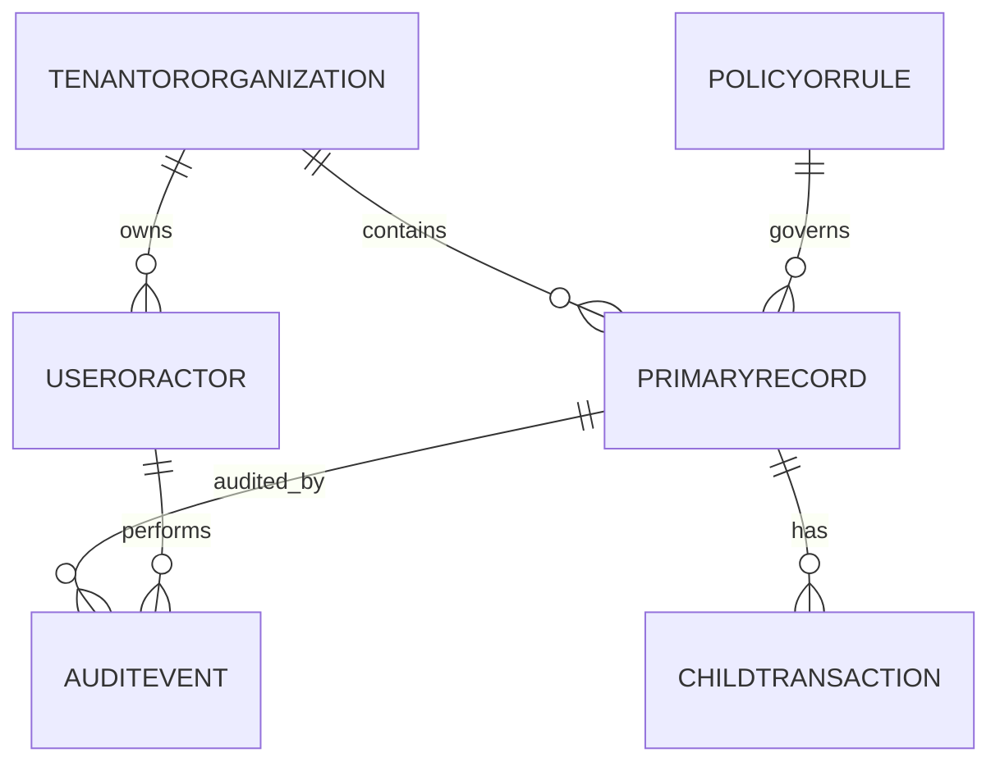
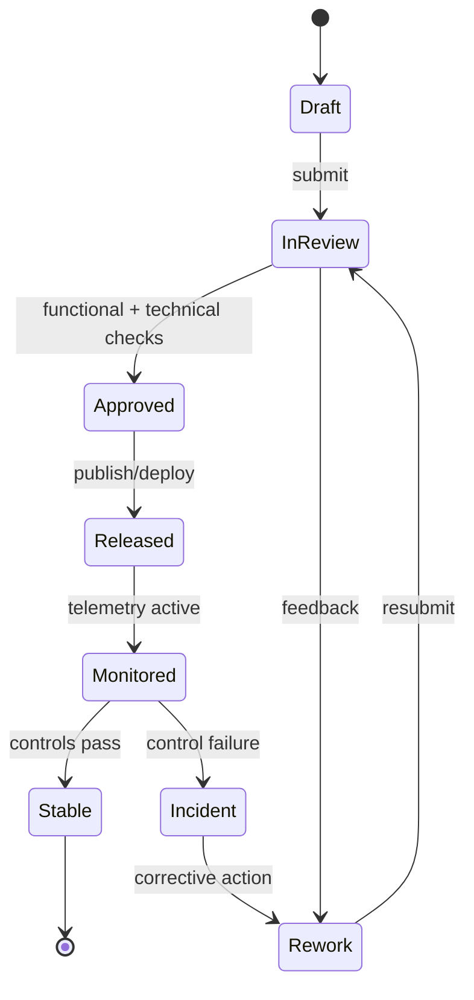

# Data Dictionary

This data dictionary is the canonical reference for **Employee Management System**. It defines shared terminology, entity semantics, and governance controls required to keep employee management workflows consistent across teams and services.

## Scope and Goals
- Establish a stable vocabulary for architecture, API, analytics, and operations teams.
- Define minimum required fields for core entities and expected relationship boundaries.
- Document data quality and retention controls needed for production readiness.

## Core Entities
| Entity | Description | Required Attributes |
|---|---|---|
| TenantOrOrganization | Top-level ownership boundary for data segregation | `org_id, name, status, region, created_at` |
| UserOrActor | Human/system principal that performs actions | `actor_id, org_id, role, status, last_active_at` |
| PrimaryRecord | Main lifecycle object handled by the platform | `record_id, org_id, state, owner_id, created_at, updated_at` |
| ChildTransaction | Operational transaction or sub-step linked to primary record | `txn_id, record_id, txn_type, amount_or_value, occurred_at` |
| PolicyOrRule | Versioned policy configuration that influences decisions | `policy_id, scope, version, effective_from, effective_to` |
| AuditEvent | Append-only evidence for state changes and controls | `audit_id, record_id, actor_id, action, reason_code, occurred_at` |

## Canonical Relationship Diagram

## Data Quality Controls
1. All write paths enforce required-field validation and referential integrity for mandatory foreign keys.
2. External imports must include provenance metadata (`source_system`, `source_ref`, `ingested_at`).
3. Status/state fields use controlled vocabularies and reject unknown values.
4. Duplicate detection runs on natural keys where business identity collisions are likely.
5. Sensitive fields carry classification tags to drive masking, encryption, and export behavior.

## Retention and Audit
- Operational records remain online for active workflow windows and support forensic queries.
- Historical records move to archive tiers by policy without breaking traceability.
- Audit events are immutable and linked through correlation ids for incident analysis.

---

---

## Process Narrative (Data dictionary governance)
1. **Initiate**: Data Steward captures the primary change request for **Data Dictionary** and links it to business objectives, impacted modules, and target release windows.
2. **Design/Refine**: The team elaborates flows, assumptions, acceptance criteria, and exception paths specific to data dictionary governance.
3. **Authorize**: Approval checks confirm that changes satisfy policy, architecture, and compliance constraints before promotion.
4. **Execute**: Metadata Registry executes the approved path and enforces schema validator at run-time or publication-time.
5. **Integrate**: Outputs are synchronized to dependent services (IAM, payroll, reporting, notifications, and audit store) with idempotent correlation IDs.
6. **Verify & Close**: Stakeholders reconcile expected outcomes against actual telemetry to confirm data semantics.

## Role/Permission Matrix (Data Dictionary)
| Capability | Employee | Manager | HR/People Ops | Engineering/IT | Compliance/Audit |
|---|---|---|---|---|---|
| View data dictionary artifacts | Scoped self | Team scoped | Full | Full | Read-only full |
| Propose change | Request only | Draft + justify | Draft + justify | Draft + justify | No |
| Approve publication/use | No | Conditional | Primary approver | Technical approver | Control sign-off |
| Execute override | No | Limited with reason | Limited with reason | Break-glass with ticket | No |
| Access evidence trail | No | Limited | Full | Full | Full |

## State Model (Data dictionary governance)

## Integration Behavior (Data Dictionary)
| Integration | Trigger | Expected Behavior | Failure Handling |
|---|---|---|---|
| IAM / RBAC | Approval or assignment change | Sync permission scopes for affected actors | Retry + alert on drift |
| Workflow/Event Bus | State transition | Publish canonical event with correlation ID | Dead-letter + replay tooling |
| Payroll/Benefits (where applicable) | Compensation/lifecycle change | Apply financial side-effects only after approved state | Hold payout + reconcile |
| Notification Channels | Review decision, exception, due date | Deliver actionable notice to owners and requestors | Escalation after SLA breach |
| Audit/GRC Archive | Any controlled transition | Store immutable evidence bundle | Block progression if evidence missing |

## Onboarding/Offboarding Edge Cases (Concrete)
- **Rehire with residual access**: If a rehire request reuses a prior identity, retain historical employee ID linkage but force fresh role entitlement approval before day-1 access.
- **Early start-date acceleration**: When onboarding date is moved earlier than background-check SLA, block activation and auto-create an exception approval task.
- **Same-day termination**: For involuntary offboarding, revoke privileged access immediately while preserving records under legal hold classification.
- **Rescinded resignation after downstream sync**: If offboarding is canceled after payroll/IAM notifications, execute compensating events and log full reversal trail.

## Compliance/Audit Controls
| Control | Description | Evidence |
|---|---|---|
| Segregation of duties | Requestor and approver cannot be the same identity for controlled actions | Approval chain + user IDs |
| Transition integrity | Only allowed state transitions can be persisted | Transition log + rejection reasons |
| Timely deprovisioning | Offboarding access revocation meets SLA targets | IAM revocation timestamp report |
| Financial reconciliation | Payroll-impacting changes reconcile before close | Payroll batch diff + sign-off |
| Immutable auditability | Controlled actions are archived in WORM/append-only storage | Hash, retention tag, archive pointer |

