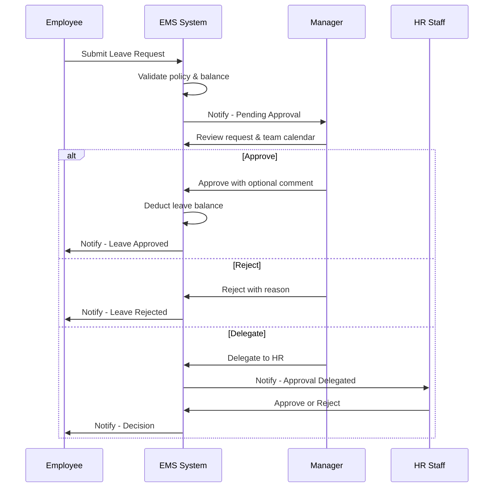
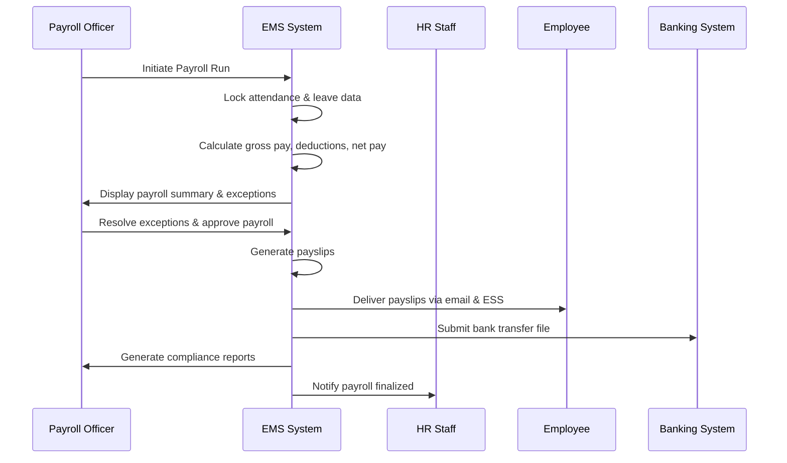
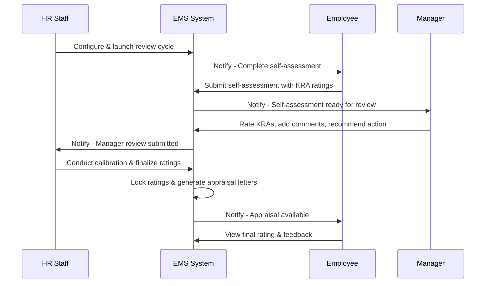
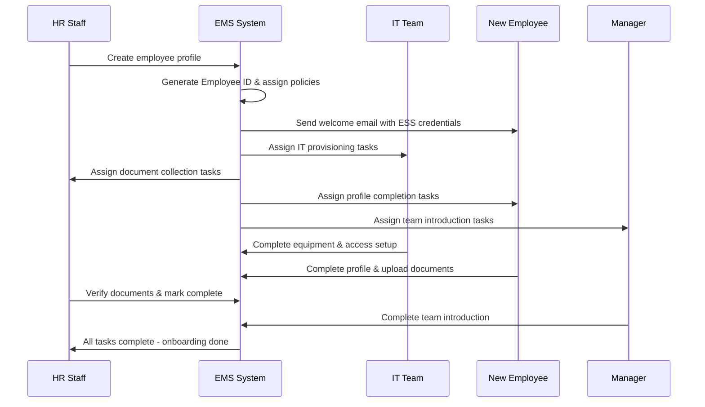
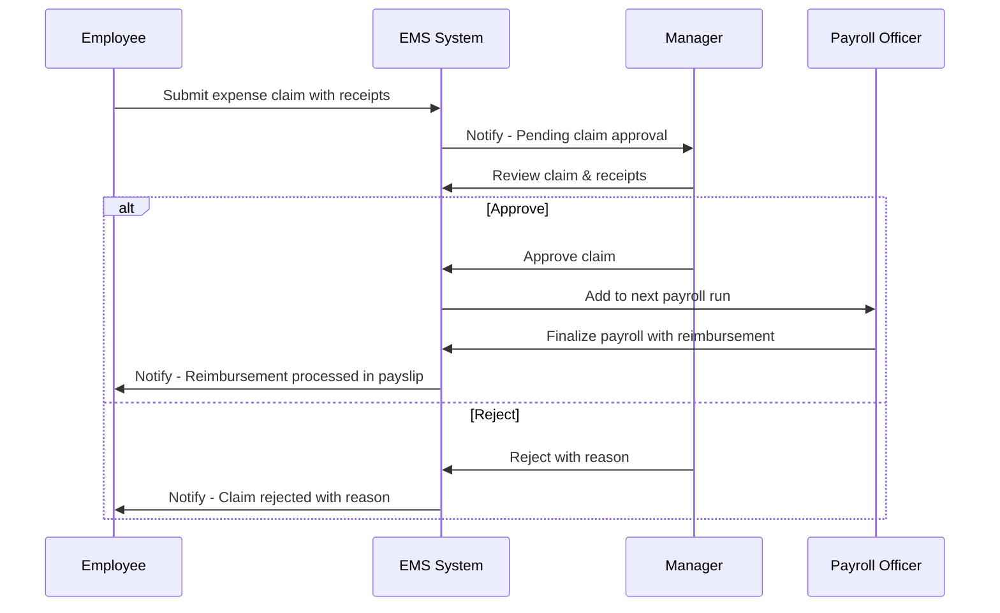
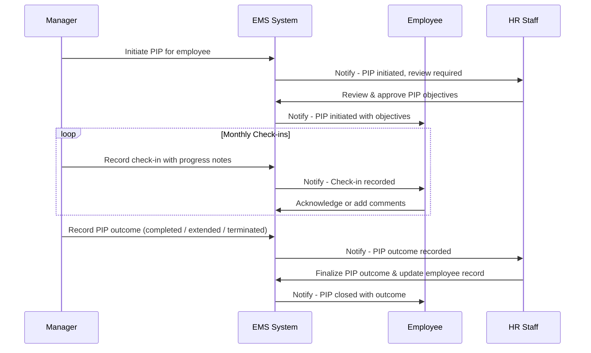

# Swimlane Diagrams

## Overview
Swimlane / BPMN diagrams showing cross-department workflows in the Employee Management System.

---

## 1. Leave Approval Swimlane

---

## 2. Payroll Processing Swimlane

---

## 3. Performance Appraisal Swimlane

---

## 4. Employee Onboarding Swimlane

---

## 5. Expense Claim Reimbursement Swimlane

---

## 6. PIP (Performance Improvement Plan) Swimlane

