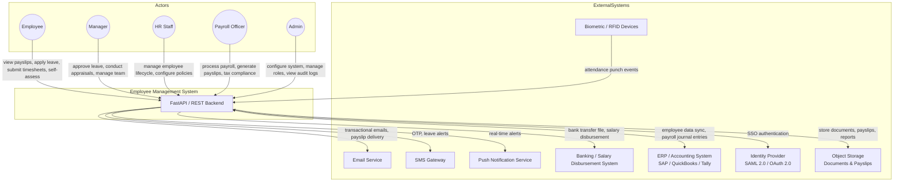
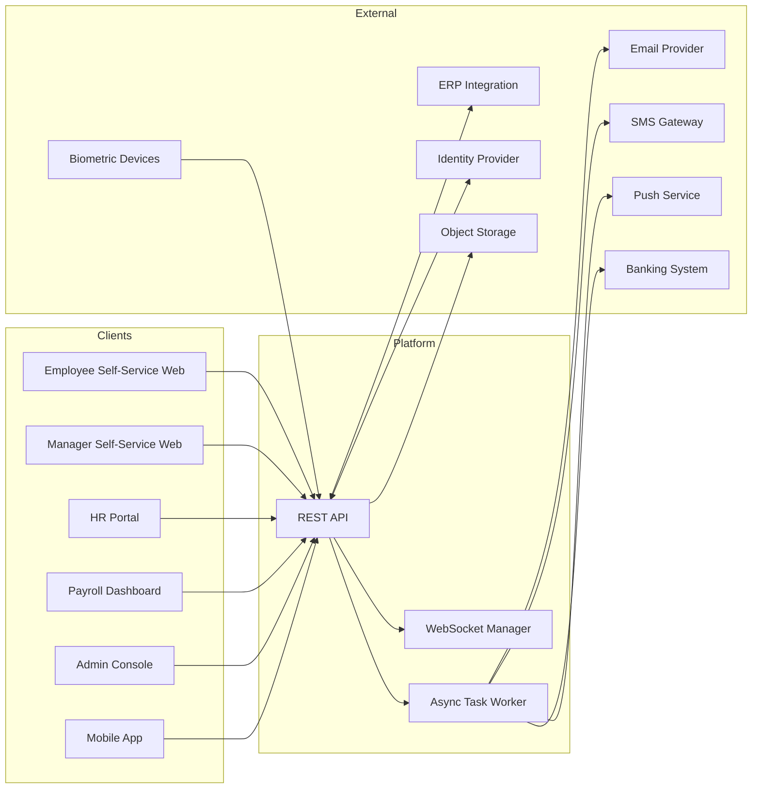
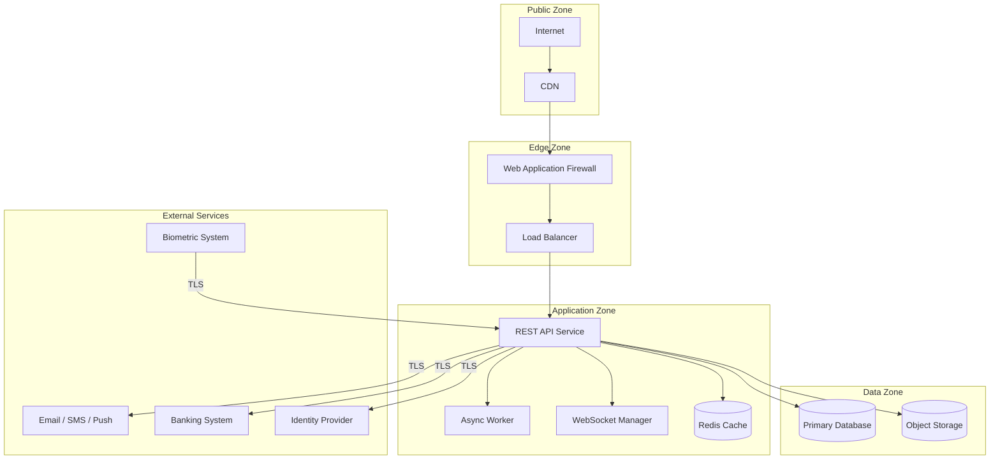

# System Context Diagram

## Overview
The system context shows the Employee Management System and its interactions with external actors and systems.

---

## Main System Context Diagram

---

## Detailed Context With Data Flows

---

## Security Boundaries

---

## External Dependency Notes

| System | Purpose | Integration Type |
|--------|---------|-----------------|
| Biometric / RFID Devices | Attendance punch recording | REST API push |
| Email Service | Payslip delivery, notifications, welcome emails | SMTP / API |
| SMS Gateway | OTP, leave and payroll alerts | API |
| Banking System | Salary disbursement file transfer | SFTP / API |
| ERP / Accounting | Payroll journal entries, employee master sync | REST / File |
| Identity Provider | SSO login for enterprise clients | SAML 2.0 / OAuth 2.0 |
| Object Storage | Document, payslip, and report storage | S3-compatible API |
| Push Notification | Mobile and web push for real-time alerts | FCM / APNs |
