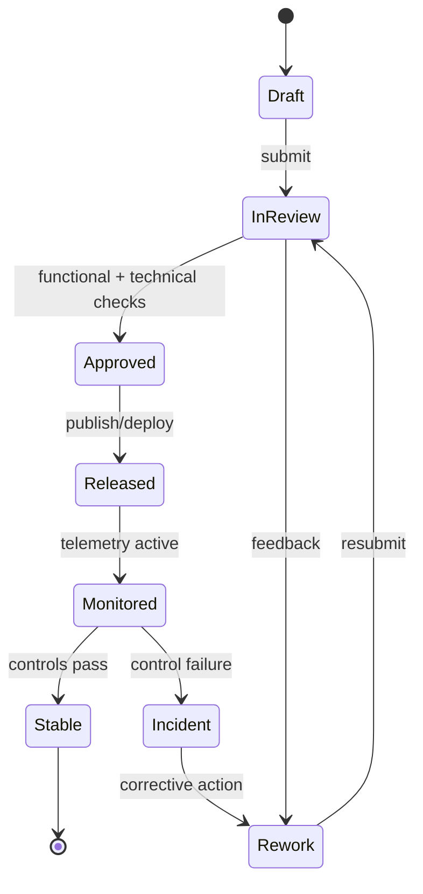

# Use Case Descriptions

## Overview
Detailed descriptions for the primary use cases in the Employee Management System.

---

## UC-001: Apply for Leave

| Field | Detail |
|-------|--------|
| **Use Case ID** | UC-001 |
| **Name** | Apply for Leave |
| **Actor** | Employee |
| **Preconditions** | Employee is logged in; leave policy exists for their employee type |
| **Postconditions** | Leave request is created with status *Pending*; manager is notified |
| **Priority** | High |

**Main Flow:**
1. Employee navigates to Leave Management → Apply Leave
2. System displays available leave types and current balances
3. Employee selects leave type, start date, end date, and enters reason
4. System validates dates (no overlap, no past dates, min notice period)
5. System calculates number of leave days excluding weekends and holidays
6. System checks if available balance is sufficient
7. Employee confirms and submits the request
8. System creates leave request with status *Pending*
9. System notifies the approving manager via email and in-app notification
10. System displays submission confirmation with request ID

**Alternate Flows:**
- **Insufficient balance**: System warns employee; allows submission only if leave type permits negative balance
- **Policy violation**: System blocks submission with detailed policy message
- **Manager unavailable**: System routes to secondary approver if configured

---

## UC-002: Approve Leave Request

| Field | Detail |
|-------|--------|
| **Use Case ID** | UC-002 |
| **Name** | Approve Leave Request |
| **Actor** | Manager |
| **Preconditions** | Pending leave request exists in manager's queue |
| **Postconditions** | Leave status updated; employee balance adjusted; notifications sent |
| **Priority** | High |

**Main Flow:**
1. Manager receives notification of pending leave request
2. Manager navigates to Approvals → Leave Requests
3. System displays pending requests with employee details, dates, and reason
4. Manager reviews leave calendar to assess team coverage
5. Manager clicks Approve with optional comment
6. System updates leave status to *Approved*
7. System deducts leave days from employee balance
8. System notifies employee of approval via email and in-app
9. System updates the team leave calendar

**Alternate Flows:**
- **Reject**: Manager provides rejection reason; employee notified; balance unchanged
- **Delegate**: Manager delegates approval to HR or another manager

---

## UC-003: Process Monthly Payroll

| Field | Detail |
|-------|--------|
| **Use Case ID** | UC-003 |
| **Name** | Process Monthly Payroll |
| **Actor** | Payroll Officer |
| **Preconditions** | Payroll cycle is configured; attendance and leave data is finalized for the period |
| **Postconditions** | Payroll is finalized; payslips generated; bank transfer file exported |
| **Priority** | Critical |

**Main Flow:**
1. Payroll Officer initiates payroll run for the current period
2. System locks attendance and leave data for the payroll period
3. System calculates gross pay per employee (basic + allowances)
4. System applies LOP deductions based on unapproved absences
5. System applies statutory deductions (PF, ESI, TDS)
6. System applies approved reimbursements and bonuses
7. System computes net pay per employee
8. Payroll Officer reviews the payroll summary and exception list
9. Payroll Officer resolves exceptions (overrides, corrections)
10. Payroll Officer finalizes and approves the payroll run
11. System generates payslips for all employees
12. System delivers payslips via email and makes them available on ESS
13. System generates bank transfer file for salary disbursement
14. System generates statutory compliance reports

**Alternate Flows:**
- **Exceptions found**: Payroll Officer corrects and re-runs calculations before finalizing
- **Off-cycle run**: Payroll Officer initiates a separate off-cycle run for bonuses or corrections

---

## UC-004: Conduct Performance Appraisal

| Field | Detail |
|-------|--------|
| **Use Case ID** | UC-004 |
| **Name** | Conduct Performance Appraisal |
| **Actor** | Manager, Employee, HR Staff |
| **Preconditions** | Review cycle is active; goals were set for the period |
| **Postconditions** | Appraisal is completed; ratings are finalized and released to employee |
| **Priority** | High |

**Main Flow:**
1. HR configures and launches the review cycle
2. System notifies employees to complete self-assessments
3. Employee logs in, rates themselves per KRA, and submits self-assessment
4. System notifies manager that self-assessment is submitted
5. Manager reviews self-assessment and goal progress
6. Manager rates each KRA, adds comments, and recommends action
7. Manager submits manager review
8. HR reviews calibrated ratings for the team
9. HR adjusts ratings if required during calibration session
10. HR finalizes and locks all ratings
11. System generates appraisal letters and makes ratings visible to employees
12. System notifies employees that their appraisal is available

**Alternate Flows:**
- **360-degree feedback**: Peer reviewers are invited and their feedback is collected before manager rating
- **Calibration adjustment**: HR overrides manager rating with audit note
- **PIP triggered**: Manager selects PIP recommendation; HR initiates PIP workflow

---

## UC-005: Onboard New Employee

| Field | Detail |
|-------|--------|
| **Use Case ID** | UC-005 |
| **Name** | Onboard New Employee |
| **Actor** | HR Staff |
| **Preconditions** | Offer letter has been accepted; joining date is confirmed |
| **Postconditions** | Employee profile is created; onboarding tasks are assigned; ESS access granted |
| **Priority** | High |

**Main Flow:**
1. HR creates employee profile with personal, contact, and employment details
2. System generates unique Employee ID
3. System creates onboarding checklist (IT setup, document collection, training, etc.)
4. System assigns checklist tasks to HR, IT, and the employee
5. System sends welcome email with ESS portal link and temporary credentials
6. Employee logs in and completes their part of the checklist
7. IT completes equipment and access provisioning tasks
8. HR marks mandatory tasks as complete
9. System records onboarding completion date
10. System assigns employee to their configured payroll group and leave policy

**Alternate Flows:**
- **Remote joining**: Digital document signing workflow triggered
- **Delayed joining**: Joining date updated; notifications rescheduled

---

## UC-006: Manage Employee Offboarding

| Field | Detail |
|-------|--------|
| **Use Case ID** | UC-006 |
| **Name** | Manage Employee Offboarding |
| **Actor** | HR Staff, Manager |
| **Preconditions** | Resignation or termination has been recorded; last working day is confirmed |
| **Postconditions** | Clearance completed; final settlement calculated; accounts deactivated |
| **Priority** | High |

**Main Flow:**
1. HR records resignation/termination with reason and last working day
2. System triggers offboarding workflow
3. System creates clearance checklist (asset return, access revocation, knowledge transfer)
4. Tasks are assigned to IT, Finance, Manager, and HR
5. Manager conducts exit interview and records feedback
6. Finance computes final settlement (pending salary, leave encashment, notice pay)
7. HR reviews and approves final settlement
8. System generates relieving letter and experience certificate
9. HR marks clearance tasks as complete
10. System deactivates employee accounts on last working day
11. System archives employee records per retention policy

---

## UC-007: Record Attendance via Biometric

| Field | Detail |
|-------|--------|
| **Use Case ID** | UC-007 |
| **Name** | Record Attendance via Biometric |
| **Actor** | Employee, Biometric Device |
| **Preconditions** | Employee is enrolled in biometric system; device is online |
| **Postconditions** | Attendance record created with timestamp; anomalies flagged |
| **Priority** | High |

**Main Flow:**
1. Employee places fingerprint or face on biometric device
2. Device authenticates the employee and records a punch event
3. Device sends punch event to EMS via API (employee ID, timestamp, type)
4. System maps punch to employee and records check-in or check-out
5. System calculates worked hours when check-out is recorded
6. System flags if employee is late or left early per configured shift

**Alternate Flows:**
- **Device offline**: Punches are cached locally and synced when connectivity is restored
- **Manual regularization**: Employee submits regularization request if punch is missing

---

---

## Process Narrative (Use-case narrative pack)
1. **Initiate**: Product Owner captures the primary change request for **Use Case Descriptions** and links it to business objectives, impacted modules, and target release windows.
2. **Design/Refine**: The team elaborates flows, assumptions, acceptance criteria, and exception paths specific to use-case narrative pack.
3. **Authorize**: Approval checks confirm that changes satisfy policy, architecture, and compliance constraints before promotion.
4. **Execute**: Use Case Service executes the approved path and enforces acceptance criteria checks at run-time or publication-time.
5. **Integrate**: Outputs are synchronized to dependent services (IAM, payroll, reporting, notifications, and audit store) with idempotent correlation IDs.
6. **Verify & Close**: Stakeholders reconcile expected outcomes against actual telemetry to confirm actor intent traceability.

## Role/Permission Matrix (Use Case Descriptions)
| Capability | Employee | Manager | HR/People Ops | Engineering/IT | Compliance/Audit |
|---|---|---|---|---|---|
| View use case descriptions artifacts | Scoped self | Team scoped | Full | Full | Read-only full |
| Propose change | Request only | Draft + justify | Draft + justify | Draft + justify | No |
| Approve publication/use | No | Conditional | Primary approver | Technical approver | Control sign-off |
| Execute override | No | Limited with reason | Limited with reason | Break-glass with ticket | No |
| Access evidence trail | No | Limited | Full | Full | Full |

## State Model (Use-case narrative pack)

## Integration Behavior (Use Case Descriptions)
| Integration | Trigger | Expected Behavior | Failure Handling |
|---|---|---|---|
| IAM / RBAC | Approval or assignment change | Sync permission scopes for affected actors | Retry + alert on drift |
| Workflow/Event Bus | State transition | Publish canonical event with correlation ID | Dead-letter + replay tooling |
| Payroll/Benefits (where applicable) | Compensation/lifecycle change | Apply financial side-effects only after approved state | Hold payout + reconcile |
| Notification Channels | Review decision, exception, due date | Deliver actionable notice to owners and requestors | Escalation after SLA breach |
| Audit/GRC Archive | Any controlled transition | Store immutable evidence bundle | Block progression if evidence missing |

## Onboarding/Offboarding Edge Cases (Concrete)
- **Rehire with residual access**: If a rehire request reuses a prior identity, retain historical employee ID linkage but force fresh role entitlement approval before day-1 access.
- **Early start-date acceleration**: When onboarding date is moved earlier than background-check SLA, block activation and auto-create an exception approval task.
- **Same-day termination**: For involuntary offboarding, revoke privileged access immediately while preserving records under legal hold classification.
- **Rescinded resignation after downstream sync**: If offboarding is canceled after payroll/IAM notifications, execute compensating events and log full reversal trail.

## Compliance/Audit Controls
| Control | Description | Evidence |
|---|---|---|
| Segregation of duties | Requestor and approver cannot be the same identity for controlled actions | Approval chain + user IDs |
| Transition integrity | Only allowed state transitions can be persisted | Transition log + rejection reasons |
| Timely deprovisioning | Offboarding access revocation meets SLA targets | IAM revocation timestamp report |
| Financial reconciliation | Payroll-impacting changes reconcile before close | Payroll batch diff + sign-off |
| Immutable auditability | Controlled actions are archived in WORM/append-only storage | Hash, retention tag, archive pointer |

