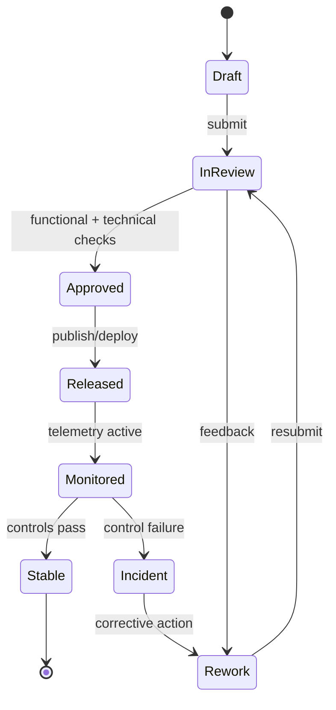

# API Design

## Overview
This document describes the REST API design for the Employee Management System. The API is versioned under `/api/v1`, uses JWT-based authentication, enforces RBAC at each endpoint, and returns paginated responses for list resources.

---

## API Architecture

```mermaid
graph TB
    subgraph "Clients"
        ESS[Employee Self-Service]
        MSS[Manager Self-Service]
        HR[HR Portal]
        Payroll[Payroll Dashboard]
        Admin[Admin Console]
        Biometric[Biometric Device]
    end

    subgraph "REST API /api/v1"
        AuthRouter[/auth]
        EmployeeRouter[/employees]
        LeaveRouter[/leave]
        AttendanceRouter[/attendance]
        PayrollRouter[/payroll]
        PerformanceRouter[/performance]
        BenefitsRouter[/benefits]
        NotifRouter[/notifications]
        ReportRouter[/reports]
        AdminRouter[/admin]
    end

    ESS --> AuthRouter
    ESS --> EmployeeRouter
    ESS --> LeaveRouter
    ESS --> AttendanceRouter
    ESS --> PayrollRouter
    ESS --> PerformanceRouter
    MSS --> LeaveRouter
    MSS --> AttendanceRouter
    MSS --> PerformanceRouter
    HR --> EmployeeRouter
    HR --> LeaveRouter
    HR --> PerformanceRouter
    HR --> ReportRouter
    Payroll --> PayrollRouter
    Payroll --> ReportRouter
    Admin --> AdminRouter
    Biometric --> AttendanceRouter
```

---

## Authentication Endpoints

| Method | Path | Description | Auth |
|--------|------|-------------|------|
| POST | `/auth/login` | Login with email & password | Public |
| POST | `/auth/logout` | Invalidate session | Authenticated |
| POST | `/auth/refresh` | Refresh access token | Authenticated |
| POST | `/auth/sso/saml` | SSO login via SAML 2.0 | Public |
| POST | `/auth/otp/enable` | Enable 2FA | Authenticated |
| POST | `/auth/otp/verify` | Verify 2FA OTP | Authenticated |
| POST | `/auth/password/change` | Change password | Authenticated |
| POST | `/auth/password/reset-request` | Request password reset | Public |
| POST | `/auth/password/reset` | Submit password reset | Public |

---

## Employee Endpoints

| Method | Path | Description | Roles |
|--------|------|-------------|-------|
| GET | `/employees` | List employees with filters | HR, Admin |
| POST | `/employees` | Create employee profile | HR |
| GET | `/employees/{id}` | Get employee details | Self, Manager, HR |
| PUT | `/employees/{id}` | Update employee profile | HR |
| GET | `/employees/me` | Get own profile | Employee |
| PUT | `/employees/me` | Update own profile (limited fields) | Employee |
| GET | `/employees/{id}/documents` | List employee documents | Self, HR |
| POST | `/employees/{id}/documents` | Upload document | Self, HR |
| POST | `/employees/{id}/transfer` | Transfer employee | HR |
| POST | `/employees/{id}/offboard` | Initiate offboarding | HR |
| GET | `/employees/org-chart` | Get org chart data | All |
| GET | `/onboarding/{employee_id}/checklist` | Get onboarding checklist | Self, HR |
| PUT | `/onboarding/tasks/{task_id}/complete` | Mark task complete | Assignee, HR |

---

## Leave Endpoints

| Method | Path | Description | Roles |
|--------|------|-------------|-------|
| GET | `/leave/types` | List leave types | All |
| GET | `/leave/balance` | Get own leave balances | Employee |
| GET | `/leave/balance/{employee_id}` | Get employee leave balance | Manager, HR |
| POST | `/leave/requests` | Apply for leave | Employee |
| GET | `/leave/requests` | List own leave requests | Employee |
| GET | `/leave/requests/pending` | List pending approvals | Manager, HR |
| GET | `/leave/requests/{id}` | Get request details | Requester, Manager, HR |
| PUT | `/leave/requests/{id}/approve` | Approve leave request | Manager, HR |
| PUT | `/leave/requests/{id}/reject` | Reject leave request | Manager, HR |
| PUT | `/leave/requests/{id}/cancel` | Cancel leave request | Requester |
| GET | `/leave/calendar` | Team leave calendar | Manager, HR |
| GET | `/leave/holidays` | Get holiday calendar | All |
| POST | `/leave/holidays` | Add holiday | HR, Admin |

---

## Attendance Endpoints

| Method | Path | Description | Roles |
|--------|------|-------------|-------|
| POST | `/attendance/punch` | Record attendance punch | Employee, Biometric |
| GET | `/attendance/me` | Get own attendance records | Employee |
| GET | `/attendance/{employee_id}` | Get employee attendance | Manager, HR |
| POST | `/attendance/regularize` | Submit regularization request | Employee |
| GET | `/attendance/regularize/pending` | List pending regularizations | Manager, HR |
| PUT | `/attendance/regularize/{id}/approve` | Approve regularization | Manager, HR |
| GET | `/shifts` | List available shifts | HR |
| POST | `/shifts` | Create shift | HR |
| POST | `/shifts/assignments` | Assign shift to employee | Manager, HR |
| POST | `/timesheets` | Submit timesheet | Employee |
| GET | `/timesheets` | List own timesheets | Employee |
| GET | `/timesheets/pending` | Pending timesheets for approval | Manager |
| PUT | `/timesheets/{id}/approve` | Approve timesheet | Manager |
| POST | `/comp-off/requests` | Apply for comp-off | Employee |
| PUT | `/comp-off/requests/{id}/approve` | Approve comp-off | Manager |

---

## Payroll Endpoints

| Method | Path | Description | Roles |
|--------|------|-------------|-------|
| POST | `/payroll/runs` | Initiate payroll run | Payroll Officer |
| GET | `/payroll/runs` | List payroll runs | Payroll Officer, Admin |
| GET | `/payroll/runs/{id}/summary` | Get payroll summary | Payroll Officer |
| GET | `/payroll/runs/{id}/exceptions` | Get payroll exceptions | Payroll Officer |
| PUT | `/payroll/runs/{id}/approve` | Approve payroll run | Payroll Officer |
| GET | `/payroll/runs/{id}/bank-file` | Download bank transfer file | Payroll Officer |
| GET | `/payroll/records` | List own payroll records | Employee |
| GET | `/payroll/payslips` | List own payslips | Employee |
| GET | `/payroll/payslips/{id}/download` | Download payslip PDF | Employee, Payroll Officer |
| GET | `/payroll/salary-structure` | Get own salary structure | Employee |
| POST | `/payroll/expense-claims` | Submit expense claim | Employee |
| GET | `/payroll/expense-claims` | List own claims | Employee |
| PUT | `/payroll/expense-claims/{id}/approve` | Approve claim | Manager |
| POST | `/payroll/tax-declarations` | Submit tax declaration | Employee |
| GET | `/payroll/tax-declarations` | Get own declaration | Employee |
| GET | `/payroll/form16` | Download Form 16 | Employee |

---

## Performance Endpoints

| Method | Path | Description | Roles |
|--------|------|-------------|-------|
| GET | `/performance/cycles` | List appraisal cycles | All |
| POST | `/performance/cycles` | Create appraisal cycle | HR |
| POST | `/performance/cycles/{id}/launch` | Launch cycle | HR |
| GET | `/performance/goals` | List own goals | Employee |
| POST | `/performance/goals` | Create goal | Employee, Manager |
| PUT | `/performance/goals/{id}/progress` | Update goal progress | Employee |
| GET | `/performance/reviews/me` | Get own review | Employee |
| PUT | `/performance/reviews/{id}/self` | Submit self-assessment | Employee |
| PUT | `/performance/reviews/{id}/manager` | Submit manager review | Manager |
| GET | `/performance/reviews/team` | List team reviews | Manager |
| PUT | `/performance/reviews/{id}/finalize` | Finalize review | HR |
| POST | `/performance/pips` | Initiate PIP | Manager |
| PUT | `/performance/pips/{id}/checkin` | Record PIP check-in | Manager |
| PUT | `/performance/pips/{id}/close` | Close PIP with outcome | Manager, HR |

---

## Report Endpoints

| Method | Path | Description | Roles |
|--------|------|-------------|-------|
| GET | `/reports/headcount` | Headcount report | HR, Admin |
| GET | `/reports/attrition` | Attrition report | HR, Admin |
| GET | `/reports/payroll-summary` | Payroll summary report | Payroll Officer, Admin |
| GET | `/reports/leave-utilization` | Leave utilization report | HR |
| GET | `/reports/attendance-summary` | Attendance summary report | HR, Manager |
| GET | `/reports/performance-distribution` | Rating distribution report | HR |
| POST | `/reports/custom` | Create custom report job | HR, Admin, Payroll Officer |
| GET | `/reports/jobs/{id}` | Get report job status | HR, Admin, Payroll Officer |
| GET | `/reports/jobs/{id}/download` | Download report artifact | HR, Admin, Payroll Officer |

---

## Common Response Format

```json
{
  "success": true,
  "data": { ... },
  "meta": {
    "page": 1,
    "per_page": 20,
    "total": 150,
    "total_pages": 8
  }
}
```

## Error Response Format

```json
{
  "success": false,
  "error": {
    "code": "LEAVE_POLICY_VIOLATION",
    "message": "Leave request does not meet minimum notice period of 2 days.",
    "details": { "policy_field": "min_notice_days", "required": 2, "given": 0 }
  }
}
```

---

---

## Process Narrative (API contract design)
1. **Initiate**: Backend Lead captures the primary change request for **Api Design** and links it to business objectives, impacted modules, and target release windows.
2. **Design/Refine**: The team elaborates flows, assumptions, acceptance criteria, and exception paths specific to api contract design.
3. **Authorize**: Approval checks confirm that changes satisfy policy, architecture, and compliance constraints before promotion.
4. **Execute**: API Gateway executes the approved path and enforces request/response schema validation at run-time or publication-time.
5. **Integrate**: Outputs are synchronized to dependent services (IAM, payroll, reporting, notifications, and audit store) with idempotent correlation IDs.
6. **Verify & Close**: Stakeholders reconcile expected outcomes against actual telemetry to confirm API reliability.

## Role/Permission Matrix (Api Design)
| Capability | Employee | Manager | HR/People Ops | Engineering/IT | Compliance/Audit |
|---|---|---|---|---|---|
| View api design artifacts | Scoped self | Team scoped | Full | Full | Read-only full |
| Propose change | Request only | Draft + justify | Draft + justify | Draft + justify | No |
| Approve publication/use | No | Conditional | Primary approver | Technical approver | Control sign-off |
| Execute override | No | Limited with reason | Limited with reason | Break-glass with ticket | No |
| Access evidence trail | No | Limited | Full | Full | Full |

## State Model (API contract design)


## Integration Behavior (Api Design)
| Integration | Trigger | Expected Behavior | Failure Handling |
|---|---|---|---|
| IAM / RBAC | Approval or assignment change | Sync permission scopes for affected actors | Retry + alert on drift |
| Workflow/Event Bus | State transition | Publish canonical event with correlation ID | Dead-letter + replay tooling |
| Payroll/Benefits (where applicable) | Compensation/lifecycle change | Apply financial side-effects only after approved state | Hold payout + reconcile |
| Notification Channels | Review decision, exception, due date | Deliver actionable notice to owners and requestors | Escalation after SLA breach |
| Audit/GRC Archive | Any controlled transition | Store immutable evidence bundle | Block progression if evidence missing |

## Onboarding/Offboarding Edge Cases (Concrete)
- **Rehire with residual access**: If a rehire request reuses a prior identity, retain historical employee ID linkage but force fresh role entitlement approval before day-1 access.
- **Early start-date acceleration**: When onboarding date is moved earlier than background-check SLA, block activation and auto-create an exception approval task.
- **Same-day termination**: For involuntary offboarding, revoke privileged access immediately while preserving records under legal hold classification.
- **Rescinded resignation after downstream sync**: If offboarding is canceled after payroll/IAM notifications, execute compensating events and log full reversal trail.

## Compliance/Audit Controls
| Control | Description | Evidence |
|---|---|---|
| Segregation of duties | Requestor and approver cannot be the same identity for controlled actions | Approval chain + user IDs |
| Transition integrity | Only allowed state transitions can be persisted | Transition log + rejection reasons |
| Timely deprovisioning | Offboarding access revocation meets SLA targets | IAM revocation timestamp report |
| Financial reconciliation | Payroll-impacting changes reconcile before close | Payroll batch diff + sign-off |
| Immutable auditability | Controlled actions are archived in WORM/append-only storage | Hash, retention tag, archive pointer |

