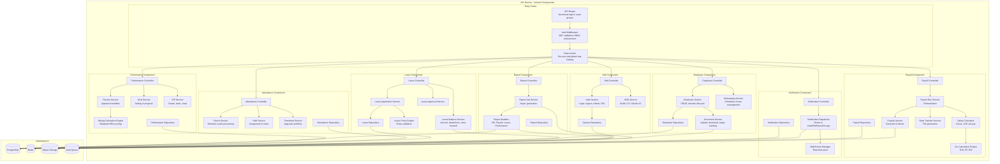

# C4 Component Diagram

## Overview
C4 Level 3 component diagram for the Employee Management System's API Service, showing internal component structure.

---

## API Service Component Diagram

```mermaid
graph TB
    subgraph "API Service - Internal Components"
        subgraph "Entry Points"
            Router[API Router\nVersioned /api/v1 route groups]
            AuthMiddleware[Auth Middleware\nJWT validation, RBAC enforcement]
            RateLimiter[Rate Limiter\nPer-user and global rate limiting]
        end

        subgraph "IAM Component"
            IAMController[IAM Controller]
            AuthService[Auth Service\nLogin, logout, refresh, 2FA]
            SSOService[SSO Service\nSAML 2.0 / OAuth 2.0]
            SessionRepo[Session Repository]
        end

        subgraph "Employee Component"
            EmployeeController[Employee Controller]
            EmployeeService[Employee Service\nCRUD, transfer, lifecycle]
            OnboardingService[Onboarding Service\nChecklists & task management]
            DocumentService[Document Service\nUpload, download, expiry tracking]
            EmployeeRepo[Employee Repository]
        end

        subgraph "Leave Component"
            LeaveController[Leave Controller]
            LeaveApplicationService[Leave Application Service]
            LeaveApprovalService[Leave Approval Service]
            LeaveBalanceService[Leave Balance Service\nAccrual, deductions, carry-forward]
            LeavePolicyEngine[Leave Policy Engine\nRules validation]
            LeaveRepo[Leave Repository]
        end

        subgraph "Attendance Component"
            AttendanceController[Attendance Controller]
            PunchService[Punch Service\nBiometric event processing]
            ShiftService[Shift Service\nAssignment & roster]
            TimesheetService[Timesheet Service\nApproval workflow]
            AttendanceRepo[Attendance Repository]
        end

        subgraph "Payroll Component"
            PayrollController[Payroll Controller]
            PayrollRunService[Payroll Run Service\nOrchestration]
            SalaryCalculator[Salary Calculator\nGross, LOP, net pay]
            TaxEngine[Tax Calculation Engine\nTDS, PF, ESI]
            PayslipService[Payslip Service\nGenerate & deliver]
            BankTransferService[Bank Transfer Service\nFile generation]
            PayrollRepo[Payroll Repository]
        end

        subgraph "Performance Component"
            PerformanceController[Performance Controller]
            ReviewService[Review Service\nAppraisal workflow]
            GoalService[Goal Service\nSetting & progress]
            PIPService[PIP Service\nCreate, track, close]
            RatingEngine[Rating Calculation Engine\nWeighted KRA scoring]
            PerformanceRepo[Performance Repository]
        end

        subgraph "Notification Component"
            NotifController[Notification Controller]
            NotifDispatcher[Notification Dispatcher\nRoute to email/SMS/push/in-app]
            WSManager[WebSocket Manager\nReal-time push]
            NotifRepo[Notification Repository]
        end

        subgraph "Report Component"
            ReportController[Report Controller]
            ReportJobService[Report Job Service\nAsync generation]
            ReportBuilders[Report Builders\nHR, Payroll, Leave, Performance]
            ReportRepo[Report Repository]
        end
    end

    subgraph "Infrastructure"
        DB[(PostgreSQL)]
        Cache[(Redis)]
        Storage[(Object Storage)]
        Queue[(Task Queue)]
    end

    Router --> AuthMiddleware
    AuthMiddleware --> RateLimiter
    RateLimiter --> IAMController
    RateLimiter --> EmployeeController
    RateLimiter --> LeaveController
    RateLimiter --> AttendanceController
    RateLimiter --> PayrollController
    RateLimiter --> PerformanceController
    RateLimiter --> NotifController
    RateLimiter --> ReportController

    IAMController --> AuthService
    IAMController --> SSOService
    AuthService --> SessionRepo
    SessionRepo --> Cache

    EmployeeController --> EmployeeService
    EmployeeController --> OnboardingService
    EmployeeService --> DocumentService
    EmployeeService --> EmployeeRepo
    DocumentService --> Storage
    EmployeeRepo --> DB

    LeaveController --> LeaveApplicationService
    LeaveController --> LeaveApprovalService
    LeaveController --> LeaveBalanceService
    LeaveApplicationService --> LeavePolicyEngine
    LeaveApplicationService --> LeaveRepo
    LeaveBalanceService --> Cache
    LeaveRepo --> DB

    AttendanceController --> PunchService
    AttendanceController --> ShiftService
    AttendanceController --> TimesheetService
    AttendanceRepo --> DB

    PayrollController --> PayrollRunService
    PayrollRunService --> SalaryCalculator
    SalaryCalculator --> TaxEngine
    PayrollRunService --> PayslipService
    PayslipService --> Storage
    PayrollRunService --> BankTransferService
    PayrollRepo --> DB

    PerformanceController --> ReviewService
    PerformanceController --> GoalService
    PerformanceController --> PIPService
    ReviewService --> RatingEngine
    PerformanceRepo --> DB

    NotifController --> NotifDispatcher
    NotifDispatcher --> WSManager
    NotifDispatcher --> Queue
    NotifRepo --> DB

    ReportController --> ReportJobService
    ReportJobService --> Queue
    ReportJobService --> ReportBuilders
    ReportBuilders --> DB
    ReportBuilders --> Storage
```
