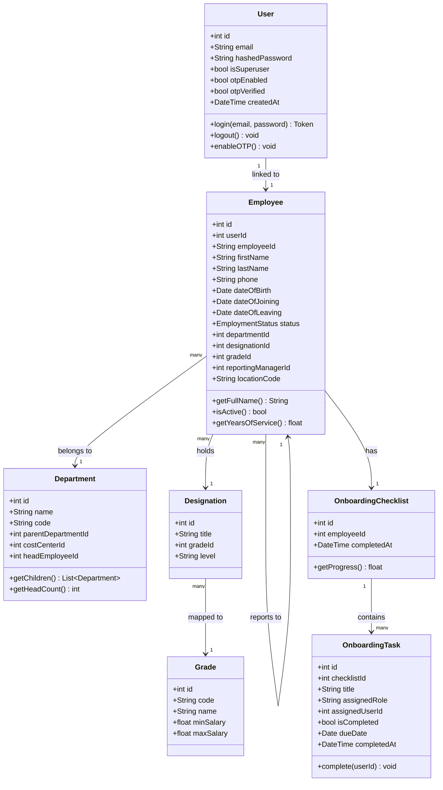
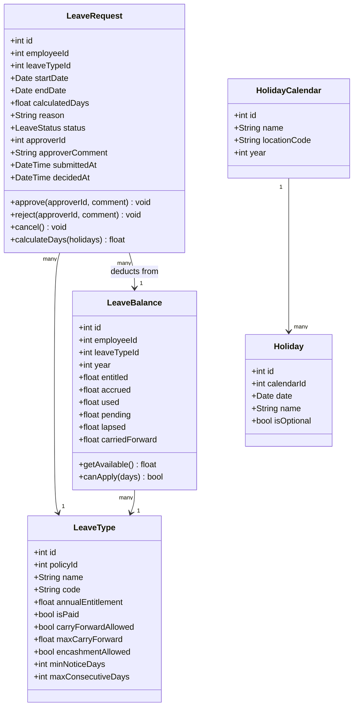
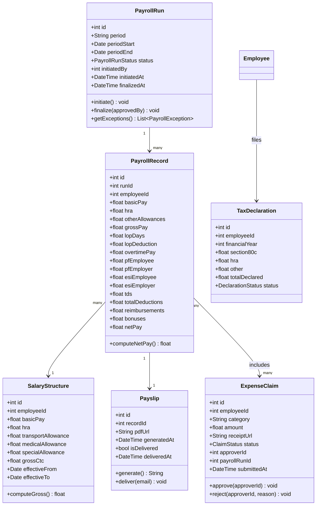
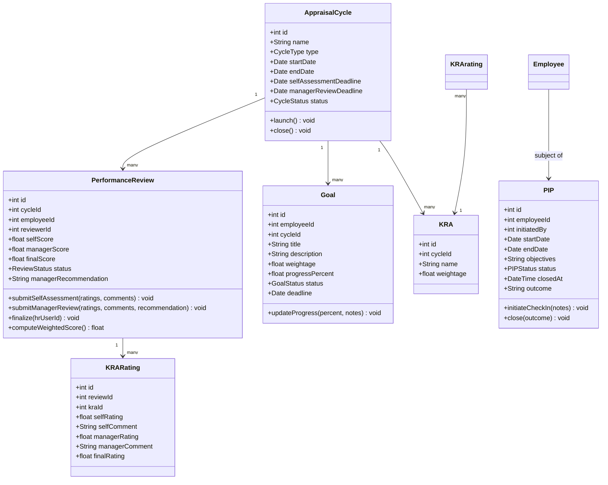

# Class Diagrams

## Overview
Detailed class diagrams for the core modules of the Employee Management System.

---

## 1. Employee & Organization Module

---

## 2. Leave Management Module

---

## 3. Payroll Module

---

## 4. Performance Management Module

