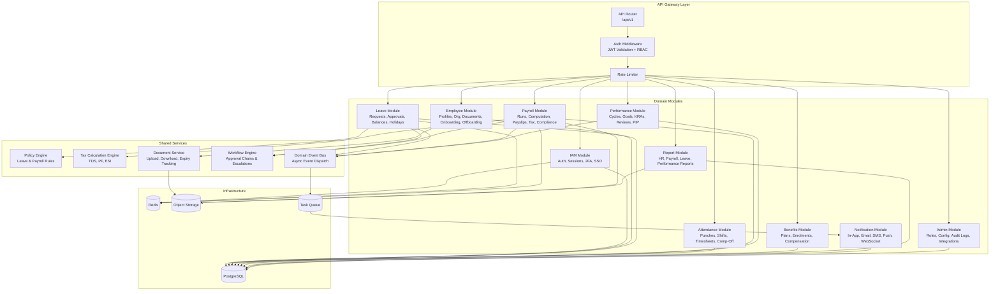

# Component Diagrams

## Overview
Component diagrams showing the software module structure of the Employee Management System.

---

## Backend Component Diagram

---

## Frontend Component Diagram

```mermaid
graph TB
    subgraph "Employee Self-Service (ESS)"
        ESSDashboard[Dashboard]
        ESSLeave[Leave Management\nApply, History, Balance]
        ESSAttendance[Attendance\nView, Regularize, Timesheet]
        ESSPayslip[Payslips\nView, Download]
        ESSPerformance[Performance\nGoals, Self-Assessment, Rating]
        ESSProfile[My Profile\nPersonal Info, Documents]
    end

    subgraph "Manager Self-Service (MSS)"
        MSSDashboard[Team Dashboard]
        MSSApprovals[Approvals\nLeave, Timesheet, Comp-Off]
        MSSPerformance[Performance\nAppraisals, PIP]
        MSSSchedule[Shift Roster]
        MSSReports[Team Reports]
    end

    subgraph "HR Portal"
        HREmployees[Employee Management\nCreate, Edit, Transfer, Offboard]
        HROnboarding[Onboarding\nChecklists & Tasks]
        HRPolicies[Policies\nLeave, Appraisal Config]
        HROrgChart[Org Chart]
        HRReports[HR Reports\nHeadcount, Attrition]
    end

    subgraph "Payroll Dashboard"
        PayrollRuns[Payroll Runs]
        PayrollReview[Review & Approve]
        PayrollCompliance[Compliance Reports\nForm 16, PF, ESI]
        PayrollReports[Payroll Analytics]
    end

    subgraph "Admin Console"
        AdminRoles[Roles & Permissions]
        AdminConfig[System Config]
        AdminAudit[Audit Logs]
        AdminIntegrations[Integrations]
    end

    subgraph "Shared Components"
        APIClient[API Client\nREST + Auth Interceptor]
        Notifications[Notification Bell\nIn-App Notifications]
        AuthProvider[Auth Context\nJWT Management]
    end

    ESSDashboard --> APIClient
    MSSDashboard --> APIClient
    HREmployees --> APIClient
    PayrollRuns --> APIClient
    AdminRoles --> APIClient
    APIClient --> AuthProvider
```

