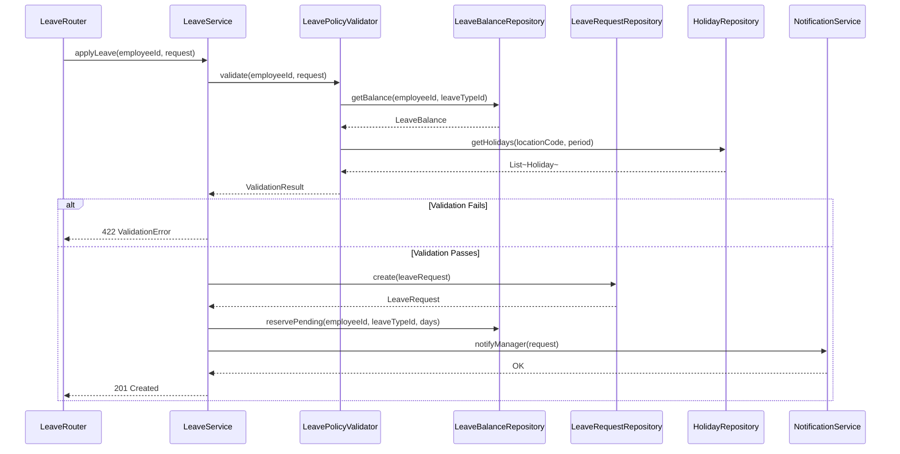
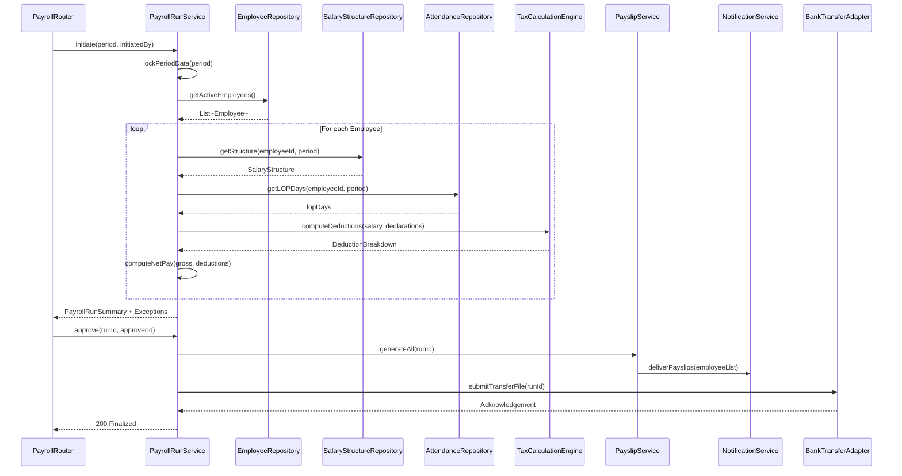
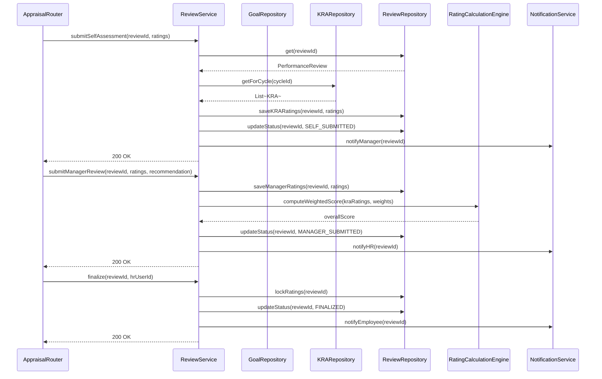
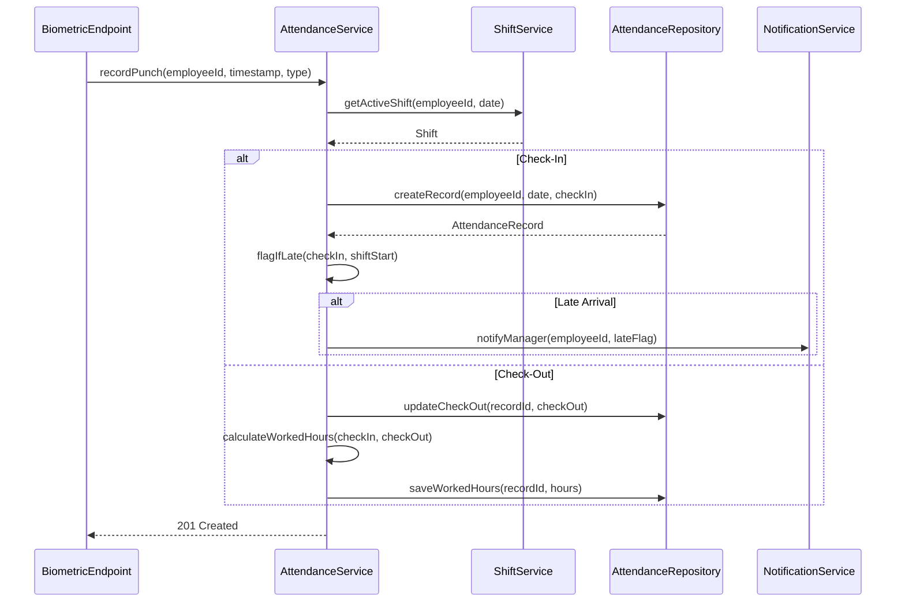

# Sequence Diagrams

## Overview
Internal sequence diagrams showing object-level interactions within the Employee Management System.

---

## 1. Leave Application - Internal Flow

---

## 2. Payroll Run - Internal Flow

---

## 3. Appraisal Review - Internal Flow

---

## 4. Attendance Punch - Internal Flow

