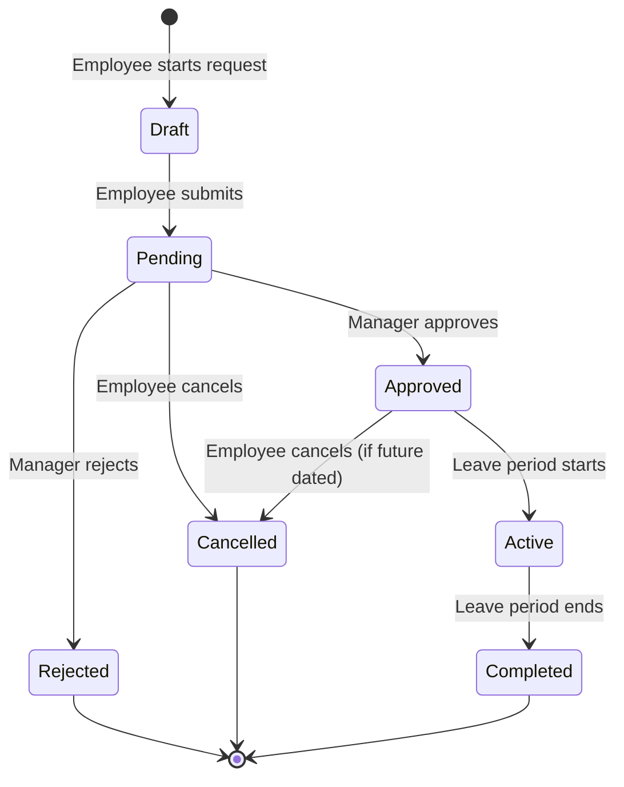
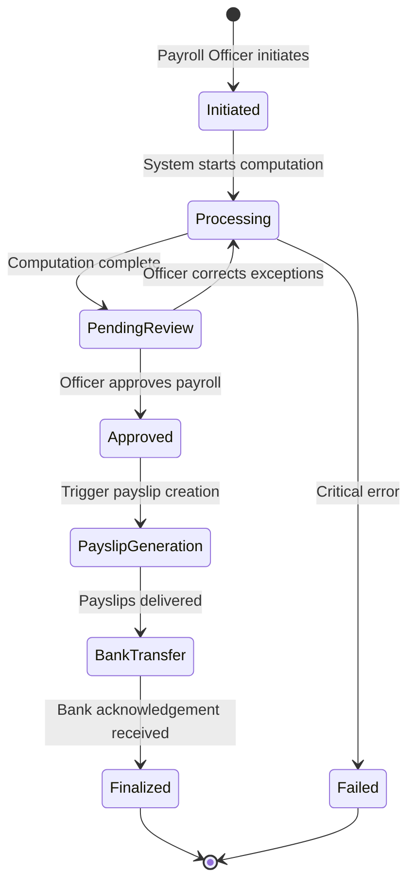
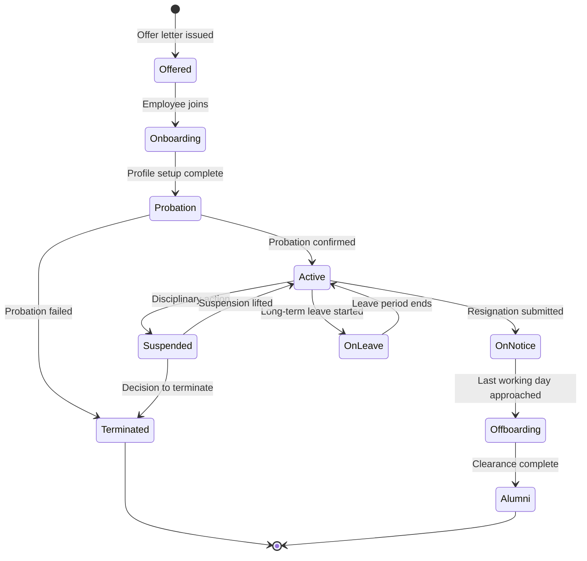
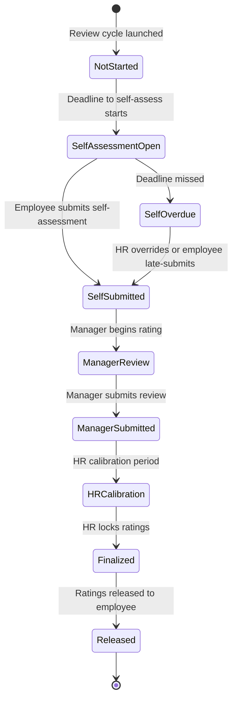
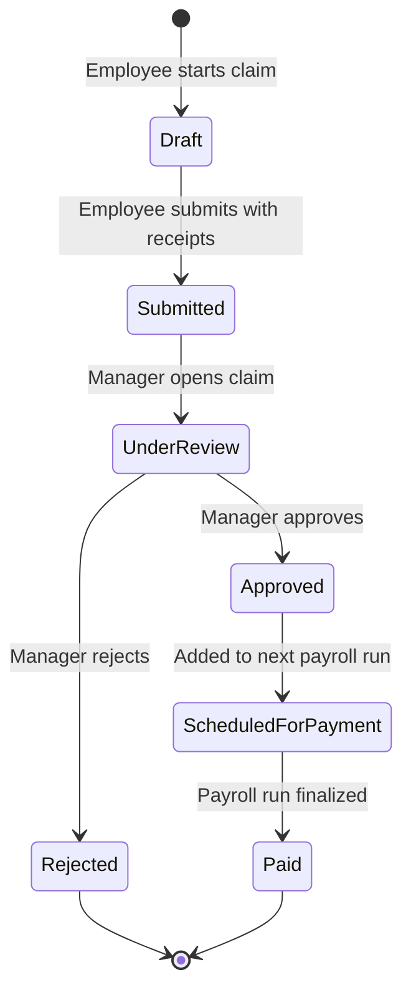
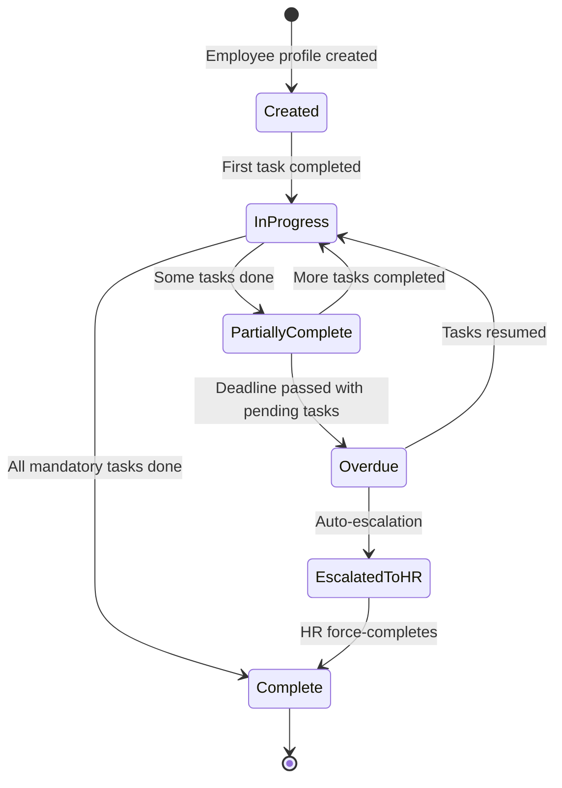
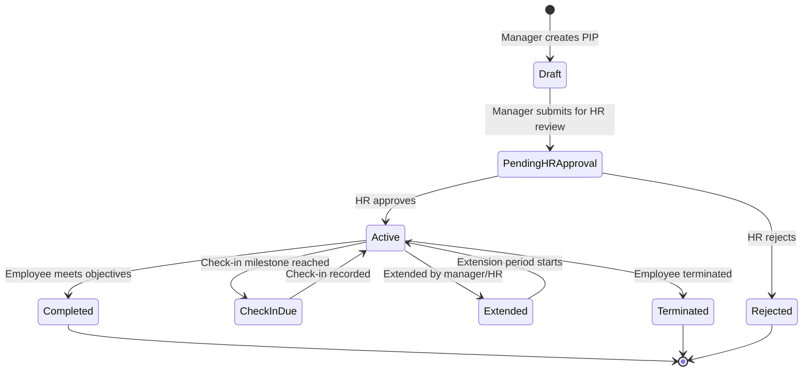

# State Machine Diagrams

## Overview
State machine diagrams showing state transitions for key entities in the Employee Management System.

---

## 1. Leave Request States

---

## 2. Payroll Run States

---

## 3. Employee Employment Status States

---

## 4. Performance Review States

---

## 5. Expense Claim States

---

## 6. Onboarding Checklist States

---

## 7. PIP (Performance Improvement Plan) States

