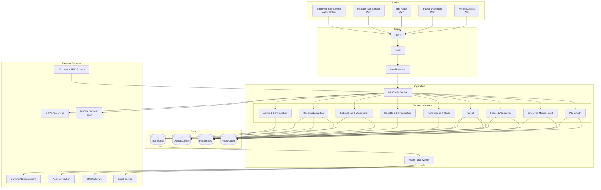
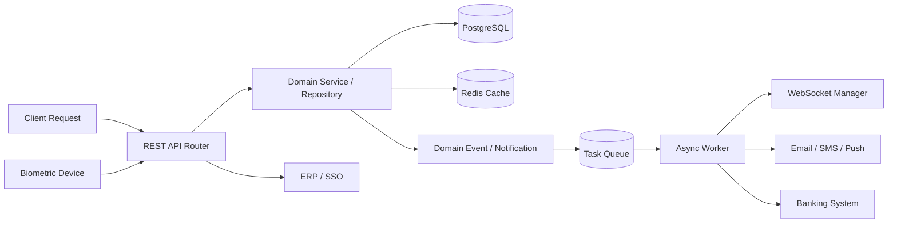

# High-Level Architecture Diagram

## Overview
This document describes the high-level architecture of the Employee Management System. The system runs as a modular monolith with domain-separated modules, async task processing, WebSocket notifications, and integrations with biometric devices, banking, and ERP systems.

---

## System Architecture Overview

---

## Runtime Interaction Model

---

## Key Backend Module Responsibilities

| Module | Main Responsibilities |
|--------|-----------------------|
| IAM | JWT auth, SSO integration, 2FA, RBAC, session management |
| Employee Management | Employee profiles, org structure, onboarding, offboarding, documents |
| Leave & Attendance | Leave requests, approvals, balances, attendance recording, timesheets, shifts |
| Payroll | Payroll runs, salary computation, deductions, payslips, bank transfer, compliance |
| Performance & Goals | Appraisal cycles, goal setting, KRA ratings, PIP, 360-degree feedback |
| Benefits & Compensation | Benefit plans, enrolment, salary structures, revision workflows |
| Notifications | In-app, email, SMS, push; WebSocket fanout for real-time updates |
| Reports & Analytics | HR, payroll, leave, performance reports; executive dashboards |
| Admin & Configuration | Roles, permissions, system settings, audit logs, integrations |

---

## Current Architecture Notes

- The system is designed as a modular monolith that can be decomposed into microservices if scale demands
- Payroll processing and bulk report generation are handled asynchronously via task queue
- Biometric punch events are ingested via REST API with offline buffering support
- SSO integration supports SAML 2.0 and OAuth 2.0 for enterprise clients
