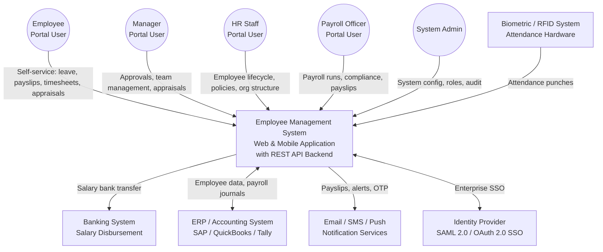
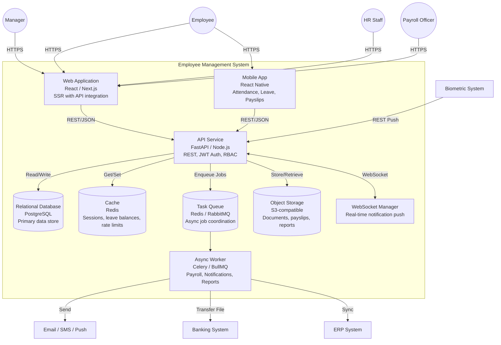

# C4 Diagrams

## Overview
C4 model diagrams for the Employee Management System at context and container levels.

---

## Level 1 - System Context Diagram

---

## Level 2 - Container Diagram

---

## Technology Choices

| Container | Technology Options | Rationale |
|-----------|-------------------|-----------|
| Web Application | React + Next.js | SSR for performance; strong ecosystem |
| Mobile App | React Native | Cross-platform; shares business logic |
| API Service | FastAPI (Python) or Node.js | High performance; async support |
| Database | PostgreSQL | ACID compliance; strong relational support for payroll |
| Cache | Redis | Fast session and balance caching |
| Task Queue | Celery + Redis / BullMQ + Redis | Reliable async payroll and notification processing |
| Object Storage | AWS S3 / MinIO | Scalable, secure document and payslip storage |
| WebSocket | Socket.IO / FastAPI WebSocket | Real-time in-app notifications |
