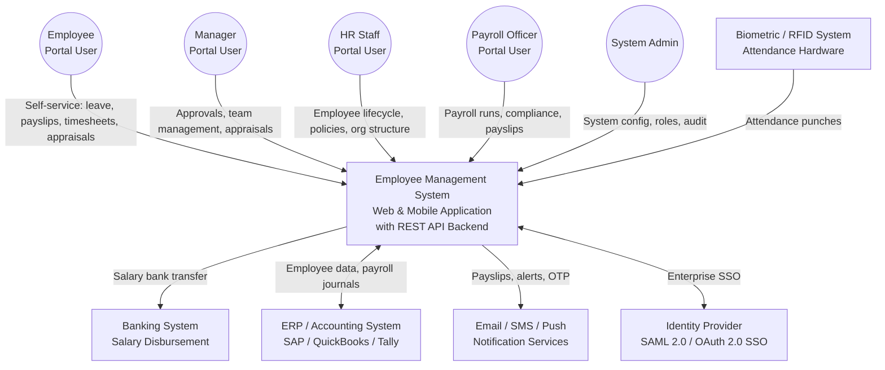
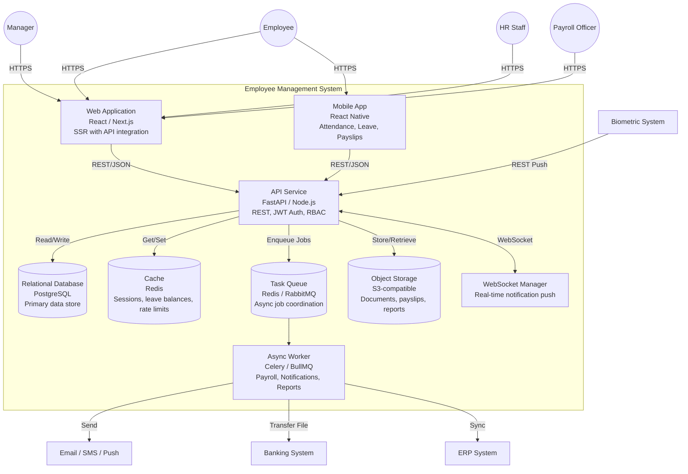
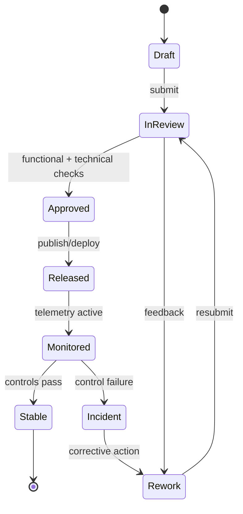

# C4 Diagrams

## Overview
C4 model diagrams for the Employee Management System at context and container levels.

---

## Level 1 - System Context Diagram

---

## Level 2 - Container Diagram

---

## Technology Choices

| Container | Technology Options | Rationale |
|-----------|-------------------|-----------|
| Web Application | React + Next.js | SSR for performance; strong ecosystem |
| Mobile App | React Native | Cross-platform; shares business logic |
| API Service | FastAPI (Python) or Node.js | High performance; async support |
| Database | PostgreSQL | ACID compliance; strong relational support for payroll |
| Cache | Redis | Fast session and balance caching |
| Task Queue | Celery + Redis / BullMQ + Redis | Reliable async payroll and notification processing |
| Object Storage | AWS S3 / MinIO | Scalable, secure document and payslip storage |
| WebSocket | Socket.IO / FastAPI WebSocket | Real-time in-app notifications |

---

---

## Process Narrative (C4 context/container alignment)
1. **Initiate**: Solution Architect captures the primary change request for **C4 Diagrams** and links it to business objectives, impacted modules, and target release windows.
2. **Design/Refine**: The team elaborates flows, assumptions, acceptance criteria, and exception paths specific to c4 context/container alignment.
3. **Authorize**: Approval checks confirm that changes satisfy policy, architecture, and compliance constraints before promotion.
4. **Execute**: Architecture Repository executes the approved path and enforces diagram consistency checks at run-time or publication-time.
5. **Integrate**: Outputs are synchronized to dependent services (IAM, payroll, reporting, notifications, and audit store) with idempotent correlation IDs.
6. **Verify & Close**: Stakeholders reconcile expected outcomes against actual telemetry to confirm architecture traceability.

## Role/Permission Matrix (C4 Diagrams)
| Capability | Employee | Manager | HR/People Ops | Engineering/IT | Compliance/Audit |
|---|---|---|---|---|---|
| View c4 diagrams artifacts | Scoped self | Team scoped | Full | Full | Read-only full |
| Propose change | Request only | Draft + justify | Draft + justify | Draft + justify | No |
| Approve publication/use | No | Conditional | Primary approver | Technical approver | Control sign-off |
| Execute override | No | Limited with reason | Limited with reason | Break-glass with ticket | No |
| Access evidence trail | No | Limited | Full | Full | Full |

## State Model (C4 context/container alignment)

## Integration Behavior (C4 Diagrams)
| Integration | Trigger | Expected Behavior | Failure Handling |
|---|---|---|---|
| IAM / RBAC | Approval or assignment change | Sync permission scopes for affected actors | Retry + alert on drift |
| Workflow/Event Bus | State transition | Publish canonical event with correlation ID | Dead-letter + replay tooling |
| Payroll/Benefits (where applicable) | Compensation/lifecycle change | Apply financial side-effects only after approved state | Hold payout + reconcile |
| Notification Channels | Review decision, exception, due date | Deliver actionable notice to owners and requestors | Escalation after SLA breach |
| Audit/GRC Archive | Any controlled transition | Store immutable evidence bundle | Block progression if evidence missing |

## Onboarding/Offboarding Edge Cases (Concrete)
- **Rehire with residual access**: If a rehire request reuses a prior identity, retain historical employee ID linkage but force fresh role entitlement approval before day-1 access.
- **Early start-date acceleration**: When onboarding date is moved earlier than background-check SLA, block activation and auto-create an exception approval task.
- **Same-day termination**: For involuntary offboarding, revoke privileged access immediately while preserving records under legal hold classification.
- **Rescinded resignation after downstream sync**: If offboarding is canceled after payroll/IAM notifications, execute compensating events and log full reversal trail.

## Compliance/Audit Controls
| Control | Description | Evidence |
|---|---|---|
| Segregation of duties | Requestor and approver cannot be the same identity for controlled actions | Approval chain + user IDs |
| Transition integrity | Only allowed state transitions can be persisted | Transition log + rejection reasons |
| Timely deprovisioning | Offboarding access revocation meets SLA targets | IAM revocation timestamp report |
| Financial reconciliation | Payroll-impacting changes reconcile before close | Payroll batch diff + sign-off |
| Immutable auditability | Controlled actions are archived in WORM/append-only storage | Hash, retention tag, archive pointer |

