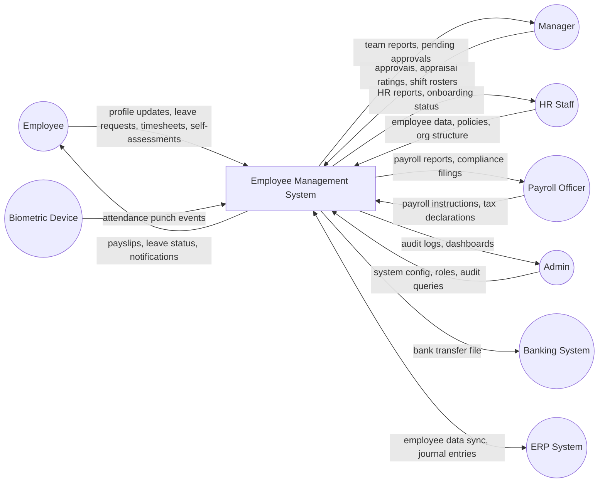
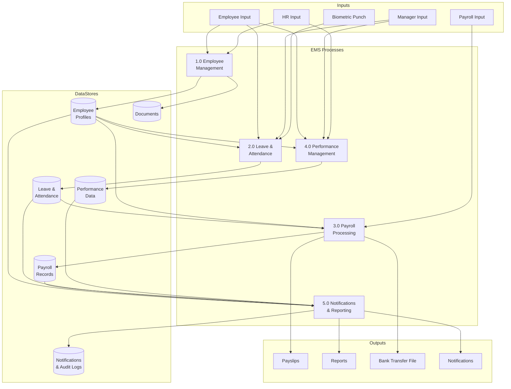
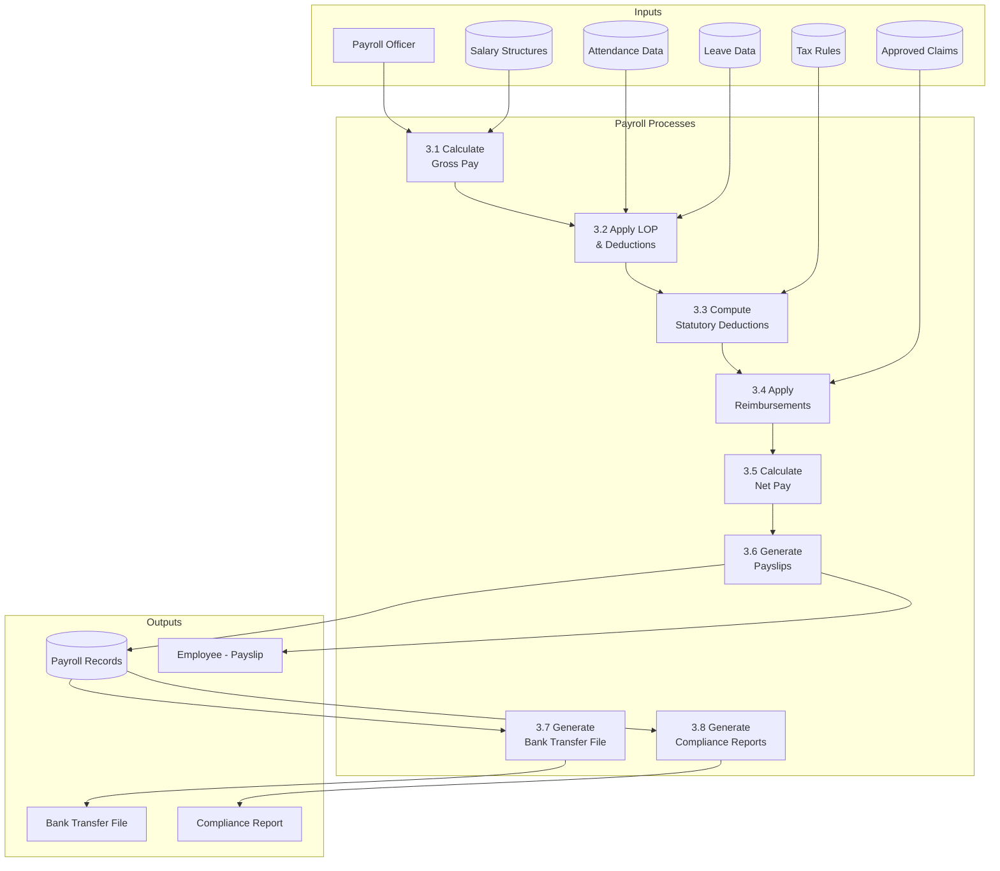
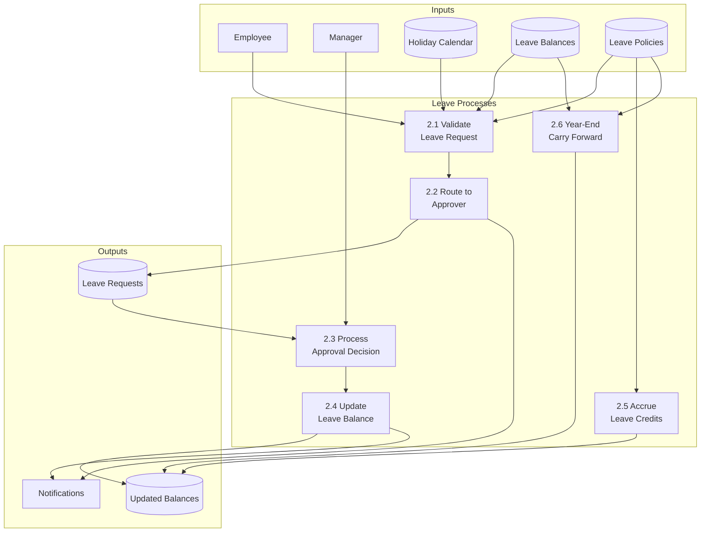

# Data Flow Diagrams

## Overview
Data flow diagrams showing how data moves through the Employee Management System at different levels of abstraction.

---

## Level 0 - Context DFD

---

## Level 1 - Major Process DFD

---

## Level 2 - Payroll Process DFD

---

## Level 2 - Leave Management DFD

