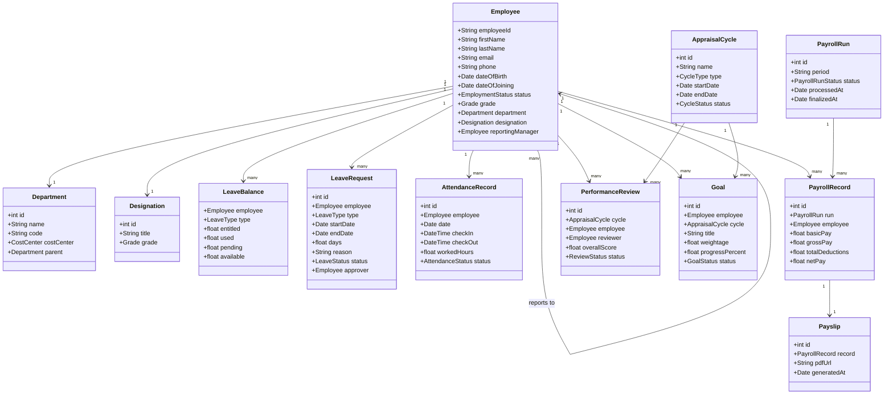
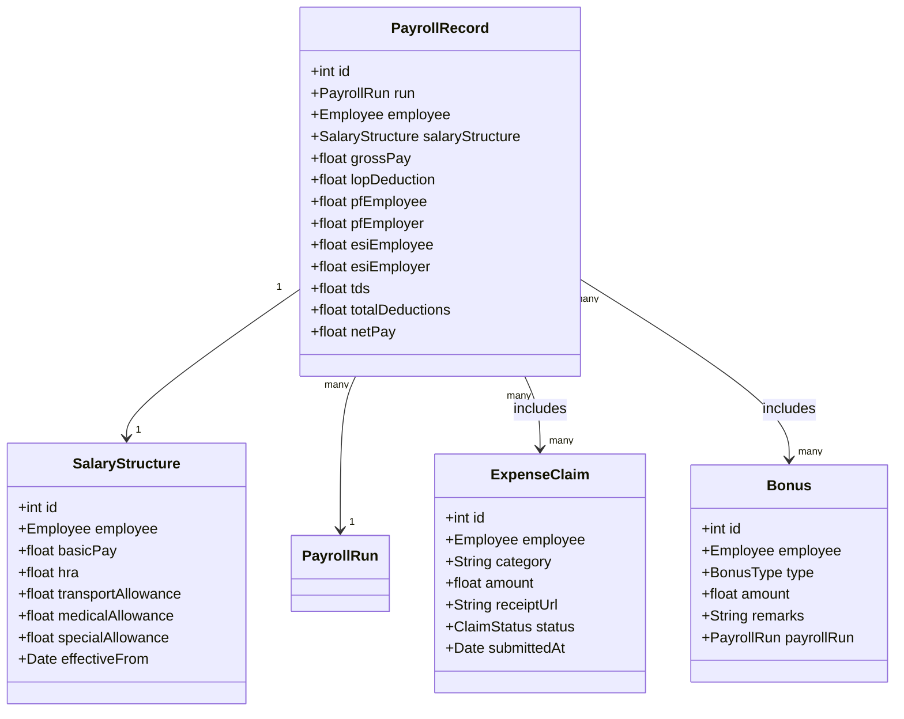
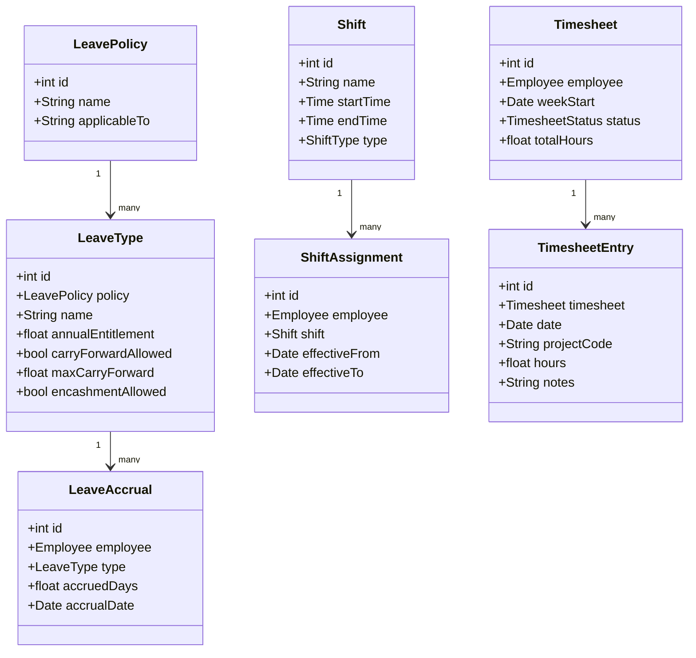

# Domain Model

## Overview
The domain model captures the key entities, their attributes, and relationships within the Employee Management System.

---

## Core Domain Model

---

## Payroll Domain Model

---

## Leave & Attendance Domain Model

