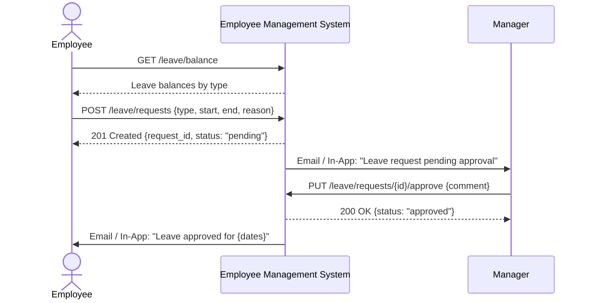
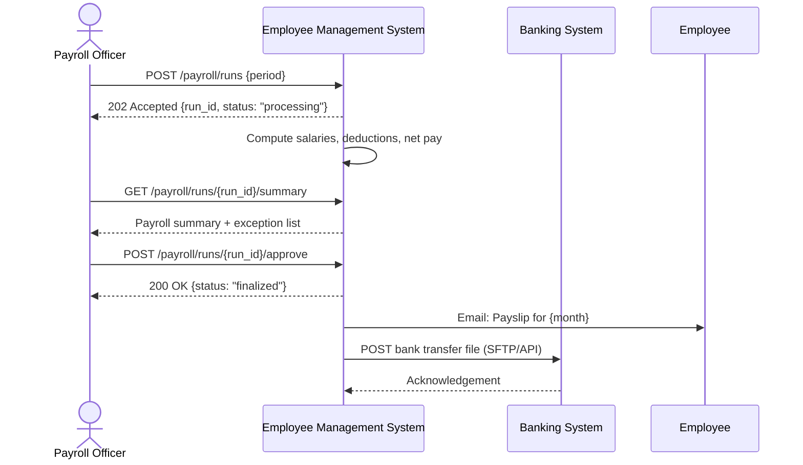
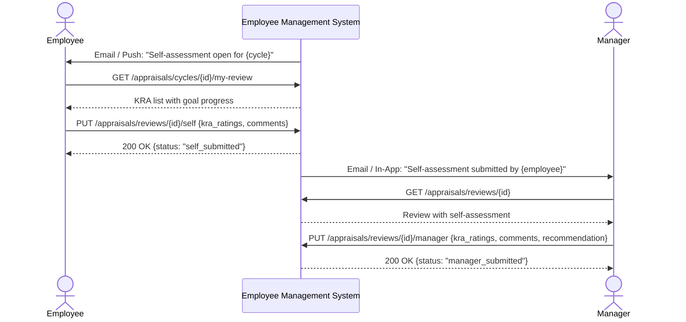
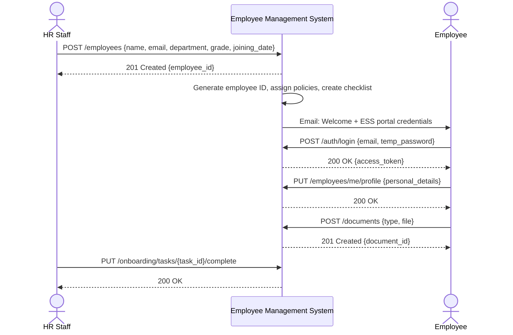

# System Sequence Diagrams

## Overview
System-level sequence diagrams showing interactions between external actors and the Employee Management System as a black box.

---

## 1. Employee Leave Application



---

## 2. Monthly Payroll Run



---

## 3. Performance Appraisal Self-Assessment



---

## 4. Employee Onboarding



---

## 5. Attendance Recording via Biometric

```mermaid
sequenceDiagram
    participant Biometric as Biometric Device
    participant EMS as Employee Management System
    actor Employee

    Biometric->>EMS: POST /attendance/punch {employee_id, timestamp, type: "check_in"}
    EMS-->>Biometric: 201 Created {attendance_id}

    EMS->>EMS: Map to employee shift; flag if late

    Biometric->>EMS: POST /attendance/punch {employee_id, timestamp, type: "check_out"}
    EMS-->>Biometric: 201 Created

    EMS->>EMS: Calculate worked hours; flag anomalies

    Employee->>EMS: GET /attendance/me?date={date}
    EMS-->>Employee: Attendance record with hours and flags
```
