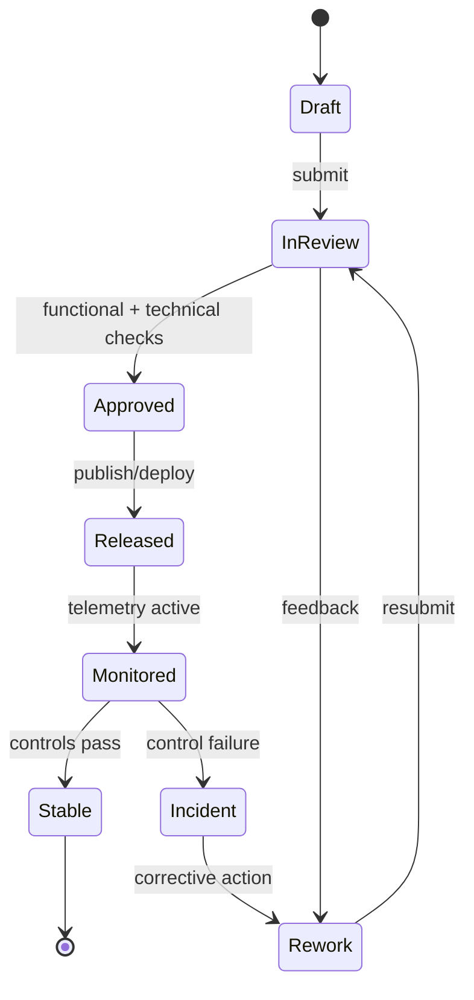

# Backend Status Matrix

## Overview
This matrix tracks the implementation status of all backend modules and features in the Employee Management System.

---

## Module Status Matrix

### IAM & Authentication

| Feature | Status | Notes |
|---------|--------|-------|
| JWT authentication (login/logout/refresh) | ✅ Implemented | RS256 signed tokens |
| Password policies (complexity, expiry) | ✅ Implemented | Configurable per org |
| 2FA / OTP for privileged accounts | ✅ Implemented | TOTP-based |
| SSO via SAML 2.0 | 🔄 In Progress | Integration config required |
| SSO via OAuth 2.0 | 🔄 In Progress | Google Workspace support |
| Role-based access control (RBAC) | ✅ Implemented | Module-level enforcement |
| Audit trail for permission changes | ✅ Implemented | |
| Session management | ✅ Implemented | Redis-backed |

---

### Employee Management

| Feature | Status | Notes |
|---------|--------|-------|
| Employee profile CRUD | ✅ Implemented | |
| Employee ID generation | ✅ Implemented | Configurable prefix/sequence |
| Department & designation management | ✅ Implemented | |
| Org chart data | ✅ Implemented | Hierarchical query |
| Employee transfer | ✅ Implemented | History maintained |
| Document upload & management | ✅ Implemented | S3-backed |
| Document expiry tracking | ✅ Implemented | Scheduled alert job |
| Onboarding checklist | ✅ Implemented | |
| Offboarding workflow | ✅ Implemented | |
| Full & final settlement computation | 🔄 In Progress | |
| Employment letter generation | 🔄 In Progress | PDF templates |

---

### Leave Management

| Feature | Status | Notes |
|---------|--------|-------|
| Leave type configuration | ✅ Implemented | |
| Leave balance tracking | ✅ Implemented | Per year per type |
| Leave application with policy validation | ✅ Implemented | |
| Leave approval / rejection workflow | ✅ Implemented | |
| Leave cancellation | ✅ Implemented | |
| Holiday calendar management | ✅ Implemented | Per location |
| Monthly leave accrual job | ✅ Implemented | |
| Year-end carry-forward processing | ✅ Implemented | |
| Leave encashment | 🔄 In Progress | Payroll integration required |
| Leave balance statement download | ✅ Implemented | |

---

### Attendance & Timesheet

| Feature | Status | Notes |
|---------|--------|-------|
| Biometric punch ingestion API | ✅ Implemented | REST push endpoint |
| Check-in / check-out recording | ✅ Implemented | |
| Worked hours calculation | ✅ Implemented | |
| Late arrival / early departure flagging | ✅ Implemented | |
| Shift definition & assignment | ✅ Implemented | |
| Shift roster management | 🔄 In Progress | |
| Attendance regularization requests | ✅ Implemented | |
| Timesheet submission | ✅ Implemented | |
| Timesheet approval workflow | ✅ Implemented | |
| Comp-off requests | ✅ Implemented | |
| Overtime calculation | ✅ Implemented | Shift-type aware |
| Offline biometric sync | 🔄 In Progress | Device firmware dependent |

---

### Payroll

| Feature | Status | Notes |
|---------|--------|-------|
| Salary structure management | ✅ Implemented | Effective date versioning |
| Monthly payroll run initiation | ✅ Implemented | |
| Gross pay calculation | ✅ Implemented | Component-based |
| LOP deduction | ✅ Implemented | From attendance data |
| PF computation (employee + employer) | ✅ Implemented | |
| ESI computation | ✅ Implemented | |
| TDS calculation | ✅ Implemented | Slab-based |
| Reimbursement inclusion | ✅ Implemented | |
| Bonus processing | ✅ Implemented | |
| Off-cycle payroll runs | ✅ Implemented | |
| Payslip PDF generation | ✅ Implemented | Configurable template |
| Payslip email delivery | ✅ Implemented | |
| Bank transfer file export | ✅ Implemented | CSV format |
| Tax declaration collection | ✅ Implemented | |
| Form 16 generation | 🔄 In Progress | Year-end batch |
| Payroll exception review | ✅ Implemented | |
| Multi-currency support | ❌ Not Started | Future requirement |

---

### Performance Management

| Feature | Status | Notes |
|---------|--------|-------|
| Appraisal cycle configuration | ✅ Implemented | |
| Goal setting | ✅ Implemented | |
| Goal progress tracking | ✅ Implemented | |
| KRA management | ✅ Implemented | |
| Employee self-assessment | ✅ Implemented | |
| Manager appraisal review | ✅ Implemented | |
| Weighted KRA scoring | ✅ Implemented | |
| 360-degree feedback collection | 🔄 In Progress | |
| HR calibration & rating finalization | ✅ Implemented | |
| Forced rating distribution | 🔄 In Progress | |
| Appraisal letter generation | 🔄 In Progress | |
| PIP initiation & tracking | ✅ Implemented | |
| PIP check-in recording | ✅ Implemented | |
| PIP close with outcome | ✅ Implemented | |

---

### Benefits & Compensation

| Feature | Status | Notes |
|---------|--------|-------|
| Benefit plan definition | ✅ Implemented | |
| Open enrolment window management | ✅ Implemented | |
| Employee enrolment | ✅ Implemented | |
| Contribution calculation | ✅ Implemented | |
| Salary band management | 🔄 In Progress | |
| Salary revision workflow | 🔄 In Progress | |
| Compensation benchmarking | ❌ Not Started | Future |

---

### Notifications

| Feature | Status | Notes |
|---------|--------|-------|
| In-app notifications | ✅ Implemented | |
| Email notifications | ✅ Implemented | SES-backed |
| SMS notifications | ✅ Implemented | SNS-backed |
| WebSocket push (real-time) | ✅ Implemented | |
| Notification preferences | ✅ Implemented | Per user |
| Bulk notification for payslip delivery | ✅ Implemented | |

---

### Reports & Analytics

| Feature | Status | Notes |
|---------|--------|-------|
| Headcount report | ✅ Implemented | |
| Attrition report | ✅ Implemented | |
| Payroll summary report | ✅ Implemented | |
| Leave utilization report | ✅ Implemented | |
| Attendance summary report | ✅ Implemented | |
| Performance rating distribution | ✅ Implemented | |
| Statutory compliance reports (PF, ESI) | ✅ Implemented | |
| Custom report builder | 🔄 In Progress | |
| Executive dashboard | 🔄 In Progress | |
| Scheduled report delivery | 🔄 In Progress | |

---

## Legend

| Symbol | Meaning |
|--------|---------|
| ✅ | Implemented and tested |
| 🔄 | In Progress / Partially implemented |
| ❌ | Not Started |

---

---

## Process Narrative (Implementation status governance)
1. **Initiate**: Engineering Manager captures the primary change request for **Backend Status Matrix** and links it to business objectives, impacted modules, and target release windows.
2. **Design/Refine**: The team elaborates flows, assumptions, acceptance criteria, and exception paths specific to implementation status governance.
3. **Authorize**: Approval checks confirm that changes satisfy policy, architecture, and compliance constraints before promotion.
4. **Execute**: Delivery Tracker executes the approved path and enforces status quality checks at run-time or publication-time.
5. **Integrate**: Outputs are synchronized to dependent services (IAM, payroll, reporting, notifications, and audit store) with idempotent correlation IDs.
6. **Verify & Close**: Stakeholders reconcile expected outcomes against actual telemetry to confirm execution transparency.

## Role/Permission Matrix (Backend Status Matrix)
| Capability | Employee | Manager | HR/People Ops | Engineering/IT | Compliance/Audit |
|---|---|---|---|---|---|
| View backend status matrix artifacts | Scoped self | Team scoped | Full | Full | Read-only full |
| Propose change | Request only | Draft + justify | Draft + justify | Draft + justify | No |
| Approve publication/use | No | Conditional | Primary approver | Technical approver | Control sign-off |
| Execute override | No | Limited with reason | Limited with reason | Break-glass with ticket | No |
| Access evidence trail | No | Limited | Full | Full | Full |

## State Model (Implementation status governance)

## Integration Behavior (Backend Status Matrix)
| Integration | Trigger | Expected Behavior | Failure Handling |
|---|---|---|---|
| IAM / RBAC | Approval or assignment change | Sync permission scopes for affected actors | Retry + alert on drift |
| Workflow/Event Bus | State transition | Publish canonical event with correlation ID | Dead-letter + replay tooling |
| Payroll/Benefits (where applicable) | Compensation/lifecycle change | Apply financial side-effects only after approved state | Hold payout + reconcile |
| Notification Channels | Review decision, exception, due date | Deliver actionable notice to owners and requestors | Escalation after SLA breach |
| Audit/GRC Archive | Any controlled transition | Store immutable evidence bundle | Block progression if evidence missing |

## Onboarding/Offboarding Edge Cases (Concrete)
- **Rehire with residual access**: If a rehire request reuses a prior identity, retain historical employee ID linkage but force fresh role entitlement approval before day-1 access.
- **Early start-date acceleration**: When onboarding date is moved earlier than background-check SLA, block activation and auto-create an exception approval task.
- **Same-day termination**: For involuntary offboarding, revoke privileged access immediately while preserving records under legal hold classification.
- **Rescinded resignation after downstream sync**: If offboarding is canceled after payroll/IAM notifications, execute compensating events and log full reversal trail.

## Compliance/Audit Controls
| Control | Description | Evidence |
|---|---|---|
| Segregation of duties | Requestor and approver cannot be the same identity for controlled actions | Approval chain + user IDs |
| Transition integrity | Only allowed state transitions can be persisted | Transition log + rejection reasons |
| Timely deprovisioning | Offboarding access revocation meets SLA targets | IAM revocation timestamp report |
| Financial reconciliation | Payroll-impacting changes reconcile before close | Payroll batch diff + sign-off |
| Immutable auditability | Controlled actions are archived in WORM/append-only storage | Hash, retention tag, archive pointer |

