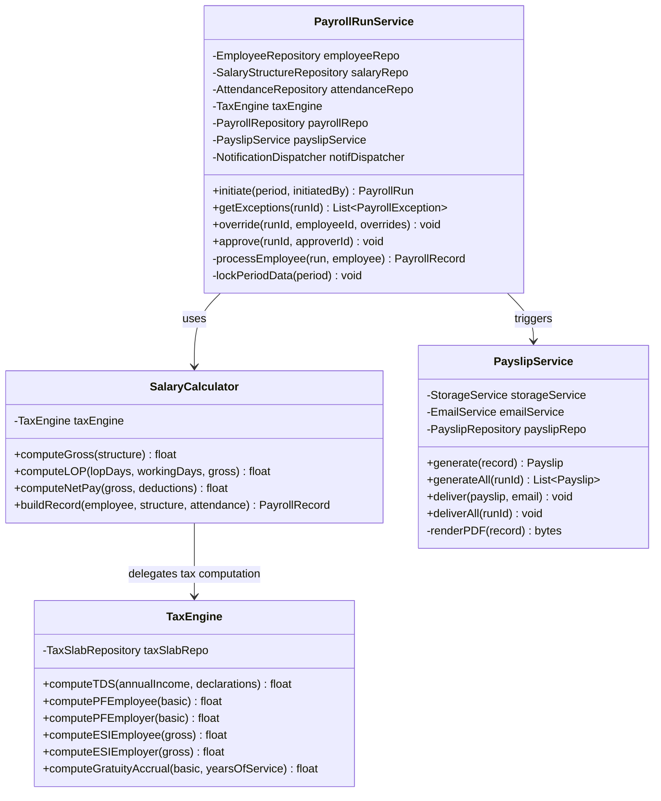
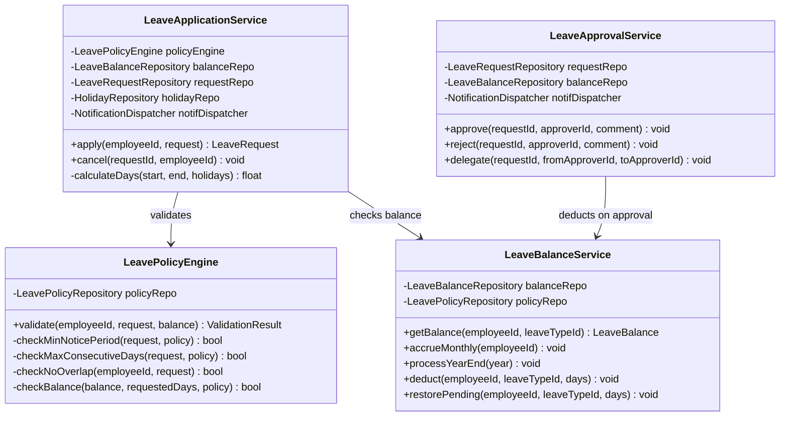
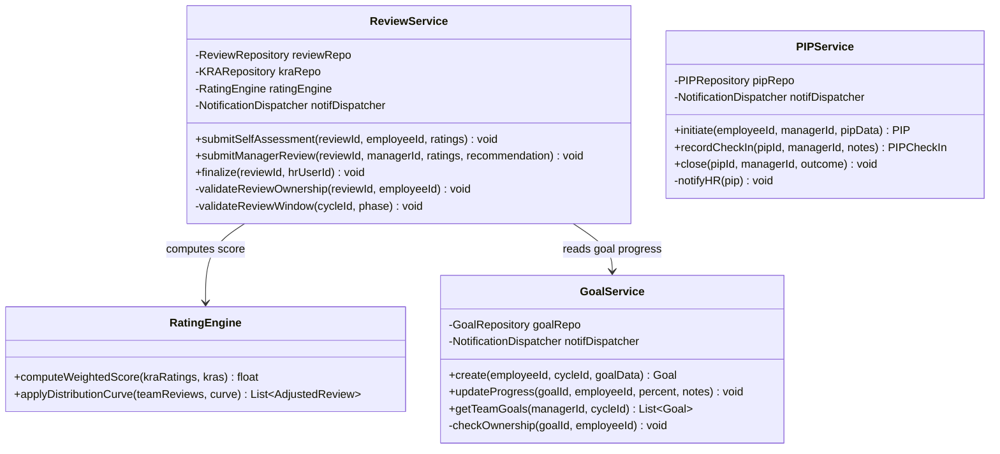

# C4 Code Diagram

## Overview
C4 Level 4 code-level diagrams for key classes within the Employee Management System's most critical modules.

---

## Payroll Calculation Engine - Code Diagram

---

## Leave Application Service - Code Diagram

---

## Performance Review Service - Code Diagram

