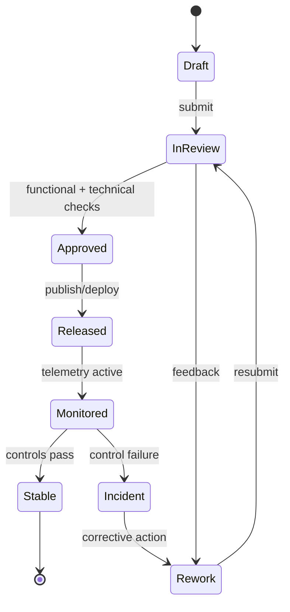

# Implementation Guidelines

## Overview
This document provides implementation guidelines for building the Employee Management System, covering project structure, coding conventions, key patterns, and module-by-module guidance.

---

## Project Structure

```
employee-management-system/
├── src/
│   ├── main.py                    # Application entry point
│   ├── config.py                  # Configuration loading
│   ├── database.py                # DB connection and session
│   │
│   ├── modules/
│   │   ├── iam/                   # Authentication, SSO, 2FA
│   │   │   ├── router.py
│   │   │   ├── service.py
│   │   │   ├── repository.py
│   │   │   ├── schemas.py
│   │   │   └── models.py
│   │   │
│   │   ├── employees/             # Employee profiles, org, onboarding
│   │   │   ├── router.py
│   │   │   ├── service.py
│   │   │   ├── repository.py
│   │   │   ├── schemas.py
│   │   │   └── models.py
│   │   │
│   │   ├── leave/                 # Leave management
│   │   │   ├── router.py
│   │   │   ├── service.py
│   │   │   ├── policy_engine.py   # Leave policy rules
│   │   │   ├── repository.py
│   │   │   ├── schemas.py
│   │   │   └── models.py
│   │   │
│   │   ├── attendance/            # Attendance, shifts, timesheets
│   │   │   ├── router.py
│   │   │   ├── service.py
│   │   │   ├── repository.py
│   │   │   ├── schemas.py
│   │   │   └── models.py
│   │   │
│   │   ├── payroll/               # Payroll processing
│   │   │   ├── router.py
│   │   │   ├── service.py
│   │   │   ├── calculator.py      # Salary & tax calculation
│   │   │   ├── tax_engine.py      # TDS, PF, ESI computation
│   │   │   ├── payslip_service.py # PDF generation & delivery
│   │   │   ├── repository.py
│   │   │   ├── schemas.py
│   │   │   └── models.py
│   │   │
│   │   ├── performance/           # Appraisals, goals, PIP
│   │   │   ├── router.py
│   │   │   ├── service.py
│   │   │   ├── rating_engine.py   # Weighted KRA scoring
│   │   │   ├── repository.py
│   │   │   ├── schemas.py
│   │   │   └── models.py
│   │   │
│   │   ├── benefits/              # Benefit plans, enrolments
│   │   │   ├── router.py
│   │   │   ├── service.py
│   │   │   ├── repository.py
│   │   │   ├── schemas.py
│   │   │   └── models.py
│   │   │
│   │   ├── notifications/         # In-app, email, SMS, push, WS
│   │   │   ├── router.py
│   │   │   ├── dispatcher.py
│   │   │   ├── ws_manager.py
│   │   │   ├── repository.py
│   │   │   └── models.py
│   │   │
│   │   ├── reports/               # Report generation
│   │   │   ├── router.py
│   │   │   ├── service.py
│   │   │   ├── builders/          # Per-domain report builders
│   │   │   └── repository.py
│   │   │
│   │   └── admin/                 # Roles, config, audit logs
│   │       ├── router.py
│   │       ├── service.py
│   │       ├── repository.py
│   │       └── models.py
│   │
│   ├── shared/
│   │   ├── auth.py                # JWT helpers, RBAC decorator
│   │   ├── pagination.py          # Paginated response builder
│   │   ├── events.py              # Domain event bus
│   │   ├── storage.py             # S3 abstraction
│   │   ├── email.py               # Email client abstraction
│   │   └── exceptions.py          # Custom exception classes
│   │
│   └── workers/
│       ├── payroll_worker.py      # Payroll run async tasks
│       ├── notification_worker.py # Notification delivery tasks
│       └── report_worker.py       # Report generation tasks
│
├── alembic/                       # Database migrations
│   └── versions/
├── tests/
│   ├── unit/
│   ├── integration/
│   └── e2e/
├── docker-compose.yml
├── Dockerfile
└── requirements.txt
```

---

## Key Implementation Patterns

### 1. Payroll Idempotency
Payroll runs must be idempotent to prevent duplicate salary payments:
- Assign a unique `run_id` per period before processing
- Check if a finalized run already exists for the period before initiating
- Use database transactions to atomically create all `payroll_records` for a run
- Finalization is a one-way state transition; corrections require new off-cycle runs

### 2. Leave Balance Consistency
Leave balances must remain consistent under concurrent leave applications:
- Use database row-level locking when deducting from `leave_balances`
- Track pending balance separately so approved-but-not-yet-started leaves are accounted for
- Accrual jobs run as scheduled tasks (e.g., monthly); use idempotent accrual records

### 3. Async Payroll Processing
Payroll computation for large employee sets must be async:
- Enqueue a payroll run job to the task queue upon initiation
- Process employees in batches within the worker
- Update `payroll_run.status` at each stage (`processing`, `pending_review`)
- Use WebSocket to push status updates to the payroll officer's dashboard

### 4. RBAC Enforcement
Role-based access must be enforced at the service layer, not just the router:
```python
# Example RBAC decorator pattern
@require_role(["HR", "Admin"])
def create_employee(current_user, employee_data):
    ...
```
- Define a permission matrix mapping roles to allowed actions per module
- Managers can only access their direct and indirect reports' data

### 5. Audit Trail
All create, update, and delete operations on sensitive entities must generate audit records:
- Capture `before` and `after` JSON snapshots for all changes
- Record the acting user, timestamp, IP address, and resource ID
- Audit logs are append-only and should never be modified

### 6. Document Expiry Alerts
Schedule a daily job to check `employee_documents.expiry_date`:
- Alert employees and HR 30 days and 7 days before expiry
- Track notification state to avoid duplicate alerts

---

## Module Implementation Priority

| Priority | Module | Key Deliverable |
|----------|--------|----------------|
| P0 | IAM | Authentication, RBAC, SSO |
| P0 | Employee Management | Employee profiles, org structure |
| P0 | Leave Management | Leave requests, approval workflow, balances |
| P0 | Attendance | Punch recording, shift assignment |
| P0 | Payroll | Payroll run, payslip generation |
| P1 | Performance | Appraisal cycles, goals, KRA ratings |
| P1 | Notifications | Email, in-app, WebSocket push |
| P1 | Reports | HR, payroll, leave reports |
| P2 | Benefits | Benefit plans, enrolment |
| P2 | PIP | Performance improvement plan workflow |
| P2 | Onboarding / Offboarding | Checklist workflows |

---

## Development Conventions

### API Response Envelope
All API responses use a consistent envelope:
```json
{
  "success": true,
  "data": { ... },
  "meta": { "page": 1, "per_page": 20, "total": 150 }
}
```

### Error Codes
All business errors return a domain-specific error code:
- `LEAVE_POLICY_VIOLATION` – leave request violates configured policy
- `PAYROLL_RUN_EXISTS` – payroll run already finalized for this period
- `INSUFFICIENT_LEAVE_BALANCE` – not enough balance for the request
- `APPRAISAL_WINDOW_CLOSED` – self-assessment submitted outside the window

### Database Migrations
- All schema changes go through Alembic migrations
- Migrations are incremental and never drop columns directly (use soft deprecation first)
- Every migration includes a reversible `downgrade()` function

### Testing Strategy
- **Unit tests** – Cover all service and engine classes in isolation with mocks
- **Integration tests** – Test key API endpoints against a test database
- **E2E tests** – Cover critical paths: leave apply → approve, payroll run → finalize, self-assessment → finalize

---

---

## Process Narrative (Delivery implementation standards)
1. **Initiate**: Principal Engineer captures the primary change request for **Implementation Guidelines** and links it to business objectives, impacted modules, and target release windows.
2. **Design/Refine**: The team elaborates flows, assumptions, acceptance criteria, and exception paths specific to delivery implementation standards.
3. **Authorize**: Approval checks confirm that changes satisfy policy, architecture, and compliance constraints before promotion.
4. **Execute**: CI/CD Pipeline executes the approved path and enforces quality gate checks at run-time or publication-time.
5. **Integrate**: Outputs are synchronized to dependent services (IAM, payroll, reporting, notifications, and audit store) with idempotent correlation IDs.
6. **Verify & Close**: Stakeholders reconcile expected outcomes against actual telemetry to confirm implementation consistency.

## Role/Permission Matrix (Implementation Guidelines)
| Capability | Employee | Manager | HR/People Ops | Engineering/IT | Compliance/Audit |
|---|---|---|---|---|---|
| View implementation guidelines artifacts | Scoped self | Team scoped | Full | Full | Read-only full |
| Propose change | Request only | Draft + justify | Draft + justify | Draft + justify | No |
| Approve publication/use | No | Conditional | Primary approver | Technical approver | Control sign-off |
| Execute override | No | Limited with reason | Limited with reason | Break-glass with ticket | No |
| Access evidence trail | No | Limited | Full | Full | Full |

## State Model (Delivery implementation standards)


## Integration Behavior (Implementation Guidelines)
| Integration | Trigger | Expected Behavior | Failure Handling |
|---|---|---|---|
| IAM / RBAC | Approval or assignment change | Sync permission scopes for affected actors | Retry + alert on drift |
| Workflow/Event Bus | State transition | Publish canonical event with correlation ID | Dead-letter + replay tooling |
| Payroll/Benefits (where applicable) | Compensation/lifecycle change | Apply financial side-effects only after approved state | Hold payout + reconcile |
| Notification Channels | Review decision, exception, due date | Deliver actionable notice to owners and requestors | Escalation after SLA breach |
| Audit/GRC Archive | Any controlled transition | Store immutable evidence bundle | Block progression if evidence missing |

## Onboarding/Offboarding Edge Cases (Concrete)
- **Rehire with residual access**: If a rehire request reuses a prior identity, retain historical employee ID linkage but force fresh role entitlement approval before day-1 access.
- **Early start-date acceleration**: When onboarding date is moved earlier than background-check SLA, block activation and auto-create an exception approval task.
- **Same-day termination**: For involuntary offboarding, revoke privileged access immediately while preserving records under legal hold classification.
- **Rescinded resignation after downstream sync**: If offboarding is canceled after payroll/IAM notifications, execute compensating events and log full reversal trail.

## Compliance/Audit Controls
| Control | Description | Evidence |
|---|---|---|
| Segregation of duties | Requestor and approver cannot be the same identity for controlled actions | Approval chain + user IDs |
| Transition integrity | Only allowed state transitions can be persisted | Transition log + rejection reasons |
| Timely deprovisioning | Offboarding access revocation meets SLA targets | IAM revocation timestamp report |
| Financial reconciliation | Payroll-impacting changes reconcile before close | Payroll batch diff + sign-off |
| Immutable auditability | Controlled actions are archived in WORM/append-only storage | Hash, retention tag, archive pointer |

