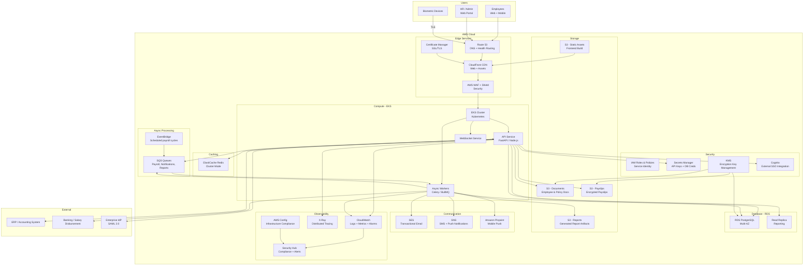

# Cloud Architecture Diagram

## Overview
Cloud architecture diagram for the Employee Management System on AWS, showing managed services, regions, and service integrations.

---

## AWS Cloud Architecture

---

## Multi-Environment Setup

| Environment | Purpose | Scale | Notes |
|-------------|---------|-------|-------|
| **Development** | Developer testing | Minimal (single pod) | Shared DB, no HA |
| **Staging** | Pre-production testing | Reduced (2 pods) | Mirrors production config |
| **Production** | Live system | Full HA (3+ pods) | Multi-AZ, DR enabled |
| **DR (Disaster Recovery)** | Failover | Standby (warm) | Cross-region replica |

---

## Cost Optimization Strategies

| Strategy | Implementation |
|----------|---------------|
| **Reserved Instances** | RDS and ElastiCache 1-year reservations for predictable workloads |
| **Spot Workers** | Async workers run on Spot instances with graceful termination handling |
| **S3 Lifecycle Policies** | Archive payslips older than 2 years to S3 Glacier |
| **CloudFront Caching** | Cache static assets aggressively; API responses with short TTLs |
| **Auto-Scaling** | HPA on CPU/memory for API pods; queue-depth scaling for workers |
| **Right-Sizing** | Periodic review of instance types based on CloudWatch metrics |
