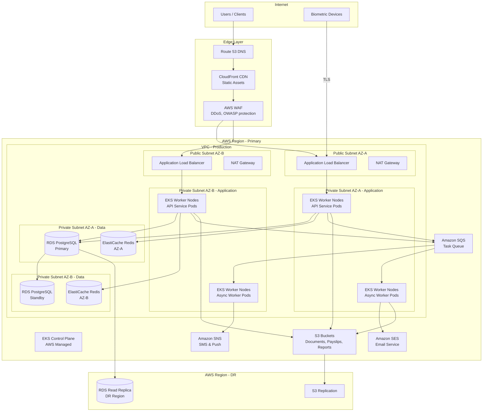
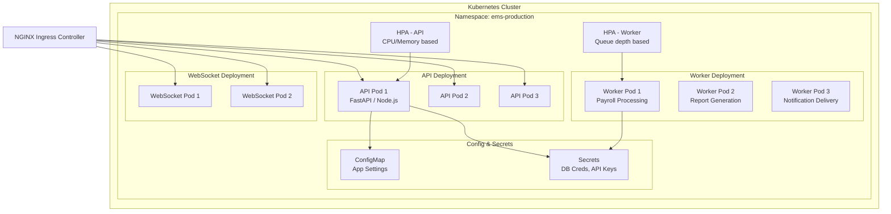

# Deployment Diagram

## Overview
Deployment diagrams showing the mapping of software components to hardware and infrastructure for the Employee Management System.

---

## Production Deployment Architecture

---

## Kubernetes Pod Layout

---

## CI/CD Pipeline

```mermaid
graph LR
    Dev[Developer Push] --> GitRepo[Git Repository]
    GitRepo --> CI[CI Pipeline\nGitHub Actions / GitLab CI]
    CI --> Lint[Lint & Format Check]
    Lint --> Tests[Unit & Integration Tests]
    Tests --> Build[Docker Build]
    Build --> SAST[SAST Security Scan]
    SAST --> Registry[Container Registry\nECR / DockerHub]
    Registry --> StagingDeploy[Deploy to Staging]
    StagingDeploy --> E2E[E2E Tests]
    E2E --> ManualApproval{Manual Approval}
    ManualApproval --> ProdDeploy[Deploy to Production\nRolling Update]
    ProdDeploy --> HealthCheck[Health Check\nReadiness Probe]
    HealthCheck --> Done([Deployment Complete])
```

