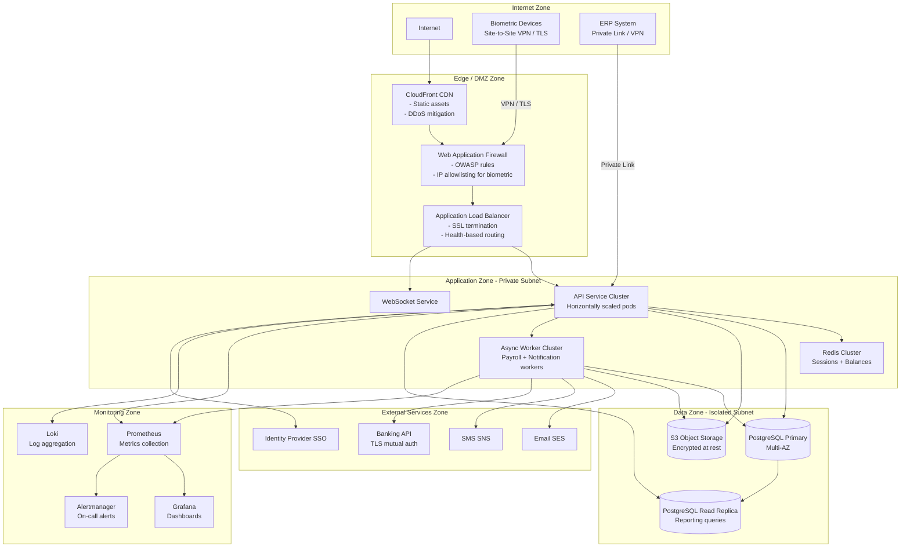
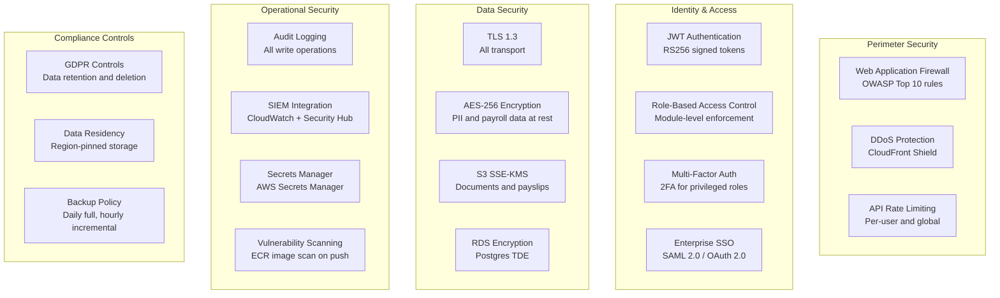
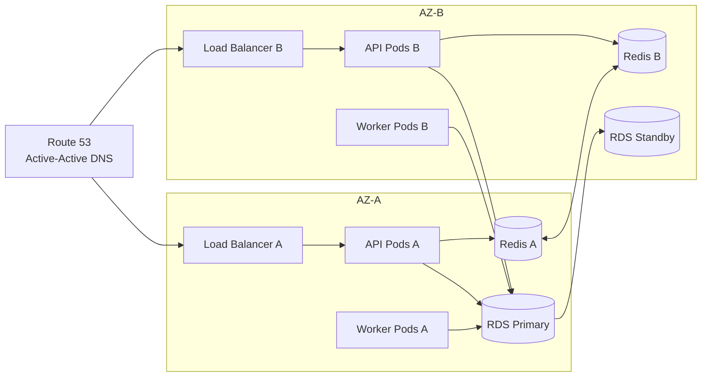

# Network / Infrastructure Diagram

## Overview
Network and infrastructure diagrams for the Employee Management System, showing security zones, traffic flow, and internal connectivity.

---

## Network Architecture

---

## Security Architecture

---

## High Availability Topology

