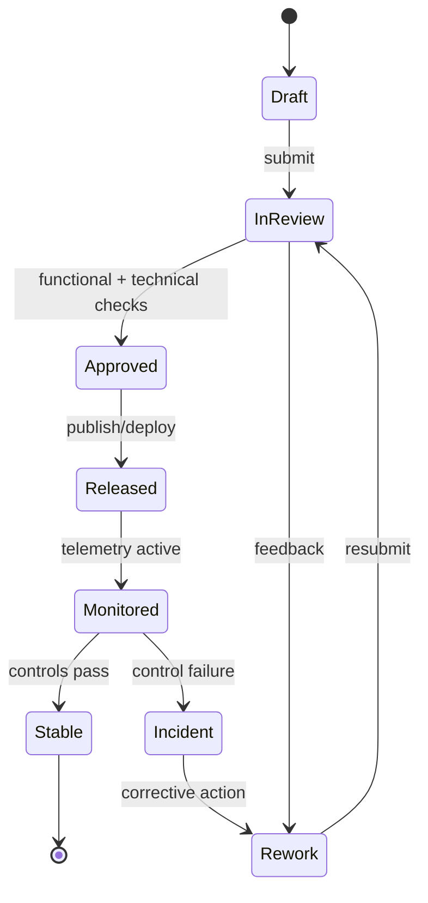

# Requirements Document

## 1. Introduction

### 1.1 Purpose
This document defines the functional and non-functional requirements for a comprehensive Employee Management System (EMS) covering HR operations, payroll processing, leave and attendance management, performance evaluation, and benefits administration.

### 1.2 Scope
The system will support:
- Employee lifecycle management from onboarding to offboarding
- Payroll calculation, tax management, and payslip generation
- Leave requests, approvals, and balance tracking
- Attendance recording and timesheet management
- Performance appraisals and goal management
- Benefits enrolment and compensation management
- HR analytics and compliance reporting

### 1.3 Definitions

| Term | Definition |
|------|------------|
| **EMS** | Employee Management System |
| **HRMS** | Human Resource Management System |
| **CTC** | Cost to Company – total annual employment cost |
| **ESS** | Employee Self-Service portal |
| **MSS** | Manager Self-Service portal |
| **PIP** | Performance Improvement Plan |
| **KRA** | Key Result Area – primary responsibility area for evaluation |
| **TDS** | Tax Deducted at Source (applicable for regional tax compliance) |
| **PF** | Provident Fund – statutory retirement savings contribution |
| **LOP** | Loss of Pay – unpaid absence deduction in payroll |

---

## 2. Functional Requirements

### 2.1 User Management & Authentication Module

#### FR-UM-001: Employee Registration & Onboarding
- System shall allow HR to create employee profiles with personal, contact, and employment details
- System shall generate a unique Employee ID upon profile creation
- System shall support document upload (ID proofs, certificates, contracts)
- System shall send welcome emails with portal credentials upon onboarding

#### FR-UM-002: Role-Based Access Control
- System shall support predefined roles: Employee, Manager, HR Staff, Payroll Officer, Admin
- System shall allow Admin to create custom roles with granular permissions
- System shall maintain audit logs for all permission changes

#### FR-UM-003: Authentication & Security
- System shall implement JWT-based authentication with refresh token support
- System shall enforce password policies (length, complexity, expiry)
- System shall support SSO via SAML 2.0 / OAuth 2.0
- System shall support 2FA for privileged accounts (HR, Payroll, Admin)

#### FR-UM-004: Employee Self-Service (ESS)
- Employees shall update personal contact information and emergency contacts
- Employees shall upload and manage personal documents
- Employees shall view their employment details, role, and department

---

### 2.2 HR Management Module

#### FR-HR-001: Employee Profile Management
- System shall maintain comprehensive employee profiles with employment history
- System shall support org-chart hierarchy (department, reporting manager)
- System shall track employment status (active, probation, on notice, terminated)
- System shall manage employee transfers between departments and locations

#### FR-HR-002: Onboarding Workflow
- System shall create onboarding task checklists assignable to HR, IT, and manager
- System shall track task completion status with due dates
- System shall trigger automated notifications for pending onboarding tasks
- System shall generate and store offer letters and appointment letters

#### FR-HR-003: Offboarding Workflow
- System shall manage resignation/termination workflows with approval chains
- System shall generate clearance checklists (assets, access revocation, final settlement)
- System shall calculate full and final settlement amounts
- System shall generate experience and relieving letters

#### FR-HR-004: Document Management
- System shall maintain a central repository for employee documents
- System shall support version control for policy documents
- System shall send alerts for documents nearing expiry (e.g., visa, certifications)
- System shall enforce role-based access to sensitive documents

#### FR-HR-005: Organizational Structure
- System shall maintain department, designation, and location hierarchies
- System shall visualize org charts dynamically
- System shall support cost-center assignments per employee

---

### 2.3 Attendance & Timesheet Module

#### FR-AT-001: Attendance Tracking
- System shall record check-in and check-out timestamps
- System shall integrate with biometric/RFID devices and mobile GPS
- System shall auto-calculate daily worked hours and overtime
- System shall flag late arrivals, early departures, and absences

#### FR-AT-002: Shift Management
- System shall define and assign work shifts (fixed, rotational, flexible)
- System shall manage shift rosters and swap requests
- System shall calculate shift differentials for payroll

#### FR-AT-003: Timesheet Management
- Employees shall submit daily or weekly timesheets with project/task codes
- Managers shall approve or reject timesheets with comments
- System shall integrate approved timesheet hours into payroll calculations
- System shall support billable hours tracking for client billing

#### FR-AT-004: Overtime & Comp-Off Management
- System shall calculate overtime based on configured rules and shift type
- Employees shall apply for compensatory-off against overtime hours
- Managers shall approve or reject comp-off requests
- System shall track comp-off balances and expiry

---

### 2.4 Leave Management Module

#### FR-LM-001: Leave Policy Configuration
- System shall support multiple leave types (annual, sick, casual, maternity, paternity, unpaid)
- System shall configure leave entitlements per employee type, location, and seniority
- System shall define carry-forward and encashment rules per leave type

#### FR-LM-002: Leave Application
- Employees shall apply for leave specifying type, dates, and reason
- System shall display available leave balance before submission
- System shall enforce leave policy rules (minimum notice, maximum consecutive days)
- System shall prevent leave overlapping with approved leaves

#### FR-LM-003: Leave Approval Workflow
- System shall route leave requests through configured approval chains
- Managers shall approve, reject, or delegate leave requests
- System shall notify employees of approval/rejection with reason
- System shall auto-approve leaves if no response within defined SLA

#### FR-LM-004: Leave Balance Management
- System shall track leave balances with accrual calculations
- System shall process year-end carry-forward and lapse based on policy
- System shall deduct approved leave from balance in real time
- System shall generate leave balance statements on demand

#### FR-LM-005: Holiday Calendar
- Admin shall configure national and regional holiday calendars
- System shall exclude holidays from leave calculations
- System shall notify employees of upcoming holidays

---

### 2.5 Payroll Module

#### FR-PR-001: Payroll Configuration
- System shall support configurable salary components (basic, HRA, allowances, deductions)
- System shall define tax slabs and statutory deduction rules (PF, ESI, TDS)
- System shall support multiple pay frequencies (monthly, bi-weekly)
- System shall configure payroll cycles per employee group or location

#### FR-PR-002: Payroll Processing
- System shall auto-calculate gross and net pay per employee each pay cycle
- System shall factor in LOP deductions from unapproved absences
- System shall apply approved overtime and comp-off payments
- System shall process salary revisions effective from specified dates
- System shall support off-cycle payroll runs for corrections and bonuses

#### FR-PR-003: Tax & Statutory Compliance
- System shall calculate income tax deductions as per configured tax slabs
- System shall generate Form 16 / tax certificates for employees
- System shall compute and track statutory contributions (PF, ESI, gratuity)
- System shall generate compliance reports for statutory filings

#### FR-PR-004: Payslip Generation
- System shall generate itemized digital payslips per employee per pay cycle
- System shall deliver payslips via email and ESS portal
- System shall archive payslips for the full employment tenure
- System shall allow employees to download payslips in PDF format

#### FR-PR-005: Reimbursements & Expense Claims
- Employees shall submit expense claims with receipts
- Managers shall approve or reject claims
- Approved claims shall be included in the next payroll run
- System shall track claim status and payment history

#### FR-PR-006: Bonus & Incentive Management
- System shall support ad-hoc bonus payments and performance-linked incentives
- System shall define bonus eligibility rules and calculation formulas
- System shall generate bonus statements for employees

---

### 2.6 Performance Evaluation Module

#### FR-PE-001: Goal Setting
- Employees and managers shall collaboratively set SMART goals per review cycle
- System shall align individual goals to department and organizational objectives
- System shall track goal progress with percentage completion
- System shall notify employees of goals nearing the deadline

#### FR-PE-002: Performance Review Cycle
- Admin shall configure review cycle types (annual, bi-annual, quarterly, probation)
- System shall auto-launch review cycles on schedule
- System shall send reminders to employees and managers for pending reviews
- System shall support 360-degree feedback from peers, subordinates, and managers

#### FR-PE-003: Appraisal Workflow
- Employees shall complete self-assessments with ratings and comments per KRA
- Managers shall rate employees, add comments, and recommend actions
- HR shall review and finalize ratings before release
- System shall calculate overall performance scores from weighted KRA ratings

#### FR-PE-004: Performance Improvement Plan (PIP)
- Managers shall initiate PIPs for under-performing employees
- System shall track PIP milestones, check-ins, and outcomes
- System shall notify HR and relevant stakeholders of PIP status changes
- System shall close PIPs as completed, extended, or resulted in termination

#### FR-PE-005: Calibration & Rating Distribution
- HR shall configure forced rating distribution curves
- System shall assist calibration sessions with comparison views
- System shall finalize and lock ratings after calibration

#### FR-PE-006: Career Development
- Employees shall record training, certifications, and skill additions
- Managers shall recommend training programs and career paths
- System shall maintain a skills inventory per employee
- System shall suggest learning resources based on skill gaps

---

### 2.7 Benefits & Compensation Module

#### FR-BC-001: Benefits Enrolment
- System shall define benefit plans (health insurance, dental, vision, life insurance)
- Employees shall enrol in eligible benefit plans during open enrolment windows
- System shall calculate employer and employee benefit contributions
- System shall manage dependent additions to benefit plans

#### FR-BC-002: Compensation Management
- System shall maintain a compensation structure with salary bands per grade
- HR shall conduct salary benchmarking comparisons
- System shall manage salary revision workflows with approvals
- System shall generate compensation statements per employee

#### FR-BC-003: Provident Fund & Gratuity
- System shall calculate and track PF contributions (employee + employer)
- System shall calculate gratuity eligibility and accruals
- System shall generate PF and gratuity statements

---

### 2.8 Notification Module

#### FR-NM-001: Email Notifications
- System shall send transactional emails for key events (leave approval, payslip, review)
- System shall support configurable email templates per notification type
- System shall track email delivery status

#### FR-NM-002: In-App Notifications
- System shall display real-time in-app notifications for pending actions
- System shall maintain a notification inbox per user with read/unread status
- System shall support bulk notification marking

#### FR-NM-003: Push & SMS Notifications
- System shall send push notifications to mobile apps for urgent alerts
- System shall send SMS for OTP and critical payroll/leave events
- System shall respect user notification preferences

---

### 2.9 Reporting & Analytics Module

#### FR-RA-001: HR Reports
- System shall generate headcount, attrition, and hiring reports
- System shall track diversity and inclusion metrics
- System shall produce department-wise workforce reports

#### FR-RA-002: Payroll Reports
- System shall generate payroll summary and variance reports
- System shall produce statutory compliance reports for filing
- System shall generate cost-center-wise payroll expense reports

#### FR-RA-003: Leave & Attendance Reports
- System shall generate attendance summary and leave utilization reports
- System shall identify absenteeism trends per team and location
- System shall produce overtime cost analysis reports

#### FR-RA-004: Performance Reports
- System shall generate rating distribution and calibration reports
- System shall track goal completion rates across departments
- System shall produce individual and team performance trend reports

#### FR-RA-005: Custom Reports & Dashboards
- Admin shall configure custom reports with field selection and filters
- System shall provide executive dashboards with key workforce metrics
- System shall support report scheduling and automated email delivery

---

## 3. Non-Functional Requirements

### 3.1 Performance

| Requirement | Target |
|-------------|--------|
| API response time | < 200ms (p95) |
| Payroll processing (1000 employees) | < 5 minutes |
| Report generation | < 30 seconds |
| Concurrent users | 10,000+ |
| Dashboard load time | < 2 seconds |

### 3.2 Scalability
- Horizontal scaling of application services
- Database read replicas for reporting queries
- Async processing for payroll and bulk report generation
- CDN for static assets and document downloads

### 3.3 Availability
- 99.9% uptime SLA
- Zero-downtime deployments
- Multi-region failover for critical HR data
- Graceful degradation on third-party integrations

### 3.4 Security
- HTTPS/TLS 1.3 for all communications
- AES-256 encryption for sensitive PII at rest
- GDPR and regional data privacy compliance
- Role-based access control at all API endpoints
- Rate limiting on authentication endpoints
- Regular security audits and penetration testing
- Audit trail for all data modifications

### 3.5 Reliability
- Automated daily database backups with point-in-time recovery
- Idempotent payroll processing to prevent double-payment
- Event sourcing for payroll and leave balance changes
- Circuit breaker patterns for third-party integrations

### 3.6 Maintainability
- Modular monolith or microservices-ready architecture
- Comprehensive structured logging
- Distributed tracing for async workflows
- Health check and readiness endpoints
- Feature flags for phased rollouts

### 3.7 Usability
- Mobile-responsive web interface
- WCAG 2.1 AA accessibility compliance
- Multi-language and locale support (dates, currency, number formats)
- Offline-capable mobile app for attendance and leave

---

## 4. System Constraints

### 4.1 Technical Constraints
- Cloud-native deployment (AWS / GCP / Azure)
- Container-based deployment (Docker / Kubernetes)
- REST API-first design with optional GraphQL for reporting
- Event-driven architecture for payroll and notification workflows

### 4.2 Business Constraints
- Multi-currency and multi-country payroll support
- Compliance with regional labour laws and statutory requirements
- Integration with existing ERP / accounting software (SAP, QuickBooks, Tally)
- Support for both full-time and contractual employee types

### 4.3 Regulatory Constraints
- Data residency requirements per country
- Labour law compliance (minimum wage, overtime, leave entitlements)
- Payroll tax compliance (TDS, PF, ESI, gratuity)
- Data protection regulations (GDPR, PDPA, local equivalents)

---

---

## Process Narrative (Requirements baseline)
1. **Initiate**: Product Manager captures the primary change request for **Requirements** and links it to business objectives, impacted modules, and target release windows.
2. **Design/Refine**: The team elaborates flows, assumptions, acceptance criteria, and exception paths specific to requirements baseline.
3. **Authorize**: Approval checks confirm that changes satisfy policy, architecture, and compliance constraints before promotion.
4. **Execute**: Requirements Board executes the approved path and enforces requirement completeness checks at run-time or publication-time.
5. **Integrate**: Outputs are synchronized to dependent services (IAM, payroll, reporting, notifications, and audit store) with idempotent correlation IDs.
6. **Verify & Close**: Stakeholders reconcile expected outcomes against actual telemetry to confirm scope integrity.

## Role/Permission Matrix (Requirements)
| Capability | Employee | Manager | HR/People Ops | Engineering/IT | Compliance/Audit |
|---|---|---|---|---|---|
| View requirements artifacts | Scoped self | Team scoped | Full | Full | Read-only full |
| Propose change | Request only | Draft + justify | Draft + justify | Draft + justify | No |
| Approve publication/use | No | Conditional | Primary approver | Technical approver | Control sign-off |
| Execute override | No | Limited with reason | Limited with reason | Break-glass with ticket | No |
| Access evidence trail | No | Limited | Full | Full | Full |

## State Model (Requirements baseline)

## Integration Behavior (Requirements)
| Integration | Trigger | Expected Behavior | Failure Handling |
|---|---|---|---|
| IAM / RBAC | Approval or assignment change | Sync permission scopes for affected actors | Retry + alert on drift |
| Workflow/Event Bus | State transition | Publish canonical event with correlation ID | Dead-letter + replay tooling |
| Payroll/Benefits (where applicable) | Compensation/lifecycle change | Apply financial side-effects only after approved state | Hold payout + reconcile |
| Notification Channels | Review decision, exception, due date | Deliver actionable notice to owners and requestors | Escalation after SLA breach |
| Audit/GRC Archive | Any controlled transition | Store immutable evidence bundle | Block progression if evidence missing |

## Onboarding/Offboarding Edge Cases (Concrete)
- **Rehire with residual access**: If a rehire request reuses a prior identity, retain historical employee ID linkage but force fresh role entitlement approval before day-1 access.
- **Early start-date acceleration**: When onboarding date is moved earlier than background-check SLA, block activation and auto-create an exception approval task.
- **Same-day termination**: For involuntary offboarding, revoke privileged access immediately while preserving records under legal hold classification.
- **Rescinded resignation after downstream sync**: If offboarding is canceled after payroll/IAM notifications, execute compensating events and log full reversal trail.

## Compliance/Audit Controls
| Control | Description | Evidence |
|---|---|---|
| Segregation of duties | Requestor and approver cannot be the same identity for controlled actions | Approval chain + user IDs |
| Transition integrity | Only allowed state transitions can be persisted | Transition log + rejection reasons |
| Timely deprovisioning | Offboarding access revocation meets SLA targets | IAM revocation timestamp report |
| Financial reconciliation | Payroll-impacting changes reconcile before close | Payroll batch diff + sign-off |
| Immutable auditability | Controlled actions are archived in WORM/append-only storage | Hash, retention tag, archive pointer |

