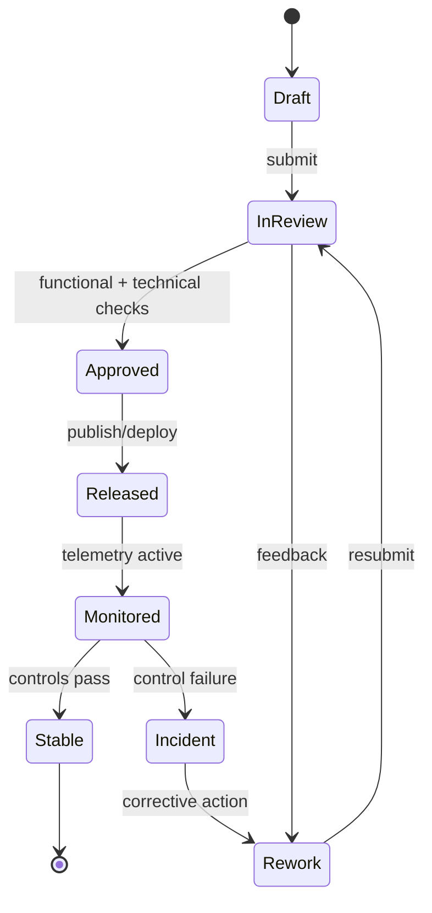

# User Stories

## Employee User Stories

### Account & Profile Management

| ID | Story | Acceptance Criteria |
|----|-------|---------------------|
| EMP-001 | As an employee, I want to log in to the ESS portal so that I can access my information | - Login with email/password - SSO option available - 2FA supported |
| EMP-002 | As an employee, I want to update my personal contact details so that HR has current information | - Edit phone, address, emergency contact - Changes trigger HR notification - Audit log updated |
| EMP-003 | As an employee, I want to upload my documents so that they are stored centrally | - Upload ID proofs, certificates - File type and size validation - Download available |
| EMP-004 | As an employee, I want to view my employment details so that I know my role and grade | - View designation, department, grade - View reporting manager - View date of joining |

### Leave Management

| ID | Story | Acceptance Criteria |
|----|-------|---------------------|
| EMP-005 | As an employee, I want to view my leave balance so that I can plan time off | - Balance per leave type shown - Pending and approved leaves shown - Available balance accurate |
| EMP-006 | As an employee, I want to apply for leave so that I can take time off | - Select leave type and dates - Reason field required - Confirmation sent |
| EMP-007 | As an employee, I want to cancel a pending leave request so that I can change my plans | - Cancel before approval - Manager notified - Balance restored |
| EMP-008 | As an employee, I want to view my leave history so that I can track past absences | - History by date range - Status shown (approved/rejected) - Download available |

### Attendance & Timesheet

| ID | Story | Acceptance Criteria |
|----|-------|---------------------|
| EMP-009 | As an employee, I want to view my attendance records so that I can verify correctness | - Daily check-in/out shown - Worked hours calculated - Anomalies flagged |
| EMP-010 | As an employee, I want to submit my weekly timesheet so that my hours are recorded | - Enter hours per project - Submit for approval - Edit before approval |
| EMP-011 | As an employee, I want to regularize a missed attendance entry so that payroll is not affected | - Submit regularization request with reason - Manager approval required - Status visible |
| EMP-012 | As an employee, I want to apply for comp-off so that I am compensated for overtime | - Select overtime date - Specify desired comp-off date - Balance updated on approval |

### Payroll & Payslips

| ID | Story | Acceptance Criteria |
|----|-------|---------------------|
| EMP-013 | As an employee, I want to view my payslips so that I know my earnings and deductions | - Payslip list by month - Detailed breakdown shown - PDF download available |
| EMP-014 | As an employee, I want to submit an expense claim so that I am reimbursed | - Upload receipts - Enter amount and category - Submission confirmation |
| EMP-015 | As an employee, I want to view my Form 16 / tax certificate so that I can file my taxes | - Available after financial year end - PDF download - Email delivery |
| EMP-016 | As an employee, I want to view my tax declaration so that I understand my deductions | - View declared investments - Update during declaration window - Impact on TDS shown |

### Performance & Goals

| ID | Story | Acceptance Criteria |
|----|-------|---------------------|
| EMP-017 | As an employee, I want to set my goals so that my targets are recorded | - Add goals with description and KPIs - Assign weightage - Manager can comment |
| EMP-018 | As an employee, I want to update goal progress so that my manager can track it | - Update percentage complete - Add progress notes - Visible to manager |
| EMP-019 | As an employee, I want to complete my self-assessment so that I contribute to my appraisal | - Rate self per KRA - Add supporting comments - Submit within review window |
| EMP-020 | As an employee, I want to view my final appraisal rating so that I know my performance outcome | - Rating released by HR - Feedback visible - Download appraisal letter |

---

## Manager User Stories

### Team Management

| ID | Story | Acceptance Criteria |
|----|-------|---------------------|
| MGR-001 | As a manager, I want to view my team's attendance so that I can monitor punctuality | - Team attendance dashboard - Highlight late arrivals and absences - Export to CSV |
| MGR-002 | As a manager, I want to approve or reject leave requests so that team coverage is maintained | - Pending requests list - Approve/reject with reason - Employee notified |
| MGR-003 | As a manager, I want to approve timesheets so that hours are validated | - Timesheet list per week - Approve/reject individual entries - Bulk approve option |
| MGR-004 | As a manager, I want to view team headcount and org chart so that I understand team structure | - Org chart view - Active/inactive count - Drill-down by sub-team |

### Performance Management

| ID | Story | Acceptance Criteria |
|----|-------|---------------------|
| MGR-005 | As a manager, I want to set goals for my team so that expectations are aligned | - Assign goals to employees - Set deadlines and KPIs - Employees notified |
| MGR-006 | As a manager, I want to conduct appraisals so that I evaluate team performance | - Rate each KRA - Write evaluation comments - Recommend action (promotion, PIP, etc.) |
| MGR-007 | As a manager, I want to initiate a PIP for an employee so that performance issues are addressed | - Define PIP objectives and timeline - Schedule check-ins - HR notified |
| MGR-008 | As a manager, I want to provide 360-degree feedback so that reviews are comprehensive | - Submit peer feedback - Rating and narrative fields - Anonymous option |

### Leave & Scheduling

| ID | Story | Acceptance Criteria |
|----|-------|---------------------|
| MGR-009 | As a manager, I want to view the team leave calendar so that I can plan coverage | - Calendar view with all approved leaves - Conflict highlight - Export option |
| MGR-010 | As a manager, I want to create shift rosters for my team so that coverage is planned | - Assign shifts per employee per day - Conflict detection - Publish roster to team |
| MGR-011 | As a manager, I want to approve shift swap requests so that team operations continue | - View swap request details - Approve/reject - Both employees notified |

---

## HR Staff User Stories

### Employee Lifecycle

| ID | Story | Acceptance Criteria |
|----|-------|---------------------|
| HR-001 | As an HR staff, I want to create a new employee profile so that they are onboarded | - Fill personal and employment details - Generate employee ID - Send welcome email |
| HR-002 | As an HR staff, I want to manage onboarding checklists so that new hires complete required steps | - Create and assign tasks - Track completion - Send reminders |
| HR-003 | As an HR staff, I want to manage employee transfers so that org changes are reflected | - Update department/location/manager - Effective date set - History maintained |
| HR-004 | As an HR staff, I want to initiate the offboarding process so that departures are managed | - Trigger offboarding workflow - Assign clearance tasks - Generate final settlement |

### HR Configuration

| ID | Story | Acceptance Criteria |
|----|-------|---------------------|
| HR-005 | As an HR staff, I want to configure leave policies so that entitlements are correct | - Define leave types - Set entitlement rules - Assign to employee groups |
| HR-006 | As an HR staff, I want to manage the holiday calendar so that leave calculations are accurate | - Add national and regional holidays - Assign to locations - Publish to employees |
| HR-007 | As an HR staff, I want to configure performance review cycles so that appraisals run on schedule | - Set cycle type and dates - Select participating employees - Enable notifications |
| HR-008 | As an HR staff, I want to manage organizational structure so that hierarchy is up to date | - Add/edit departments and designations - Assign cost centers - Update reporting lines |

### Compliance & Reporting

| ID | Story | Acceptance Criteria |
|----|-------|---------------------|
| HR-009 | As an HR staff, I want to generate headcount reports so that workforce data is available | - Filter by department, location, grade - Export to CSV/PDF - Schedule delivery |
| HR-010 | As an HR staff, I want to view attrition reports so that trends are visible | - Monthly attrition rate shown - Voluntary vs involuntary split - Exit reason analysis |
| HR-011 | As an HR staff, I want to track document expiry so that compliance is maintained | - Alert 30 days before expiry - View expiring document list - Notify employee |

---

## Payroll Officer User Stories

### Payroll Processing

| ID | Story | Acceptance Criteria |
|----|-------|---------------------|
| PAY-001 | As a payroll officer, I want to run the monthly payroll so that salaries are processed | - Initiate payroll run - Review computed values - Approve and finalize |
| PAY-002 | As a payroll officer, I want to review payroll exceptions so that errors are corrected | - Exception list with reasons - Override individual values - Re-compute and validate |
| PAY-003 | As a payroll officer, I want to process off-cycle payments so that bonuses and corrections are paid | - Select employees - Enter payment details - Generate payslips |
| PAY-004 | As a payroll officer, I want to generate payslips so that employees receive their pay statements | - Bulk generate for all employees - Email delivery - Portal availability confirmed |

### Compliance & Reporting

| ID | Story | Acceptance Criteria |
|----|-------|---------------------|
| PAY-005 | As a payroll officer, I want to generate statutory compliance reports so that filings are on time | - PF, ESI, TDS reports - Download in required format - Filing deadlines tracked |
| PAY-006 | As a payroll officer, I want to process tax declarations so that TDS is accurate | - Employee declarations imported - TDS recalculated - Employees notified |
| PAY-007 | As a payroll officer, I want to generate Form 16 for all employees so that tax certificates are issued | - Bulk generation after year end - Email delivery - Acknowledgement tracked |
| PAY-008 | As a payroll officer, I want to view cost center payroll reports so that budget utilization is visible | - Breakdown by cost center - Month-over-month variance - Export available |

---

## Admin User Stories

### System Configuration

| ID | Story | Acceptance Criteria |
|----|-------|---------------------|
| ADM-001 | As an admin, I want to manage roles and permissions so that access is controlled | - Create and edit roles - Assign granular permissions - Assign roles to users |
| ADM-002 | As an admin, I want to configure system settings so that the platform works per company policy | - Set company name, logo, timezone - Configure email templates - Set fiscal year dates |
| ADM-003 | As an admin, I want to view audit logs so that I can monitor system activity | - Filter by user, action, module - Date range filter - Export to CSV |
| ADM-004 | As an admin, I want to manage integrations so that EMS connects to external systems | - Configure HRMS/ERP sync - Set up biometric device integration - Test connectivity |

### Reporting & Analytics

| ID | Story | Acceptance Criteria |
|----|-------|---------------------|
| ADM-005 | As an admin, I want to view an executive dashboard so that leadership has key workforce metrics | - Headcount, attrition, payroll cost - Real-time data - Drill-down capability |
| ADM-006 | As an admin, I want to schedule automated reports so that stakeholders receive regular updates | - Configure report and recipients - Set frequency - Delivery confirmation |
| ADM-007 | As an admin, I want to manage the company org structure so that hierarchies are maintained | - Add/edit/remove departments - Manage locations - Publish org chart |

---

---

## Process Narrative (User-story operationalization)
1. **Initiate**: Product Owner captures the primary change request for **User Stories** and links it to business objectives, impacted modules, and target release windows.
2. **Design/Refine**: The team elaborates flows, assumptions, acceptance criteria, and exception paths specific to user-story operationalization.
3. **Authorize**: Approval checks confirm that changes satisfy policy, architecture, and compliance constraints before promotion.
4. **Execute**: Backlog System executes the approved path and enforces story readiness checks at run-time or publication-time.
5. **Integrate**: Outputs are synchronized to dependent services (IAM, payroll, reporting, notifications, and audit store) with idempotent correlation IDs.
6. **Verify & Close**: Stakeholders reconcile expected outcomes against actual telemetry to confirm delivery intent.

## Role/Permission Matrix (User Stories)
| Capability | Employee | Manager | HR/People Ops | Engineering/IT | Compliance/Audit |
|---|---|---|---|---|---|
| View user stories artifacts | Scoped self | Team scoped | Full | Full | Read-only full |
| Propose change | Request only | Draft + justify | Draft + justify | Draft + justify | No |
| Approve publication/use | No | Conditional | Primary approver | Technical approver | Control sign-off |
| Execute override | No | Limited with reason | Limited with reason | Break-glass with ticket | No |
| Access evidence trail | No | Limited | Full | Full | Full |

## State Model (User-story operationalization)

## Integration Behavior (User Stories)
| Integration | Trigger | Expected Behavior | Failure Handling |
|---|---|---|---|
| IAM / RBAC | Approval or assignment change | Sync permission scopes for affected actors | Retry + alert on drift |
| Workflow/Event Bus | State transition | Publish canonical event with correlation ID | Dead-letter + replay tooling |
| Payroll/Benefits (where applicable) | Compensation/lifecycle change | Apply financial side-effects only after approved state | Hold payout + reconcile |
| Notification Channels | Review decision, exception, due date | Deliver actionable notice to owners and requestors | Escalation after SLA breach |
| Audit/GRC Archive | Any controlled transition | Store immutable evidence bundle | Block progression if evidence missing |

## Onboarding/Offboarding Edge Cases (Concrete)
- **Rehire with residual access**: If a rehire request reuses a prior identity, retain historical employee ID linkage but force fresh role entitlement approval before day-1 access.
- **Early start-date acceleration**: When onboarding date is moved earlier than background-check SLA, block activation and auto-create an exception approval task.
- **Same-day termination**: For involuntary offboarding, revoke privileged access immediately while preserving records under legal hold classification.
- **Rescinded resignation after downstream sync**: If offboarding is canceled after payroll/IAM notifications, execute compensating events and log full reversal trail.

## Compliance/Audit Controls
| Control | Description | Evidence |
|---|---|---|
| Segregation of duties | Requestor and approver cannot be the same identity for controlled actions | Approval chain + user IDs |
| Transition integrity | Only allowed state transitions can be persisted | Transition log + rejection reasons |
| Timely deprovisioning | Offboarding access revocation meets SLA targets | IAM revocation timestamp report |
| Financial reconciliation | Payroll-impacting changes reconcile before close | Payroll batch diff + sign-off |
| Immutable auditability | Controlled actions are archived in WORM/append-only storage | Hash, retention tag, archive pointer |

