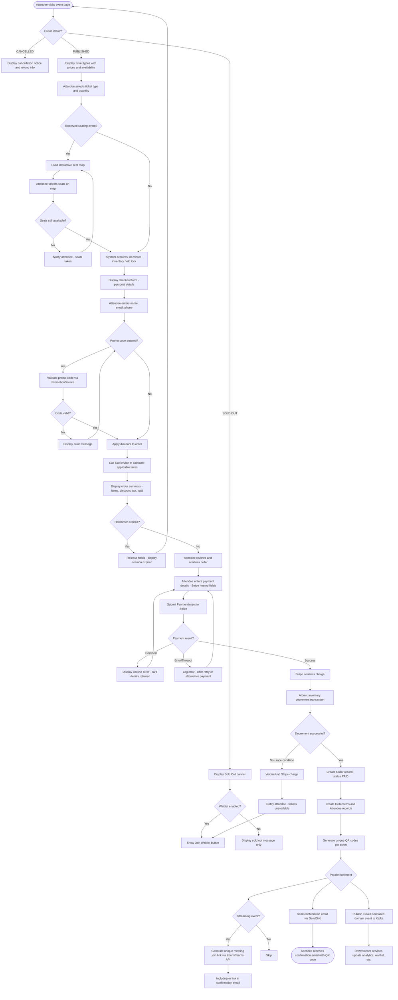
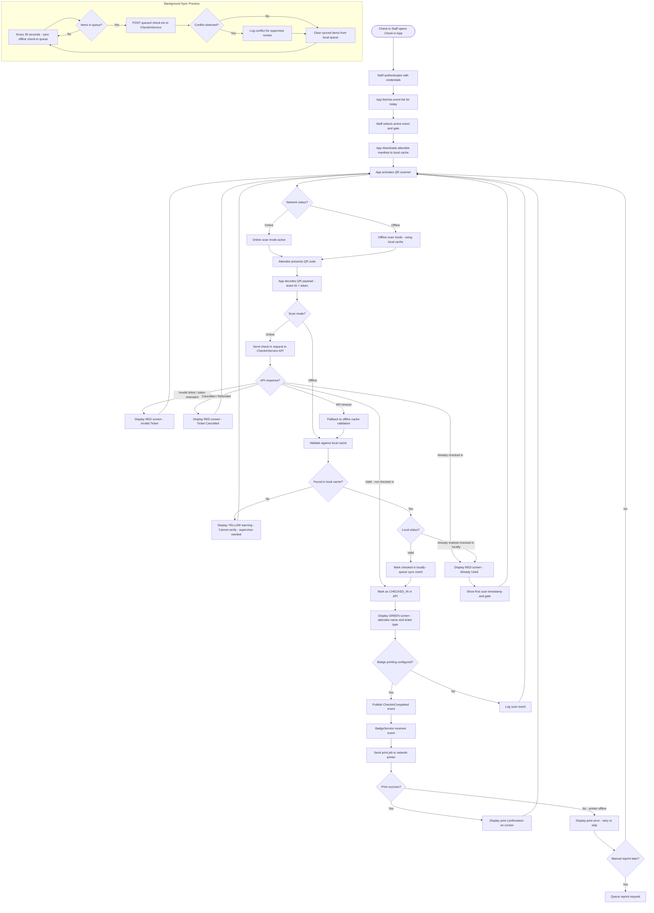

# Activity Diagram — Event Management and Ticketing Platform

## Overview

This document presents activity diagrams for the two most complex operational flows in the Event Management and Ticketing Platform: the Ticket Purchase Flow and the Event Check-in Flow. Each diagram is accompanied by a detailed narrative explaining the decisions and parallel activities involved.

---

## 1. Ticket Purchase Flow

### Narrative

The ticket purchase flow begins when an attendee visits an event page. It encompasses seat selection (optional), cart management, identity resolution, promo code application, tax calculation, payment processing, and post-purchase fulfilment. The flow branches at multiple decision points: seat availability, session timeout, promo code validity, and payment outcome. On success, the system performs multiple parallel fulfilment tasks.

### Key Decision Points

| Decision | Options | Consequence |
|---|---|---|
| Event status | Published / Sold Out / Cancelled | Routes to appropriate experience |
| Reserved seating | Yes / No | Triggers seat map interaction |
| Seats available | Yes / No | Proceeds or returns to map |
| Promo code | Entered / Not entered | Validates or skips discount |
| Hold timer expired | Yes / No | Restarts flow or proceeds |
| Payment result | Success / Declined / Error | Continues or retries |
| Inventory decrement | Success / Race condition | Creates order or triggers refund |

---

## 2. Event Check-in Flow

### Narrative

The check-in flow covers the complete experience from a staff member arriving at the venue through to admitting an attendee and optionally printing their badge. A critical aspect of this flow is the offline capability: the Check-in app caches event data at startup so that connectivity loss does not halt operations. Scan events are queued locally and synchronised when connectivity is restored.

### Check-in Status Codes

| Status Code | Screen Colour | Message | Action Required |
|---|---|---|---|
| `VALID` | Green | Attendee name + ticket type | Admit attendee |
| `ALREADY_CHECKED_IN` | Red | "Already used — [datetime]" | Do not admit; escalate if disputed |
| `INVALID_TOKEN` | Red | "Invalid ticket" | Do not admit |
| `CANCELLED` | Red | "Ticket cancelled" | Do not admit; direct to help desk |
| `REFUNDED` | Red | "Ticket refunded" | Do not admit; direct to help desk |
| `NOT_FOUND_OFFLINE` | Yellow | "Cannot verify — needs supervisor" | Hold attendee; supervisor lookup |
| `API_TIMEOUT` | Yellow | "Falling back to offline mode" | Verify against local cache |

### Offline Mode Considerations

The Check-in app is designed to remain operational during network outages, which are common in large venues. Key design decisions:

1. **Manifest pre-loading**: At app launch, the full attendee list (ticket IDs, QR tokens, names, ticket types) is downloaded and stored in the device's IndexedDB.
2. **Optimistic offline check-in**: A check-in performed offline is immediately reflected locally to prevent double-admit.
3. **Sync conflict resolution**: If a ticket was checked in at another gate during offline period, the conflict is logged but the second check-in is not reversed (the supervisor sees the conflict log).
4. **Manifest refresh**: Staff can manually trigger a manifest refresh when connectivity is restored.
5. **Security note**: The local cache does not store payment information or full personal data—only the minimum needed for check-in validation.
