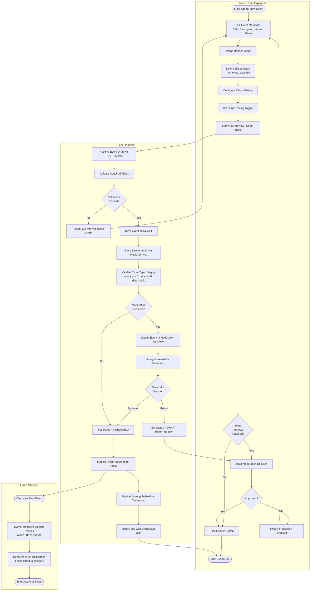
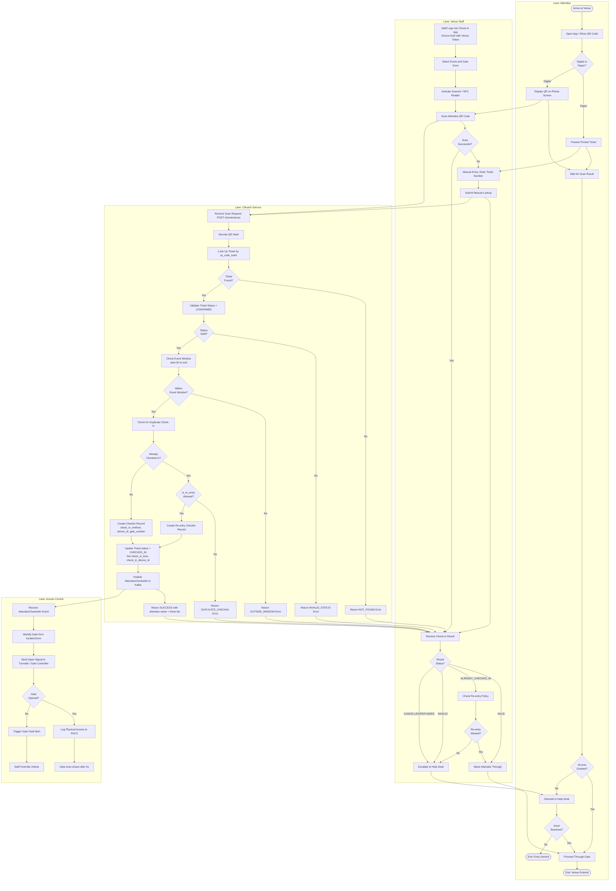

# BPMN Swimlane Diagram

## Introduction to BPMN Notation

This document uses BPMN 2.0 notation conventions adapted for Mermaid flowcharts. Each process is rendered as a swimlane diagram where horizontal subgraphs represent process participants (lanes). The following notation applies throughout:

| Symbol | Shape | Meaning |
|--------|-------|---------|
| Start Event | Circle (rounded node) | Process initiation point |
| End Event | Double-circle (terminal node) | Process termination point |
| Task | Rectangle | An atomic unit of work performed by the lane actor |
| Decision Gateway | Diamond | XOR gateway — exactly one outgoing path taken based on condition |
| Parallel Gateway | Diamond (+) | AND gateway — all outgoing paths taken simultaneously |
| Intermediate Event | Dashed rectangle | A message or timer event occurring mid-flow |
| Data Object | Note shape | Persistent data produced or consumed by a task |
| Error End Event | Circle with X | Process terminates due to unrecoverable error |

Swimlanes are modelled as `subgraph` blocks in Mermaid. Arrows crossing subgraph boundaries represent inter-lane message flows or hand-offs. Decision nodes sitting on lane boundaries belong to the lane that evaluates the condition. Error paths are shown with dashed semantics where Mermaid allows, and annotated inline.

All three processes — Ticket Purchase, Event Creation & Publishing, and Day-of Check-in — are fully annotated with step tables, timing SLAs, and an exception handling matrix at the end of the document.

---

## Ticket Purchase Process

### Flow Diagram

```mermaid
flowchart TD
    subgraph OE["Lane: Event Organizer"]
        OE1([Event Published]) --> OE2[/Tickets Listed on Platform/]
    end

    subgraph ATT["Lane: Attendee"]
        A1([Start: Browse Events]) --> A2[Search & Filter Events]
        A2 --> A3[View Event Detail Page]
        A3 --> A4[Select Ticket Type & Quantity]
        A4 --> A5[Proceed to Checkout]
        A5 --> A6[Enter Payment Details]
        A6 --> A7{Payment\nAuthorized?}
        A7 -- No --> A8[Receive Decline Notice]
        A8 --> A9{Retry\nPayment?}
        A9 -- Yes --> A6
        A9 -- No --> A10([End: Purchase Abandoned])
        A7 -- Yes --> A11[Receive Order Confirmation Email]
        A11 --> A12[Download QR-Code Ticket]
        A12 --> A13([End: Purchase Complete])
    end

    subgraph PL["Lane: Platform"]
        P1[Receive Checkout Request] --> P2{Inventory\nAvailable?}
        P2 -- No --> P3[Return SOLD_OUT Error]
        P3 --> P4([End: Rejected])
        P2 -- Yes --> P5[Place 15-Min Inventory Hold]
        P5 --> P6[Create Order in PENDING_PAYMENT]
        P6 --> P7[Set Redis TTL hold:{orderId} = 900s]
        P7 --> P8{Hold\nExpired?}
        P8 -- Yes --> P9[Release Hold — Decrement quantity_held]
        P9 --> P10[Cancel Order — Status = CANCELLED]
        P10 --> P11[Push Expiry Notification via WebSocket]
        P11 --> P12([End: Hold Expired])
        P8 -- No --> P13[Route Payment to Gateway]
        P13 --> P14{Payment\nAuthorized?}
        P14 -- No --> P15[Release Inventory Hold]
        P15 --> P16[Update Order Status = FAILED]
        P16 --> P17[Emit HoldReleased Event]
        P14 -- Yes --> P18[Confirm Order — Status = COMPLETED]
        P18 --> P19[Decrement quantity_available]
        P19 --> P20[Increment quantity_sold]
        P20 --> P21[Generate QR Code Hash — SHA-256]
        P21 --> P22[Store Ticket Record — Status = CONFIRMED]
        P22 --> P23[Publish OrderCompleted Event to Kafka]
        P23 --> P24[Trigger Confirmation Email via NotificationService]
    end

    subgraph PP["Lane: Payment Provider"]
        PP1[Receive Authorization Request] --> PP2[Validate Card Details]
        PP2 --> PP3{Card\nValid?}
        PP3 -- No --> PP4[Return DECLINED + Decline Code]
        PP3 -- Yes --> PP5[Reserve Funds on Card]
        PP5 --> PP6[Return Auth Code + Transaction ID]
        PP6 --> PP7[Await Capture Signal]
        PP7 --> PP8[Settle Funds to Platform Merchant Account]
        PP8 --> PP9([End: Settlement Complete])
    end

    OE2 --> A3
    A5 --> P1
    P3 --> A3
    P11 --> A3
    P13 --> PP1
    PP4 --> P14
    PP6 --> P14
    P17 --> A8
    P24 --> A11
```

### Ticket Purchase — Step Annotation Table

| Step | Lane | Description | Business Rule | Error Scenario |
|------|------|-------------|---------------|----------------|
| OE1 | Event Organizer | Organizer publishes event after setting ticket types | Event must have ≥1 published TicketType with price ≥ 0 | If no TicketType exists, publish action blocked with ERR_NO_TICKET_TYPES |
| OE2 | Event Organizer | Platform lists tickets on public-facing catalog pages | Tickets appear within 30s of EventPublished Kafka event being consumed by SearchIndexService | CDN cache miss may delay rendering by up to 5s |
| A1 | Attendee | Attendee opens app or website and begins browsing | No authentication required for browsing | If CDN is down, origin fallback serves event pages |
| A2 | Attendee | Attendee applies search filters (date, category, city, price range) | Search powered by Elasticsearch; results ranked by relevance + proximity | Stale index results possible within 30s window |
| A3 | Attendee | Attendee opens event detail page showing ticket types and remaining availability | Availability counter reads from Redis cache (5s TTL) — not real-time DB query | Oversell risk mitigated by inventory hold system |
| A4 | Attendee | Attendee selects ticket tier and quantity within min/max_per_order bounds | BR-006: max min(max_per_order, 10) per ticket type; velocity limit 20 tickets/24h same attendee+event | HTTP 422 PURCHASE_LIMIT_EXCEEDED if limit breached |
| A5 | Attendee | Attendee clicks "Proceed to Checkout" — triggers inventory hold request | Attendee must be authenticated (email-verified account) to checkout | Unauthenticated users redirected to login with return URL |
| P1 | Platform | Checkout service receives POST /orders request with ticketTypeId, quantity, sessionToken | Request validated: JWT must be valid, CSRF token present | 401 Unauthorized if JWT expired; 403 if account SUSPENDED/BANNED |
| P2 | Platform | Atomic check and decrement on TicketType.quantity_available using SELECT FOR UPDATE | quantity_available must be ≥ requested quantity after hold | Race condition handled by row-level lock; last-writer-releases pattern |
| P3 | Platform | Platform returns HTTP 409 CONFLICT with error code SOLD_OUT | Attendee redirected to waitlist sign-up modal | N/A |
| P5 | Platform | quantity_held += quantity; quantity_available -= quantity committed in DB transaction | Transaction must succeed atomically; rollback on any failure | DeadlockException triggers retry up to 3 times with 50ms backoff |
| P6 | Platform | Order record created with status = PENDING_PAYMENT and hold_expires_at = NOW() + 900s | Order linked to authenticated attendee via attendee_id | FK violation if attendee_id invalid — should never occur post-auth |
| P7 | Platform | Redis key hold:{orderId} set with 900-second TTL using SET NX EX command | Lua script used for atomicity: check+set in single operation | Redis unavailable: fallback to DB-only hold with background TTL job |
| P8 | Platform | Platform checks Redis TTL on hold key before routing payment | If TTL ≤ 0 or key missing, hold is considered expired | Redis key evicted early (memory pressure) — mitigated by allkeys-lru policy |
| P9–P12 | Platform | Expiry cleanup: release hold, cancel order, notify attendee | BR-001: hold expiry triggers full rollback of inventory | WebSocket push requires active connection; email fallback always fires |
| P13 | Platform | Platform routes payment request to configured gateway (Stripe default) | Gateway selected from Event.payment_gateway; fallback to default if event-level not set | Gateway timeout (>3s) triggers circuit breaker; order held in PAYMENT_PROCESSING limbo |
| PP1–PP6 | Payment Provider | Gateway validates card using Luhn check, CVV, AVS, and 3DS if required | 3DS challenge only triggered for high-risk transactions based on fraud score | 3DS timeout: transaction auto-declined after 10 minutes |
| P18–P22 | Platform | Atomic order completion: update order status, ticket statuses, inventory counters | All 5 DB operations wrapped in single transaction; Saga pattern with compensating transactions | Partial failure triggers compensating transaction to revert completed steps |
| P21 | Platform | QR code hash = SHA-256(ticket_id + secret_salt + generated_at_epoch) | QR generated in <500ms SLA; URL points to CDN-hosted QR image | Hash collision probability negligible (2^256 space); verified on each scan |
| P23 | Platform | OrderCompleted event published to Kafka topic com.eventplatform.orders.OrderCompleted | At-least-once delivery; consumers must be idempotent on orderId | Kafka unavailable: event buffered in outbox table; retry every 30s |
| A11 | Attendee | Attendee receives HTML email with order summary and PDF ticket attachment | Email sent within 30s of order completion SLA | Email provider failure: retry 3× with 1s/5s/30s backoff; DLQ after failure |
| A12 | Attendee | QR code ticket available in app "My Tickets" section and as email attachment | QR must be rendered within 500ms of generation | Apple Wallet / Google Pay pass generation triggered async; available within 5 minutes |

---

## Event Creation & Publishing Process

### Flow Diagram



### Event Creation — Step Annotation Table

| Step | Lane | Description | Business Rule | Error Scenario |
|------|------|-------------|---------------|----------------|
| EO1 | Event Organizer | Organizer initiates event creation from dashboard | Organizer account must have ACTIVE status and verified payment details | Unverified payment account: blocked with prompt to complete KYC |
| EO2A | Event Organizer | Metadata entry: title (max 255 chars), description (markdown supported), venue selection or online toggle | end_datetime must be > start_datetime; timezone must be IANA-valid | Venue capacity must cover max_capacity or warning displayed |
| EO3 | Event Organizer | Banner image uploaded via pre-signed S3 URL | Accepted formats: JPG, PNG, WebP; max 10MB; min dimensions 1920×1080 | File too large: HTTP 413; wrong format: HTTP 415; virus scan fail: rejected |
| EO4 | Event Organizer | Each TicketType configured with tier, price, quantity and sale window | At least one non-COMP ticket type required for paid events | Overlapping sale windows on same tier generate a warning (not error) |
| EO5 | Event Organizer | Refund policy selected from enum or FLEXIBLE with custom text | FLEXIBLE policy must include written terms (min 100 chars) | No policy defaults to NO_REFUND with warning displayed |
| PV2 | Platform | Server-side schema validation using JSON Schema Draft-07 | Slug auto-generated from title if not provided; must match [a-z0-9-]+ | Duplicate slug triggers numeric suffix append: my-event-2 |
| PV6 | Platform | Media Service scans file, resizes to 3 variants (800px, 1200px, 1920px), stores in S3 | CDN distribution triggered immediately; image available within 60s | S3 upload failure triggers retry 3×; organizer notified on persistent failure |
| PV9–PV11 | Platform | Large events (capacity > 10,000) or certain categories require manual moderation | Moderation SLA: 4 business hours | Moderator reassignment if unactioned for 2 hours |
| PV14 | Platform | EventPublished Kafka message triggers downstream index, notification, and CDN warming | Message includes full event payload including all TicketType snapshots | Schema registry validation before publish; version mismatch triggers DLQ |

---

## Day-of Check-in Process

### Flow Diagram



### Day-of Check-in — Step Annotation Table

| Step | Lane | Description | Business Rule | Error Scenario |
|------|------|-------------|---------------|----------------|
| VS1 | Venue Staff | Staff authenticates check-in device using venue-scoped OAuth token | Device must be registered to the event; token expires every 8 hours | Expired device token: force re-auth; new login requires staff PIN |
| VS2 | Venue Staff | Staff selects specific event and assigns gate zone for reporting accuracy | Multiple events per day supported; staff can only see events they are assigned to | Wrong event selection causes check-in data in wrong bucket — auditable |
| VS4 | Venue Staff | QR scan using device camera or dedicated USB scanner | Scan API has <500ms SLA; offline mode caches last 10,000 valid QR hashes locally | Offline cache expires after 24h; re-sync required |
| CI2 | CheckIn Service | Base64-decode QR payload, extract ticket_id and hmac_signature | HMAC verified using HMAC-SHA256 with per-event secret key | HMAC mismatch: ticket forgery attempt logged to security audit log |
| CI3 | CheckIn Service | Redis lookup first (hot path); PostgreSQL fallback if cache miss | Redis cache primed on event day with all valid QR hashes | Cache miss adds ~5ms latency; not a reliability concern |
| CI9 | CheckIn Service | Event window check: check-in allowed from event_start - 2h to event_end | BR-007: check-in cutoff 30 min after event start for no-show tracking | Outside window returns clear error message to staff app |
| CI12–CI13 | CheckIn Service | Duplicate detection using unique index on (ticket_id, is_exit_scan=false) | Prevents double-admission without re-entry authorization | Duplicate attempt logged as security event; third attempt triggers alert |
| CI17 | CheckIn Service | CheckIn record written with full audit trail: method, device_id, gate, location | CheckIn records are immutable; corrections done via voiding and re-creating | DB write failure: in-memory queue with retry; staff gets provisional OK |
| CI19 | CheckIn Service | AttendeeCheckedIn published to Kafka within 200ms of DB write | At-least-once delivery; AccessControlService must be idempotent | Kafka unavailable: gate access granted anyway; event buffered for replay |
| AC3 | Access Control | Gate controller receives OPEN command via MQTT or REST webhook | Physical gate must respond within 2s; timeout triggers manual override alert | Gate hardware failure: staff receives alert on handheld device |

---

## Process Timing — SLA Reference

### Ticket Purchase SLAs

| Step | Target SLA | p95 Budget | p99 Budget | Measurement Point |
|------|-----------|-----------|-----------|-------------------|
| Inventory availability check | <50ms | <100ms | <200ms | CheckoutService → DB query |
| Inventory hold placement | <200ms | <400ms | <800ms | Full atomic DB transaction |
| Redis TTL key set | <10ms | <20ms | <50ms | Redis SET NX EX command |
| Payment auth routing | <100ms | <200ms | <500ms | Platform → Payment Gateway |
| Payment gateway authorization | <2s | <3s | <5s | Gateway response time |
| Order completion (DB write) | <100ms | <300ms | <1s | DB transaction commit |
| QR code generation | <500ms | <800ms | <1.5s | SHA-256 + image render |
| Kafka OrderCompleted publish | <100ms | <300ms | <1s | Producer acknowledgement |
| Confirmation email delivery | <30s | <60s | <120s | Email provider acceptance |
| Apple/Google Wallet pass | <5min | <10min | <30min | Pass file ready in S3 |

### Check-in SLAs

| Step | Target SLA | Notes |
|------|-----------|-------|
| QR scan decode + validation | <200ms | p99 must be <500ms for acceptable UX |
| Redis QR hash lookup (hot path) | <5ms | 99.9% of scans in online mode |
| DB fallback lookup | <50ms | Cache miss scenario only |
| CheckIn record write | <100ms | Synchronous before returning response |
| Kafka event publish | <200ms | Async; gate access not blocked |
| Access control gate open | <2s | Physical hardware constraint |
| Offline sync re-connect | <30s | After network restoration |

---

## Exception Handling Matrix

| Exception Type | Trigger Condition | Immediate Recovery Action | Escalation Path | SLA to Resolve |
|---------------|-------------------|--------------------------|-----------------|----------------|
| SOLD_OUT | quantity_available = 0 at checkout | Redirect attendee to waitlist sign-up | N/A — business outcome | Instant |
| HOLD_EXPIRED | Redis TTL reaches 0 before order completion | Release inventory hold, cancel order, notify via WebSocket + email | N/A — expected timeout | <5s cleanup |
| PAYMENT_DECLINED | Payment provider returns non-200 auth code | Release hold, prompt retry with different payment method (max 3 retries) | After 3 failures: suggest alternate payment methods | Instant retry |
| PAYMENT_GATEWAY_TIMEOUT | Gateway response > 5s | Circuit breaker opens; order remains in PAYMENT_PROCESSING state | Background reconciliation job checks gateway status every 60s | <10min reconciliation |
| DUPLICATE_CHARGE | Payment captured twice for same order | Auto-void duplicate capture; initiate refund for duplicate | FinanceService notified; manual review triggered | <24h |
| DB_DEADLOCK | Concurrent ticket hold transactions conflict | Retry with exponential backoff (50ms, 100ms, 200ms) — max 3 retries | Alert if >5 deadlocks/minute on same TicketType | <500ms per retry |
| REDIS_UNAVAILABLE | Redis connection pool exhausted or node down | Fallback to DB-only hold management; hold TTL enforced by scheduled job | On-call SRE paged; Redis failover to replica | <2min for failover |
| KAFKA_PRODUCER_FAILURE | Kafka broker unreachable | Event written to outbox table in PostgreSQL; Kafka relay job polls every 30s | SRE alert if outbox queue > 1000 events | <5min relay |
| QR_GENERATION_FAILURE | SHA-256 or image render service fails | Retry 3×; if all fail: ticket confirmed in DB, QR regenerated on next page load | Ticket still valid; manual check-in fallback available | <1min retry cycle |
| CHECKIN_DUPLICATE | QR scanned twice without re-entry flag | Return ALREADY_CHECKED_IN code; staff alerted in app | Staff escalates to help desk for identity verification | Instant detection |
| GATE_HARDWARE_FAILURE | Access control gate doesn't respond to OPEN in 2s | Staff override unlock procedure triggered | Venue operations team alerted via app push notification | <5min manual resolution |
| EVENT_CANCELLATION_BATCH | Event status → CANCELLED with >10,000 orders | Batch refund job created with 1000-order chunks; 5s between batches | Finance team notified; organizer account may be flagged | <2h initiation; 5-10 business days settlement |
| INVALID_QR_SIGNATURE | HMAC verification fails on QR decode | Reject scan, log security event with device_id, attendee_id, timestamp | Security team alerted if >3 failed HMAC validations from same device in 10 min | Immediate block of suspicious device |
| IDENTITY_VERIFICATION_FAIL | Age-restricted event; attendee cannot verify age at gate | Deny entry; escalate to event manager | Event manager decision logged with override audit trail | <5min resolution at gate |
| ORGANIZER_PAYMENT_FAILURE | Organizer payout fails after event completion | Retry payout via alternate bank account on file | Finance team creates support ticket; manual bank transfer initiated | <3 business days |
| CAPACITY_SYNC_DRIFT | Redis availability counter drifts from DB source of truth | Background reconciliation job corrects Redis every 60s | Alert if drift > 10 tickets; emergency Redis flush and re-prime | <60s automatic correction |
