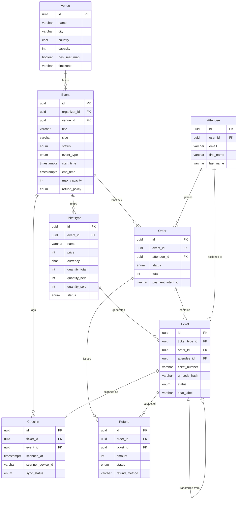

# Data Dictionary — Event Management and Ticketing Platform

## Core Entities

This section defines the canonical data model for the platform. All identifiers are UUID v4. Monetary
values are stored as integers in the smallest currency denomination. Timestamps are stored in UTC
(`TIMESTAMPTZ`) unless noted otherwise. Soft-delete semantics apply only to the `Event` entity.

### Event

| Field | Type | Nullable | Default | Constraints | Description |
|-------|------|----------|---------|-------------|-------------|
| id | UUID | No | gen_random_uuid() | PK | Unique event identifier |
| organizer_id | UUID | No | — | FK → users.id, NOT NULL | Organizer who owns and manages the event |
| venue_id | UUID | Yes | NULL | FK → venues.id | Physical venue; null for virtual-only events |
| title | VARCHAR(255) | No | — | NOT NULL | Public-facing display title |
| slug | VARCHAR(255) | No | — | UNIQUE, NOT NULL | URL-friendly identifier derived from title |
| description | TEXT | Yes | NULL | — | Full event description; Markdown supported |
| status | ENUM | No | draft | draft/published/on_sale/sold_out/cancelled/ended | Current lifecycle phase |
| event_type | ENUM | No | in_person | in_person/virtual/hybrid | Delivery mode affecting check-in and streaming |
| category | VARCHAR(100) | Yes | NULL | — | Genre or category label (music, sports, conference) |
| start_time | TIMESTAMPTZ | No | — | NOT NULL | Event start stored in UTC |
| end_time | TIMESTAMPTZ | No | — | NOT NULL, CHECK > start_time | Event end stored in UTC |
| timezone | VARCHAR(64) | No | — | NOT NULL | IANA timezone identifier used for display only |
| published_at | TIMESTAMPTZ | Yes | NULL | — | Timestamp of first publication transition |
| max_capacity | INTEGER | No | — | CHECK > 0 | Hard upper bound on confirmed attendee count |
| age_restriction | INTEGER | Yes | NULL | CHECK >= 0 | Minimum attendee age; null means no restriction |
| visibility | ENUM | No | public | public/private/unlisted | Controls discovery and ticket-sale access |
| streaming_url | TEXT | Yes | NULL | — | Livestream URL for virtual or hybrid events |
| refund_policy | ENUM | No | none | full/partial/none | Governs attendee refund eligibility |
| refund_cutoff_hours | INTEGER | Yes | NULL | CHECK >= 0 | Hours before start_time when refunds close |
| payout_released_at | TIMESTAMPTZ | Yes | NULL | — | Timestamp when organizer payout was disbursed |
| created_at | TIMESTAMPTZ | No | now() | NOT NULL | Row creation timestamp |
| updated_at | TIMESTAMPTZ | No | now() | NOT NULL | Last modification timestamp |
| deleted_at | TIMESTAMPTZ | Yes | NULL | — | Soft-delete sentinel; null means active record |

### Venue

| Field | Type | Nullable | Default | Constraints | Description |
|-------|------|----------|---------|-------------|-------------|
| id | UUID | No | gen_random_uuid() | PK | Unique venue identifier |
| name | VARCHAR(255) | No | — | NOT NULL | Venue public display name |
| address_line1 | VARCHAR(255) | No | — | NOT NULL | Primary street address |
| address_line2 | VARCHAR(255) | Yes | NULL | — | Suite, floor, or unit supplement |
| city | VARCHAR(100) | No | — | NOT NULL | City of the venue |
| state | VARCHAR(100) | Yes | NULL | — | State or province; optional for some countries |
| country | CHAR(2) | No | — | NOT NULL, ISO 3166-1 alpha-2 | Two-letter country code |
| postal_code | VARCHAR(20) | Yes | NULL | — | Postal or ZIP code |
| latitude | NUMERIC(9,6) | Yes | NULL | CHECK BETWEEN -90 AND 90 | Geographic latitude for map display |
| longitude | NUMERIC(9,6) | Yes | NULL | CHECK BETWEEN -180 AND 180 | Geographic longitude for map display |
| capacity | INTEGER | No | — | CHECK > 0 | Maximum physical occupancy of the venue |
| has_seat_map | BOOLEAN | No | false | NOT NULL | True when assigned seating is configured |
| timezone | VARCHAR(64) | No | — | NOT NULL | IANA timezone of the venue location |
| created_at | TIMESTAMPTZ | No | now() | NOT NULL | Row creation timestamp |
| updated_at | TIMESTAMPTZ | No | now() | NOT NULL | Last modification timestamp |

### TicketType

| Field | Type | Nullable | Default | Constraints | Description |
|-------|------|----------|---------|-------------|-------------|
| id | UUID | No | gen_random_uuid() | PK | Unique ticket type identifier |
| event_id | UUID | No | — | FK → events.id, NOT NULL | Parent event |
| name | VARCHAR(255) | No | — | NOT NULL | Tier name (General Admission, VIP, Early Bird) |
| description | TEXT | Yes | NULL | — | Inclusions or perks listed on the ticket face |
| price | INTEGER | No | — | CHECK >= 0 | Base price in smallest currency unit (cents) |
| currency | CHAR(3) | No | USD | NOT NULL, ISO 4217 | Three-letter currency code |
| quantity_total | INTEGER | No | — | CHECK > 0 | Total tickets allocated for this type |
| quantity_held | INTEGER | No | 0 | CHECK >= 0 | Count currently reserved by active Redis holds |
| quantity_sold | INTEGER | No | 0 | CHECK >= 0 | Count in confirmed or issued status |
| quantity_available | INTEGER | — | — | GENERATED AS (quantity_total - quantity_held - quantity_sold) | Computed real-time availability; read-only |
| sale_start_at | TIMESTAMPTZ | Yes | NULL | — | When sales open; null inherits event start_time |
| sale_end_at | TIMESTAMPTZ | Yes | NULL | — | When sales close; null allows sales until start |
| max_per_order | INTEGER | No | 10 | CHECK > 0 | Maximum tickets of this type per single order |
| is_transferable | BOOLEAN | No | true | NOT NULL | Whether peer-to-peer ticket transfers are allowed |
| requires_approval | BOOLEAN | No | false | NOT NULL | Whether organizer must approve each registration |
| status | ENUM | No | active | active/paused/sold_out/hidden | Current on-sale availability status |
| created_at | TIMESTAMPTZ | No | now() | NOT NULL | Row creation timestamp |
| updated_at | TIMESTAMPTZ | No | now() | NOT NULL | Last modification timestamp |

### Ticket

| Field | Type | Nullable | Default | Constraints | Description |
|-------|------|----------|---------|-------------|-------------|
| id | UUID | No | gen_random_uuid() | PK | Unique ticket identifier |
| ticket_type_id | UUID | No | — | FK → ticket_types.id, NOT NULL | Ticket tier that generated this record |
| order_id | UUID | No | — | FK → orders.id, NOT NULL | Parent order |
| attendee_id | UUID | Yes | NULL | FK → attendees.id | Assigned attendee; set at checkout or transfer |
| ticket_number | VARCHAR(20) | No | — | UNIQUE, NOT NULL | Human-readable reference (e.g., EVT-000042) |
| qr_code_hash | VARCHAR(64) | No | — | UNIQUE, NOT NULL | SHA-256 of the HMAC-signed QR payload |
| status | ENUM | No | held | held/confirmed/used/cancelled/transferred/refunded | Current lifecycle status |
| seat_label | VARCHAR(50) | Yes | NULL | — | Row and seat identifier when venue has seat map |
| issued_at | TIMESTAMPTZ | Yes | NULL | — | Timestamp when status transitioned to confirmed |
| transferred_from_ticket_id | UUID | Yes | NULL | FK → tickets.id | Source ticket ID when created via transfer |
| created_at | TIMESTAMPTZ | No | now() | NOT NULL | Row creation timestamp |
| updated_at | TIMESTAMPTZ | No | now() | NOT NULL | Last modification timestamp |

### Order

| Field | Type | Nullable | Default | Constraints | Description |
|-------|------|----------|---------|-------------|-------------|
| id | UUID | No | gen_random_uuid() | PK | Unique order identifier |
| event_id | UUID | No | — | FK → events.id, NOT NULL | Associated event |
| attendee_id | UUID | No | — | FK → attendees.id, NOT NULL | Purchasing attendee |
| status | ENUM | No | pending | pending/confirmed/cancelled/refunded/partially_refunded | Order lifecycle state |
| subtotal | INTEGER | No | — | CHECK >= 0 | Sum of all ticket prices in cents |
| platform_fee | INTEGER | No | — | CHECK >= 0 | Platform service fee in cents |
| tax | INTEGER | No | 0 | CHECK >= 0 | Tax collected in cents |
| total | INTEGER | No | — | CHECK > 0 | Gross amount charged to payment method in cents |
| payment_intent_id | VARCHAR(255) | Yes | NULL | — | Stripe PaymentIntent ID |
| payment_method | VARCHAR(50) | Yes | NULL | — | Payment method type (card, bank_transfer, wallet) |
| coupon_code | VARCHAR(50) | Yes | NULL | — | Applied promotional or discount code |
| coupon_discount | INTEGER | No | 0 | CHECK >= 0 | Discount amount from applied coupon in cents |
| created_at | TIMESTAMPTZ | No | now() | NOT NULL | Row creation timestamp |
| updated_at | TIMESTAMPTZ | No | now() | NOT NULL | Last modification timestamp |

### Attendee

| Field | Type | Nullable | Default | Constraints | Description |
|-------|------|----------|---------|-------------|-------------|
| id | UUID | No | gen_random_uuid() | PK | Unique attendee identifier |
| user_id | UUID | Yes | NULL | FK → users.id | Linked platform account; null for guest checkout |
| email | VARCHAR(255) | No | — | NOT NULL, valid RFC 5322 | Primary contact email; stored lowercase |
| first_name | VARCHAR(100) | No | — | NOT NULL | Given name |
| last_name | VARCHAR(100) | No | — | NOT NULL | Family name |
| phone | VARCHAR(30) | Yes | NULL | E.164 format | Contact phone number |
| dietary_preferences | TEXT | Yes | NULL | — | Free-text dietary restrictions for catered events |
| accessibility_needs | TEXT | Yes | NULL | — | Free-text accessibility or mobility requirements |
| created_at | TIMESTAMPTZ | No | now() | NOT NULL | Row creation timestamp |
| updated_at | TIMESTAMPTZ | No | now() | NOT NULL | Last modification timestamp |

### CheckIn

| Field | Type | Nullable | Default | Constraints | Description |
|-------|------|----------|---------|-------------|-------------|
| id | UUID | No | gen_random_uuid() | PK | Unique check-in record identifier |
| ticket_id | UUID | No | — | FK → tickets.id, UNIQUE | Ticket being scanned; UNIQUE enforces one entry |
| event_id | UUID | No | — | FK → events.id, NOT NULL | Associated event |
| scanned_at | TIMESTAMPTZ | No | — | NOT NULL | UTC timestamp when QR code was read |
| scanner_device_id | VARCHAR(100) | No | — | NOT NULL | Hardware scanner or mobile app device identifier |
| gate_id | VARCHAR(50) | Yes | NULL | — | Entry gate or zone label |
| is_online | BOOLEAN | No | true | NOT NULL | False when scanned in offline/disconnected mode |
| sync_status | ENUM | No | synced | synced/pending | Upload state for offline-captured records |
| created_at | TIMESTAMPTZ | No | now() | NOT NULL | Row creation timestamp |

### Refund

| Field | Type | Nullable | Default | Constraints | Description |
|-------|------|----------|---------|-------------|-------------|
| id | UUID | No | gen_random_uuid() | PK | Unique refund identifier |
| order_id | UUID | No | — | FK → orders.id, NOT NULL | Source order for this refund |
| ticket_id | UUID | Yes | NULL | FK → tickets.id | Null for full-order refunds |
| amount | INTEGER | No | — | CHECK > 0 | Refund amount in cents |
| status | ENUM | No | pending | pending/approved/processed/failed/rejected | Processing pipeline status |
| reason | VARCHAR(255) | Yes | NULL | — | Attendee-supplied reason for the request |
| refund_method | VARCHAR(50) | No | — | NOT NULL | original_payment_method / store_credit / manual |
| processed_at | TIMESTAMPTZ | Yes | NULL | — | Timestamp Stripe confirmed the credit |
| created_at | TIMESTAMPTZ | No | now() | NOT NULL | Row creation timestamp |
| updated_at | TIMESTAMPTZ | No | now() | NOT NULL | Last modification timestamp |

## Canonical Relationship Diagram

## Data Quality Controls

### Currency Handling

All monetary amounts — `price`, `subtotal`, `platform_fee`, `tax`, `total`, `amount`, and
`coupon_discount` — are stored as integers representing the smallest currency denomination: cents
for USD, EUR, and CAD; pence for GBP; yen for JPY (no subunit). Floating-point arithmetic is
never used for monetary values anywhere in the codebase. Display formatting (e.g., `$12.50`)
occurs exclusively in the API serialisation layer using an ISO 4217 currency exponent lookup table.
Multi-currency orders are not supported; all line items within a single order must share the same
currency code, which is locked at hold creation time.

### Timezone Handling

All `TIMESTAMPTZ` columns are stored and indexed in UTC. The `Event.timezone` and `Venue.timezone`
fields hold IANA timezone identifiers (e.g., `America/Chicago`) used solely for display conversions
and user-facing local-time strings. Business rule evaluations — refund cutoff windows, payout
scheduling, hold expiry, and no-show detection — operate exclusively on UTC values. Scanner devices
synchronise via NTP before each event so `CheckIn.scanned_at` is accurate to within one second.

### Soft-Delete Pattern

`Event` is the only entity that supports soft deletion via `deleted_at`. A default query scope
appends `WHERE deleted_at IS NULL` to every ORM query on the `events` table. A database BEFORE
DELETE trigger raises an exception to prevent hard deletes. Cancelled events transition `status` to
`cancelled` and may also set `deleted_at` after the automated refund pipeline completes. All other
entities (`Order`, `Ticket`, `Refund`) use enumerated `status` fields to represent terminal states
and are never deleted.

### Audit Trail

The `audit_log` table records every state-changing mutation on `Order`, `Ticket`, `Refund`, and
`Event`. Each row stores: entity type, entity ID, actor ID, actor role, previous status, new status,
changed fields as a JSON diff, and a UTC timestamp. The table is append-only; BEFORE UPDATE and
BEFORE DELETE triggers raise exceptions to prevent modifications. Admin and organizer overrides
additionally populate an `override_reason` text column and are tagged with `is_override = true` for
filtered compliance reporting.

### Validation Rules

- Slug: matches `^[a-z0-9]+(?:-[a-z0-9]+)*$`; max 255 characters; globally unique enforced by DB index.
- Email: validated against RFC 5322 at the application layer; stored lowercase; UNIQUE per attendee.
- Phone: E.164 format (`+` followed by 7–15 digits) when provided.
- `quantity_held + quantity_sold <= quantity_total` enforced by CHECK constraint on `ticket_types`.
- `total = subtotal + platform_fee + tax - coupon_discount` validated by the order service before commit.
- `check_ins.ticket_id` UNIQUE constraint provides database-level defence-in-depth against duplicate scans.
- Refund `amount` is validated against remaining refundable balance to prevent over-refunding.
- `end_time > start_time` enforced by a CHECK constraint on `events`.

### Index Strategy

The following indexes support the most frequent query patterns at production load:

- `events(organizer_id, status, deleted_at)` — organizer dashboard event listing
- `events(start_time, status, visibility)` — public event discovery sorted by date
- `ticket_types(event_id, status)` — availability lookup at checkout initiation
- `tickets(order_id)` — order detail and confirmation page
- `tickets(attendee_id, status)` — attendee ticket wallet
- `tickets(qr_code_hash)` — QR scan lookup; must be sub-millisecond at peak load
- `check_ins(event_id, scanned_at)` — real-time attendance count and entry-rate queries
- `refunds(order_id, status)` — refund reconciliation and organizer payout blocking
- `orders(event_id, status, created_at)` — organizer sales reports
