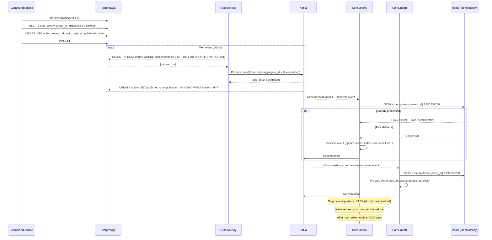
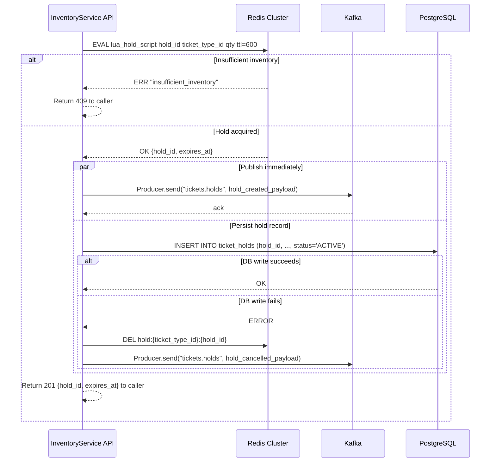

# Event Catalog — Event Management and Ticketing Platform

**Domain:** Event lifecycle, inventory management, ticketing, check-in, refunds, and organizer payouts.  
**Owner:** Platform Engineering  
**Last reviewed:** 2025-01-15

---

## Contract Conventions

All events published by this platform follow a uniform envelope and naming convention to enable
reliable routing, schema evolution, and consumer-side idempotency.

### Naming Convention

Events follow the pattern `<domain>.<aggregate>.<past_tense_verb>.v<major>`.  
Examples: `ticketing.ticket.hold_created.v1`, `ticketing.event.published.v1`.

- `domain` is always `ticketing` for this platform's internal events.
- `aggregate` is the bounded-context noun in singular form (e.g., `event`, `ticket`, `order`).
- `past_tense_verb` uses snake_case and describes the completed state change (e.g., `hold_created`, `checked_in`).
- `v<major>` is incremented only on breaking changes; minor/patch changes are backward-compatible and do
  not require a version bump.

### Envelope Schema

Every event carries a standard outer envelope regardless of payload shape:

| Field | Type | Required | Description |
|---|---|---|---|
| `event_id` | UUID v4 | Yes | Globally unique identifier for this event instance; used as idempotency key by consumers |
| `occurred_at` | ISO 8601 UTC | Yes | Wall-clock time when the state change occurred on the producer side |
| `correlation_id` | UUID v4 | Yes | Trace ID propagated from the originating HTTP request or job; used for end-to-end observability |
| `causation_id` | UUID v4 | Yes | `event_id` of the direct parent event that caused this one; root commands use their own request ID |
| `producer` | string | Yes | Name of the publishing service (e.g., `inventory-service`, `order-service`) |
| `schema_version` | semver string | Yes | Full semantic version of the payload schema (e.g., `1.0.0`); registered in Confluent Schema Registry |
| `tenant_id` | UUID v4 | Yes | Platform tenant identifier; enables multi-tenant consumers to filter without parsing the payload |

### Payload Contracts

Payload schemas are immutable after their first production publish. Any change that removes a field,
renames a field, or changes a field's type requires a new major version (e.g., `.v2`) with a parallel
run period of at least 30 days. During the parallel run, both versions are published simultaneously.
Additive changes (new optional fields) are backward-compatible and allowed without a major bump.

Schema definitions live in the `schemas/` directory of the platform monorepo and are registered with
**Confluent Schema Registry** in Avro format. The CI pipeline enforces backward compatibility by running
`schema-registry-cli compatibility-check` against the registry on every pull request that touches a schema.

### Delivery Guarantees and Ordering

All topics use **at-least-once delivery**. Every consumer must implement idempotency keyed on
`event_id`. The recommended pattern is an `processed_event_ids` set in Redis with a TTL equal to
the maximum expected replay window (default 72 hours).

Per-aggregate key ordering is enforced on Kafka by setting the Kafka message key to the aggregate
identifier (e.g., `event_id` for event lifecycle topics, `order_id` for order topics). No global
ordering across aggregates is assumed or guaranteed.

---

## Domain Events

| Event Name | Topic | Trigger | Key Payload Fields | Typical Consumers | SLO (commit-to-publish) |
|---|---|---|---|---|---|
| `ticketing.event.published.v1` | `events.lifecycle` | Organizer transitions event from draft to published | `event_id`, `organizer_id`, `title`, `start_time`, `ticket_types[]`, `venue_id` | SearchIndexService, NotificationService, RecommendationEngine | < 3 s |
| `ticketing.ticket.hold_created.v1` | `tickets.holds` | Attendee initiates checkout; Redis hold created atomically | `hold_id`, `ticket_type_id`, `event_id`, `attendee_id`, `quantity`, `expires_at` | InventoryService, AnalyticsService | < 500 ms |
| `ticketing.order.completed.v1` | `orders.lifecycle` | Payment captured successfully; order confirmed | `order_id`, `attendee_id`, `event_id`, `ticket_ids[]`, `amount_paid`, `currency`, `payment_method` | TicketService, NotificationService, AnalyticsService, PayoutService | < 2 s |
| `ticketing.ticket.transferred.v1` | `tickets.transfers` | Ticket transfer accepted by recipient | `ticket_id`, `from_attendee_id`, `to_attendee_id`, `event_id`, `transferred_at` | CheckInService, NotificationService | < 2 s |
| `ticketing.event.cancelled.v1` | `events.lifecycle` | Organizer cancels a live or upcoming event | `event_id`, `cancelled_at`, `cancellation_reason`, `refund_policy` | RefundService, NotificationService, PayoutService | < 5 s |
| `ticketing.refund.issued.v1` | `refunds.lifecycle` | Refund successfully processed via Stripe | `refund_id`, `order_id`, `ticket_ids[]`, `amount_refunded`, `currency`, `stripe_refund_id`, `reason` | InventoryService, AnalyticsService, PayoutService | < 5 s |
| `ticketing.attendee.checked_in.v1` | `checkin.events` | QR code scan validated at the venue gate | `ticket_id`, `attendee_id`, `event_id`, `gate_id`, `checked_in_at`, `device_id` | AnalyticsService, OrganizerDashboard | < 1 s |
| `ticketing.capacity.threshold_reached.v1` | `events.capacity` | `quantity_available / quantity_total` drops below configurable threshold (default 20%) | `event_id`, `ticket_type_id`, `threshold_pct`, `current_available`, `current_total` | PricingEngine, NotificationService, MarketingService | < 2 s |

### ticketing.event.published.v1

This event fires when an organizer transitions an event record from `DRAFT` to `PUBLISHED` status.
It represents the moment at which the event becomes discoverable and purchasable by the public.
SearchIndexService must consume this event to create or update the OpenSearch document so the event
appears in browse and search results. NotificationService uses it to dispatch welcome emails to attendees
who have set event-type alerts. If publishing fails after the domain write but before the outbox relay
picks up the row, the outbox relay will retry until successful; the organizer will not see the event go
live in the dashboard until the event has been published to Kafka and processed by SearchIndexService,
which sends a separate `search.index.refreshed.v1` acknowledgement.

### ticketing.ticket.hold_created.v1

Emitted immediately after a Redis hold is atomically created for a given ticket type during the checkout
initiation flow. The hold represents a temporary reservation that expires after 600 seconds. This event
is produced on the **fast path** (direct Kafka publish from InventoryService before the PostgreSQL record
is committed) to meet the < 500 ms SLO. Because of this, a compensating delete is emitted as
`ticketing.ticket.hold_cancelled.v1` if the subsequent PostgreSQL write fails. InventoryService consumes
this event to decrement `quantity_available` in its read replica cache. AnalyticsService uses the stream
to compute hold-to-purchase conversion funnels in near-real time.

### ticketing.order.completed.v1

Published after Stripe confirms payment capture and the order record transitions to `CONFIRMED` status
in PostgreSQL. This is the most critical event in the platform; its failure or delay cascades to
non-delivery of tickets, missing confirmation emails, and incorrect payout accruals. TicketService
consumes it to generate individual ticket records, assign QR codes, and trigger PDF generation.
PayoutService consumes it to accrue the gross amount into the organizer's pending payout balance.
The event uses the transactional outbox pattern — it is written to the `outbox` table in the same
database transaction as the order record, guaranteeing exactly-once write and at-least-once delivery.

### ticketing.ticket.transferred.v1

This event is emitted once the transfer recipient accepts ownership of a ticket. It is not emitted
at initiation (when the sender requests a transfer) to avoid polluting the stream with abandoned
transfer requests. CheckInService must consume this event to update its local mapping of `ticket_id →
valid_holder_id`, so that QR scans are validated against the current holder's identity, not the
original purchaser. NotificationService sends both parties a confirmation email with updated ticket
details. The transfer record is stored immutably in the `ticket_transfer_history` table for audit.

### ticketing.event.cancelled.v1

Produced when an organiser cancels a live or upcoming event. This is a high-impact, low-frequency
event that triggers a cascade of critical side effects. RefundService must initiate bulk refund
processing for all confirmed orders associated with the event. NotificationService sends mass
cancellation emails to all ticket holders. PayoutService withholds any pending payout for the
organizer and flags it for manual review. The `refund_policy` field determines whether full, partial,
or no automatic refund is issued, allowing RefundService to apply the correct Stripe refund amount
without additional API calls to EventService.

### ticketing.refund.issued.v1

Emitted once Stripe confirms that a refund has been processed and the `refund` object reaches
`succeeded` status. It carries the `stripe_refund_id` to enable deduplication if the Stripe webhook
fires multiple times. InventoryService consumes this event to increment `quantity_available` for the
affected ticket type, making the seat available for re-purchase. PayoutService adjusts the organizer's
pending payout balance by subtracting the refunded amount. If the event fires before the corresponding
`ticketing.order.completed.v1` (out-of-order delivery), the consumer parks it in a dead-letter staging
table and replays it once the order record is confirmed, relying on idempotency to prevent double-processing.

### ticketing.attendee.checked_in.v1

Published by CheckInService each time a QR code scan is successfully validated at an entry gate. The
event is produced from venue devices via a dedicated check-in ingestion endpoint that proxies to Kafka.
When a device is offline, events are buffered locally and flushed in batch on reconnect; the
`checked_in_at` field retains the original scan timestamp, not the flush timestamp, to preserve accuracy
for attendance analytics. OrganizerDashboard subscribes to a Server-Sent Events stream derived from this
Kafka topic to provide the real-time attendance counter visible in the organizer's mobile view.

### ticketing.capacity.threshold_reached.v1

A synthetic threshold event generated by InventoryService when it detects that available capacity for
a ticket type crosses below a configurable percentage of total capacity. It is not emitted on every
sale — only on the crossing transition — to avoid flooding consumers. PricingEngine consumes it to
begin dynamic price escalation, evaluating configured scarcity multiplier rules. MarketingService
updates the event listing badge to show "Selling Fast" urgency messaging. The threshold percentage is
configurable per event via `ticket_type.capacity_alert_threshold_pct` and defaults to 20%.

---

## Publish and Consumption Sequence

### Transactional Outbox Pattern

The following diagram shows the standard path for events that require strong durability guarantees
(e.g., `ticketing.order.completed.v1`).

### Fast Path for Hold Created (< 500 ms SLO)

The hold event bypasses the outbox pattern to meet the sub-500 ms latency requirement.

---

## Operational SLOs

### Commit-to-Publish Latency Targets

| Event | P95 commit-to-publish | Max replay lag | DLQ alert threshold |
|---|---|---|---|
| `ticketing.event.published.v1` | < 3 s | 30 s | 5 messages |
| `ticketing.ticket.hold_created.v1` | < 500 ms | 5 s | 10 messages |
| `ticketing.order.completed.v1` | < 2 s | 15 s | 3 messages |
| `ticketing.ticket.transferred.v1` | < 2 s | 15 s | 5 messages |
| `ticketing.event.cancelled.v1` | < 5 s | 60 s | 1 message |
| `ticketing.refund.issued.v1` | < 5 s | 60 s | 2 messages |
| `ticketing.attendee.checked_in.v1` | < 1 s | 10 s | 20 messages |
| `ticketing.capacity.threshold_reached.v1` | < 2 s | 10 s | 5 messages |

### Schema Versioning Policy

When a backward-compatible change is needed (adding an optional field), the schema is updated in-place
and re-registered with Confluent Schema Registry under the same subject. The registry enforces
`BACKWARD` compatibility by default; a CI step runs `schema-registry-cli compatibility-check` on every
PR that modifies a `.avsc` file.

When a breaking change is unavoidable, a new major version is introduced (e.g., `ticketing.order.completed.v2`).
Both `v1` and `v2` are published in parallel for a minimum of 30 days. During this window, the producer
writes to both topics simultaneously. Consumers are expected to migrate to `v2` within the parallel run
period. After 30 days, `v1` is deprecated; producers stop publishing to it after an additional 14-day
sunset window, giving slow-deploying consumers a final grace period.

### Monitoring and Alerting

Consumer lag alerts are configured per consumer group in Prometheus using the
`kafka_consumer_group_lag` metric exported by the MSK Prometheus exporter. Alerts fire when lag
exceeds the values in the table above for more than 2 consecutive minutes. DLQ message counts are
monitored via a CloudWatch metric filter on the DLQ topic; any non-zero count triggers a PagerDuty
P2 alert for all events except `ticketing.event.cancelled.v1` and `ticketing.refund.issued.v1`, where
even a single DLQ entry triggers a P1 alert due to financial impact.

Schema registry compatibility checks run in the `validate-schemas` CI job. If any registered schema
is no longer compatible with the schema in the PR, the pipeline fails and the PR is blocked from merge.

### Incident Response

**DLQ Triage Runbook:** When a DLQ alert fires, the on-call engineer uses the `scripts/replay-dlq.sh`
script to inspect message headers, identify the failure reason from the consumer error log, apply a fix
or configuration change, and replay messages using `kafka-consumer-groups.sh --reset-offsets`.

**Event Replay Procedure:** For scenarios requiring a full replay of a topic (e.g., after consumer
data loss), the OutboxRelay supports a `--replay-from-offset` flag that re-publishes all outbox rows
with `occurred_at` within a given window. Consumers handle replayed events transparently via
idempotency keys. Replay is time-bounded to prevent unbounded Kafka retention costs; the maximum
replay window is 72 hours.
