# System Context Diagram — Event Management and Ticketing Platform

## Overview

This document presents the system context diagram for the Event Management and Ticketing Platform using the C4 model. The diagram establishes the system boundary, identifies all human actors who interact with the system, and maps all external system integrations.

---

## C4 Context Diagram

```mermaid
C4Context
    title System Context — Event Management and Ticketing Platform

    Person(organizer, "Organizer", "Creates and manages events, ticket types, pricing, speakers, sponsors, and monitors analytics and payouts.")
    Person(attendee, "Attendee", "Discovers events, purchases tickets, manages orders, joins waitlists, and attends in-person or virtual events.")
    Person(checkInStaff, "Check-in Staff", "Scans attendee QR codes, performs manual lookups, and prints badges at the venue on event day.")
    Person(financeAdmin, "Finance Admin", "Reviews and approves organizer payouts, manages platform fee structures, and generates financial reports.")
    Person(platformAdmin, "Platform Admin", "Manages organizer accounts, event categories, tax configurations, system health, and global platform settings.")

    System(emtp, "Event Management & Ticketing Platform", "Core SaaS platform that handles event lifecycle management, ticket sales, order processing, check-in operations, and financial settlements.")

    System_Ext(paymentGateway, "Payment Gateway (Stripe)", "Processes card payments, digital wallet payments, refunds, and organizer payouts via Stripe Connect.")
    System_Ext(emailService, "Email Service (SendGrid)", "Delivers transactional emails including ticket confirmations, reminders, payout notifications, and waitlist alerts.")
    System_Ext(smsService, "SMS Service (Twilio)", "Sends SMS reminders, waitlist notifications, and check-in alerts to opted-in attendees.")
    System_Ext(streamingPlatform, "Streaming Platform (Zoom / Teams)", "Hosts virtual and hybrid event streams. Provides meeting/webinar creation, unique join links, and attendance data.")
    System_Ext(calendarService, "Calendar Services (Google / Apple / Outlook)", "Accepts .ics exports and calendar API calls so attendees can add events to their personal calendar.")
    System_Ext(taxService, "Tax Calculation Service (Avalara)", "Calculates applicable sales tax, VAT, and GST rates for ticket purchases based on event jurisdiction and buyer location.")
    System_Ext(analyticsService, "Analytics Platform (Mixpanel / Segment)", "Receives behavioural telemetry for attendee journeys, funnel analysis, and organizer dashboard metrics.")
    System_Ext(identityProvider, "Identity Provider (Auth0)", "Handles authentication and authorisation for organizer, attendee, and admin users via OAuth2 / OIDC.")
    System_Ext(objectStorage, "Object Storage (AWS S3)", "Stores event images, speaker headshots, sponsor logos, badge templates, and exported reports.")
    System_Ext(cdnProvider, "CDN (CloudFront)", "Serves static assets and media files globally with low latency.")

    Rel(organizer, emtp, "Creates events, manages tickets, views analytics, initiates payouts", "HTTPS / Web Browser")
    Rel(attendee, emtp, "Discovers events, purchases tickets, joins waitlists, manages orders", "HTTPS / Web Browser / Mobile App")
    Rel(checkInStaff, emtp, "Scans QR codes, manual check-in, prints badges, views dashboard", "HTTPS / Mobile PWA")
    Rel(financeAdmin, emtp, "Approves payouts, manages fees, generates reports", "HTTPS / Admin Portal")
    Rel(platformAdmin, emtp, "Manages accounts, configuration, system health", "HTTPS / Admin Portal")

    Rel(emtp, paymentGateway, "Charges cards, processes refunds, initiates payouts", "HTTPS / Stripe API")
    Rel(emtp, emailService, "Sends transactional emails", "HTTPS / SendGrid API")
    Rel(emtp, smsService, "Sends SMS notifications", "HTTPS / Twilio API")
    Rel(emtp, streamingPlatform, "Creates meetings, retrieves join links, pulls attendance data", "HTTPS / Zoom API / Teams Graph API")
    Rel(emtp, calendarService, "Generates calendar events and .ics files", "HTTPS / Calendar APIs")
    Rel(emtp, taxService, "Requests tax calculation at checkout", "HTTPS / Avalara API")
    Rel(emtp, analyticsService, "Streams behavioural events and funnel data", "HTTPS / Segment API")
    Rel(emtp, identityProvider, "Delegates authentication and token validation", "HTTPS / Auth0 OIDC")
    Rel(emtp, objectStorage, "Stores and retrieves media and document files", "HTTPS / AWS S3 API")
    Rel(emtp, cdnProvider, "Serves assets via CDN edge nodes", "HTTPS / CloudFront")
```

---

## Actor Descriptions

### Human Actors

#### Organizer

The Organizer is the primary business customer of the platform. Organizers are event promoters, conference committees, sports clubs, and entertainment companies that create and manage events. They interact with the platform through a dedicated Organizer Portal (web application). Key responsibilities include event configuration, ticket inventory management, sponsorship, speaker management, and financial settlement.

**Interaction channels:** Organizer Portal (web), REST API (for direct integrations), email notifications.

#### Attendee

Attendees are end consumers who discover, purchase tickets for, and attend events. They range from individual consumers buying a single ticket to corporate buyers purchasing group allocations. Attendees interact via the public-facing web application and a mobile-optimised experience.

**Interaction channels:** Attendee Web App, Mobile PWA, email (tickets, reminders), SMS (opt-in reminders).

#### Check-in Staff

Check-in Staff are venue personnel responsible for admitting attendees on event day. They use the lightweight Check-in PWA on smartphones or tablets. Staff members may operate at entrance gates, session rooms, or badge printing kiosks.

**Interaction channels:** Check-in Mobile PWA, badge printing kiosk, offline-capable local cache.

#### Finance Admin

Finance Admins are internal platform team members responsible for financial oversight. They review pending organizer payouts, manage fee configurations, handle refund overrides, and produce reconciliation reports.

**Interaction channels:** Admin Portal, exported CSV/PDF reports, email alerts.

#### Platform Admin

Platform Admins manage the overall health and configuration of the platform. They approve organizer accounts, manage the event category taxonomy, configure tax rates, monitor system health dashboards, and handle escalated content moderation.

**Interaction channels:** Admin Portal, monitoring dashboards, audit logs.

---

## External System Descriptions

### Payment Gateway (Stripe)

Stripe is the primary payment processor. The platform uses Stripe's Payment Intents API for card-present and card-not-present transactions. Stripe Connect is used to manage organizer payouts, enabling the platform to collect and distribute funds. Stripe Radar handles fraud detection. Webhooks notify the platform of payment lifecycle events (charges, refunds, disputes).

**Data exchanged:** Payment tokens, charge confirmations, refund confirmations, payout transfer statuses, chargeback alerts.

### Email Service (SendGrid)

SendGrid delivers all transactional email communications from the platform. This includes order confirmations, QR code delivery, event reminders, waitlist notifications, payout confirmations, and password reset emails. The platform uses SendGrid's Template API for dynamic content rendering.

**Data exchanged:** Recipient email, template ID, dynamic template variables (attendee name, QR code URL, event details).

### SMS Service (Twilio)

Twilio delivers SMS messages to attendees and organizers who have opted in. Use cases include 24-hour event reminders, waitlist offer notifications, and two-factor authentication codes.

**Data exchanged:** Recipient phone number, message body, delivery status callbacks.

### Streaming Platform (Zoom / Microsoft Teams)

Streaming providers host the virtual component of hybrid and fully virtual events. The platform integrates via OAuth to create scheduled webinars or meetings, generate per-attendee join links, and retrieve post-event attendance reports and recording URLs.

**Data exchanged:** Meeting/webinar creation parameters, unique join URLs per attendee, attendance records, recording metadata.

### Calendar Services (Google / Apple / Outlook)

Calendar integration allows attendees to add events directly to their personal calendars. The platform generates `.ics` files (RFC 5545) and deep links to Google Calendar and Outlook Web. For virtual events, the calendar entry includes the unique join URL.

**Data exchanged:** iCalendar event data (VEVENT), timezone information, meeting URLs.

### Tax Calculation Service (Avalara)

Avalara provides real-time tax calculation based on the buyer's address and the event's jurisdiction. The service returns applicable rates for sales tax, VAT, and GST. This ensures the platform complies with tax regulations in all supported markets.

**Data exchanged:** Transaction details (product type, buyer location, seller location), applicable tax rates, tax amounts.

### Analytics Platform (Mixpanel / Segment)

The analytics platform receives event telemetry from the attendee-facing web application and API. Data is used to analyse ticket purchase funnels, measure feature adoption, and power the organizer's event analytics dashboard through aggregated metrics.

**Data exchanged:** User action events (page views, button clicks, checkout steps), user identity (anonymised or hashed), custom properties.

### Identity Provider (Auth0)

Auth0 manages authentication and authorisation for all user types. It handles social login (Google, Apple), email/password, and enterprise SSO (SAML) for organizer accounts. The platform validates JWT tokens issued by Auth0 on every API request.

**Data exchanged:** OAuth2 authorisation codes, JWT access tokens, OIDC ID tokens, user profile claims.

### Object Storage (AWS S3)

AWS S3 stores all binary assets including event cover images, speaker headshots, sponsor logos, badge templates, exported reports, and generated PDF tickets. Assets are organised by organizer ID and event ID for access control.

**Data exchanged:** Binary file uploads and downloads, pre-signed URL generation for temporary access.

### CDN (CloudFront)

AWS CloudFront distributes static assets from S3 and the frontend application globally. It reduces latency for attendees accessing event pages and media content worldwide. The CDN also provides DDoS protection at the edge.

**Data exchanged:** HTTP requests for static assets, cache control headers.

---

## System Boundary Notes

The following capabilities are **within** the system boundary:

- Event lifecycle management (create, publish, cancel)
- Ticket type configuration and dynamic pricing engine
- Seat map builder and inventory management
- Order processing and promo code application (payment initiation delegated to Stripe)
- QR code generation and check-in processing
- Waitlist management
- Refund processing (execution delegated to Stripe)
- Organizer payout calculation (transfer delegated to Stripe Connect)
- Badge template management and print job dispatch
- Attendee self-service portal
- Finance admin and platform admin portals
- Notification orchestration (delivery delegated to SendGrid/Twilio)

The following capabilities are **outside** the system boundary:

- Actual payment card authorisation and settlement (Stripe)
- Email/SMS delivery infrastructure (SendGrid / Twilio)
- Video streaming infrastructure (Zoom / Teams)
- Tax regulation and legal compliance determination (Avalara)
- User authentication credential storage (Auth0)
