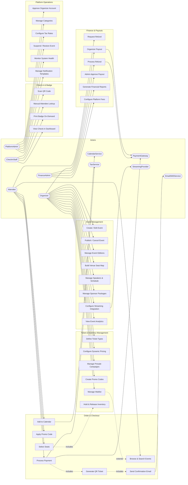

# Use-Case Diagram — Event Management and Ticketing Platform

## Overview

This document presents the use-case diagram for the Event Management and Ticketing Platform. The diagram identifies all external actors and the use cases they participate in, establishing the functional scope of the system.

---

## Actors

| Actor | Type | Description |
|---|---|---|
| **Organizer** | Primary Human | Creates and manages events, ticket types, speakers, sponsors, and payouts |
| **Attendee** | Primary Human | Discovers events, purchases tickets, manages orders, and attends events |
| **CheckInStaff** | Primary Human | Scans QR codes, checks in attendees, prints badges at the venue |
| **FinanceAdmin** | Primary Human | Reviews payouts, manages fee structures, generates financial reports |
| **PlatformAdmin** | Primary Human | Manages organisers, categories, platform configuration, and system health |
| **PaymentGateway** | External System | Processes card payments, refunds, and payouts (e.g., Stripe) |
| **StreamingProvider** | External System | Hosts virtual/hybrid event streams (Zoom, Microsoft Teams) |
| **EmailSMSService** | External System | Delivers transactional email and SMS notifications (e.g., SendGrid, Twilio) |
| **CalendarService** | External System | Provides calendar export and add-to-calendar integrations |
| **TaxService** | External System | Calculates applicable taxes per jurisdiction |

---

## Use-Case Diagram

---

## Use-Case Descriptions Summary

### Event Management Use Cases

| ID | Use Case | Primary Actor | Brief Description |
|---|---|---|---|
| UC01 | Create / Edit Event | Organizer | Organizer creates a new event or edits a draft with full details including type, dates, and description |
| UC02 | Publish / Cancel Event | Organizer | Transitions event state from Draft to Published, or initiates cancellation with attendee notifications |
| UC03 | Manage Event Editions | Organizer | Creates and manages recurring event series, linking editions under a parent event entity |
| UC04 | Build Venue Seat Map | Organizer | Uses the drag-and-drop canvas to define sections, rows, seats, and assign accessibility attributes |
| UC05 | Manage Speakers & Schedule | Organizer | Adds speaker profiles and builds the event agenda with session timings and room assignments |
| UC06 | Manage Sponsor Packages | Organizer | Configures sponsor tiers, uploads logos, and assigns visibility placements on the event page |
| UC07 | Configure Streaming Integration | Organizer | Connects Zoom or Teams account and configures virtual meeting rooms for online attendees |
| UC08 | View Event Analytics | Organizer | Accesses real-time sales, revenue, and check-in dashboards for owned events |

### Ticket & Inventory Management Use Cases

| ID | Use Case | Primary Actor | Brief Description |
|---|---|---|---|
| UC09 | Define Ticket Types | Organizer | Creates ticket categories (VIP, GA, Early Bird, Group) with prices, quantities, and sale windows |
| UC10 | Configure Dynamic Pricing | Organizer | Sets inventory-based or time-based pricing tiers that activate automatically |
| UC11 | Manage Presale Campaigns | Organizer | Creates presale windows with access codes distributed to targeted attendee groups |
| UC12 | Create Promo Codes | Organizer | Generates discount codes with rules for value, usage limits, expiry, and eligible ticket types |
| UC13 | Manage Waitlist | Organizer | Monitors waitlist queue and manually promotes or auto-promotes attendees when seats open |
| UC14 | Hold & Release Inventory | System | Temporarily holds selected seats during checkout and releases them on timeout or cancellation |

### Order & Checkout Use Cases

| ID | Use Case | Primary Actor | Brief Description |
|---|---|---|---|
| UC15 | Browse & Search Events | Attendee | Discovers events through keyword search, category filters, and location-based discovery |
| UC16 | Select Seats | Attendee | Interacts with the live seat map to choose and hold specific seats before checkout |
| UC17 | Apply Promo Code | Attendee | Enters a discount code at checkout to reduce the order total |
| UC18 | Process Payment | Attendee | Submits payment via card or digital wallet through the PCI-compliant checkout form |
| UC19 | Generate QR Ticket | System | Automatically creates a unique QR code per ticket upon successful payment |
| UC20 | Send Confirmation Email | System | Dispatches confirmation email with ticket QR codes and event details via email service |
| UC21 | Add to Calendar | Attendee | Exports event details to Google Calendar, Apple Calendar, or Outlook |

### Check-in & Badge Use Cases

| ID | Use Case | Primary Actor | Brief Description |
|---|---|---|---|
| UC22 | Scan QR Code | CheckInStaff | Uses the mobile PWA to scan attendee QR codes for rapid entry verification |
| UC23 | Manual Attendee Lookup | CheckInStaff | Searches attendee records by name or order ID for attendees without a QR code |
| UC24 | Print Badge On-Demand | CheckInStaff | Triggers badge printing for an attendee at the venue kiosk |
| UC25 | View Check-in Dashboard | CheckInStaff | Monitors live check-in statistics and crowd flow across gates and sessions |

### Finance & Payouts Use Cases

| ID | Use Case | Primary Actor | Brief Description |
|---|---|---|---|
| UC26 | Request Refund | Attendee | Submits a refund request through the attendee portal within policy terms |
| UC27 | Process Refund | FinanceAdmin | Reviews and executes refund transactions, including admin-override refunds |
| UC28 | Organizer Payout | Organizer | Reviews payout summary and initiates a bank transfer after event completion |
| UC29 | Admin Approve Payout | FinanceAdmin | Reviews payout requests in the queue and approves or rejects them |
| UC30 | Generate Financial Reports | FinanceAdmin | Produces revenue, refund, and fee reports for specified date ranges |
| UC31 | Configure Platform Fees | FinanceAdmin | Sets and updates fee structures per organizer tier |

### Platform Operations Use Cases

| ID | Use Case | Primary Actor | Brief Description |
|---|---|---|---|
| UC32 | Approve Organizer Account | PlatformAdmin | Reviews pending organizer registrations and approves or rejects applications |
| UC33 | Manage Categories | PlatformAdmin | Creates, edits, and deactivates event categories in the taxonomy |
| UC34 | Configure Tax Rates | PlatformAdmin | Maintains jurisdiction-level tax rate tables used in checkout |
| UC35 | Suspend / Restore Event | PlatformAdmin | Immediately suspends an event page for policy violations and can restore it |
| UC36 | Monitor System Health | PlatformAdmin | Views live API metrics, error rates, and infrastructure alerts |
| UC37 | Manage Notification Templates | PlatformAdmin | Edits HTML/Markdown templates for transactional emails and SMS messages |
