# C4 Component Diagram

## Overview

This document describes the internal component structure of the Event Management and Ticketing Platform using the C4 model at the component level. The system is decomposed into five backend containers that together handle the full event lifecycle — event publishing, order processing, gate check-in, refunds, and attendee notifications. Two frontend containers (Web App and Mobile App) consume the backend via the API Gateway container.

Each backend container is a self-contained microservice with its own database. Within each container, components follow a clean-architecture layering: controllers handle HTTP concerns, domain services encode business logic, repositories abstract persistence, and infrastructure adapters integrate external systems. This layering ensures that domain logic can be unit-tested in isolation and that infrastructure components can be swapped (e.g., replacing Stripe with a different payment provider) without touching business rules.

The diagram below shows the components within each container and the key relationships between them. Infrastructure adapters (Redis, Stripe, SendGrid, etc.) are shown as external systems at the component level to make data-flow and dependency direction explicit.

## C4 Component Diagram

```mermaid
graph TB
    WEB["🌐 Web App\n[React / Next.js]\nAttendee and organizer UI"]
    MOB["📱 Mobile App\n[React Native]\nAttendee and gate-staff UI"]

    subgraph GW_BOX["API Gateway Container"]
        GW["Kong Gateway\nJWT validation, rate limiting, routing"]
    end

    subgraph EVENT_SVC["Event Service Container\n[Spring Boot — PostgreSQL]"]
        ECTL["EventController\nREST handler for /events/**"]
        EREPO["EventRepository\nPostgreSQL JPA repository"]
        SMBUILDER["SeatMapBuilder\nAssembles SVG seat-map from sections/seats"]
        PUBPIPE["PublishingPipeline\nValidates and transitions DRAFT → PUBLISHED;\nemits event.published to Kafka"]
    end

    subgraph ORDER_SVC["Order Service Container\n[Spring Boot — PostgreSQL / Redis]"]
        OCTL["OrderController\nREST handler for /orders/**"]
        HOLDMGR["HoldManager\nAcquires and releases Redis seat locks\nvia Lua atomic scripts"]
        PAYPROC["PaymentProcessor\nStripe PaymentIntent adapter;\nhandles webhooks and idempotency"]
        OREPO["OrderRepository\nPostgreSQL JPA repository"]
    end

    subgraph CHECKIN_SVC["CheckIn Service Container\n[Go / Gin — PostgreSQL]"]
        SCANCTL["ScanController\nREST handler for /checkin/**"]
        QRVAL["QRValidator\nDecodes and verifies QR signatures;\nqueries ticket status"]
        OFFSYNC["OfflineSyncManager\nBatch-processes offline scan uploads;\napplies deduplication"]
        MANBUILDER["ManifestBuilder\nBuilds and caches full attendee manifest\nfor offline device download"]
    end

    subgraph REFUND_SVC["Refund Service Container\n[Spring Boot — PostgreSQL]"]
        RCTL["RefundController\nREST handler for /refunds/**"]
        ELIGCHK["EligibilityChecker\nEnforces event refund policy windows;\nchecks ticket status"]
        REFPROC["RefundProcessor\nCalls Stripe refund API;\nupdates order and ticket status"]
    end

    subgraph NOTIF_SVC["Notification Service Container\n[Node.js — Bull Queue]"]
        EMAILD["EmailDispatcher\nSendGrid templated emails\n(confirmation, reminder, refund)"]
        SMSD["SMSDispatcher\nTwilio SMS for day-of alerts\nand ticket links"]
        WALLETGEN["WalletGenerator\nApple PassKit and Google Wallet\npass creation and push-update"]
    end

    subgraph EXTERNAL["External Systems"]
        STRIPE["Stripe\nPayments + Connect"]
        SENDGRID["SendGrid"]
        TWILIO["Twilio"]
        APWALLET["Apple Wallet\n(PassKit)"]
        GWALLET["Google Wallet API"]
        REDIS["Redis\nHold Locks"]
        KAFKA["Kafka\nEvent Bus"]
    end

    WEB --> GW
    MOB --> GW

    GW --> ECTL
    GW --> OCTL
    GW --> SCANCTL
    GW --> RCTL

    ECTL --> EREPO
    ECTL --> SMBUILDER
    ECTL --> PUBPIPE
    PUBPIPE --> KAFKA

    OCTL --> HOLDMGR
    OCTL --> PAYPROC
    OCTL --> OREPO
    HOLDMGR --> REDIS
    PAYPROC --> STRIPE
    PAYPROC --> KAFKA

    SCANCTL --> QRVAL
    SCANCTL --> OFFSYNC
    SCANCTL --> MANBUILDER
    QRVAL --> KAFKA

    RCTL --> ELIGCHK
    RCTL --> REFPROC
    REFPROC --> STRIPE
    REFPROC --> KAFKA

    KAFKA --> EMAILD
    KAFKA --> SMSD
    KAFKA --> WALLETGEN
    EMAILD --> SENDGRID
    SMSD --> TWILIO
    WALLETGEN --> APWALLET
    WALLETGEN --> GWALLET
```

## Component Descriptions

| Component | Container | Technology | Responsibility |
|---|---|---|---|
| **EventController** | Event Service | Spring MVC `@RestController` | Handles `POST /events`, `GET /events`, `PATCH /events/{id}`, `POST /events/{id}/publish`, `POST /events/{id}/cancel`. Validates request bodies and delegates to domain services. |
| **EventRepository** | Event Service | Spring Data JPA + PostgreSQL | CRUD and query operations on the `events`, `ticket_types`, `venues`, and `seat_maps` tables. Applies RLS session parameters before every query. |
| **SeatMapBuilder** | Event Service | Domain service | Reads `seat_sections` and `seats` records to assemble a structured seat-map DTO; generates or validates SVG overlays uploaded by organizers. |
| **PublishingPipeline** | Event Service | Domain service + Kafka producer | Enforces pre-publish invariants (at least one active ticket type, valid venue or stream URL), transitions `EventStatus` to `PUBLISHED`, persists, and publishes `event.published` to Kafka. |
| **OrderController** | Order Service | Spring MVC `@RestController` | Handles `/orders/**` and `/holds/**` endpoints. Enforces JWT attendee scope. Passes idempotency keys from request headers to downstream services. |
| **HoldManager** | Order Service | Redis Lua scripts | Atomically decrements available inventory in Redis using `EVALSHA` with a Lua script to guarantee compare-and-decrement without race conditions. Persists hold records to PostgreSQL as an audit trail. |
| **PaymentProcessor** | Order Service | Stripe Java SDK + webhook listener | Creates Stripe `PaymentIntent` objects on order initiation; confirms payment on webhook receipt; publishes `order.confirmed` event; handles idempotent retries via Stripe idempotency keys. |
| **OrderRepository** | Order Service | Spring Data JPA + PostgreSQL | Persists orders, order line items, coupon redemptions, and ticket-hold records. Runs the stale-order expiry sweep via a scheduled `@Scheduled` job. |
| **ScanController** | CheckIn Service | Go Gin `RouterGroup` | Handles `/checkin/scan`, `/checkin/sync`, and `/events/{id}/checkin/manifest` endpoints. Authenticates device tokens via `X-Device-Token` header. |
| **QRValidator** | CheckIn Service | Go domain service | Decodes the QR code (HMAC-SHA256 signed payload), queries the tickets table, checks for existing non-duplicate check-ins, and writes the check-in record atomically using a PostgreSQL unique partial index. |
| **OfflineSyncManager** | CheckIn Service | Go domain service | Accepts batches of offline scan records, applies server-side deduplication against the check-ins table, classifies each scan as `ACCEPTED`, `DUPLICATE`, or `INVALID`, and publishes `checkin.recorded` events to Kafka. |
| **ManifestBuilder** | CheckIn Service | Go service + Redis cache | Builds the full attendee manifest by joining `tickets`, `order_line_items`, and `attendees`. Caches the result in Redis with a 15-minute TTL and invalidates on `ticket.issued` Kafka events. |
| **RefundController** | Refund Service | Spring MVC `@RestController` | Handles `/refunds` CRUD and `/refunds/{id}/approve`. Enforces attendee scope for creation and organizer/admin scope for approval. |
| **EligibilityChecker** | Refund Service | Domain service | Evaluates the event's refund policy (e.g., no refunds within 7 days of event) and the ticket's current status (`VALID`, `USED`, `CANCELLED`) to determine whether a refund can be requested. |
| **RefundProcessor** | Refund Service | Stripe Java SDK + domain service | Calls Stripe's `Refund` API with the original charge ID, updates the refund record to `PROCESSED`, sets ticket status to `CANCELLED`, and emits `refund.processed` to Kafka. Handles partial-refund scenarios when only some tickets in an order are refunded. |
| **EmailDispatcher** | Notification Service | SendGrid Node.js SDK + Bull worker | Consumes Kafka events (`order.confirmed`, `event.cancelled`, `refund.processed`) and sends templated transactional emails. Retries with exponential back-off on SendGrid rate-limit errors. |
| **SMSDispatcher** | Notification Service | Twilio Node.js SDK + Bull worker | Sends day-of event reminders and ticket-link SMS messages. Respects user communication preferences stored in the Attendee profile. |
| **WalletGenerator** | Notification Service | PassKit library + Google Wallet REST API | Generates Apple `.pkpass` bundles (signed with organizer certificate) and Google Wallet `EventTicketObject` payloads. Pushes silent-update notifications to installed passes when event details change. |

## Key Design Decisions

**Redis atomic hold locks with Lua scripts** — Inventory reservation uses a single Lua script executed atomically on Redis via `EVALSHA`. The script reads the current available count, checks it is ≥ the requested quantity, decrements it, and sets a TTL key — all in one round-trip. This eliminates the time-of-check / time-of-use race that would occur with separate GET + DECR calls, ensuring that two concurrent buyers can never both succeed when only one ticket remains.

**Idempotent order processing via Stripe idempotency keys** — The `PaymentProcessor` component derives a deterministic Stripe idempotency key from the `orderId` (e.g., `order-{orderId}-create-intent`). If the HTTP call to Stripe times out, the retry will return the same `PaymentIntent` object rather than creating a duplicate charge. The `OrderController` similarly accepts an `Idempotency-Key` header from the client so that network retries from the mobile app do not create duplicate orders.

**Offline-first check-in** — The `ManifestBuilder` caches a point-in-time snapshot of all valid tickets for a device to download before entering the venue. The `QRValidator` can fall back to this manifest when the network is unavailable. Scans recorded offline are uploaded in a batch via `POST /checkin/sync`, and the `OfflineSyncManager` handles deduplication using the PostgreSQL partial unique index on `(ticket_id) WHERE is_duplicate = FALSE`, ensuring exactly one canonical check-in per ticket regardless of race conditions between devices.

**Transactional outbox pattern for Kafka events** — Services that need to publish Kafka events as part of a database transaction (e.g., `PublishingPipeline`, `PaymentProcessor`, `RefundProcessor`) write the event payload to an `outbox` table within the same ACID transaction. A Debezium connector streams rows from the `outbox` table into Kafka via CDC, guaranteeing at-least-once delivery even if the Kafka broker is temporarily unavailable at commit time. This prevents the dual-write inconsistency where the database write succeeds but the Kafka publish fails.

**Stripe Connect for organizer payouts** — Rather than collecting all payment funds into a platform bank account and wiring money to organizers, the platform uses Stripe Connect's destination charge model. Each organizer onboards to Stripe Connect and receives a `stripeAccountId`. When an order is confirmed, the charge is split at the Stripe level: the `platform_fee` flows to the platform account and the remainder flows directly to the organizer's connected account. The `Payout Service` reconciles post-event totals and triggers manual Stripe `Transfer` objects only for adjustments (e.g., refund clawbacks).

**QR code signing for tamper-proof tickets** — The `QRValidator` does not rely solely on a UUID lookup to validate a ticket. Each QR code encodes a compact payload `{ticketId}:{eventId}:{issuedAtEpoch}` signed with an HMAC-SHA256 key known only to the Ticket Service. This allows the `CheckIn Service` to verify authenticity without a database round-trip when operating offline, and makes it computationally infeasible for attendees to forge valid QR codes by guessing ticket IDs.
