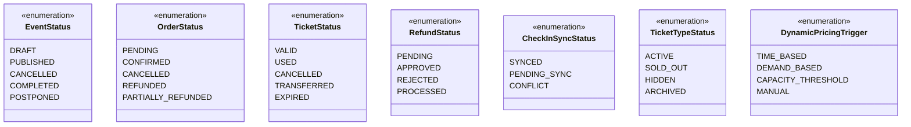
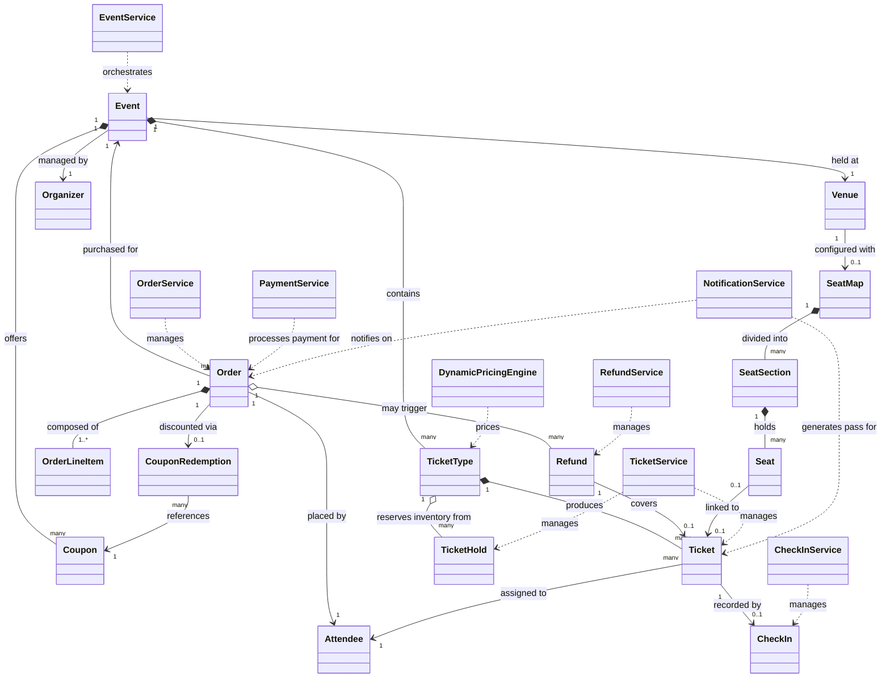

# Class Diagram

## Overview

The Event Management and Ticketing Platform is modelled around four primary aggregate roots — **Event**, **Order**, **CheckIn**, and **Refund** — each owning its subordinate entities and enforcing its own invariants. Supporting domain objects such as `TicketType`, `Seat`, `Coupon`, and `TicketHold` live within these aggregates and are accessed only through their root's repository interface. This design prevents cross-aggregate coupling at the persistence layer while keeping business rules co-located with the data they govern.

Service-layer classes are thin, stateless orchestrators that translate inbound commands into aggregate method calls, coordinate infrastructure adapters (Stripe, Redis, Kafka), and emit domain events for downstream consumers. The **DynamicPricingEngine** is an isolated domain service — it reads event-capacity data and pricing rules but owns no persistent state, making it independently deployable and testable. All service classes depend on abstractions, enabling in-memory fakes to drive unit tests without a running database or message broker.

State transitions within aggregates are always driven by explicit methods (`event.publish()`, `order.confirm()`, `refund.approve()`) rather than direct field mutation, ensuring domain events are always raised and invariants always checked. Enumerations constrain every status field, eliminating stringly-typed state and making invalid state transitions a compile-time error.

## Enumerations

## Core Domain Classes

```mermaid
classDiagram
    class Event {
        +UUID id
        +UUID organizerId
        +UUID venueId
        +String title
        +String description
        +Instant startAt
        +Instant endAt
        +EventStatus status
        +String timezone
        +String coverImageUrl
        +Integer maxCapacity
        +Boolean isOnline
        +String streamUrl
        +Instant createdAt
        +Instant updatedAt
        +publish() void
        +cancel(String reason) void
        +postpone(Instant newStart) void
        +complete() void
        +isSaleable() Boolean
    }
    class Venue {
        +UUID id
        +String name
        +String addressLine1
        +String city
        +String state
        +String country
        +String zipCode
        +Double latitude
        +Double longitude
        +Integer capacity
        +UUID seatMapId
        +getFullAddress() String
    }
    class TicketType {
        +UUID id
        +UUID eventId
        +String name
        +String description
        +BigDecimal basePrice
        +BigDecimal currentPrice
        +String currency
        +Integer quantity
        +Integer quantitySold
        +Integer quantityHeld
        +Integer maxPerOrder
        +TicketTypeStatus status
        +Instant saleStartAt
        +Instant saleEndAt
        +Integer sortOrder
        +availableCount() Integer
        +isOnSale() Boolean
        +markSoldOut() void
        +incrementSold(Integer qty) void
    }
    class Ticket {
        +UUID id
        +UUID ticketTypeId
        +UUID orderId
        +UUID attendeeId
        +String qrCode
        +TicketStatus status
        +Instant issuedAt
        +Instant transferredAt
        +Instant checkedInAt
        +invalidate() void
        +transfer(UUID newAttendeeId) void
        +generateQR() String
        +markCheckedIn() void
    }
    class Order {
        +UUID id
        +UUID eventId
        +UUID attendeeId
        +UUID couponId
        +OrderStatus status
        +BigDecimal subtotal
        +BigDecimal discountAmount
        +BigDecimal platformFee
        +BigDecimal totalAmount
        +String currency
        +String stripePaymentIntentId
        +Instant expiresAt
        +Instant confirmedAt
        +Instant createdAt
        +confirm() void
        +cancel() void
        +markRefunded() void
        +isExpired() Boolean
        +calculateTotal() BigDecimal
    }
    class OrderLineItem {
        +UUID id
        +UUID orderId
        +UUID ticketTypeId
        +Integer quantity
        +BigDecimal unitPrice
        +BigDecimal subtotal
        +computeSubtotal() BigDecimal
    }
    class Attendee {
        +UUID id
        +UUID userId
        +String firstName
        +String lastName
        +String email
        +String phone
        +String locale
        +Instant createdAt
        +getFullName() String
    }
    class Organizer {
        +UUID id
        +UUID userId
        +String name
        +String email
        +String stripeAccountId
        +Boolean isVerified
        +String logoUrl
        +String websiteUrl
        +Instant createdAt
        +canPublishEvents() Boolean
    }
    class CheckIn {
        +UUID id
        +UUID ticketId
        +UUID eventId
        +UUID deviceId
        +Instant scannedAt
        +Double latitude
        +Double longitude
        +CheckInSyncStatus syncStatus
        +String operatorId
        +Boolean isDuplicate
        +markSynced() void
        +flagConflict() void
    }
    class Refund {
        +UUID id
        +UUID orderId
        +UUID ticketId
        +UUID requestedBy
        +String reason
        +BigDecimal amount
        +RefundStatus status
        +String stripeRefundId
        +String reviewNote
        +Instant requestedAt
        +Instant resolvedAt
        +approve() void
        +reject(String note) void
        +process() void
    }
    class TicketHold {
        +UUID id
        +UUID ticketTypeId
        +String sessionId
        +Integer quantity
        +Instant expiresAt
        +String redisKey
        +Boolean isActive
        +isExpired() Boolean
        +release() void
        +extend(Duration duration) void
    }
    class Coupon {
        +UUID id
        +UUID eventId
        +String code
        +String discountType
        +BigDecimal discountValue
        +Integer maxUses
        +Integer usedCount
        +Instant validFrom
        +Instant validTo
        +Boolean isActive
        +isRedeemable() Boolean
        +computeDiscount(BigDecimal base) BigDecimal
        +incrementUsed() void
    }
    class CouponRedemption {
        +UUID id
        +UUID couponId
        +UUID orderId
        +BigDecimal discountApplied
        +Instant redeemedAt
    }
    class SeatMap {
        +UUID id
        +UUID venueId
        +String name
        +String svgUrl
        +Integer totalSeats
        +Instant updatedAt
        +sectionCount() Integer
    }
    class SeatSection {
        +UUID id
        +UUID seatMapId
        +String name
        +Integer rowCount
        +Integer seatsPerRow
        +BigDecimal priceMultiplier
        +String colorHex
        +Integer sortOrder
        +totalCapacity() Integer
    }
    class Seat {
        +UUID id
        +UUID seatSectionId
        +String rowLabel
        +Integer seatNumber
        +String status
        +UUID ticketId
        +Boolean isAccessible
        +String accessibilityNote
        +isAvailable() Boolean
        +reserve(UUID ticketId) void
        +release() void
    }
```

## Service Layer Classes

```mermaid
classDiagram
    class EventService {
        +createEvent(CreateEventCommand) Event
        +publishEvent(UUID eventId) Event
        +cancelEvent(UUID eventId, String reason) Event
        +postponeEvent(UUID eventId, Instant newStart) Event
        +updateEvent(UUID eventId, UpdateEventCommand) Event
        +getEventById(UUID eventId) Event
        +listEvents(EventSearchQuery) Page~Event~
        +getCapacitySummary(UUID eventId) CapacitySummary
    }
    class TicketService {
        +createTicketType(UUID eventId, CreateTicketTypeCommand) TicketType
        +updateTicketType(UUID typeId, UpdateTicketTypeCommand) TicketType
        +reserveTickets(HoldRequest) TicketHold
        +releaseHold(String holdId) void
        +issueTickets(UUID orderId) List~Ticket~
        +validateTicket(String qrCode) TicketValidationResult
        +transferTicket(UUID ticketId, UUID newAttendeeId) Ticket
    }
    class OrderService {
        +initiateOrder(InitiateOrderCommand) Order
        +confirmOrder(UUID orderId, String paymentIntentId) Order
        +cancelOrder(UUID orderId) Order
        +applyHold(UUID orderId, String holdId) Order
        +applyDiscount(UUID orderId, String couponCode) Order
        +getOrderById(UUID orderId) Order
        +listOrdersForAttendee(UUID attendeeId) List~Order~
        +expireStaleOrders() void
    }
    class CheckInService {
        +scanTicket(ScanRequest) CheckInResult
        +buildManifest(UUID eventId) AttendeeManifest
        +syncOfflineScans(List~CheckIn~ scans) SyncResult
        +getCheckInStats(UUID eventId) CheckInStats
        +listCheckIns(UUID eventId, Pageable) Page~CheckIn~
        +flagDuplicate(UUID checkInId) void
    }
    class RefundService {
        +requestRefund(RefundRequest) Refund
        +approveRefund(UUID refundId) Refund
        +rejectRefund(UUID refundId, String reason) Refund
        +processRefund(UUID refundId) Refund
        +getRefundEligibility(UUID ticketId) RefundEligibility
        +listRefundsForOrder(UUID orderId) List~Refund~
    }
    class PaymentService {
        +createPaymentIntent(PaymentIntentRequest) PaymentIntent
        +confirmPayment(String paymentIntentId) PaymentConfirmation
        +capturePayment(String paymentIntentId) CaptureResult
        +voidPayment(String paymentIntentId) void
        +processRefund(String chargeId, BigDecimal amount) StripeRefund
        +getPaymentStatus(String paymentIntentId) PaymentStatus
    }
    class DynamicPricingEngine {
        +computePrice(UUID ticketTypeId, PricingContext) BigDecimal
        +evaluateTriggers(UUID eventId) List~PricingTrigger~
        +updatePriceRules(UUID ticketTypeId, List~PriceRule~) void
        +getRecommendedPrice(UUID ticketTypeId) PriceRecommendation
        +simulatePricing(PricingScenario) PricingSimulation
    }
    class NotificationService {
        +sendOrderConfirmation(UUID orderId) void
        +sendTicketTransfer(UUID ticketId, UUID newAttendeeId) void
        +sendEventReminder(UUID eventId, Duration before) void
        +sendCheckInConfirmation(UUID checkInId) void
        +sendRefundUpdate(UUID refundId) void
        +sendEventCancellation(UUID eventId) void
        +generateWalletPass(UUID ticketId) WalletPass
    }
```

## Class Relationships

