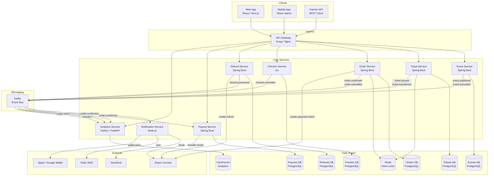
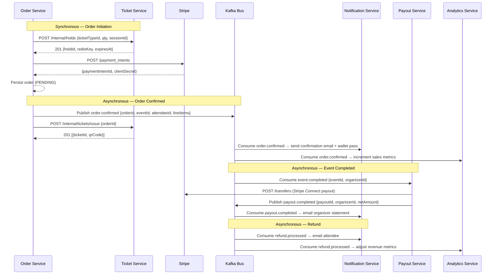
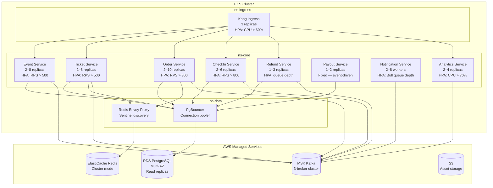

# Component Diagram

## Overview

The platform is decomposed into eight independently deployable microservices, each owning its own PostgreSQL schema and exposing a REST API through the central API Gateway. Services communicate synchronously (REST over HTTP/2) for commands that require immediate responses, and asynchronously via Kafka topics for events that can be processed out-of-band (notifications, analytics, payout scheduling). Every service is packaged as a container image and deployed on Kubernetes with a Horizontal Pod Autoscaler; stateful components (Redis, Kafka, PostgreSQL) run as managed cloud services outside the cluster.

The API Gateway is the single entry point for all external clients — web, mobile, and third-party partner integrations. It handles TLS termination, JWT verification, rate limiting, and request routing. It does not contain business logic; routing rules are declarative and stored in a ConfigMap. Services that need to call each other internally (e.g., Order Service calling Ticket Service to reserve inventory) use cluster-internal DNS names and do not route through the gateway, keeping internal latency low.

Redis is used exclusively for two purposes: short-lived seat/ticket-hold locks (TTL 10 minutes) managed by the Ticket Service, and session-level idempotency keys managed by the Order Service. No service stores long-lived canonical data in Redis; all durable state lives in PostgreSQL. This keeps the Redis cluster small, cheap, and eviction-safe — a Redis restart never causes permanent data loss.

## Component Diagram

## Service Responsibilities

| Component | Responsibility | Technology | Scaling Strategy |
|---|---|---|---|
| **API Gateway** | TLS termination, JWT auth, rate limiting, routing | Kong (Kubernetes Ingress) | Horizontal — 3+ replicas with sticky sessions disabled |
| **Event Service** | Event CRUD, seat-map configuration, publishing lifecycle, capacity tracking | Spring Boot 3, PostgreSQL | Horizontal read replicas; write path single-master |
| **Ticket Service** | Ticket-type management, Redis-based inventory holds, QR generation, ticket issuance | Spring Boot 3, PostgreSQL, Redis | Horizontal; Redis Lua scripts ensure atomic hold decrements |
| **Order Service** | Order initiation, Stripe PaymentIntent creation, hold binding, order expiry sweep | Spring Boot 3, PostgreSQL, Redis | Horizontal; idempotency keys in Redis prevent duplicate orders |
| **CheckIn Service** | QR scan validation, offline manifest delivery, scan sync, duplicate detection | Go (Gin), PostgreSQL | Horizontal with write-behind; offline-first mobile sync via REST batch endpoint |
| **Refund Service** | Refund eligibility, approval workflow, Stripe refund execution, attendee notifications | Spring Boot 3, PostgreSQL | Single replica with async Stripe webhook processor |
| **Payout Service** | Post-event payout calculation, Stripe Connect transfers, organizer statements | Spring Boot 3, PostgreSQL | Single replica; triggered by `event.completed` Kafka event |
| **Notification Service** | Email (SendGrid), SMS (Twilio), Apple/Google Wallet pass generation, push notifications | Node.js, Bull queue | Horizontal queue workers; dead-letter queue for retries |
| **Analytics Service** | Real-time sales funnel, check-in heatmaps, demand forecasting, organizer dashboards | Python FastAPI, ClickHouse | Horizontal query replicas; ClickHouse materialized views for aggregates |

## Inter-Service Communication

**Kafka Topic Catalogue**

| Topic | Producer | Consumers | Retention |
|---|---|---|---|
| `event.published` | Event Service | Analytics | 7 days |
| `event.cancelled` | Event Service | Notification, Analytics | 7 days |
| `event.completed` | Event Service | Payout, Analytics | 30 days |
| `order.confirmed` | Order Service | Notification, Analytics, Payout | 7 days |
| `order.cancelled` | Order Service | Notification, Analytics | 7 days |
| `ticket.issued` | Ticket Service | Notification | 7 days |
| `ticket.transferred` | Ticket Service | Notification | 7 days |
| `checkin.recorded` | CheckIn Service | Analytics | 30 days |
| `refund.processed` | Refund Service | Notification, Analytics | 30 days |
| `payout.completed` | Payout Service | Notification | 90 days |

## External Integrations

| Integration | Service Consumer | Protocol | Purpose |
|---|---|---|---|
| **Stripe Payments** | Order Service | REST (Stripe SDK) | PaymentIntent creation; 3D-Secure support |
| **Stripe Connect** | Payout Service | REST (Stripe SDK) | Marketplace payouts to organizer bank accounts |
| **Stripe Webhooks** | Order Service, Refund Service | HTTPS webhook | Async payment confirmation; refund status updates |
| **SendGrid** | Notification Service | REST (SendGrid SDK) | Transactional email — confirmations, reminders, receipts |
| **Twilio SMS** | Notification Service | REST (Twilio SDK) | SMS ticket links and event day reminders |
| **Apple Wallet (PassKit)** | Notification Service | HTTPS + certificate signing | `.pkpass` generation and push-update for ticket passes |
| **Google Wallet API** | Notification Service | REST (OAuth2) | Google Wallet event ticket object creation and updates |
| **Zoom / Streaming** | Event Service | REST (Zoom OAuth) | Auto-create Zoom webinar; embed join URL in event record |
| **Datadog** | All services | DogStatsD + APM agent | Distributed tracing, metrics, and log aggregation |
| **AWS S3** | Event Service, Notification Service | AWS SDK | Cover image storage; wallet-pass asset hosting |

## Kubernetes Deployment Topology

Each service is deployed as a Kubernetes `Deployment` with a matching `HorizontalPodAutoscaler` and `PodDisruptionBudget`. Stateful infrastructure (PostgreSQL, Redis, Kafka, ClickHouse) runs as managed cloud services (AWS RDS, ElastiCache, MSK, and a self-managed ClickHouse cluster on EKS) with VPC-peering to the application cluster. Namespaces provide soft multi-tenancy within the cluster; `NetworkPolicy` rules restrict cross-namespace traffic to explicitly permitted service-to-service paths.

**Pod resource profiles**

| Service | CPU Request | CPU Limit | Memory Request | Memory Limit | Min Pods | Max Pods |
|---|---|---|---|---|---|---|
| API Gateway (Kong) | 250m | 1000m | 256Mi | 512Mi | 3 | 10 |
| Event Service | 200m | 800m | 384Mi | 768Mi | 2 | 8 |
| Ticket Service | 250m | 1000m | 384Mi | 768Mi | 2 | 8 |
| Order Service | 300m | 1200m | 512Mi | 1Gi | 2 | 10 |
| CheckIn Service | 100m | 500m | 128Mi | 256Mi | 2 | 6 |
| Refund Service | 150m | 600m | 384Mi | 768Mi | 1 | 3 |
| Payout Service | 100m | 400m | 256Mi | 512Mi | 1 | 2 |
| Notification Service | 100m | 400m | 256Mi | 512Mi | 2 | 8 |
| Analytics Service | 300m | 1200m | 512Mi | 1Gi | 2 | 4 |

## Observability

All services emit metrics via the Datadog DogStatsD agent (deployed as a DaemonSet) and structured JSON logs to stdout collected by Fluent Bit and forwarded to Datadog Logs. Distributed traces use the OpenTelemetry SDK with the Datadog exporter, providing end-to-end trace context from the API Gateway through every downstream service call and database query.

| Signal | Tool | Key Metrics / Queries |
|---|---|---|
| **Metrics** | Datadog | `order.confirmed.rate`, `ticket_hold.active_count`, `checkin.scan.latency_p99`, `refund.pending_count` |
| **Traces** | Datadog APM (OTel) | End-to-end latency per endpoint; slow query spans; Kafka consumer lag |
| **Logs** | Datadog Logs (Fluent Bit) | Structured JSON; `correlation_id` propagated via `X-Request-Id` header |
| **Dashboards** | Datadog | Sales funnel (holds → orders → confirmed), check-in velocity, refund queue depth |
| **Alerts** | Datadog Monitors | P99 scan latency > 500 ms; order confirmation error rate > 1%; Kafka consumer lag > 10 k |
| **Uptime** | Datadog Synthetics | Synthetic `POST /holds` + `POST /orders` flow every 60 s from 3 regions |

## Failure Modes and Mitigations

| Failure Scenario | Impact | Mitigation |
|---|---|---|
| Redis unavailable | Ticket holds cannot be acquired; new orders blocked | Circuit breaker returns `503`; fallback to DB-level hold with 30 s TTL |
| Stripe API timeout | Order confirmation delayed | PaymentProcessor retries 3× with exponential back-off; idempotency key prevents double charge |
| Kafka broker down | Domain events not published | Outbox pattern — events stored in DB; Debezium replays on broker recovery |
| PostgreSQL primary failover | Write operations fail during ~30 s failover | Spring Retry + PgBouncer reconnect; read-only operations redirected to replica |
| CheckIn Service crash during event | Gate scans fail | Offline manifest pre-loaded on devices; local scan buffered and synced on recovery |
| SendGrid rate limit | Confirmation emails delayed | Bull dead-letter queue retries with back-off; SMS fallback for critical notifications |
| Duplicate Stripe webhook | Order confirmed twice | Idempotency check on `stripePaymentIntentId` UNIQUE constraint in `orders` table |
