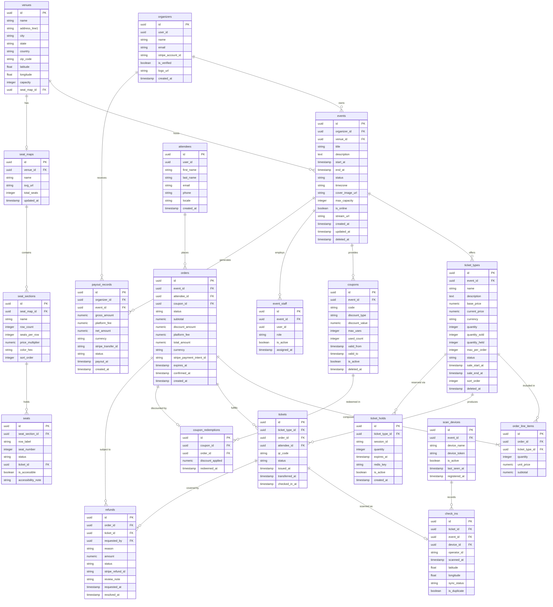

# ERD — Database Schema

## Overview

The database schema follows a multi-tenant relational model hosted on PostgreSQL. Every table carrying organizer-owned or attendee-owned data includes a tenant discriminator column so that Row-Level Security (RLS) policies can enforce data isolation at the database layer without requiring application-level WHERE clauses on every query. Foreign keys are declared but `DEFERRABLE INITIALLY DEFERRED` where circular references exist (e.g., `orders` ↔ `tickets`) to allow atomic bulk inserts during order fulfillment.

The schema separates write-heavy transactional tables (`orders`, `tickets`, `ticket_holds`, `check_ins`) from read-heavy reference tables (`events`, `venues`, `seat_maps`) so that different read-replica topologies can be applied per table group. `ticket_holds` is a short-lived table used alongside Redis; the database record acts as an audit trail and fallback when the Redis key is evicted. All monetary values are stored as `NUMERIC(12,2)` in the smallest supported currency unit to avoid floating-point drift.

UUID primary keys generated with `gen_random_uuid()` are used throughout to enable distributed generation without coordination. Created-at and updated-at timestamps are set by `DEFAULT now()` triggers. Soft deletes are applied on `events`, `ticket_types`, and `coupons` via a `deleted_at` column; hard deletes are reserved for GDPR erasure requests processed through the Attendee Data Service.

## Entity Relationship Diagram



## Table Definitions

### events

```sql
CREATE TABLE events (
    id                UUID        PRIMARY KEY DEFAULT gen_random_uuid(),
    organizer_id      UUID        NOT NULL REFERENCES organizers(id),
    venue_id          UUID        REFERENCES venues(id),
    title             VARCHAR(255) NOT NULL,
    description       TEXT,
    start_at          TIMESTAMPTZ NOT NULL,
    end_at            TIMESTAMPTZ NOT NULL,
    status            VARCHAR(20) NOT NULL DEFAULT 'DRAFT'
                          CHECK (status IN ('DRAFT','PUBLISHED','CANCELLED','COMPLETED','POSTPONED')),
    timezone          VARCHAR(60) NOT NULL DEFAULT 'UTC',
    cover_image_url   TEXT,
    max_capacity      INTEGER,
    is_online         BOOLEAN     NOT NULL DEFAULT FALSE,
    stream_url        TEXT,
    created_at        TIMESTAMPTZ NOT NULL DEFAULT now(),
    updated_at        TIMESTAMPTZ NOT NULL DEFAULT now(),
    deleted_at        TIMESTAMPTZ,
    CONSTRAINT events_end_after_start CHECK (end_at > start_at)
);
CREATE INDEX idx_events_organizer   ON events(organizer_id) WHERE deleted_at IS NULL;
CREATE INDEX idx_events_status_start ON events(status, start_at) WHERE deleted_at IS NULL;
CREATE INDEX idx_events_start_at    ON events(start_at) WHERE status = 'PUBLISHED';
```

### ticket_types

```sql
CREATE TABLE ticket_types (
    id               UUID         PRIMARY KEY DEFAULT gen_random_uuid(),
    event_id         UUID         NOT NULL REFERENCES events(id),
    name             VARCHAR(120) NOT NULL,
    description      TEXT,
    base_price       NUMERIC(12,2) NOT NULL,
    current_price    NUMERIC(12,2) NOT NULL,
    currency         CHAR(3)      NOT NULL DEFAULT 'USD',
    quantity         INTEGER      NOT NULL,
    quantity_sold    INTEGER      NOT NULL DEFAULT 0,
    quantity_held    INTEGER      NOT NULL DEFAULT 0,
    max_per_order    INTEGER      NOT NULL DEFAULT 10,
    status           VARCHAR(20)  NOT NULL DEFAULT 'ACTIVE'
                         CHECK (status IN ('ACTIVE','SOLD_OUT','HIDDEN','ARCHIVED')),
    sale_start_at    TIMESTAMPTZ,
    sale_end_at      TIMESTAMPTZ,
    sort_order       INTEGER      NOT NULL DEFAULT 0,
    deleted_at       TIMESTAMPTZ,
    CONSTRAINT tt_quantity_positive CHECK (quantity > 0),
    CONSTRAINT tt_sold_lte_quantity CHECK (quantity_sold + quantity_held <= quantity)
);
CREATE INDEX idx_tt_event      ON ticket_types(event_id) WHERE deleted_at IS NULL;
CREATE INDEX idx_tt_status     ON ticket_types(event_id, status) WHERE deleted_at IS NULL;
```

### tickets

```sql
CREATE TABLE tickets (
    id               UUID        PRIMARY KEY DEFAULT gen_random_uuid(),
    ticket_type_id   UUID        NOT NULL REFERENCES ticket_types(id),
    order_id         UUID        NOT NULL REFERENCES orders(id) DEFERRABLE INITIALLY DEFERRED,
    attendee_id      UUID        NOT NULL REFERENCES attendees(id),
    qr_code          VARCHAR(64) NOT NULL UNIQUE,
    status           VARCHAR(20) NOT NULL DEFAULT 'VALID'
                         CHECK (status IN ('VALID','USED','CANCELLED','TRANSFERRED','EXPIRED')),
    issued_at        TIMESTAMPTZ NOT NULL DEFAULT now(),
    transferred_at   TIMESTAMPTZ,
    checked_in_at    TIMESTAMPTZ
);
CREATE UNIQUE INDEX idx_tickets_qr       ON tickets(qr_code);
CREATE INDEX        idx_tickets_order    ON tickets(order_id);
CREATE INDEX        idx_tickets_attendee ON tickets(attendee_id);
CREATE INDEX        idx_tickets_type     ON tickets(ticket_type_id, status);
```

### orders

```sql
CREATE TABLE orders (
    id                        UUID         PRIMARY KEY DEFAULT gen_random_uuid(),
    event_id                  UUID         NOT NULL REFERENCES events(id),
    attendee_id               UUID         NOT NULL REFERENCES attendees(id),
    coupon_id                 UUID         REFERENCES coupons(id),
    status                    VARCHAR(25)  NOT NULL DEFAULT 'PENDING'
                                  CHECK (status IN ('PENDING','CONFIRMED','CANCELLED','REFUNDED','PARTIALLY_REFUNDED')),
    subtotal                  NUMERIC(12,2) NOT NULL,
    discount_amount           NUMERIC(12,2) NOT NULL DEFAULT 0,
    platform_fee              NUMERIC(12,2) NOT NULL DEFAULT 0,
    total_amount              NUMERIC(12,2) NOT NULL,
    currency                  CHAR(3)      NOT NULL DEFAULT 'USD',
    stripe_payment_intent_id  VARCHAR(100) UNIQUE,
    expires_at                TIMESTAMPTZ,
    confirmed_at              TIMESTAMPTZ,
    created_at                TIMESTAMPTZ  NOT NULL DEFAULT now()
);
CREATE INDEX idx_orders_attendee ON orders(attendee_id);
CREATE INDEX idx_orders_event    ON orders(event_id, status);
CREATE INDEX idx_orders_expires  ON orders(expires_at) WHERE status = 'PENDING';
CREATE INDEX idx_orders_stripe   ON orders(stripe_payment_intent_id) WHERE stripe_payment_intent_id IS NOT NULL;
```

### attendees

```sql
CREATE TABLE attendees (
    id          UUID         PRIMARY KEY DEFAULT gen_random_uuid(),
    user_id     UUID         UNIQUE NOT NULL,
    first_name  VARCHAR(80)  NOT NULL,
    last_name   VARCHAR(80)  NOT NULL,
    email       VARCHAR(255) NOT NULL UNIQUE,
    phone       VARCHAR(30),
    locale      VARCHAR(10)  NOT NULL DEFAULT 'en',
    created_at  TIMESTAMPTZ  NOT NULL DEFAULT now()
);
CREATE UNIQUE INDEX idx_attendees_email ON attendees(lower(email));
```

### check_ins

```sql
CREATE TABLE check_ins (
    id           UUID        PRIMARY KEY DEFAULT gen_random_uuid(),
    ticket_id    UUID        NOT NULL REFERENCES tickets(id),
    event_id     UUID        NOT NULL REFERENCES events(id),
    device_id    UUID        REFERENCES scan_devices(id),
    operator_id  VARCHAR(80),
    scanned_at   TIMESTAMPTZ NOT NULL,
    latitude     DOUBLE PRECISION,
    longitude    DOUBLE PRECISION,
    sync_status  VARCHAR(15) NOT NULL DEFAULT 'SYNCED'
                     CHECK (sync_status IN ('SYNCED','PENDING_SYNC','CONFLICT')),
    is_duplicate BOOLEAN     NOT NULL DEFAULT FALSE
);
CREATE UNIQUE INDEX idx_checkins_ticket_first ON check_ins(ticket_id)
    WHERE is_duplicate = FALSE;
CREATE INDEX idx_checkins_event       ON check_ins(event_id, scanned_at);
CREATE INDEX idx_checkins_sync_status ON check_ins(sync_status) WHERE sync_status != 'SYNCED';
```

### refunds

```sql
CREATE TABLE refunds (
    id               UUID         PRIMARY KEY DEFAULT gen_random_uuid(),
    order_id         UUID         NOT NULL REFERENCES orders(id),
    ticket_id        UUID         REFERENCES tickets(id),
    requested_by     UUID         NOT NULL REFERENCES attendees(id),
    reason           TEXT,
    amount           NUMERIC(12,2) NOT NULL,
    status           VARCHAR(15)  NOT NULL DEFAULT 'PENDING'
                         CHECK (status IN ('PENDING','APPROVED','REJECTED','PROCESSED')),
    stripe_refund_id VARCHAR(100),
    review_note      TEXT,
    requested_at     TIMESTAMPTZ  NOT NULL DEFAULT now(),
    resolved_at      TIMESTAMPTZ
);
CREATE INDEX idx_refunds_order  ON refunds(order_id);
CREATE INDEX idx_refunds_status ON refunds(status) WHERE status IN ('PENDING','APPROVED');
```

## Indexes and Performance

| Table | Index Name | Columns | Type | Purpose |
|---|---|---|---|---|
| `events` | `idx_events_status_start` | `(status, start_at)` | B-tree | Browse upcoming published events |
| `events` | `idx_events_organizer` | `(organizer_id)` | B-tree | Organizer dashboard listings |
| `ticket_types` | `idx_tt_event` | `(event_id)` | B-tree | Fetch all types for an event |
| `tickets` | `idx_tickets_qr` | `(qr_code)` | B-tree unique | QR scan lookup — sub-millisecond |
| `tickets` | `idx_tickets_type` | `(ticket_type_id, status)` | B-tree | Inventory availability count |
| `orders` | `idx_orders_expires` | `(expires_at) WHERE status='PENDING'` | Partial B-tree | Expiry sweep job |
| `orders` | `idx_orders_stripe` | `(stripe_payment_intent_id)` | Partial B-tree | Webhook correlation |
| `check_ins` | `idx_checkins_ticket_first` | `(ticket_id) WHERE NOT duplicate` | Partial unique | Prevent double scan |
| `check_ins` | `idx_checkins_event` | `(event_id, scanned_at)` | B-tree | Real-time stats queries |
| `refunds` | `idx_refunds_status` | `(status) WHERE PENDING/APPROVED` | Partial B-tree | Pending-review queue |
| `ticket_holds` | `idx_holds_session` | `(session_id)` | B-tree | Session hold lookup |
| `ticket_holds` | `idx_holds_expires` | `(expires_at) WHERE active` | Partial B-tree | Hold expiry cleanup |
| `payout_records` | `idx_payout_organizer` | `(organizer_id, payout_at)` | B-tree | Organizer finance reports |
| `coupon_redemptions` | `idx_redemption_order` | `(order_id)` | B-tree | Unique per-order check |

## Row-Level Security

RLS is enabled on all tables containing organizer- or attendee-scoped data. The application connects to PostgreSQL with a dedicated role that sets two session-level parameters before executing any query: `app.current_organizer_id` and `app.current_attendee_id`.

**Organizer isolation** — tables `events`, `ticket_types`, `coupons`, `payout_records`, and `event_staff` each have a policy that restricts SELECT, UPDATE, and DELETE to rows where `organizer_id = current_setting('app.current_organizer_id')::uuid`. INSERT policies require the same equality, preventing an organizer from creating resources on behalf of another tenant.

**Attendee isolation** — tables `orders`, `tickets`, `refunds`, and `coupon_redemptions` apply a policy scoped to `attendee_id = current_setting('app.current_attendee_id')::uuid`. Staff and admin roles bypass attendee RLS through a `BYPASSRLS` grant, allowing the CheckIn Service and Organizer dashboard to read across attendees for the events they manage.

**Staff scoping** — the `check_ins` table uses a JOIN-based policy: a staff user may SELECT rows where `event_id IN (SELECT event_id FROM event_staff WHERE user_id = current_user AND is_active)`. This prevents gate staff at one event from reading scan logs for a different event in the same database.

**Superuser / service accounts** — the Order Service uses a role that bypasses RLS to perform atomic cross-attendee operations (e.g., group-booking on behalf of an organizer). All such operations are audited via an `audit_log` table populated by a statement-level trigger.
