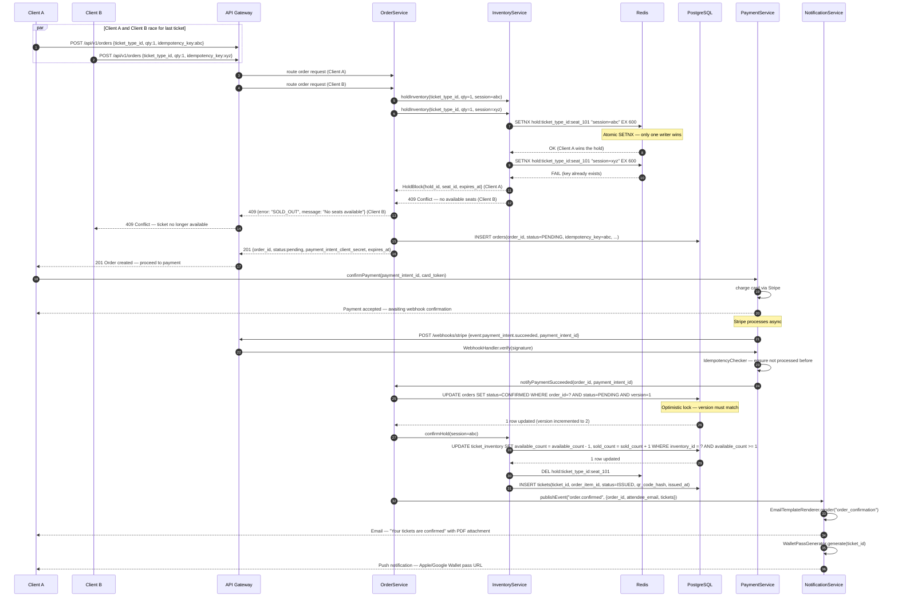
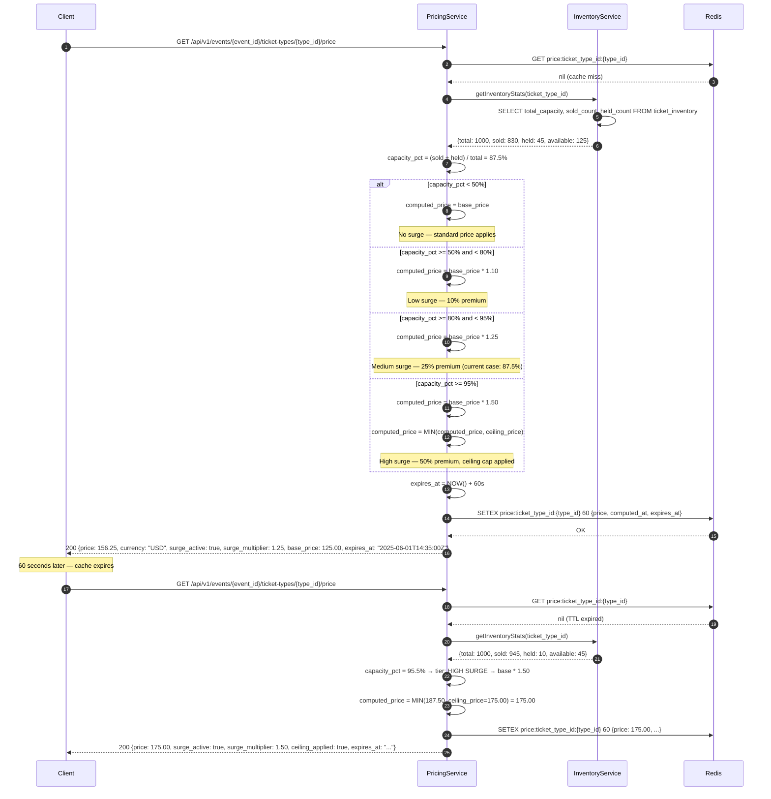
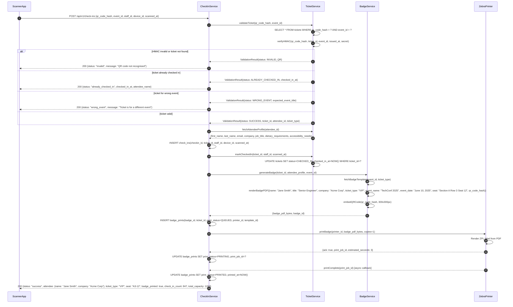
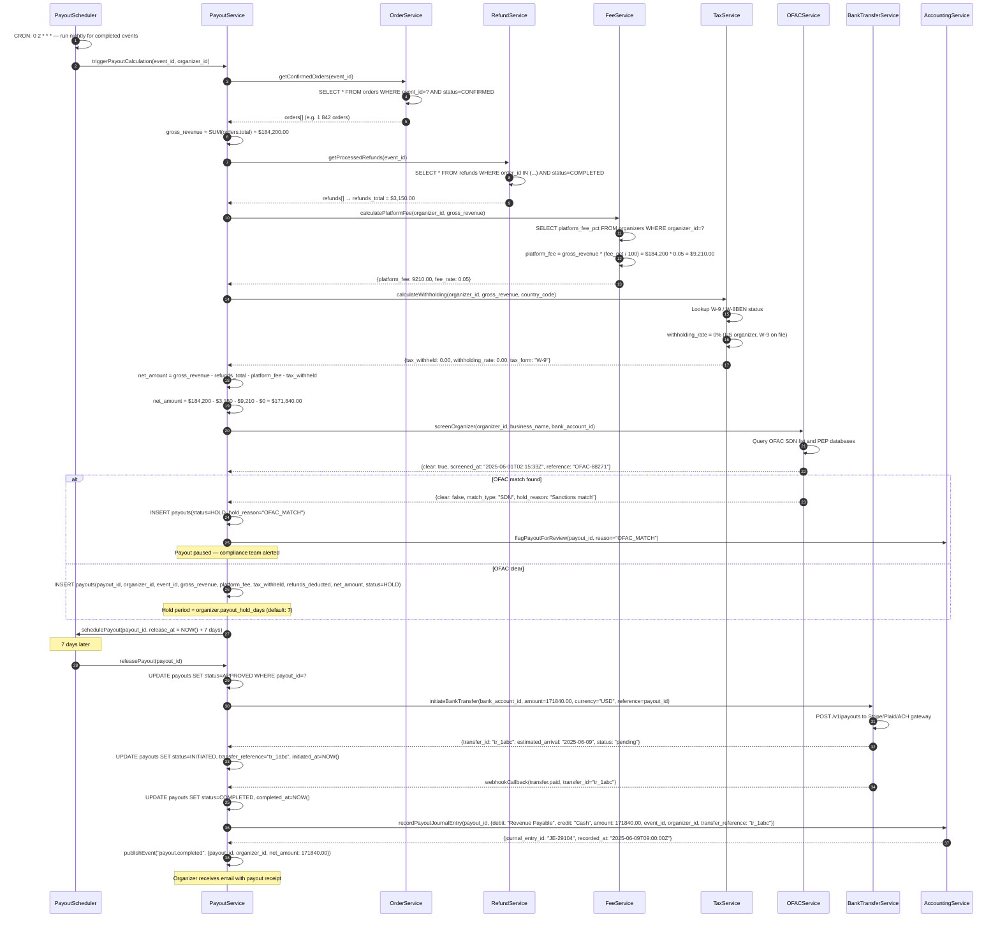

# Event Management and Ticketing Platform — Sequence Diagrams

## Overview

These sequence diagrams capture four critical flows in the platform: concurrent ticket purchasing with race-condition protection, dynamic pricing computation, badge printing at check-in, and post-event payout calculation.

---

## Sequence 1: Concurrent Ticket Purchase with Optimistic Locking

Two clients simultaneously attempt to purchase the last available ticket. Redis atomic operations (SETNX) and PostgreSQL optimistic locking together ensure exactly one purchase succeeds.

---

## Sequence 2: Dynamic Pricing Calculation

The platform supports surge pricing based on inventory utilisation. Price tiers are computed on demand and cached in Redis with a 60-second TTL to avoid hammering the database on every GET /ticket-types request.

---

## Sequence 3: Badge Printing at Check-In

Staff scan the attendee's QR code. The system validates the ticket, fetches the attendee profile, generates a personalised badge PDF, and sends it to the nearest Zebra printer.

---

## Sequence 4: Payout Calculation After Event

After an event concludes, the payout scheduler triggers a calculation job that aggregates revenue, deducts fees and refunds, screens through OFAC, and initiates a bank transfer.

---

## Cross-Cutting Concerns

| Concern | Implementation |
|---------|---------------|
| **Idempotency** | All mutation endpoints accept `Idempotency-Key` header; stored in DB to prevent duplicate processing |
| **Distributed tracing** | All services propagate `X-Trace-ID` and `X-Span-ID` headers; spans emitted to Jaeger |
| **Rate limiting** | API Gateway enforces per-IP and per-token limits; 429 returned with `Retry-After` header |
| **Circuit breaking** | PaymentService and InventoryService calls wrapped in Resilience4J circuit breakers |
| **Audit logging** | Every state transition (order, ticket, payout) appended to an append-only audit_log table |
