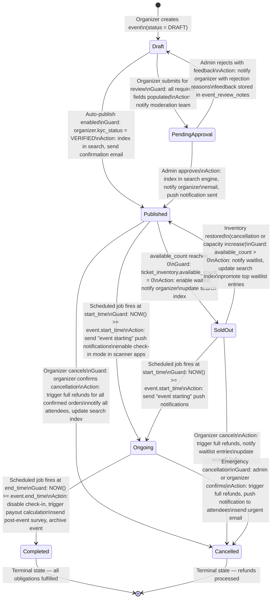
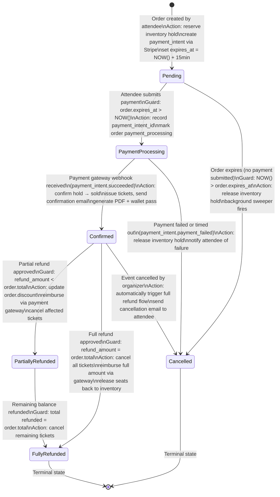
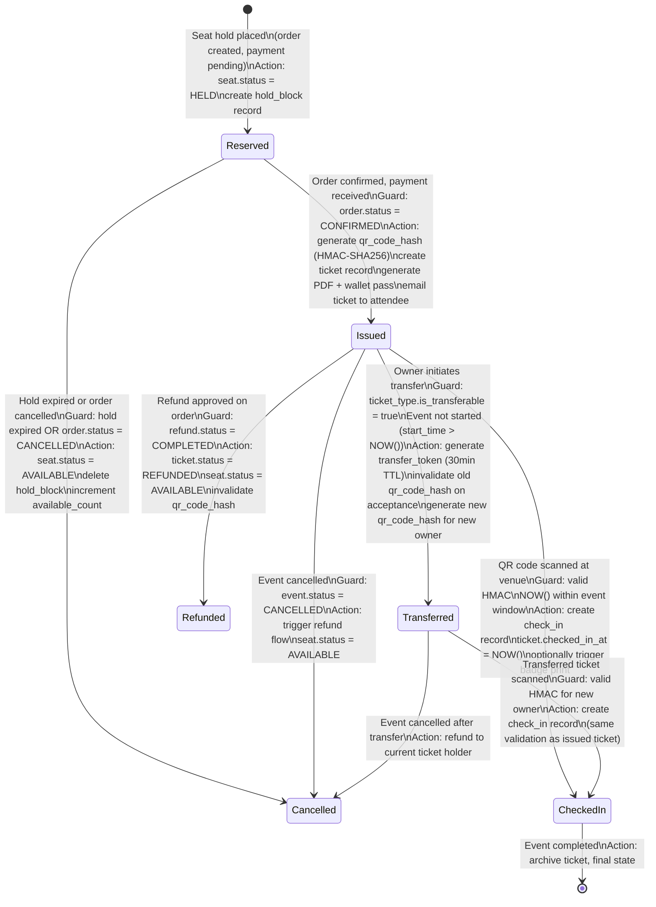
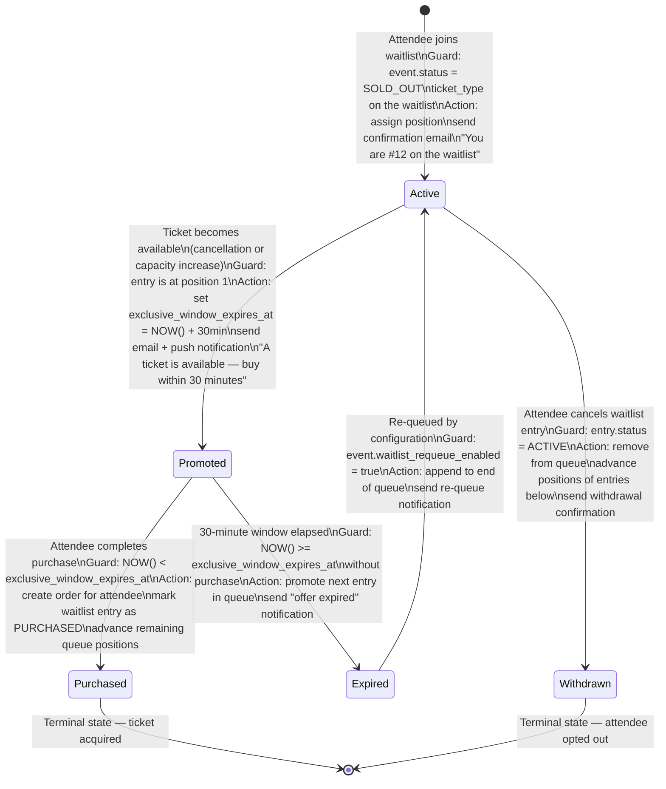

# Event Management and Ticketing Platform — State Machine Diagrams

## Overview

This document defines four state machines governing the core lifecycle entities of the platform. Each machine is implemented as a persistent state column with database-level CHECK constraints, enforced transitions in the service layer, and domain events emitted on every transition.

---

## State Machine 1: Event Lifecycle

Events progress from internal drafting through a moderation gate before becoming publicly visible. Once live, they track sell-out, runtime, and completion automatically via scheduled jobs.



### Event State Transition Rules

| From | To | Guard Condition | Side Effects |
|------|----|-----------------|--------------|
| `DRAFT` | `PENDING_APPROVAL` | All required fields set | Moderation queue entry created |
| `DRAFT` | `PUBLISHED` | KYC verified + auto-publish flag | Search indexed, tickets on sale |
| `PENDING_APPROVAL` | `PUBLISHED` | Admin approval action | Organizer notified via email |
| `PENDING_APPROVAL` | `DRAFT` | Admin rejection | Rejection reason stored |
| `PUBLISHED` | `SOLD_OUT` | `available_count = 0` | Waitlist enabled |
| `SOLD_OUT` | `PUBLISHED` | `available_count > 0` | Waitlist promoted |
| `PUBLISHED` | `ONGOING` | `NOW() >= start_time` | Check-in mode activated |
| `ONGOING` | `COMPLETED` | `NOW() >= end_time` | Payout job triggered |
| `PUBLISHED` | `CANCELLED` | Organiser + confirmation | Full refunds issued |
| `ONGOING` | `CANCELLED` | Admin emergency | Full refunds + urgent notification |

---

## State Machine 2: Order Lifecycle

Orders begin in a short-lived PENDING state while payment is collected. The `expires_at` field (default: 15 minutes) acts as a soft guard; a background sweeper cancels un-paid orders that have timed out.



### Order State Transition Rules

| From | To | Guard | Side Effects |
|------|----|-------|--------------|
| `PENDING` | `PAYMENT_PROCESSING` | `expires_at > NOW()` | `payment_intent_id` stored |
| `PENDING` | `CANCELLED` | `expires_at < NOW()` | Inventory hold released |
| `PAYMENT_PROCESSING` | `CONFIRMED` | Gateway webhook success | Tickets issued, emails sent |
| `PAYMENT_PROCESSING` | `CANCELLED` | Gateway webhook failure | Hold released, attendee notified |
| `CONFIRMED` | `PARTIALLY_REFUNDED` | Partial refund processed | Affected tickets cancelled |
| `CONFIRMED` | `FULLY_REFUNDED` | Full refund processed | All tickets cancelled, seats freed |
| `CONFIRMED` | `CANCELLED` | Event cancelled | Full refund auto-triggered |
| `PARTIALLY_REFUNDED` | `FULLY_REFUNDED` | Remaining amount refunded | All tickets cancelled |

---

## State Machine 3: Ticket Lifecycle

Each ticket follows the order that spawned it. Once issued, it can be independently transferred, checked in, or cancelled. The `qr_code_hash` is regenerated on transfer to invalidate the old code.



### Ticket State Transition Rules

| From | To | Guard | Side Effects |
|------|----|-------|--------------|
| _(new)_ | `RESERVED` | Order created | `seat.status = HELD` |
| `RESERVED` | `ISSUED` | `order.status = CONFIRMED` | QR hash generated, PDF emailed |
| `RESERVED` | `CANCELLED` | Hold expired | `available_count` incremented |
| `ISSUED` | `TRANSFERRED` | Transferable + before event | Old QR invalidated, new QR issued |
| `ISSUED` | `CHECKED_IN` | Valid HMAC + event window | `check_in` record created |
| `TRANSFERRED` | `CHECKED_IN` | Valid HMAC | `check_in` record created |
| `ISSUED` | `REFUNDED` | `refund.status = COMPLETED` | QR invalidated, seat freed |
| `ISSUED` | `CANCELLED` | Event cancelled | Auto-refund flow triggered |

---

## State Machine 4: Waitlist Entry Lifecycle

When inventory reaches zero, attendees can join the waitlist. Entries are position-ordered. When a ticket becomes available (through cancellation), the top entry is promoted and given a 30-minute exclusive purchase window.



### Waitlist State Transition Rules

| From | To | Guard | Side Effects |
|------|----|-------|--------------|
| _(new)_ | `ACTIVE` | Event sold out | Position assigned, email sent |
| `ACTIVE` | `PROMOTED` | Position 1 and ticket available | 30-min window set, notification sent |
| `PROMOTED` | `PURCHASED` | Within window | Order created at original price |
| `PROMOTED` | `EXPIRED` | Window elapsed | Next entry promoted |
| `EXPIRED` | `ACTIVE` | Re-queue enabled | Moved to end of queue |
| `ACTIVE` | `WITHDRAWN` | Attendee cancels | Queue positions shifted |

---

## Implementation Notes

### Database Enforcement
All status columns use PostgreSQL CHECK constraints:
```sql
status VARCHAR(30) NOT NULL CHECK (status IN ('DRAFT','PENDING_APPROVAL','PUBLISHED','SOLD_OUT','ONGOING','COMPLETED','CANCELLED'))
```

### Service-Layer Enforcement
Each service uses a transition validation map before executing state changes:

```python
VALID_TRANSITIONS = {
    ("DRAFT", "PENDING_APPROVAL"),
    ("DRAFT", "PUBLISHED"),
    ("PENDING_APPROVAL", "PUBLISHED"),
    ("PENDING_APPROVAL", "DRAFT"),
    ("PUBLISHED", "SOLD_OUT"),
    ("PUBLISHED", "ONGOING"),
    ("PUBLISHED", "CANCELLED"),
    ("SOLD_OUT", "PUBLISHED"),
    ("SOLD_OUT", "ONGOING"),
    ("SOLD_OUT", "CANCELLED"),
    ("ONGOING", "COMPLETED"),
    ("ONGOING", "CANCELLED"),
}

def transition(entity, new_status, actor_id):
    if (entity.status, new_status) not in VALID_TRANSITIONS:
        raise InvalidTransitionError(entity.status, new_status)
    entity.status = new_status
    audit_log.append(entity.id, actor_id, new_status)
    event_bus.publish(f"{entity.type}.{new_status.lower()}", entity)
```

### Domain Events Published on Transitions

| Transition | Domain Event |
|------------|-------------|
| Event → PUBLISHED | `event.published` |
| Event → SOLD_OUT | `event.capacity.sold_out` |
| Event → CANCELLED | `event.cancelled` |
| Order → CONFIRMED | `order.confirmed` |
| Order → CANCELLED | `order.cancelled` |
| Ticket → ISSUED | `ticket.issued` |
| Ticket → CHECKED_IN | `ticket.checked_in` |
| Ticket → TRANSFERRED | `ticket.transferred` |
| Waitlist → PROMOTED | `waitlist.promoted` |
| Payout → COMPLETED | `payout.completed` |
