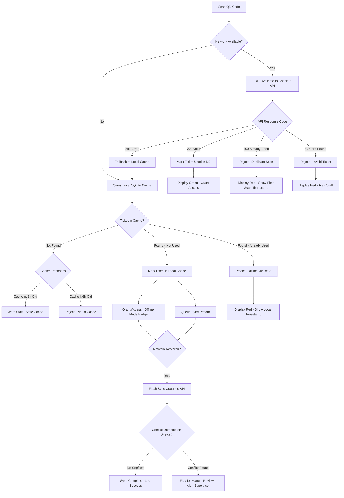

# Check-In and Access Control — Edge Cases

This document covers edge cases for the check-in and access control subsystem of the Event Management and Ticketing Platform. Each case describes a realistic failure scenario, its impact, how the system detects it, how it is mitigated at runtime, how we recover, and what long-term prevention looks like.

---

## QR Validation Flow (Including Offline Mode)

---

### EC-01: QR Code Scanner App Goes Offline at Venue Mid-Event

- **Failure Mode:** The scanner app loses internet connectivity (Wi-Fi AP overload, ISP outage, venue network failure) after check-in has started. Subsequent scans cannot reach the validation API.
- **Impact:** Check-in stalls if staff are unprepared. Fraudulent tickets may be accepted if offline fallback logic is absent. Real attendees may be wrongly denied if the device has no local data.
- **Detection:** The scanner app monitors API response latency. If three consecutive requests timeout in under 5 seconds, it transitions to offline mode and surfaces a banner ("Offline Mode Active — Using Local Cache") on the scanner UI. A heartbeat ping to the health endpoint runs every 30 seconds.
- **Mitigation:** Before the event opens, the check-in service pre-fetches the full manifest (ticket ID, hash, tier, validity window) for all tickets belonging to that event and stores it in an encrypted SQLite database on the device. In offline mode, scans are validated against this manifest. All offline accept/reject decisions are queued for reconciliation. Staff are shown an orange offline badge on the UI header.
- **Recovery:** When connectivity is restored, the app automatically flushes its sync queue. The server processes each queued scan event, detects any conflicts (e.g., a ticket accepted offline was already flagged as fraudulent online), and generates an incident report. Conflicting entries are surfaced in the organizer dashboard under "Offline Sync Conflicts."
- **Prevention:** Deploy dedicated event Wi-Fi with redundant uplinks (primary ISP + LTE failover). Require the check-in app to perform a full manifest sync at least 2 hours before event open. Alert the event coordinator if the device cache is older than 6 hours or if fewer than 90% of expected tickets are cached.

---

### EC-02: Same Ticket Scanned Twice (Deliberate Ticket Sharing After Transfer)

- **Failure Mode:** An attendee photographs or screenshots their QR code and shares it with a friend after check-in, or before using it themselves. Both individuals attempt to enter using the same QR code.
- **Impact:** One unauthorized person gains entry to a paid event. The legitimate ticket holder may be denied entry after the fraudulent scan. This undermines capacity management and creates a hostile experience.
- **Detection:** The validation API enforces idempotency on ticket scans. Each ticket record has a `scanned_at` timestamp and a `scanned_by_device_id` field. On the second scan, the API returns HTTP 409 with the original scan timestamp and device ID, which the scanner app displays to staff.
- **Mitigation:** QR codes are single-use. The ticket record is atomically updated to `used` state via a database row-level lock on first scan. The scanner displays the name of the ticket holder and the original scan time on duplicate detection, giving staff context to resolve the dispute. Ticket transfers invalidate the previous holder's QR code and generate a new one for the transferee.
- **Recovery:** Staff escalate to the event supervisor. The system provides the first-scan device ID and timestamp. If the legitimate holder presents ID matching the ticket name, they are admitted and an incident is logged. If the system was in offline mode and conflict is detected post-sync, the organizer is notified and a refund review is initiated.
- **Prevention:** Implement rotating QR codes that change every 30 seconds for high-security events (cryptographically signed with a timestamp window). This makes photographed codes useless after the window expires. Display the attendee's photo (from profile) on the scanner app after a valid scan.

---

### EC-03: Counterfeit / Forged QR Code Presented at Venue

- **Failure Mode:** A bad actor generates a QR code that visually matches the platform's format but contains a fabricated or cloned ticket ID. The forged code is presented at the venue.
- **Impact:** Unauthorized access to the event. Revenue loss for the organizer. Security risk depending on event type. Reputational damage if detected publicly.
- **Detection:** The validation API verifies a cryptographic HMAC-SHA256 signature embedded in the QR code payload. The payload encodes `ticket_id + event_id + issue_timestamp`, and the signature is computed with a per-event secret key. A QR code without a valid signature returns HTTP 403 "Invalid Signature" regardless of whether the ticket ID exists in the database.
- **Mitigation:** QR code payloads are never plaintext ticket IDs. They are JWT-structured tokens signed with RS256 using event-scoped key pairs. The scanner app validates the signature locally before making any API call, allowing immediate rejection of obviously forged codes without network round-trips. Staff receive an explicit "FORGED TICKET" alert with a distinct red animation, distinct from the "Already Used" alert.
- **Recovery:** The scanner logs the raw QR payload for forensic review. Security staff are notified at the venue. The incident is escalated to the platform's trust and safety team, who analyze whether a specific ticket ID was targeted (indicating a data breach) or random generation was attempted. If a breach is suspected, a security incident is opened.
- **Prevention:** Rotate event signing keys per event. Store private keys in AWS KMS; never expose them in application code. Conduct penetration testing on the QR generation endpoint. Enable anomaly alerts for any ticket ID that is scanned more than once within a 5-minute window across different devices.

---

### EC-04: Badge Printer Jammed with 500-Person Queue Forming

- **Failure Mode:** The thermal badge printer at the registration desk jams mid-print due to a paper jam, ribbon failure, or overheating. A physical queue forms rapidly.
- **Impact:** Attendee experience degrades significantly. Session start times may be delayed. Staff become overwhelmed. For conferences where badges are required for room access, sessions are blocked.
- **Detection:** The printer driver reports a fault code (paper jam, ribbon error, cover open) to the check-in station software. The UI transitions to a "Printer Fault" state and triggers an audible alert on the check-in device. The operations dashboard shows the printer as offline.
- **Mitigation:** The system is configured for "scan-only" fallback mode: if no badge is needed for access (ticket QR code is sufficient), the printer is optional. For events requiring physical badges, the check-in app supports a "badge-less mode" that issues a digital badge (Apple Wallet / Google Wallet pass) to the attendee's registered email or phone immediately at scan. Pre-printed blank badges with write-on name labels are kept as a physical backup at every registration desk.
- **Recovery:** Staff clear the jam, reload paper or replace ribbon, and resume. Any badges that were mid-print are reprinted. The queue is managed by opening additional check-in lanes that use scan-only mode. The organizer is alerted via the operations dashboard with an ETA for printer restoration.
- **Prevention:** Run a printer self-test (full-roll print cycle) 1 hour before doors open as part of the pre-event checklist. Maintain at least one spare printer on-site. Configure low-paper and low-ribbon alerts at 20% remaining capacity. Use enterprise-grade thermal printers rated for high-volume events.

---

### EC-05: Check-In Service Overloaded at Event Open (5,000 Attendees in First 10 Minutes)

- **Failure Mode:** All 5,000 attendees arrive within the first 10 minutes of doors opening, causing a thundering herd. The check-in validation API is overwhelmed, response times spike above 10 seconds, and scanner apps start timing out.
- **Impact:** Massive queue at entry. Attendees miss opening sessions. Staff frustration. Potential crowd safety issues at entry points.
- **Detection:** The check-in API exposes a `/health` endpoint that reports p99 latency and current request rate. An alarm fires in CloudWatch when p99 latency exceeds 2 seconds for 3 consecutive 1-minute periods, or when error rate exceeds 1%.
- **Mitigation:** The check-in service auto-scales horizontally behind an ALB with a target of 500ms p99 latency. Scale-out policies are pre-warmed 30 minutes before event open based on expected attendance. For large events, scanner apps are configured with a 3-second timeout and automatically fall back to offline mode, eliminating API load while maintaining check-in continuity.
- **Recovery:** Auto-scaling typically resolves the overload within 2-3 minutes. If not, the on-call engineer can manually trigger a scale-out event. Scanner apps in offline mode continue processing without interruption. After the initial surge passes, apps reconnect and sync queued scan records.
- **Prevention:** Load test the check-in API to at least 2x the expected peak RPM at least 48 hours before large events. Pre-provision EC2 capacity reservations for events over 2,000 attendees. Implement a read-through cache (Redis) for ticket lookups so the database is not hit on every scan during the peak window.

---

### EC-06: Attendee Attempts Check-In at Wrong Event (Same Venue, Different Event)

- **Failure Mode:** Two events run concurrently at the same venue (e.g., a multi-event conference center). An attendee with a valid ticket for Event A presents it at the Event B entry point.
- **Impact:** The attendee is confused and delayed. If not caught, an unauthorized attendee enters Event B, potentially displacing a paying customer. Capacity counts for Event B are skewed.
- **Detection:** The validation API includes `event_id` in the QR payload. When a ticket for Event A is scanned at an Event B scanner (configured with Event B's `event_id`), the API returns HTTP 422 "Wrong Event" with the correct event name and hall number.
- **Mitigation:** Scanner devices are configured with a specific `event_id` at the start of an event. The scanner UI displays the event name and venue zone prominently at the top of the screen so staff can visually confirm they are at the correct station. The scanner plays a distinct two-tone audio alert (different from the single-tone "already used" alert) when a wrong-event ticket is scanned.
- **Recovery:** Staff direct the attendee to the correct entry point. The scanner app provides the event name and hall/room number from the API error response so staff can give specific directions. The wrong-event scan is logged for analytics (useful for venue signage improvements).
- **Prevention:** Use color-coded wristbands or badges per event. Ensure venue signage clearly differentiates events. Send attendees a push notification 30 minutes before doors open with their entry gate number.

---

### EC-07: Transferred Ticket Used by Both Original and New Owner

- **Failure Mode:** A ticket is transferred to a new owner. The original owner retains the old QR code. Both attempt entry — one succeeds, one is denied, but it is unclear to staff which person is legitimate.
- **Impact:** One person is wrongly denied entry. Staff dispute resolution is time-consuming. Attendee experience is severely degraded.
- **Detection:** On ticket transfer, the platform immediately invalidates the original QR code by rotating the token (new HMAC signature computed with a new nonce). The old QR code, when scanned, returns HTTP 410 "Ticket Transferred" with the transfer timestamp, not a generic "invalid" error.
- **Mitigation:** The transfer confirmation email to the new owner contains the new QR code. The original owner's account shows the ticket as "Transferred" with a notice that the old QR code is void. Transfers trigger a push notification to both parties. The scanner UI shows "TRANSFERRED — New Owner" on HTTP 410 responses, allowing staff to ask for the new owner's code.
- **Recovery:** The new owner presents their QR code (from the transfer confirmation email or their account). If the new owner cannot produce their code, staff can perform a name-based lookup on the check-in device using the "Manual Check-In" flow, which requires the new owner's registered name and email.
- **Prevention:** When an attendee opens their ticket in the app after it has been transferred, display a prominent "This ticket has been transferred — your QR code is no longer valid" message. Send an SMS to the original owner's phone number on transfer to ensure they are aware even if they do not use the app.

---

### EC-08: Check-In Staff Device Battery Dies Mid-Event

- **Failure Mode:** A staff member's tablet or phone used for scanning runs out of battery mid-event. The device powers off, and no spare device or charger is immediately available.
- **Impact:** One check-in lane goes offline. Queue at that lane builds up. If the device was in offline mode, unsynced scan records are at risk of being lost.
- **Detection:** The scanner app monitors battery level and displays a warning when battery falls below 20% and a critical alert below 10%. If a device disconnects from the operations dashboard (heartbeat stops), the organizer is alerted.
- **Mitigation:** The scanner app writes each offline scan record to persistent local storage (SQLite on disk) immediately on scan — not held in memory. Even if the device powers off abruptly, records are not lost when the device is powered back on. Staff are instructed to plug in at the 20% warning.
- **Recovery:** When the device is plugged in and powered back on, the app resumes from its last known state. The local scan queue is preserved and synced to the server when connectivity is reestablished. Staff at adjacent lanes absorb the queue until the device recovers.
- **Prevention:** Require all check-in devices to start the event at 100% battery. Maintain a supply of portable battery packs (20,000mAh minimum) and USB charging cables at the organizer desk. The pre-event checklist includes a device battery verification step. For events over 4 hours, require powered check-in stations (table with power strips).
