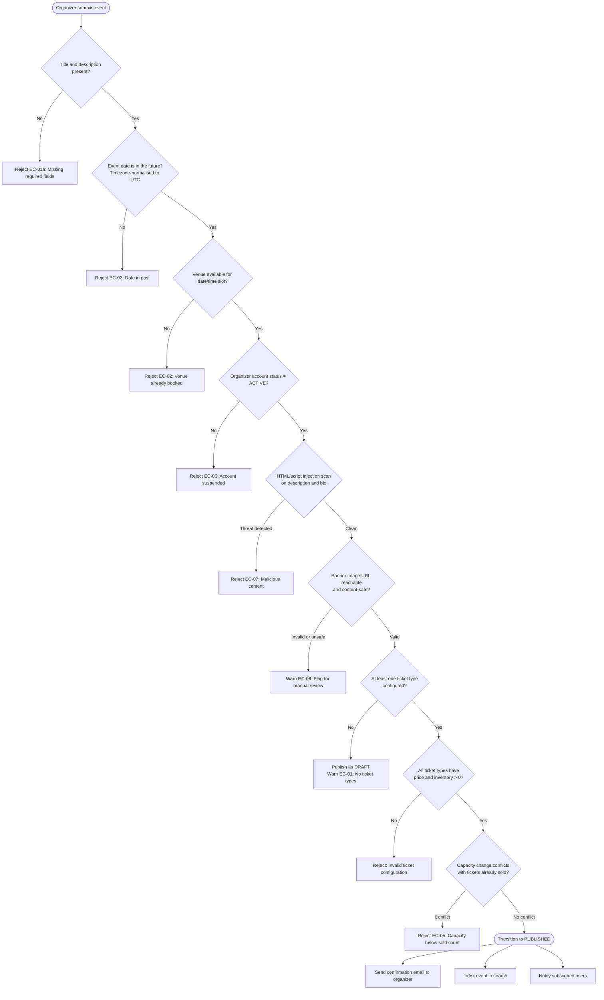

# Edge Cases — Event Creation and Publishing

**Domain:** Event lifecycle management — from draft through published, cancelled, and archived states.  
**Owner:** Platform Engineering  
**Last reviewed:** 2024-05-10

---

## Event Publication Validation Flow

The following flowchart shows every validation gate an event must pass before it
transitions from `DRAFT` to `PUBLISHED`. Each rejection path maps to the edge case
identifier documented below.

---

## Edge Cases

---

### EC-01: Event Published With No Ticket Types Configured

- **Failure Mode:** An organizer completes the event metadata form and publishes without creating any ticket type. The event appears live on the discovery page. Attendees can view the event detail page but find no way to purchase. The "Get Tickets" button either renders a blank state or an unhandled 404 from the ticket listings endpoint.
- **Impact:** Direct conversion loss. Attendees leave the page and may not return. Organizer receives no revenue. Support volume increases as confused attendees file tickets. High reputational risk if the event surfaces in curated newsletters before the organizer notices.
- **Detection:** `GET /events/{id}/tickets` returns an empty array. A post-publish webhook listener checks ticket count and fires a `platform.event.no_tickets_warning` event within 60 seconds of publication. Datadog monitor alerts if `event.tickets.count_at_publish = 0` for any newly published event.
- **Mitigation:** The publication flow blocks a final-state `PUBLISHED` transition and instead persists the event in a `DRAFT_COMPLETE` state with a prominent warning banner in the organizer dashboard. The API rejects `status=PUBLISHED` if `ticket_types.count = 0`, returning HTTP 422 with error code `EVENT_NO_TICKET_TYPES`.
- **Recovery:** Organizer is emailed immediately with a deep-link to the ticket configuration screen. If the event has already been indexed and surfaced to users, the discovery card shows "Tickets coming soon" until a ticket type is added. No manual intervention required; the state machine auto-transitions to `PUBLISHED` when the first ticket type is saved.
- **Prevention:** Add a multi-step publish wizard that enforces ticket type creation as a required step before the publish button becomes active. Add E2E test `EC-01` covering the direct API bypass path (calling `PATCH /events/{id}` with `status=PUBLISHED` and no ticket types).

---

### EC-02: Venue Double-Booked by Two Different Organizers

- **Failure Mode:** Two organizers independently submit events at the same venue for an overlapping date-time window. Both requests pass the initial validation check (each reads the venue as available before either commits) and both events are published. The venue receives conflicting bookings.
- **Impact:** Legal and operational exposure for the platform. One or both organizers may hold binding contracts with the venue. Mass cancellations damage organizer trust. Potential litigation.
- **Detection:** A unique constraint on `venue_reservations(venue_id, date, start_time, end_time)` causes one of the two concurrent inserts to fail with a constraint violation. The API catches this and returns HTTP 409. Post-hoc: daily audit query comparing all `PUBLISHED` events against venue reservation records flags any orphaned events without a reservation.
- **Mitigation:** Venue availability check and reservation insert execute within a single serializable database transaction. The reservation row is inserted with `SELECT ... FOR UPDATE` on the venue record to prevent concurrent interleaving. Additionally, venue availability is re-validated inside the transaction immediately before the event status transitions to `PUBLISHED`.
- **Recovery:** The organizer whose transaction loses the race receives an HTTP 409 with `VENUE_CONFLICT` error and a redirect to the venue-selection step. Their event remains in `DRAFT`. The winning organizer's event publishes normally. No manual intervention required for the technical conflict. If both organizers have external venue contracts, the support team follows the venue conflict escalation playbook in Notion.
- **Prevention:** Build a venue management module that tracks reservation state independently of event state. Consider requiring venue confirmation (either self-service via venue portal or manual approval) before a reservation is committed, eliminating the race entirely.

---

### EC-03: Event Date Submitted in the Past Due to Timezone Mismatch

- **Failure Mode:** An organizer in UTC+5:30 (IST) enters an event time of `2024-12-01 01:00` intending midnight local time. The frontend sends the value without timezone information. The backend interprets it as UTC, which is 5h30m earlier than intended — potentially placing the event in the past, or on the wrong day.
- **Impact:** The event either fails validation (if the UTC-interpreted time is in the past) confusing the organizer, or it publishes with the wrong date, causing attendees to show up at the wrong time. For events near midnight, the date itself can shift by a full day.
- **Detection:** Validation rejects events where the UTC-normalised start time is more than 5 minutes in the past. Frontend integration tests assert that timezone-aware ISO 8601 strings (e.g., `2024-12-01T01:00:00+05:30`) are always submitted.
- **Mitigation:** The frontend always appends the browser's IANA timezone to the submitted datetime. The API requires an ISO 8601 datetime with a UTC offset or timezone name; bare datetime strings without offset are rejected with HTTP 400 `DATETIME_MISSING_TIMEZONE`. All datetime values are stored as `TIMESTAMPTZ` in PostgreSQL and displayed to each viewer in their local timezone.
- **Recovery:** If a past-date event slips through (e.g., via a direct API call), the post-publish validation job catches it within 60 seconds, moves the event back to `DRAFT`, and emails the organizer with the specific date discrepancy highlighted. The organizer can correct and re-publish with no data loss.
- **Prevention:** Adopt a contract-first API schema (OpenAPI) that marks all datetime fields as `format: date-time` (RFC 3339). Add a CI lint step that fails if any date field in the schema accepts bare dates. Unit tests cover UTC−12 and UTC+14 (widest timezone spread) for all date validation paths.

---

### EC-04: Event Cancellation With 10,000 Existing Ticketholders

- **Failure Mode:** An organizer cancels a large event. The system must process up to 10,000 individual refunds, send 10,000 cancellation emails, and release all reserved seats — all while the platform continues to serve other traffic. Naive synchronous processing blocks the cancellation API handler for minutes and times out. Partial failures leave some attendees refunded and others not, with no clear state.
- **Impact:** Refund SLA breach. Attendee support volume spikes. If refunds are partial, there is a regulatory and trust risk. The platform's payment processor (Stripe) rate-limits bulk refund calls if not throttled.
- **Detection:** Monitoring on `refund.batch.progress` gauge tracks completion percentage. An alert fires if a batch older than 30 minutes has < 100 % completion. The organizer dashboard shows a live cancellation progress bar backed by the same metric.
- **Mitigation:** Event cancellation enqueues a `CancelEventJob` in the background job queue (Sidekiq / BullMQ). The job fans out individual `RefundTicketJob` workers at a rate-limited 50 per second to stay within Stripe's API limits. Each worker is idempotent: it checks `refund_status` before calling Stripe, so retries are safe. Emails are sent after each individual refund succeeds, not in a single bulk blast.
- **Recovery:** If the batch job fails partway, the Sidekiq dead-letter queue retains all unprocessed jobs. The on-call engineer runs `rake events:retry_cancellation_batch[event_id]` to re-enqueue only the unfailed tickets. Attendees who have already been refunded are skipped (idempotency check). Progress is visible in the ops dashboard.
- **Prevention:** Load test the cancellation pipeline to 10,000 refunds in staging before each major release. Establish a contractual SLA of 72 hours for full refund processing on large-event cancellations, disclosed in the Terms of Service, to provide buffer for processor-side delays.

---

### EC-05: Event Capacity Reduced Below the Number of Tickets Already Sold

- **Failure Mode:** An organizer edits an event and reduces the capacity — for example, from 500 to 300 seats — after 400 tickets have already been sold. The new capacity is lower than the committed inventory, creating a logical impossibility: 100 ticket holders have valid tickets to an event with no seat for them.
- **Impact:** Operational crisis on event day. Oversold events generate chargebacks, negative press, and in some jurisdictions trigger consumer protection penalties.
- **Detection:** The capacity update API calculates `tickets_sold` at the time of the update request and compares it against the requested new capacity. If `new_capacity < tickets_sold`, the update is rejected.
- **Mitigation:** `PATCH /events/{id}` validates `new_capacity >= current_sold_count` before persisting the change. The check runs inside a transaction with a row-level lock on the event record to prevent a race where tickets sell between the check and the update. The API returns HTTP 422 `CAPACITY_BELOW_SOLD_COUNT` with the current sold count in the response body.
- **Recovery:** If the constraint is bypassed (e.g., a direct DB update by an engineer), a reconciliation job detects the discrepancy within 5 minutes and pages the on-call engineer. The event is moved to `CAPACITY_LOCKED` state (no new sales, no further edits) pending manual resolution. Affected organizer is contacted via account team.
- **Prevention:** Add a database-level check constraint: `capacity >= 0`. Add an application-level invariant test in CI that asserts `events.capacity >= COUNT(tickets WHERE status IN ('sold','reserved'))` across all test fixture states.

---

### EC-06: Organizer Account Suspended After Event Published With Active Ticket Sales

- **Failure Mode:** An organizer is suspended (for fraud, ToS violation, or chargebacks) after their event is already published and tickets are actively selling. The suspension must not punish attendees who have already purchased.
- **Impact:** Without handling, attendees continue purchasing tickets to an event whose organizer can no longer receive payout, increasing financial exposure. Existing ticket holders may be stranded if the event is abruptly delisted.
- **Detection:** The account suspension webhook triggers an `organizer.suspended` event consumed by the event management service. A scheduled job also cross-checks organizer status against all `PUBLISHED` events every 15 minutes.
- **Mitigation:** On receiving `organizer.suspended`: (1) immediately halt new ticket sales on all events owned by the organizer (events move to `SALES_PAUSED`); (2) place all future payouts in escrow pending Trust & Safety review; (3) do **not** cancel existing orders — attendees retain valid tickets until T&S determines event viability.
- **Recovery:** Trust & Safety triages within 24 hours. If the event is deemed viable (e.g., the organizer's content team can proceed), sales are re-enabled under a new account. If the event is cancelled, the bulk-refund pipeline (EC-04) is triggered. Attendees receive status emails at each state transition.
- **Prevention:** Implement a graduated trust system where new organizers are limited to lower-risk event configurations (smaller capacity, longer payout hold) until they establish a track record.

---

### EC-07: Event Description Contains Malicious HTML or Script Injection

- **Failure Mode:** An organizer submits an event description containing a `<script>` tag, an `onerror` attribute on an ``, or a `javascript:` href. If rendered unescaped, this executes arbitrary JavaScript in attendees' browsers (stored XSS), enabling session token theft, phishing redirects, or cryptomining.
- **Impact:** Stored XSS is a P0 security vulnerability. It compromises attendee accounts, violates GDPR (data exfiltration), and triggers regulatory notification obligations. Reputational damage is severe.
- **Detection:** Input is scanned on write by DOMPurify (server-side, via jsdom) and by a custom allowlist sanitizer. Any tag or attribute outside the allowlist is stripped and the rejection is logged to the `security.xss_attempt` stream in Datadog. A weekly penetration test covers this input vector.
- **Mitigation:** The description field accepts a strict Markdown subset. The backend renders Markdown to HTML using a sandboxed renderer that applies DOMPurify with `ALLOWED_TAGS` restricted to `['p','ul','ol','li','b','i','a','br','h3','h4']` and `ALLOWED_ATTR` restricted to `['href']` with a URL scheme allowlist of `https:` only. Raw HTML in description input is always rejected.
- **Recovery:** If a malicious payload is discovered post-publication, the event is immediately moved to `UNDER_REVIEW` (hidden from public), the organizer account is flagged for Trust & Safety review, and a security incident is opened. Affected sessions (if any XSS execution occurred) are invalidated.
- **Prevention:** Add a `Content-Security-Policy: default-src 'self'` header and a `script-src 'none'` directive on event detail pages to prevent inline script execution even if sanitisation has a gap. Add automated XSS fuzzing with Burp Suite to the nightly CI security scan.

---

### EC-08: Banner Image URL Points to NSFW or Illegal Content

- **Failure Mode:** An organizer provides a banner image URL that resolves to inappropriate, illegal, or copyrighted content hosted on a third-party server. The image renders on the event detail page and in social sharing previews. The remote URL may also change after passing initial validation.
- **Impact:** Platform serves CSAM or NSFW imagery to users, triggering legal liability, app store violations, and severe reputational damage. If the URL changes post-validation, previously clean events become harmful without any new organizer action.
- **Detection:** On submission, the image URL is fetched server-side and passed to the Google Cloud Vision SafeSearch API. Events with `LIKELY` or `VERY_LIKELY` scores on adult, violent, or racy categories are quarantined. A periodic re-scan job re-checks all active event images every 24 hours.
- **Mitigation:** All banner images are downloaded and re-hosted on the platform's own CDN (Cloudflare R2) at publish time. The stored event record references the CDN URL, not the original organizer URL. This eliminates the mutable-URL attack vector entirely. The original URL is stored in an audit field only.
- **Recovery:** If a re-scan detects a newly harmful image on an existing CDN copy (e.g., an adversarial image that passed initial detection), the event is moved to `UNDER_REVIEW`, the CDN asset is purged, and the organizer is notified to upload a replacement.
- **Prevention:** Require direct image uploads (not URLs) in the organizer UI, making re-hosting the only path. This eliminates the SSRF vector that open URL fetching introduces. Maintain an image hash blocklist fed by Trust & Safety reports.
