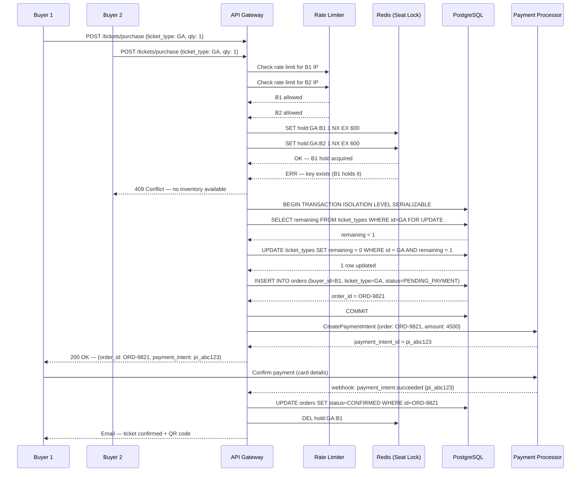

# Edge Cases — Ticket Sales and Allocation

**Domain:** Ticket inventory management, purchase flow, seat allocation, and pricing.  
**Owner:** Commerce Engineering  
**Last reviewed:** 2024-05-10

---

## Concurrent Purchase Race Condition — Sequence Diagram

The following diagram shows the complete lifecycle of two buyers attempting to purchase
the last available ticket simultaneously, and how the distributed lock + serializable
transaction pattern resolves the conflict.

---

## Edge Cases

---

### EC-01: Race Condition — Two Buyers Purchase Last Ticket Simultaneously

- **Failure Mode:** Two buyers submit purchase requests for the last available ticket within milliseconds of each other. Both requests read the inventory count as 1, both pass the availability check, and both attempt to decrement inventory and create an order. Without synchronisation, both succeed, resulting in inventory going to -1 and two valid orders for one ticket. On event day, one attendee is turned away at the gate.
- **Impact:** Oversold inventory is a P0 issue. The platform faces a chargeback from the turned-away attendee, potential legal action if the event was sold-out, and severe trust damage. Duplicate QR codes allow gate fraud.
- **Detection:** A post-purchase invariant check runs every 60 seconds: `SELECT ticket_type_id FROM ticket_types WHERE remaining < 0`. Any negative value pages the on-call engineer immediately. Stripe duplicate-charge detection also flags two near-simultaneous charges for the same ticket type at the same amount.
- **Mitigation:** A two-layer synchronisation approach: (1) Redis `SET NX EX` distributed lock is acquired per ticket type before entering the purchase flow. Only one buyer at a time proceeds for a given ticket type; others are queued or rejected with retry-after. (2) Inside the purchase transaction, `UPDATE ticket_types SET remaining = remaining - 1 WHERE id = ? AND remaining > 0` uses an optimistic row-level check. If `rowsAffected = 0`, the transaction rolls back and the buyer receives a 409. The `SERIALIZABLE` isolation level prevents phantom reads.
- **Recovery:** If a duplicate order is detected post-hoc, the second order (by `created_at`) is cancelled and fully refunded automatically. The first order holder retains their ticket. Both buyers are emailed; the refunded buyer is offered priority access to any released inventory or waitlist position.
- **Prevention:** Introduce a formal inventory ledger pattern: every ticket purchase is a debit entry in an `inventory_transactions` table. The current available count is always derived as `initial_count - SUM(debits)`, making oversell mathematically impossible without a duplicate insert. Apply a `CHECK (remaining >= 0)` database constraint as a hard backstop.

---

### EC-02: Presale Access Code Brute-Forced by Automated Bot

- **Failure Mode:** A presale event requires a 6-character alphanumeric access code. A bot operator writes a script that systematically tries all combinations (or a targeted wordlist) against the `POST /tickets/presale/validate` endpoint, eventually finding valid codes and purchasing tickets before legitimate holders can.
- **Impact:** Legitimate attendees with valid presale codes are unable to purchase. Organizer trust is damaged. If the attacker purchases and resells, it constitutes ticket touting, which is illegal in several jurisdictions.
- **Detection:** Rate limit monitoring alerts when a single IP or user session exceeds 5 code validation attempts in 60 seconds. A Datadog anomaly detector flags unusually high presale validation request volume (>10× baseline). Distributed bot patterns (many IPs, low per-IP rate) are detected by the WAF's bot management rules (Cloudflare Bot Management score < 30).
- **Mitigation:** Code validation endpoint is rate-limited to 5 attempts per session per minute and 20 per IP per hour, with exponential backoff enforced server-side. Codes are single-use: once validated, the code is locked to the session token and cannot be used by a second session. Codes are 12 characters minimum (62^12 ≈ 3.2 × 10^21 combinations). CAPTCHA challenge is triggered after 3 failed attempts from a session.
- **Recovery:** If brute-force is detected in progress, the presale code namespace for that event is rotated: existing valid codes remain valid (loaded into a new Redis set), and new codes are issued to legitimate holders via email. The attacking IP ranges are blocked at the CDN layer.
- **Prevention:** Move to a signed presale invite model: instead of a shared code, each invited attendee receives a unique signed JWT link (`/presale?token=<JWT>`) containing their email and the event ID. Validation checks the JWT signature; brute-force is computationally infeasible. Tokens are single-use, time-limited, and tied to the invite email.

---

### EC-03: Promo Code Applied After Order Already Confirmed (Timing Attack)

- **Failure Mode:** A buyer completes checkout and the order reaches `CONFIRMED` status. The buyer then finds a valid promo code and calls the promo code application endpoint (`POST /orders/{id}/apply_promo`) after the fact, expecting a partial refund. The system applies the discount to the already-confirmed order and issues a refund — but the promo code was intended only for new purchases.
- **Impact:** Revenue leakage. If the promo code has a high redemption cap, repeated exploitation drains the promotional budget. For organizer-funded promos, the organizer bears the cost of fraudulent applications.
- **Detection:** `order.promo_applied_post_confirmation` event is emitted whenever a promo is applied to a confirmed order. A daily report aggregates these events and sends them to the Finance team. Stripe refund volume anomaly alerts catch spikes.
- **Mitigation:** The promo code application endpoint validates that `order.status = PENDING_PAYMENT` before applying. Any attempt to apply a promo to an order in `CONFIRMED`, `FULFILLED`, or any terminal state returns HTTP 422 `PROMO_ORDER_ALREADY_CONFIRMED`. Promo codes are validated and locked to a session at cart creation time — the discount is priced in before the payment intent is created, so there is no post-confirmation adjustment path.
- **Recovery:** If a promo is applied post-confirmation through a bug, the Finance team is notified via the daily anomaly report. The refund is evaluated against the promo terms; if fraudulent, the buyer's account is flagged and the refund is disputed through the payment processor.
- **Prevention:** Remove the post-confirmation promo endpoint entirely. Promos must be applied during the cart/checkout session before payment intent creation. If a legitimate late-promo scenario exists (e.g., a customer service adjustment), route it through a separate admin-gated manual credit flow with audit logging.

---

### EC-04: Inventory Count Drift Between Redis and PostgreSQL After Redis Failover

- **Failure Mode:** Redis stores the in-memory seat hold and available-inventory counters for performance. During a Redis primary failure, the system fails over to a replica. In-flight seat holds (set via `SET NX EX`) that were written to the primary but not yet replicated are lost. The replica's count shows more available seats than PostgreSQL reflects, causing the system to oversell.
- **Impact:** Oversold inventory (same downstream impact as EC-01 but harder to detect because the discrepancy is subtle and gradual). P0 for high-sale-volume events.
- **Detection:** A reconciliation job runs every 2 minutes comparing `SUM(Redis available:{ticket_type_id})` against `PostgreSQL ticket_types.remaining`. Any discrepancy > 0 triggers an alert. Post-failover, the reconciliation job is triggered immediately by the Redis failover event hook.
- **Mitigation:** Redis is treated as a cache and performance accelerator, not the authoritative inventory source. PostgreSQL is authoritative. Every purchase path validates inventory via the DB-level optimistic lock (`UPDATE ... WHERE remaining > 0`) regardless of what Redis reports. Redis counts are refreshed from PostgreSQL on any discrepancy detected. Redis is configured with `WAIT 1 0` (wait for at least 1 replica acknowledgement) on all inventory write operations to reduce replication lag risk.
- **Recovery:** After a Redis failover is detected, the reconciliation job runs immediately and resets all Redis inventory counters from the PostgreSQL source of truth. Seat holds that were in-flight at the time of the failover are treated as expired; affected buyers receive a notification to retry their purchase. No oversold orders are issued because the DB-level check catches any discrepancy at the transaction level.
- **Prevention:** Migrate to a Redis Cluster setup with synchronous replication for inventory keys using `WAIT` semantics. Alternatively, adopt a pure database-driven inventory model (removing Redis from the critical purchase path) and use Redis only for non-authoritative session data. Conduct a quarterly chaos experiment (`redis-pod-delete` LitmusChaos) to validate the reconciliation path end-to-end.

---

### EC-05: Group Ticket Purchase — Partial Payment Failure

- **Failure Mode:** A buyer selects 10 tickets for a group purchase. The payment processor creates a single payment intent for the full amount. Payment succeeds for the authorization step, but the capture fails (e.g., insufficient funds after an auth hold, card network timeout). The system has reserved 10 seats and decremented inventory by 10, but no revenue was collected. Alternatively, a multi-item cart partially fails: 8 of 10 items charge but 2 fail due to SCA challenges.
- **Impact:** Inventory held for a failed group order blocks legitimate buyers. If the partial-capture scenario occurs, the platform may collect partial revenue without delivering all tickets, triggering disputes.
- **Detection:** Payment webhook `payment_intent.payment_failed` or `charge.failed` received after inventory was reserved. Order stuck in `PENDING_PAYMENT` with a past-due TTL (>15 min). Monitoring alert on `order.stale_pending_payment.count`.
- **Mitigation:** Group purchases use a single atomic payment intent for the full group amount — no partial captures. If the payment fails, the entire order is cancelled atomically and all inventory is released in a single transaction. The seat hold TTL is set to 15 minutes; after expiry, a cleanup job releases inventory regardless of payment status. For SCA multi-step flows, the entire checkout session is held for the same 15-minute window.
- **Recovery:** On `payment_intent.payment_failed`, the order transitions to `PAYMENT_FAILED`, all held inventory is released, and the buyer receives an email with a retry link that pre-populates their cart. The retry link is valid for 30 minutes. If the buyer does not retry, the seats return to general availability.
- **Prevention:** Pre-validate card eligibility for large group purchases before reserving inventory (e.g., run a £0 authorisation check or use Stripe's payment method capabilities API to confirm the card supports the transaction amount). Surface group purchase limits clearly in the UI (e.g., max 10 tickets per transaction) to reduce the frequency of large partial-failure scenarios.

---

### EC-06: Seat Map Render Fails During Peak Sale Window

- **Failure Mode:** A high-demand event with a reserved-seat map (e.g., a stadium concert) goes on sale. Thousands of users simultaneously request the interactive seat map SVG, which is generated server-side from a dynamic seat availability overlay. The seat map rendering service is CPU-bound and becomes overloaded, returning timeouts or 500 errors. Users cannot select seats and abandon purchase.
- **Impact:** Revenue loss directly proportional to the duration of the outage. For a major event, peak-demand windows last 3–5 minutes; an outage during this window can result in hundreds of thousands of dollars in lost sales. Organizer SLA breach.
- **Detection:** `seat_map.render.error_rate` > 1 % for 2 consecutive minutes triggers a P1 alert. Latency p99 > 5 seconds triggers a P2 alert (leading indicator). Real user monitoring (RUM) tracks seat-map load success rate from the browser.
- **Mitigation:** Seat map SVGs are pre-rendered at event publication time and stored as static assets on the CDN. Dynamic availability overlays (which seats are taken) are applied client-side via a lightweight JSON availability feed (`GET /events/{id}/seat_availability`) rather than server-side rendering. The availability feed is cached in Redis with a 5-second TTL and served under a separate low-latency endpoint. The seat map SVG itself never changes shape mid-sale — only the availability overlay does.
- **Recovery:** If the rendering service degrades, the CDN serves the last valid pre-rendered SVG. Availability updates fall back to a polling interval of 30 seconds (from the normal 5 seconds), which may show stale availability but keeps the purchase flow functional. An auto-scaling rule adds rendering service pods when CPU > 70 % for 60 seconds.
- **Prevention:** Load test the seat map endpoint to 10,000 concurrent requests in staging before every major on-sale event. For events expected to have >50,000 concurrent users at on-sale, manually pre-warm the CDN edge cache across all PoPs 30 minutes before the sale opens.

---

### EC-07: Price Change During Active Checkout Session (Seat Held at Old Price)

- **Failure Mode:** An organiser updates a ticket price (e.g., from early-bird to standard pricing) while a buyer has the ticket held in an active checkout session priced at the old rate. The buyer completes payment using the old price. The payment intent was created with the old amount, so Stripe charges the old price — but the organiser expects the new price.
- **Impact:** Revenue shortfall for the organiser. If the price increased, the platform may be contractually obligated to absorb the difference or refund/re-charge the buyer. If the price decreased, the buyer overpaid.
- **Detection:** At payment intent confirmation, the API re-validates the payment intent amount against the current ticket price. If `payment_intent.amount != current_price * qty`, the confirmation is flagged. Post-sale reconciliation job compares order amounts against ticket_type prices at the `order.confirmed_at` timestamp.
- **Mitigation:** The seat hold record stores the price at the time of hold. The payment intent is created using this locked price. Price changes by the organiser apply only to new sessions; active holds are honoured at the held price for up to the hold TTL (15 minutes). The organiser dashboard shows a warning: "There are X active checkout sessions at the old price. Price change will apply to new sessions after current holds expire." The API enforces this by locking `ticket_types.price` in the session reservation row.
- **Recovery:** If a discrepancy is detected post-payment, the Finance team reviews: (1) if the buyer underpaid due to a price increase, the platform absorbs the delta as a cost of the hold policy; (2) if the buyer overpaid due to a price decrease, an automatic partial refund is issued for the difference. Both cases are logged to the `pricing_discrepancy` audit table.
- **Prevention:** Implement a price epoch system: each price change creates a new `ticket_price_epoch` record. Sessions are locked to an epoch, and the epoch remains valid until all active holds for that epoch expire. This decouples price changes from active sessions cleanly without requiring holds to be invalidated.

---

### EC-08: Flash Sale Ends While User Is on Payment Screen With Old Price

- **Failure Mode:** A flash sale offers tickets at 50 % discount for 10 minutes. A buyer enters the checkout flow at 09:59:50 with the discounted price locked in their session. The flash sale ends at 10:00:00. The buyer completes payment at 10:00:05. The payment intent was created at 09:59:52 with the sale price, so the charge succeeds at the discounted rate — but the sale has now ended.
- **Impact:** Revenue loss (discount applied beyond the sale window). Unfair advantage for the buyer who barely entered the flow in time vs. one who entered 1 second later. If the discrepancy is large (e.g., 50 % off a £200 ticket), total exposure can be significant at scale.
- **Detection:** `order.flash_sale_overhang.count` metric tracks orders confirmed after the flash sale end time whose payment intent was created before the end time. Alert fires if count > expected threshold (some overhang is acceptable by product policy; a large spike suggests an exploit).
- **Mitigation:** Product policy defines a "grace window" of 60 seconds after flash sale expiry during which payment intents created before the expiry are honoured at the sale price. Payment intents created after the expiry use the full price. This is implemented by comparing `payment_intent.created_at` against `flash_sale.end_at` at confirmation time. The grace window is configurable per event.
- **Recovery:** Payment intents created within the grace window are accepted. Payment intents created outside the grace window (e.g., a buyer who held the page open for 10 minutes) are rejected at confirmation with `FLASH_SALE_EXPIRED`; the buyer is redirected to the standard-price checkout.
- **Prevention:** On the frontend, display a live countdown timer for flash sales. When the sale ends, immediately show a modal: "The flash sale has ended. Continue at the standard price?" This prevents the user from submitting a payment they expect to be at the sale price after expiry. Client-side enforcement is complemented by the server-side grace window check as the authoritative control.
