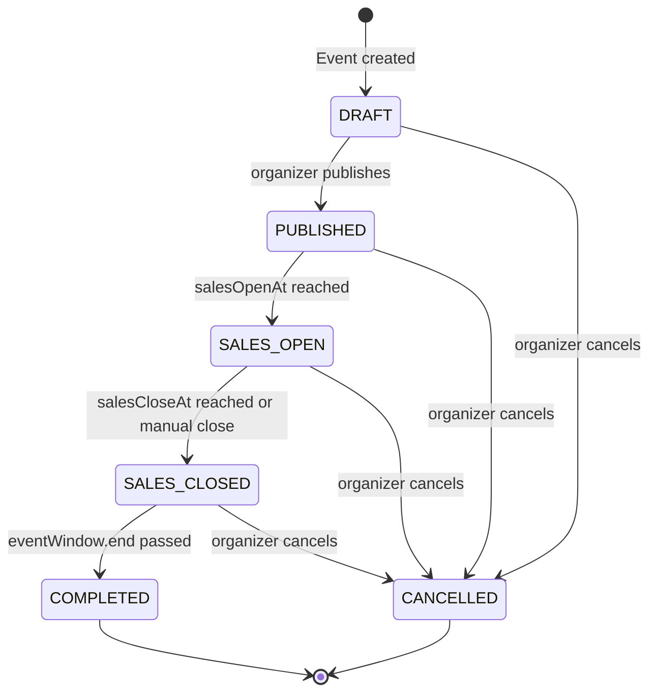
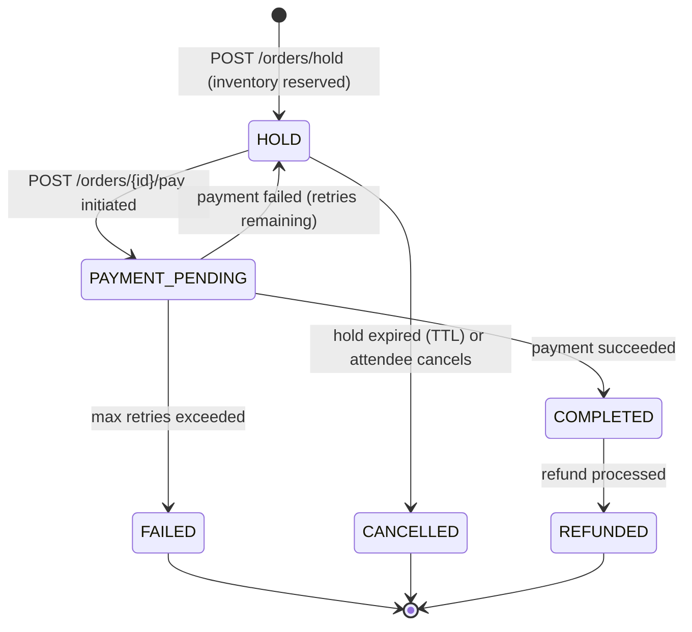
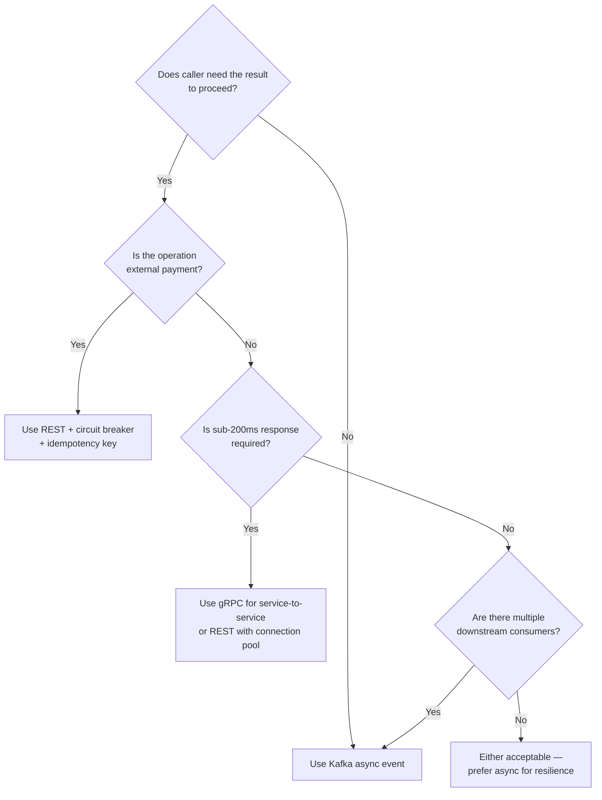
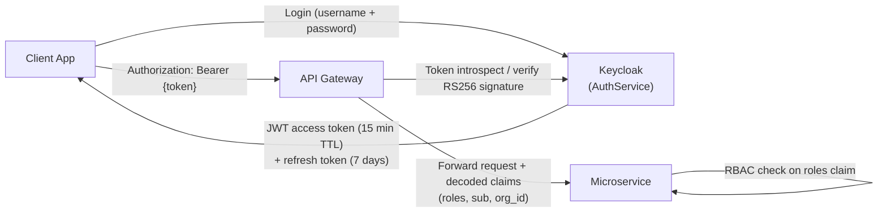
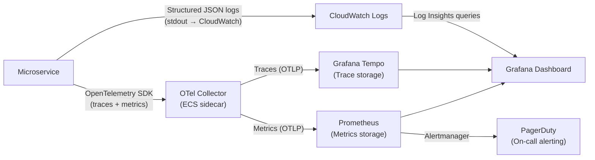
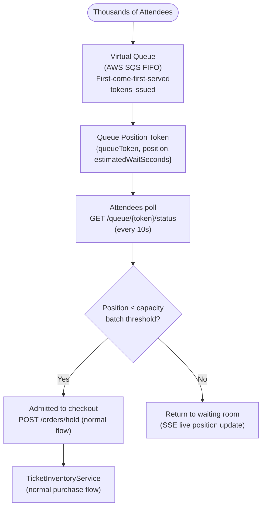

# Architecture Diagram

## Introduction

The Event Management and Ticketing Platform is built as a microservices system with a **domain-driven decomposition** philosophy: each service aligns to a single bounded context, owns its data, and communicates via explicit contracts rather than shared databases.

Three principles guide every architectural decision:

**1. Async-first communication**: Anything that does not require an immediate synchronous response uses Kafka events. This decouples services, improves resilience, and enables independent scaling. Synchronous REST/gRPC is reserved for inventory checks (where consistency is required), payment gateway calls (where a result is needed immediately), and QR code validation (where sub-200 ms response is mandatory).

**2. Eventual consistency is acceptable outside the order core**: The payment flow from hold creation through to ticket issuance must be strongly consistent within the Order aggregate. Everything after — QR generation, email delivery, analytics ingestion, search index updates — can be eventually consistent. This design choice dramatically reduces the number of distributed transactions needed.

**3. Failure isolation**: A slow NotificationService must not degrade the ticket purchase flow. A circuit breaker on every external call and a bulkhead pattern between bounded contexts ensures a failure in one domain does not cascade into a full system outage.

---

## High-Level Architecture

```mermaid
flowchart TD
    subgraph Client Layer
        WEB["Web App\nReact / Next.js\nVercel + CloudFront CDN"]
        MOBILE["Mobile App\nReact Native\niOS + Android"]
        PORTAL["Organizer Portal\nReact SPA\nCloudFront"]
    end

    subgraph API Layer
        GW["API Gateway\nKong / AWS API GW\nAuth · Rate Limiting · Routing · TLS termination"]
    end

    subgraph Core Services — ECS Fargate
        EVT["EventService\nNode.js / Fastify"]
        INV["TicketInventoryService\nGo"]
        ORD["OrderService\nNode.js / Fastify"]
        CHECKIN["CheckInService\nGo"]
        REF["RefundService\nNode.js / Fastify"]
        NOTIF["NotificationService\nNode.js / Fastify"]
    end

    subgraph Supporting Services
        AUTH["AuthService\nKeycloak\nECS Fargate"]
        SEARCH["SearchService\nNode.js + Elasticsearch\nECS Fargate"]
        ANALYTICS["AnalyticsService\nPython / FastAPI\nECS Fargate"]
        PAYMENT["PaymentService\nNode.js / Fastify\nECS Fargate"]
        MEDIA["MediaService\nNode.js\nECS Fargate"]
    end

    subgraph Data Layer
        PG_EVT[(PostgreSQL\nEvents DB\nRDS)]
        PG_INV[(PostgreSQL\nInventory DB\nRDS)]
        PG_ORD[(PostgreSQL\nOrders DB\nRDS)]
        PG_CHK[(PostgreSQL\nCheckIns DB\nRDS)]
        PG_REF[(PostgreSQL\nRefunds DB\nRDS)]
        PG_NOT[(PostgreSQL\nNotifications DB\nRDS)]
        REDIS[(Redis\nElastiCache\nHolds · Sessions · Counts)]
        ES[(Elasticsearch\nEvent Search Index)]
        S3[(S3\nTicket PDFs · QR images\nEvent media)]
    end

    subgraph Messaging
        KAFKA["Apache Kafka\nAWS MSK\nAsync event bus"]
    end

    subgraph External Integrations
        STRIPE["Stripe\nPayments · Refunds · Connect"]
        SENDGRID["SendGrid\nTransactional Email"]
        TWILIO["Twilio\nSMS Notifications"]
        FIREBASE["Firebase FCM\nPush Notifications"]
        GMAPS["Google Maps API\nGeocoding · Maps"]
        CFCDN["CloudFront CDN\nStatic Assets"]
    end

    %% Client → API Gateway
    WEB & MOBILE & PORTAL --> GW

    %% API Gateway → Auth
    GW -- "Token introspection\nOIDC" --> AUTH

    %% API Gateway → Core Services
    GW -- "REST" --> EVT
    GW -- "REST" --> INV
    GW -- "REST" --> ORD
    GW -- "REST" --> CHECKIN
    GW -- "REST" --> REF

    %% Core Services → Databases (owned DBs)
    EVT --> PG_EVT
    INV --> PG_INV
    INV --> REDIS
    ORD --> PG_ORD
    CHECKIN --> PG_CHK
    CHECKIN --> REDIS
    REF --> PG_REF
    NOTIF --> PG_NOT

    %% Core Services → Kafka
    EVT -- "Produce" --> KAFKA
    INV -- "Produce" --> KAFKA
    ORD -- "Produce" --> KAFKA
    CHECKIN -- "Produce" --> KAFKA
    REF -- "Produce" --> KAFKA
    NOTIF -- "Consume" --> KAFKA

    %% Supporting Services
    ORD --> PAYMENT
    PAYMENT --> STRIPE
    NOTIF --> SENDGRID
    NOTIF --> TWILIO
    NOTIF --> FIREBASE
    EVT --> SEARCH
    SEARCH --> ES
    EVT --> MEDIA
    MEDIA --> S3
    EVT --> GMAPS

    %% Analytics
    KAFKA -- "Consume" --> ANALYTICS
    ANALYTICS --> ES

    %% CDN
    CFCDN --> S3
```

---

## Service Responsibilities

### EventService

| Attribute | Detail |
|---|---|
| **Bounded Context** | Event Context |
| **Owned Data** | `events`, `venues`, `event_categories`, `event_media`, `organizer_profiles` tables in PostgreSQL |
| **Technology** | Node.js 20, Fastify 4, TypeORM, ECS Fargate (2 vCPU, 4 GB RAM), Auto Scaling 2–20 instances |
| **Published Events** | `EventPublished`, `EventCancelled`, `EventUpdated`, `EventCapacityChanged`, `EventCompleted` |
| **Consumed Events** | `OrganizerVerified` (from AuthService via Kafka) |
| **Synchronous Dependencies** | SearchService (index event on publish), MediaService (upload event images), Google Maps API (geocode venue) |
| **Async Dependencies** | Kafka `events.*` topics |
| **Key Endpoints** | `POST /events`, `PUT /events/{id}`, `POST /events/{id}/publish`, `POST /events/{id}/cancel`, `GET /events/{id}`, `GET /events/{id}/ticket-types` |
| **Critical Invariants** | Event capacity ≥ sum of all TicketType capacities; status machine enforced at service layer; organizer ownership validated on every mutation |

**Event Status Machine**:



---

### TicketInventoryService

| Attribute | Detail |
|---|---|
| **Bounded Context** | Ticketing Context |
| **Owned Data** | `ticket_types`, `ticket_holds` in PostgreSQL; hold state in Redis (primary source of truth for real-time availability) |
| **Technology** | Go 1.22, Chi router, pgx/v5, go-redis, ECS Fargate (1 vCPU, 2 GB RAM), Auto Scaling 3–30 instances |
| **Published Events** | `TicketHoldCreated`, `TicketHoldExpired`, `TicketHoldConfirmed`, `TicketHoldReleased`, `CapacityThresholdReached` |
| **Consumed Events** | `OrderCompleted` (confirm hold → sold), `EventCancelled` (void all holds for event) |
| **Synchronous Dependencies** | None (inventory is the authoritative source, not a consumer) |
| **Async Dependencies** | Redis (atomic hold state), Kafka `inventory.*` topics |
| **Key Endpoints** | `POST /inventory/hold` (reserve), `DELETE /inventory/hold/{holdId}` (release), `POST /inventory/hold/{holdId}/confirm` |
| **Critical Invariants** | All inventory operations are atomic Redis pipelines; `available + held + sold == totalCapacity` always; hold TTL enforced by Redis key expiry with a companion Kafka event via expiry notifications |

**Redis Hold Data Structure**:

```
Key: hold:{holdId}
Value: JSON { orderId, eventId, ticketTypeId, quantity, expiresAt }
TTL: 600 seconds

Key: inventory:{ticketTypeId}:available  → Integer
Key: inventory:{ticketTypeId}:held       → Integer
Key: inventory:{ticketTypeId}:sold       → Integer
```

---

### OrderService

| Attribute | Detail |
|---|---|
| **Bounded Context** | Commerce Context |
| **Owned Data** | `orders`, `order_items`, `payments` tables in PostgreSQL |
| **Technology** | Node.js 20, Fastify 4, Prisma ORM, ECS Fargate (2 vCPU, 4 GB RAM), Auto Scaling 2–20 instances |
| **Published Events** | `OrderPlaced`, `OrderCompleted`, `OrderCancelled`, `OrderRefundRequested` |
| **Consumed Events** | `TicketHoldExpired` (auto-cancel held orders), `PaymentProcessed` (internal from PaymentService) |
| **Synchronous Dependencies** | TicketInventoryService (hold creation/confirmation), PaymentService (payment processing) |
| **Async Dependencies** | Kafka `orders.*` topics |
| **Key Endpoints** | `POST /orders/hold`, `POST /orders/{id}/pay`, `GET /orders/{id}`, `POST /orders/{id}/cancel`, `POST /orders/{id}/refund` |
| **Critical Invariants** | Hold must be active before payment is attempted; idempotency keys checked before creating holds or initiating payments; `paymentAttempts ≤ 3` before hold release |

**Order State Machine**:



---

### CheckInService

| Attribute | Detail |
|---|---|
| **Bounded Context** | Access Control Context |
| **Owned Data** | `check_ins`, `staff_profiles`, `device_registrations`, `qr_manifests` in PostgreSQL; real-time attendance counts in Redis |
| **Technology** | Go 1.22, Gin, pgx/v5, go-redis, ECS Fargate (2 vCPU, 4 GB RAM), Auto Scaling 3–20 instances |
| **Published Events** | `AttendeeCheckedIn`, `InvalidScanAttempted`, `OfflineSyncCompleted` |
| **Consumed Events** | `TicketIssued` (add to QR manifest), `TicketVoided` (remove from manifest), `EventCancelled` (lock check-in for event) |
| **Synchronous Dependencies** | TicketService (validate ticket on online check-in) |
| **Async Dependencies** | Kafka `checkins.*` topics |
| **Key Endpoints** | `POST /check-in/validate`, `POST /check-in/override`, `POST /check-in/sync`, `GET /check-in/manifest/{eventId}`, `GET /check-in/dashboard/{eventId}` |
| **Critical Invariants** | Redis `SET NX` prevents duplicate check-ins under concurrent scans; manifest HMAC signature prevents QR forgery in offline mode; offline sync deduplicates by ticketId |

---

### RefundService

| Attribute | Detail |
|---|---|
| **Bounded Context** | Commerce Context |
| **Owned Data** | `refunds`, `refund_batches` tables in PostgreSQL |
| **Technology** | Node.js 20, Fastify 4, Prisma ORM, ECS Fargate (1 vCPU, 2 GB RAM), Auto Scaling 1–10 instances |
| **Published Events** | `RefundIssued`, `RefundFailed`, `RefundBatchCompleted` |
| **Consumed Events** | `EventCancelled` (trigger bulk refund batch), `OrderRefundRequested` (individual refund) |
| **Synchronous Dependencies** | Stripe (refund API calls) |
| **Async Dependencies** | Kafka `refunds.*` topics, SQS dead letter queue for failed refunds |
| **Key Endpoints** | `GET /refunds/{refundId}`, `GET /refunds/batch/{batchId}` (status polling), `POST /refunds/{id}/retry` (manual ops retry) |
| **Critical Invariants** | Idempotency key `{refundBatchId}:{orderId}` passed to Stripe to prevent double-refunds; chunk processing with pacing to respect Stripe rate limits (100 req/s); failed refunds go to DLQ after 3 retries |

---

### NotificationService

| Attribute | Detail |
|---|---|
| **Bounded Context** | Cross-cutting (consumes from all contexts) |
| **Owned Data** | `notifications`, `notification_templates`, `delivery_logs` in PostgreSQL |
| **Technology** | Node.js 20, Fastify 4, Handlebars templating, Bull queue, ECS Fargate (1 vCPU, 2 GB RAM), Auto Scaling 1–10 instances |
| **Published Events** | None (fire-and-forget) |
| **Consumed Events** | `OrderCompleted`, `RefundIssued`, `EventCancelled`, `AttendeeCheckedIn`, `TicketTransferred`, `WaitlistNotified` |
| **Synchronous Dependencies** | SendGrid (email), Twilio (SMS), Firebase FCM (push) |
| **Async Dependencies** | Kafka `notifications.*` input topics, Bull/Redis retry queue |
| **Key Endpoints** | `GET /notifications/{attendeeId}` (in-app notification feed), `DELETE /notifications/{id}/dismiss` |
| **Critical Invariants** | Each event consumed is idempotent (notification record keyed on `{eventType}:{sourceEntityId}`); failed sends queued in Bull with retry policy; unsubscribe preferences respected before send |

---

## Communication Patterns

### Synchronous (REST / gRPC)

Used when the caller needs an immediate result to proceed, or when strong consistency is required.

| Call | From → To | Protocol | Reason for Synchronous |
|---|---|---|---|
| Inventory check | OrderService → TicketInventoryService | REST | Result needed before creating hold |
| Hold creation | OrderService → TicketInventoryService | REST | Atomic inventory reservation |
| Payment processing | OrderService → PaymentService → Stripe | REST | Immediate success/failure needed |
| QR validation | CheckInService → TicketService | REST | Real-time access decision (sub-200 ms) |
| Search indexing | EventService → SearchService | REST (fire-and-forget with 2s timeout) | Near-real-time search availability desired |
| Token validation | API Gateway → AuthService | REST (cached) | Every request needs auth validation |

### Asynchronous (Apache Kafka)

Used for all post-purchase flows, cross-service notifications, and any operation where decoupling matters more than immediacy.

| Event | Producer → Consumer(s) | Topic | Reason for Async |
|---|---|---|---|
| `OrderCompleted` | OrderService → TicketService, NotificationService, AnalyticsService | `orders.completed` | Multiple consumers; ticket generation and emails need not block payment response |
| `EventCancelled` | EventService → InventoryService, RefundService, NotificationService | `events.cancelled` | Fan-out to multiple bounded contexts; bulk operations are long-running |
| `TicketIssued` | TicketService → CheckInService | `tickets.issued` | QR manifest updates can be eventual (updated hourly anyway) |
| `AttendeeCheckedIn` | CheckInService → NotificationService, AnalyticsService | `checkins.recorded` | Welcome push is best-effort; analytics is always async |
| `RefundFailed` | RefundService → Dead Letter Topic | `refunds.failed` | Ops monitoring and retry — no real-time consumer needed |

### Pattern Selection Guide



---

## Cross-Cutting Concerns

### Authentication and Authorisation



**Roles and permissions**:

| Role | Capabilities |
|---|---|
| `ATTENDEE` | Purchase tickets, view own orders, request refunds, manage profile |
| `ORGANIZER` | Create/update/cancel own events, view sales reports, download attendee lists |
| `STAFF` | Access check-in endpoints for assigned events only, view check-in dashboard |
| `ADMIN` | Full platform access, organizer management, bulk operations, override check-ins |

**Service-to-service auth**: All internal service calls use mTLS with certificates rotated by AWS ACM Private CA. Service identity verified via certificate Subject Alternative Name matching service name.

### Observability



**Observability standards**:
- Every inbound HTTP request generates a trace span with `traceId` propagated via `traceparent` header
- Every Kafka message carries `traceId` in headers for distributed trace continuation
- All logs are structured JSON with mandatory fields: `timestamp`, `level`, `service`, `traceId`, `spanId`
- No PII in logs — email addresses and names replaced with `attendeeId` references
- Key business metrics tracked: `ticket_purchase_duration_ms`, `hold_conversion_rate`, `check_in_rate_per_minute`, `payment_success_rate`

### Circuit Breakers

| Integration Point | Library | Failure Threshold | Open Duration | Fallback Behaviour |
|---|---|---|---|---|
| OrderService → PaymentService → Stripe | Resilience4j (Java) / opossum (Node.js) | 5 failures / 10s | 30s | Return 503 to client; preserve hold |
| NotificationService → SendGrid | opossum | 10 failures / 30s | 60s | Queue to Bull retry; return 202 |
| NotificationService → Twilio | opossum | 10 failures / 30s | 60s | Skip SMS, email fallback only |
| CheckInService → PostgreSQL | pgx retry policy | 3 failures / 5s | 10s | Redis-only degraded mode |
| EventService → SearchService | opossum | 5 failures / 10s | 30s | Silently skip index update; retry on next event update |

### Rate Limiting

Configured at API Gateway (Kong) level per endpoint:

| Endpoint | Limit (per IP) | Limit (per authenticated user) | Burst | Notes |
|---|---|---|---|---|
| `GET /events` (search) | 100 req/s | 200 req/s | 500 | Public; CDN cache absorbs most traffic |
| `POST /orders/hold` | 10 req/s | 20 req/s | 30 | Flash sale protection; Redis token bucket |
| `POST /orders/{id}/pay` | 5 req/s | 10 req/s | 15 | Payment endpoint hardening |
| `POST /check-in/validate` | 50 req/s per device | 200 req/s per event | 500 | Scanner burst at door open |
| `POST /events` (create) | 5 req/min | 10 req/min per organizer | 15 | Anti-spam for organizer portal |
| `POST /events/{id}/cancel` | 1 req/min | 2 req/min | 3 | Prevents accidental double-cancel |

---

## Scaling Characteristics

### Per-Service Scaling Profile

| Service | Baseline RPS | Peak RPS | Auto-scale Trigger | Scale-up Time | Bottleneck | Mitigation |
|---|---|---|---|---|---|---|
| EventService | 500 | 5,000 | CPU > 60% or RPS > 800 | 60–90 s | DB write throughput on event updates | Read replica for GET endpoints; write-through Redis cache |
| TicketInventoryService | 2,000 | 50,000 | CPU > 70% or latency P99 > 200 ms | 30–45 s | Redis throughput for atomic hold ops | Redis cluster mode; connection pooling; Go goroutine concurrency |
| OrderService | 1,000 | 15,000 | CPU > 60% or queue depth > 100 | 60–90 s | Stripe API rate limits (1000 req/s per account) | Request queue with backpressure; multiple Stripe accounts per organizer |
| CheckInService | 3,000 | 80,000 | CPU > 70% or latency P99 > 150 ms | 30–45 s | Redis counter INCR under mass arrival burst | Redis pipelining; batch INCRBY with count accumulation; Go goroutines |
| RefundService | 50 (normal) | 500 (cancellation) | Queue depth > 50 (Kafka lag) | 120 s | Stripe refund rate limit (100 req/s) | Paced batch processing with sleep between chunks |
| NotificationService | 500 | 10,000 | Kafka consumer lag > 1000 | 60 s | SendGrid throughput (varies by plan) | Bull queue with concurrency control; skip non-critical channels under backpressure |

### Flash Sale Architecture

For events with anticipated flash sales (e.g., popular concerts going on sale), the platform activates a **virtual queue** pattern:



The virtual queue serves as a traffic regulator, smoothing the arrival burst and preventing Redis from being overwhelmed by 100,000 simultaneous hold requests for a 10,000-capacity event.
