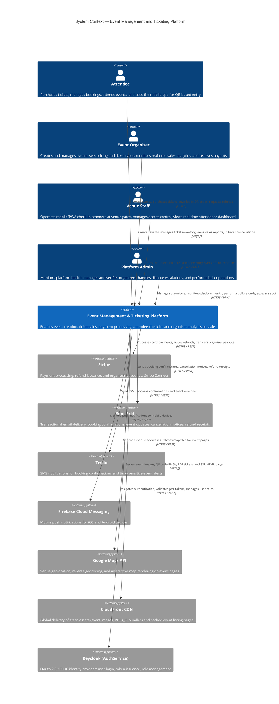

# C4 Context and Container Diagram

## Introduction

The **C4 model** (Context, Containers, Components, Code) is a hierarchical notation for visualising software architecture at four levels of abstraction. Each level adds detail for a different audience:

- **Level 1 — System Context**: Shows the system and the people/external systems that interact with it. Audience: everyone including non-technical stakeholders.
- **Level 2 — Container**: Decomposes the system into its deployable units (web apps, services, databases, message queues). Audience: technical leads and developers.
- **Level 3 — Component**: Decomposes a single container into its major components. Not covered in this document (see individual service architecture docs).
- **Level 4 — Code**: Class-level design. Not covered here (see domain model).

This document covers **Level 1 (System Context)** and **Level 2 (Container Diagram)** for the Event Management and Ticketing Platform. It is the entry point for any engineer onboarding to the platform and the definitive reference for deployment boundary decisions.

---

## System Context Diagram (C4 Level 1)

The System Context diagram shows who uses the platform and what external systems it depends on. The platform itself is treated as a single black box.



### Context Diagram Narrative

The platform sits at the centre of four distinct user groups with very different interaction patterns:

- **Attendees** are the highest-volume users (potentially millions). Their interactions are primarily read-heavy (browsing events) with periodic write spikes (flash sale purchases). Mobile access is dominant.
- **Organizers** are low-volume but high-value users. Their interactions are primarily write-heavy (event creation, ticket management) and read-heavy-analytics (sales dashboards). They interact primarily via the Organizer Portal desktop web app.
- **Venue Staff** interact exclusively during event execution windows (hours, not days). Their interaction pattern is extremely high-frequency writes (check-in scans) over very short periods, under unreliable field connectivity.
- **Admins** are the smallest user group with the broadest permissions. They access the platform via VPN-restricted admin endpoints.

---

## Container Diagram (C4 Level 2)

The Container diagram decomposes the platform into its deployable units. Each container is independently deployable, has a clear owner, and communicates with other containers via explicit APIs or events.

```mermaid
C4Container
    title Container Diagram — Event Management and Ticketing Platform

    Person(attendee, "Attendee", "Ticket buyer")
    Person(organizer, "Event Organizer", "Event creator")
    Person(venueStaff, "Venue Staff", "Check-in operator")
    Person(admin, "Platform Admin", "Platform operator")

    System_Ext(stripe, "Stripe", "Payment gateway")
    System_Ext(sendgrid, "SendGrid", "Email delivery")
    System_Ext(twilio, "Twilio", "SMS delivery")
    System_Ext(firebase, "Firebase FCM", "Push notifications")
    System_Ext(googleMaps, "Google Maps API", "Geocoding")

    System_Boundary(platform, "Event Management & Ticketing Platform") {

        Container(webApp, "Web Application", "React 18 / Next.js 14, Vercel", "SSR event discovery pages, attendee dashboard, ticket checkout flow. Served via CloudFront CDN.")

        Container(organizerPortal, "Organizer Portal", "React 18 SPA, CloudFront", "Event management dashboard, ticket type configuration, real-time sales analytics, attendee exports.")

        Container(mobileApp, "Mobile App", "React Native 0.73, iOS + Android", "Ticket wallet, QR code display, offline check-in scanner for staff, push notification support.")

        Container(apiGateway, "API Gateway", "Kong 3.x, ECS Fargate", "Single ingress point. Handles TLS termination, JWT validation, rate limiting (Redis token bucket), request routing, and correlation ID injection.")

        Container(authService, "AuthService", "Keycloak 23, ECS Fargate, PostgreSQL", "OAuth 2.0 / OIDC provider. Issues JWT access tokens (RS256, 15-min TTL) and refresh tokens. Manages user accounts, roles, and organizer profile links.")

        Container(eventService, "EventService", "Node.js 20 / Fastify 4, ECS Fargate", "Event CRUD, status state machine, capacity management, organizer verification. Publishes EventPublished and EventCancelled to Kafka.")

        Container(ticketInventoryService, "TicketInventoryService", "Go 1.22 / Chi, ECS Fargate", "Atomic ticket inventory management. Uses Redis pipelines for hold creation/confirmation/release. Sub-20ms hold operations under 10k concurrent requests.")

        Container(orderService, "OrderService", "Node.js 20 / Fastify 4, ECS Fargate", "Order lifecycle: hold → payment → completion. Orchestrates TicketInventoryService and PaymentService. Enforces idempotency and payment retry limits.")

        Container(checkInService, "CheckInService", "Go 1.22 / Gin, ECS Fargate", "Online and offline QR validation. Generates signed hourly QR manifests for PWA offline mode. Records check-ins with Redis deduplication.")

        Container(refundService, "RefundService", "Node.js 20 / Fastify 4, ECS Fargate", "Individual and bulk refund processing. Paced Stripe API calls (100 req/s). Chunk-based batch processing for event cancellation refunds.")

        Container(notificationService, "NotificationService", "Node.js 20 / Fastify 4, ECS Fargate", "Multi-channel notification routing (email, SMS, push, in-app). Handlebars template engine. Bull queue for retry and backpressure control.")

        Container(searchService, "SearchService", "Node.js 20 / Express, ECS Fargate", "Event discovery and full-text search. Maintains Elasticsearch index. Handles geolocation queries (events near me) and faceted filtering.")

        Container(analyticsService, "AnalyticsService", "Python 3.12 / FastAPI, ECS Fargate", "Consumes Kafka event stream. Produces real-time aggregations (Kafka Streams). Batch ETL to Redshift. Serves organizer analytics API.")

        Container(paymentService, "PaymentService", "Node.js 20 / Fastify 4, ECS Fargate", "Abstracts Stripe API. Handles payment intent creation, 3DS challenges, refunds. Implements circuit breaker and idempotency logic for Stripe calls.")

        Container(mediaService, "MediaService", "Node.js 20, ECS Fargate", "Image upload, resizing (Sharp), and CDN invalidation for event cover images. Ticket PDF generation (Puppeteer).")

        Container(messageBus, "Message Bus", "Apache Kafka, AWS MSK 3.x", "Async event backbone. Topics partitioned by eventId or orderId for ordered processing. 7-day retention. Consumer groups per bounded context.")

        ContainerDb(eventsDb, "Events DB", "PostgreSQL 16, AWS RDS", "Stores events, venues, organizer_profiles, event_categories. Owned by EventService.")

        ContainerDb(inventoryDb, "Inventory DB", "PostgreSQL 16, AWS RDS", "Stores ticket_types, ticket_hold_audit_log. Authoritative hold state in Redis. Owned by TicketInventoryService.")

        ContainerDb(ordersDb, "Orders DB", "PostgreSQL 16, AWS RDS", "Stores orders, order_items, payments. Owned by OrderService.")

        ContainerDb(checkinsDb, "CheckIns DB", "PostgreSQL 16, AWS RDS", "Stores check_ins, staff_profiles, device_registrations, qr_manifests. Owned by CheckInService.")

        ContainerDb(refundsDb, "Refunds DB", "PostgreSQL 16, AWS RDS", "Stores refunds, refund_batches. Owned by RefundService.")

        ContainerDb(notificationsDb, "Notifications DB", "PostgreSQL 16, AWS RDS", "Stores notifications, templates, delivery_logs. Owned by NotificationService.")

        ContainerDb(redis, "Redis Cluster", "Redis 7.x, AWS ElastiCache", "Ticket holds (primary inventory state), session tokens, rate-limit counters, real-time attendance counts, Bull job queues.")

        ContainerDb(elasticsearch, "Elasticsearch", "Elasticsearch 8.x, AWS OpenSearch", "Event search index with full-text, geo, and faceted search capabilities.")

        ContainerDb(s3, "Object Storage", "AWS S3", "Ticket PDFs, QR code PNGs, event cover images, QR manifest files, analytics Parquet exports.")
    }

    %% Client → Gateway
    Rel(attendee, webApp, "Browses and purchases", "HTTPS")
    Rel(attendee, mobileApp, "Purchases and scans QR", "HTTPS")
    Rel(organizer, organizerPortal, "Manages events", "HTTPS")
    Rel(venueStaff, mobileApp, "Scans tickets", "HTTPS / BLE")
    Rel(admin, organizerPortal, "Admin operations", "HTTPS / VPN")

    Rel(webApp, apiGateway, "API calls", "HTTPS / REST")
    Rel(organizerPortal, apiGateway, "API calls", "HTTPS / REST")
    Rel(mobileApp, apiGateway, "API calls", "HTTPS / REST")

    %% Gateway → Auth + Services
    Rel(apiGateway, authService, "Token introspection", "HTTPS / OIDC")
    Rel(apiGateway, eventService, "Routes /events/*", "HTTP / REST")
    Rel(apiGateway, ticketInventoryService, "Routes /inventory/*", "HTTP / REST")
    Rel(apiGateway, orderService, "Routes /orders/*", "HTTP / REST")
    Rel(apiGateway, checkInService, "Routes /check-in/*", "HTTP / REST")
    Rel(apiGateway, refundService, "Routes /refunds/*", "HTTP / REST")
    Rel(apiGateway, searchService, "Routes /search/*", "HTTP / REST")

    %% Service → Database (owned)
    Rel(eventService, eventsDb, "Read/Write", "TCP / PostgreSQL")
    Rel(ticketInventoryService, inventoryDb, "Read/Write", "TCP / PostgreSQL")
    Rel(ticketInventoryService, redis, "Hold ops (atomic pipeline)", "TCP / RESP")
    Rel(orderService, ordersDb, "Read/Write", "TCP / PostgreSQL")
    Rel(checkInService, checkinsDb, "Read/Write", "TCP / PostgreSQL")
    Rel(checkInService, redis, "SET NX dedup, attendance INCR", "TCP / RESP")
    Rel(refundService, refundsDb, "Read/Write", "TCP / PostgreSQL")
    Rel(notificationService, notificationsDb, "Read/Write", "TCP / PostgreSQL")
    Rel(notificationService, redis, "Bull job queue", "TCP / RESP")
    Rel(searchService, elasticsearch, "Index and query", "HTTP / REST")

    %% Service → Kafka
    Rel(eventService, messageBus, "Produce: EventPublished, EventCancelled", "TCP / Kafka")
    Rel(ticketInventoryService, messageBus, "Produce: HoldCreated, HoldExpired", "TCP / Kafka")
    Rel(orderService, messageBus, "Produce: OrderCompleted, OrderCancelled", "TCP / Kafka")
    Rel(checkInService, messageBus, "Produce: AttendeeCheckedIn", "TCP / Kafka")
    Rel(refundService, messageBus, "Produce: RefundIssued, RefundFailed", "TCP / Kafka")
    Rel(notificationService, messageBus, "Consume: all notification-triggering events", "TCP / Kafka")
    Rel(analyticsService, messageBus, "Consume: all events for analytics", "TCP / Kafka")

    %% Service → External
    Rel(paymentService, stripe, "Payment intents, refunds", "HTTPS / REST")
    Rel(orderService, paymentService, "Process payment", "HTTP / REST")
    Rel(notificationService, sendgrid, "Send email", "HTTPS / REST")
    Rel(notificationService, twilio, "Send SMS", "HTTPS / REST")
    Rel(notificationService, firebase, "Send push", "HTTPS / REST")
    Rel(eventService, googleMaps, "Geocode venue", "HTTPS / REST")
    Rel(mediaService, s3, "Upload/read assets", "HTTPS / S3 API")
```



---

## Container Interaction Matrix

This matrix is the authoritative reference for every container-to-container communication path, including protocol, synchrony, and SLA.

| From | To | Protocol | Sync / Async | Purpose | SLA (P99) |
|---|---|---|---|---|---|
| API Gateway | AuthService | HTTPS / OIDC introspect | Sync | JWT token validation on every request | < 10 ms (cached 60s) |
| API Gateway | EventService | HTTP / REST | Sync | Event CRUD routing | < 200 ms |
| API Gateway | TicketInventoryService | HTTP / REST | Sync | Inventory check and hold routing | < 50 ms |
| API Gateway | OrderService | HTTP / REST | Sync | Order and payment routing | < 3,000 ms |
| API Gateway | CheckInService | HTTP / REST | Sync | Check-in validation routing | < 200 ms |
| API Gateway | SearchService | HTTP / REST | Sync | Event search routing | < 150 ms |
| OrderService | TicketInventoryService | HTTP / REST | Sync | Create / confirm / release hold | < 50 ms |
| OrderService | PaymentService | HTTP / REST | Sync | Process payment | < 2,500 ms |
| PaymentService | Stripe | HTTPS / REST | Sync | Charge card, issue refund | < 2,000 ms |
| EventService | SearchService | HTTP / REST | Sync (fire-and-forget, 2s timeout) | Update search index on event change | < 2,000 ms |
| EventService | Kafka `events.*` | TCP / Kafka | Async | Notify downstream of event lifecycle changes | < 100 ms produce |
| OrderService | Kafka `orders.*` | TCP / Kafka | Async | Notify downstream of order completion | < 100 ms produce |
| CheckInService | Kafka `checkins.*` | TCP / Kafka | Async | Notify analytics and notification of check-in | < 100 ms produce |
| NotificationService | Kafka `*` | TCP / Kafka | Async (consume) | Trigger notifications from all domain events | Kafka lag < 5s |
| NotificationService | SendGrid | HTTPS / REST | Async (Bull queue) | Email delivery | < 5s queue, < 60s delivery |
| NotificationService | Twilio | HTTPS / REST | Async (Bull queue) | SMS delivery | < 5s queue, < 30s delivery |
| NotificationService | Firebase | HTTPS / REST | Async (Bull queue) | Push delivery | < 5s queue, < 10s delivery |
| TicketInventoryService | Redis | TCP / RESP | Sync (in-process) | Atomic hold operations | < 5 ms |
| CheckInService | Redis | TCP / RESP | Sync (in-process) | SET NX dedup + INCR attendance | < 3 ms |
| AnalyticsService | Kafka `*` | TCP / Kafka | Async (consume) | Stream ingestion for real-time aggregation | Kafka lag < 10s |
| AnalyticsService | Redshift / S3 | HTTPS / S3 + JDBC | Async (batch) | Historical analytics ETL | Hourly batch |
| MediaService | S3 | HTTPS / S3 API | Async | Asset upload and CDN distribution | < 500 ms upload |
| CheckInService | S3 | HTTPS / S3 API | Async | QR manifest distribution to CDN | < 200 ms read |

---

## Deployment Boundaries

All containers are deployed in AWS. The following diagram shows VPC subnet placement and internet access boundaries.

```mermaid
flowchart TB
    subgraph Internet
        CLIENTS["Web Browsers\nMobile Apps\nOrganizer Portal"]
        EXTERNALS["Stripe · SendGrid\nTwilio · Firebase\nGoogle Maps"]
    end

    subgraph AWS Region us-east-1
        subgraph Public Subnets
            CF["CloudFront CDN\n(Edge locations globally)"]
            ALB["Application Load Balancer\n(Public internet-facing)"]
            NAT["NAT Gateway\n(Outbound internet for private subnets)"]
        end

        subgraph Private Subnets — Application Tier
            GW["API Gateway\n(Kong, ECS Fargate)"]
            EVT["EventService"]
            INV["TicketInventoryService"]
            ORD["OrderService"]
            CHK["CheckInService"]
            REF["RefundService"]
            NOTIF["NotificationService"]
            AUTH["AuthService (Keycloak)"]
            SEARCH["SearchService"]
            ANALYTICS["AnalyticsService"]
            PAY["PaymentService"]
            MEDIA["MediaService"]
        end

        subgraph Private Subnets — Data Tier
            RDS["PostgreSQL RDS\n(per-service instances\nin isolated security groups)"]
            ELASTICACHE["ElastiCache Redis\n(cluster mode, 3 shards)"]
            MSK["AWS MSK (Kafka)\n(3 brokers, 3 AZs)"]
            OS["Amazon OpenSearch\n(Elasticsearch)"]
            S3_PRIV["S3 Buckets\n(via VPC endpoint)"]
        end
    end

    CLIENTS -- "HTTPS 443" --> CF
    CF -- "HTTPS" --> ALB
    ALB -- "HTTP (internal)" --> GW
    GW --> EVT & INV & ORD & CHK & REF & NOTIF & AUTH & SEARCH
    EVT & INV & ORD & CHK & REF & NOTIF & ANALYTICS & PAY & MEDIA --> NAT
    NAT --> EXTERNALS
    EVT & INV & ORD & CHK & REF & NOTIF --> RDS
    INV & CHK & NOTIF --> ELASTICACHE
    EVT & INV & ORD & CHK & REF & NOTIF & ANALYTICS --> MSK
    SEARCH --> OS
    MEDIA & CHK & ANALYTICS --> S3_PRIV
```

**Security group rules**:

| Layer | Inbound Allowed From | Outbound Allowed To |
|---|---|---|
| API Gateway | ALB (port 8000) | All application tier services (port 3000/8080) |
| Application services | API Gateway only (no public internet) | Data tier services, NAT Gateway |
| Data tier (RDS) | Application tier services (port 5432) only | None |
| Data tier (Redis) | Application tier services (port 6379) only | None |
| Data tier (MSK) | Application tier services (port 9092/9094) only | None |
| S3 | VPC endpoint only (no public access) | N/A (object storage) |

---

## Technology Decisions

### Go for TicketInventoryService

**Decision**: TicketInventoryService is written in Go, while all other core services are Node.js.

**Context**: The inventory service must handle up to 50,000 concurrent hold requests during flash sales with a P99 latency target of 50 ms. Each hold request requires two Redis pipeline operations and one PostgreSQL write.

**Go advantages over Node.js for this workload**:
- Go goroutines are truly concurrent (M:N threading model). A 2 vCPU container can handle 10,000+ concurrent goroutines with minimal context switch overhead, compared to Node.js's single-threaded event loop which serialises I/O callbacks.
- Go's `sync.Mutex` and channel primitives provide fine-grained concurrency control without the complexity of async/await chains when coordinating Redis WATCH/MULTI/EXEC transactions.
- Go's HTTP server handles keep-alive connections efficiently without the callback depth that Node.js requires for nested async operations.
- Compiled binary with no JIT warmup: consistent latency from first request, critical for auto-scaling cold starts.

**Alternatives considered**:
- Node.js cluster mode: Shares memory state awkwardly across worker processes; Redis WATCH transactions require sticky routing.
- Java/Spring: Excellent concurrency but 30–60 s JVM warmup time is unacceptable for ECS auto-scaling.
- Rust: Superior performance but 3–5× development velocity reduction for marginal gains over Go at this scale.

### Redis for Ticket Holds

**Decision**: The authoritative hold state lives in Redis, not PostgreSQL.

**Context**: Under flash sale conditions, 10,000 attendees simultaneously attempt to hold tickets for a 5,000-capacity event. The system must prevent oversell with sub-10 ms inventory operations.

**Redis advantages over PostgreSQL for hold state**:
- Native TTL support: Redis key expiry automatically releases holds after 600 seconds without a cron job scanning the database for expired rows — critical for correctness under load.
- Atomic `DECRBY` / `INCRBY` operations with `WATCH`/`MULTI`/`EXEC` pipelines provide optimistic concurrency control that is 10–50× faster than PostgreSQL `SELECT FOR UPDATE` row locking.
- Memory-resident operations: no disk I/O in the critical hold path. PostgreSQL write latency is typically 2–10 ms; Redis is typically 0.1–1 ms for the same operation.
- Redis Cluster mode scales writes horizontally across shards partitioned by `{ticketTypeId}`.

**Risk mitigated**: Redis data loss risk is addressed by writing a `ticket_hold_audit_log` record to PostgreSQL asynchronously after every hold operation. If Redis is lost, holds are re-derivable from the audit log within the TTL window.

### Apache Kafka over AWS SQS

**Decision**: Apache Kafka (AWS MSK) is used as the async event bus instead of SQS or EventBridge.

**Context**: The platform requires reliable multi-consumer event delivery with ordered processing per entity, and must support event replay for building new downstream services without re-processing from scratch.

| Requirement | Kafka | SQS | EventBridge |
|---|---|---|---|
| Multiple independent consumers per event | Consumer groups — each gets full copy | Single logical queue (SNS fan-out needed) | Event bus subscriptions — similar |
| Per-entity ordering (events for same eventId processed in order) | Partition by eventId — guaranteed order within partition | FIFO queue — ordering only within message group | No ordering guarantees |
| Event replay (new service catches up from the start) | Seek to offset 0, replay entire topic | Messages deleted after consume — no replay | No replay (archive is extra cost) |
| High throughput (100,000+ events/s at peak) | Designed for this — multi-partition parallel writes | ~3,000 msg/s per queue (soft limit) | ~10,000 events/s per bus |
| Retention for audit | 7-day default, configurable to indefinite | 14-day maximum | 24h max on bus (archive to S3 optional) |

**Decision rationale**: The `events.cancelled` topic must be consumed by InventoryService, RefundService, and NotificationService **independently** — each at their own pace. InventoryService may complete in seconds; RefundService may take hours to process 50,000 refunds. Kafka consumer groups allow independent progress tracking via offsets. SQS would require three separate queues and SNS fan-out, with no replay capability.

**SQS is still used for one purpose**: the `refunds.failed` dead letter queue, where simplicity and managed DLQ behaviour is preferable to Kafka topic management for low-volume, manually-reviewed failures.

### PostgreSQL per Service over Shared Database

**Decision**: Each microservice owns and exclusively accesses its own PostgreSQL RDS instance.

**Context**: A shared database creates hidden coupling — any schema change can break multiple services, and a slow query in one service's domain can degrade the entire database cluster.

**Per-service database advantages**:
- **Independent schema evolution**: EventService can add a new column to the `events` table without any coordination with OrderService.
- **Independent scaling**: OrderService under high purchase load can use a larger RDS instance class without affecting CheckInService.
- **Failure isolation**: An OrderService database outage does not prevent attendees from checking in (CheckInService has its own database and Redis fallback).
- **Technology freedom**: In the future, CheckInService could migrate its hot check-in data to a different store (e.g., DynamoDB for single-digit millisecond latency) without impacting other services.

**Cost and complexity trade-off**: Running 6 PostgreSQL RDS instances is more expensive (approximately $400–$800/month additional) than a single shared instance. This cost is accepted because the operational independence and fault isolation are fundamental to the platform's reliability SLAs. RDS Aurora Serverless v2 is used for lower-traffic services (RefundService, NotificationService) to reduce idle costs.

**Cross-service data access**: Services never query each other's databases directly. If OrderService needs event details (e.g., for an order confirmation email), it calls the EventService REST API or reads from its local denormalised cache populated by consuming Kafka events. This is the **API composition** and **event-driven caching** pattern.
