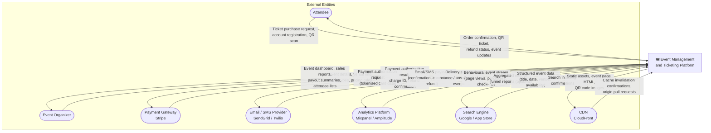
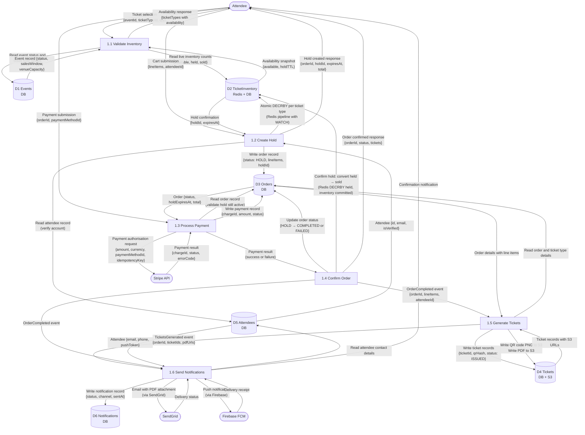
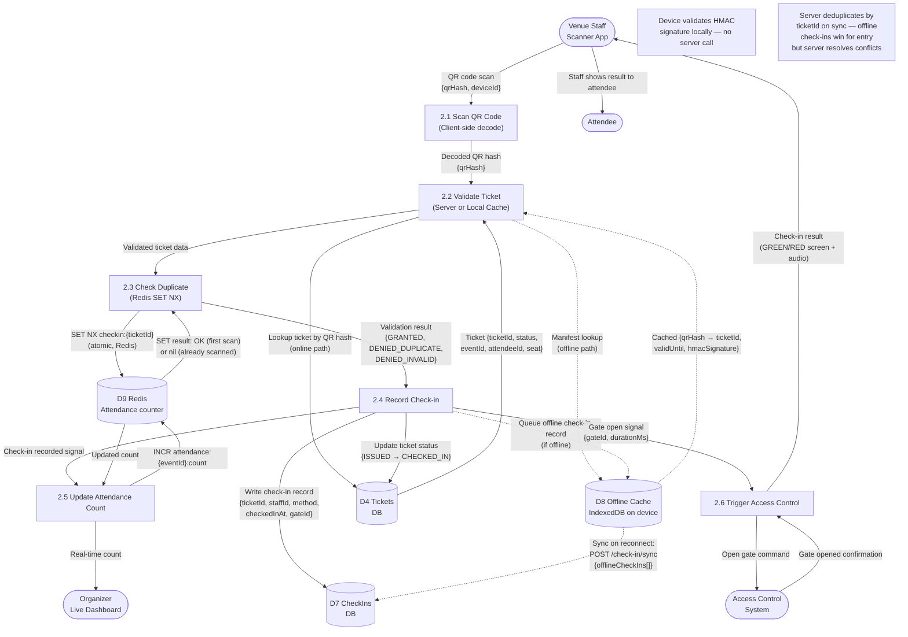
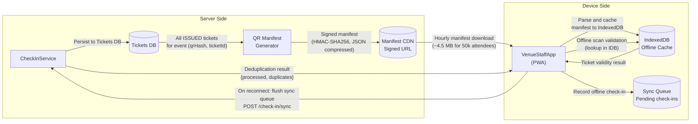
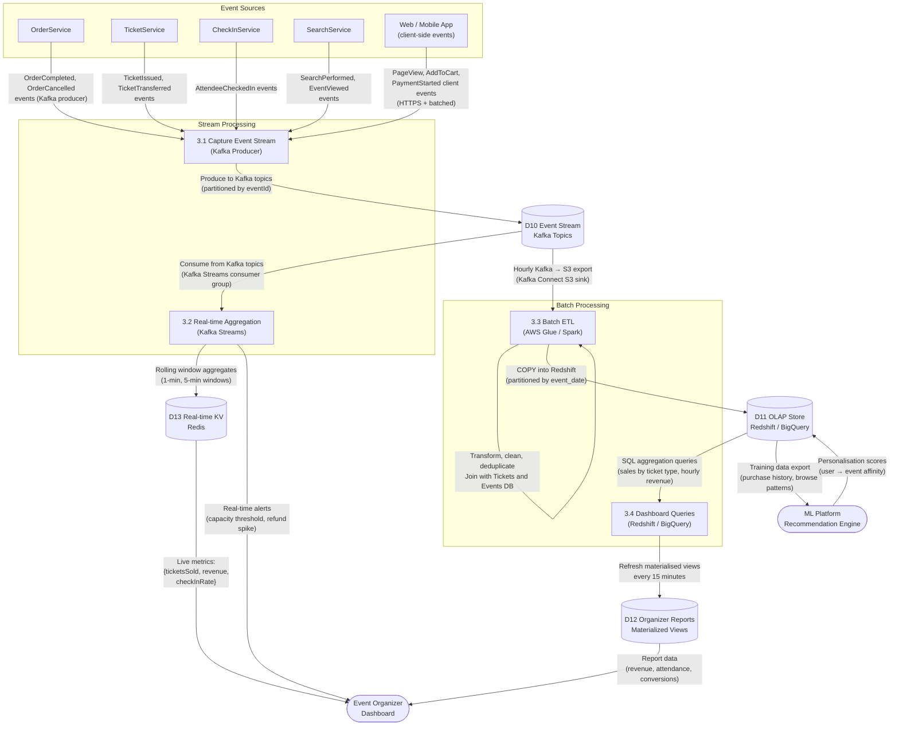
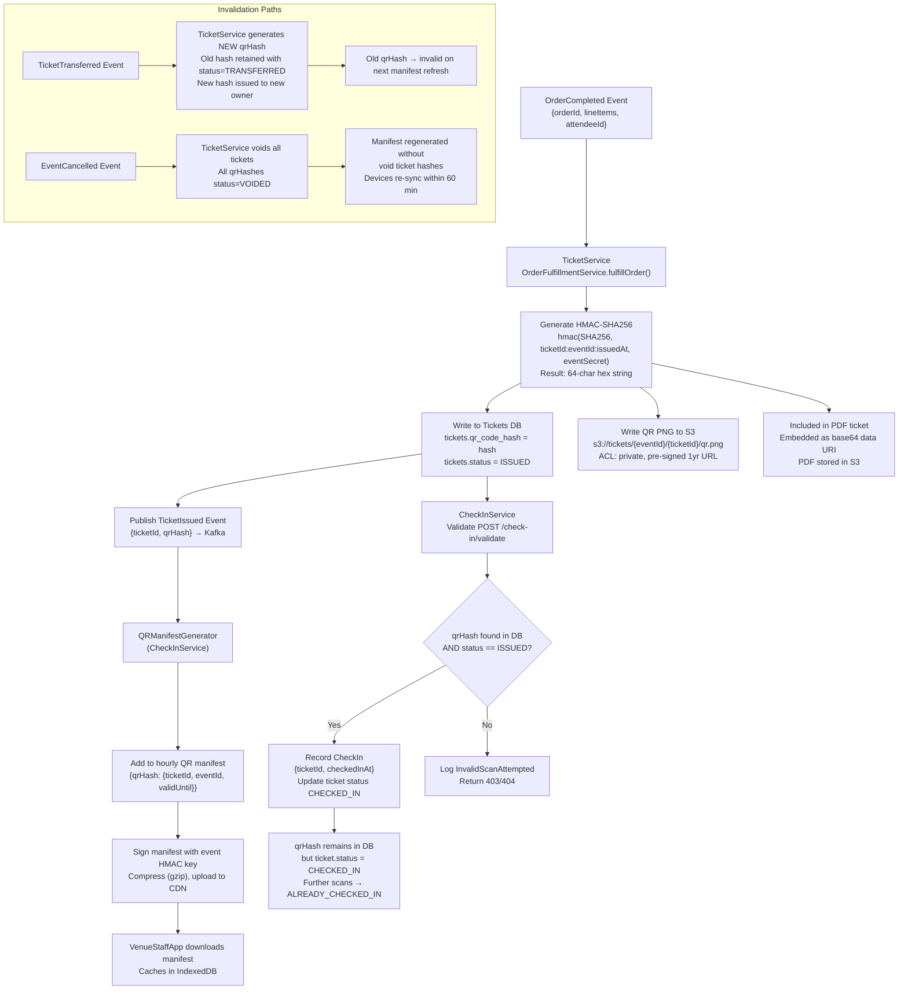
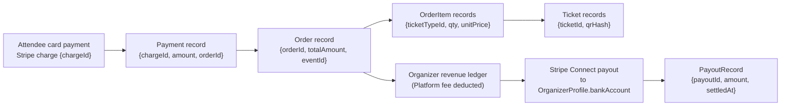

# Data Flow Diagram

## Introduction

Data Flow Diagrams (DFDs) model how data moves through a system — where it comes from, how it is transformed, where it is stored, and where it goes. Unlike sequence diagrams that show time-ordered interactions between components, DFDs focus on **data in motion and data at rest**, making them the primary tool for data governance, GDPR compliance analysis, and security threat modelling.

This document uses a two-level DFD notation:

- **Level 0 (Context DFD)**: The entire platform as a single process. Shows all external entities and the top-level data flows crossing the system boundary.
- **Level 1 (Decomposed DFDs)**: The system opened up to reveal major processing functions, data stores, and the flows between them. Each Level 1 diagram covers a single major capability of the platform.

**Notation conventions used in Mermaid flowcharts**:
- Rounded rectangles (`([...])`) represent **external entities** (actors outside the system boundary)
- Rectangles (`[...]`) represent **processes** (transformations of data)
- Cylinders (`[(...)]}`) represent **data stores** (persistent storage)
- Arrows represent **data flows** with labels describing the data content
- Dashed borders indicate **offline / asynchronous** paths

---

## Level 0 — Context DFD

The entire Event Management and Ticketing Platform is represented as a single process node. All data that crosses the system boundary is shown as labelled flows.

---

## Level 1 — Ticket Purchase Flow

This Level 1 DFD decomposes the ticket purchase process into its six core processing functions. Data stores show where data is read from and written to at each step.

### Level 1 Ticket Purchase: Data Transformation Summary

| Process | Input Data | Transformation | Output Data |
|---|---|---|---|
| 1.1 Validate Inventory | Raw attendee selection | Join with live Redis counts and DB event metadata | Enriched availability catalog |
| 1.2 Create Hold | Cart line items | Atomic Redis DECRBY + Order record creation | holdId with TTL, orderId |
| 1.3 Process Payment | orderId + paymentMethodId | Payment gateway authorisation | chargeId or error |
| 1.4 Confirm Order | Payment result | Order state transition + inventory commit | Confirmed order record |
| 1.5 Generate Tickets | OrderCompleted event | QR hash generation, PDF rendering, S3 upload | Ticket records with URLs |
| 1.6 Send Notifications | TicketsGenerated event | Template rendering, channel selection | Email + push delivery |

---

## Level 1 — Check-in Flow

The check-in flow has an offline-first architecture. Data flows bifurcate based on device connectivity, with offline paths relying on a locally cached QR manifest.

### Check-in Offline Data Flow Detail

The offline-first architecture requires careful data lifecycle management:

---

## Level 1 — Analytics Data Flow

The analytics pipeline processes both real-time streams (for organizer live dashboards) and batch data (for historical reports and machine learning).

### Analytics Latency Characteristics

| Pipeline Stage | Input | Processing | Latency | Output |
|---|---|---|---|---|
| Kafka produce | Service domain events | Fire-and-forget async | < 5 ms | Kafka topic |
| Kafka Streams aggregate | Kafka topic | Rolling window (1 min) | 60–90 s end-to-end | Redis real-time KV |
| Kafka → S3 sink | Kafka topic | Micro-batch every 5 min | 5–10 min | S3 Parquet files |
| Glue ETL job | S3 Parquet | Hourly incremental | 60–90 min | Redshift |
| Dashboard refresh | Redshift | Materialised view refresh | 15 min | Dashboard |

---

## Data Classification

Every data element in the system is classified by sensitivity, storage encryption requirements, transit requirements, and GDPR scope. This table is the source of truth for the platform's data governance policy.

| Data Element | Classification | Storage Encryption | Transit Encryption | Retention Period | GDPR Personal Data |
|---|---|---|---|---|---|
| Attendee.email | PII | AES-256 (column-level) | TLS 1.3 required | 7 years (tax) | Yes — subject to erasure |
| Attendee.firstName, lastName | PII | AES-256 (column-level) | TLS 1.3 required | 7 years (tax) | Yes — subject to erasure |
| Attendee.phone | PII | AES-256 (column-level) | TLS 1.3 required | 7 years (tax) | Yes — subject to erasure |
| Attendee.dateOfBirth | PII-Sensitive | AES-256 (column-level) | TLS 1.3 required | 7 years (tax) | Yes — subject to erasure |
| Attendee.billingAddress | PII | AES-256 (column-level) | TLS 1.3 required | 7 years (tax) | Yes — subject to erasure |
| Payment.gatewayChargeId | Financial | AES-256 at rest | TLS 1.3 required | 7 years (tax/audit) | No (pseudonymous ref) |
| Payment.amount, currency | Financial | Standard DB encryption | TLS 1.3 required | 7 years (tax/audit) | No |
| Ticket.qrCodeHash | Operational | Standard DB encryption | TLS 1.3 required | 2 years after event | No |
| Ticket.pdfUrl | Operational | S3 SSE-S3 | TLS 1.3 + pre-signed URL | 1 year after event | No |
| Order.totalAmount | Financial | Standard DB encryption | TLS 1.3 required | 7 years (tax/audit) | No |
| CheckIn.checkedInAt | Operational | Standard DB encryption | TLS 1.3 required | 3 years | No |
| CheckIn.deviceId | Operational | Standard DB encryption | TLS 1.3 required | 3 years | No |
| Event.title, description | Public | None required | TLS 1.3 | Indefinite | No |
| OrganizerProfile.bankAccount | Financial-Sensitive | AES-256 (column-level) | TLS 1.3 required | 7 years (tax) | Yes (natural person only) |
| SessionToken (JWT) | Security | Redis TTL-expiry | TLS 1.3 required | 1 hour (token TTL) | No |
| Kafka event stream | Operational | MSK at-rest encryption | TLS 1.3 (MSK) | 7 days | Minimised (IDs only) |
| Redshift analytics | Operational + PII-derived | Redshift cluster encryption | TLS 1.3 | 3 years | Pseudonymised (attendeeId hash) |
| CloudWatch logs | Operational | AWS managed | TLS 1.3 | 90 days | No PII in logs (enforced) |

**GDPR Erasure Implementation**: When an attendee submits a deletion request, the following fields are overwritten with null or anonymised tokens: `firstName`, `lastName`, `email`, `phone`, `dateOfBirth`, `billingAddress`. The `attendeeId` UUID is retained as a foreign key to preserve financial audit trails, but is no longer linkable to the individual. The erasure is propagated to all Kafka consumer systems via an `AttendeeDataErased` event.

---

## Data Lineage

### Ticket.qrCodeHash Lineage

The QR code hash is a security-critical data element. Its full lifecycle from generation through validation and eventual invalidation must be traceable for security audits and dispute resolution.

### Data Lineage: Attendee Purchase to Payout

For financial audit purposes, the complete chain from attendee payment to organizer payout must be traceable:

Every hop in this chain has a foreign key reference enabling point-in-time reconstruction of the full financial audit trail. Kafka event replay from the `orders.completed` topic can reconstruct the ledger independently of the database for audit reconciliation.
