# Domain Model

## Introduction

The domain model defines the core business concepts, their attributes, behaviours, and relationships within the Event Management and Ticketing Platform. It is the shared language between engineers, product managers, and domain experts — what Domain-Driven Design calls the **Ubiquitous Language**. Every class in this model maps directly to terms used in business conversations; no technical implementation details leak into the model.

The platform is decomposed into **four bounded contexts**. Each context owns a coherent slice of the domain, has its own internal model, and communicates with other contexts only through well-defined integration events or anti-corruption layers. This isolation prevents the codebase from becoming an entangled big ball of mud as the product grows.

A bounded context is not just a code package — it is an explicit team and deployment boundary. Each context maps to one or more microservices, owns its own database schema, and publishes a versioned API contract to the rest of the system.

---

## Full Domain Class Diagram

```mermaid
classDiagram
    direction TB

    class Event {
        +UUID id
        +String title
        +String slug
        +String description
        +EventStatus status
        +DateTimeRange eventWindow
        +Money basePrice
        +Integer totalCapacity
        +Integer reservedCapacity
        +Integer soldCapacity
        +UUID organizerProfileId
        +UUID venueId
        +List~UUID~ ticketTypeIds
        +List~String~ tags
        +String coverImageUrl
        +DateTime publishedAt
        +DateTime salesOpenAt
        +DateTime salesCloseAt
        +DateTime createdAt
        +DateTime updatedAt
        +publish() EventPublished
        +cancel(reason) EventCancelled
        +updateCapacity(delta) void
        +isOnSale() bool
        +availableCapacity() int
    }

    class EventStatus {
        <<enumeration>>
        DRAFT
        PUBLISHED
        SALES_OPEN
        SALES_CLOSED
        CANCELLED
        COMPLETED
    }

    class Venue {
        +UUID id
        +String name
        +Address address
        +GeoCoordinate coordinates
        +Integer maxCapacity
        +String timezone
        +List~AccessZone~ zones
        +Map~String,String~ amenities
        +String mapImageUrl
        +DateTime createdAt
        +getTimezone() String
        +validateCapacity(requested) bool
    }

    class TicketType {
        +UUID id
        +UUID eventId
        +String name
        +String description
        +Money price
        +Integer totalQuantity
        +Integer soldQuantity
        +Integer heldQuantity
        +TicketTypeStatus status
        +SeatLocation seatRange
        +Boolean isTransferable
        +Integer maxPerOrder
        +DateTime saleStartsAt
        +DateTime saleEndsAt
        +List~UUID~ applicablePromoCodes
        +availableQuantity() int
        +reserveQuantity(count) void
        +releaseQuantity(count) void
        +confirmSale(count) void
    }

    class TicketTypeStatus {
        <<enumeration>>
        ACTIVE
        PAUSED
        SOLD_OUT
        EXPIRED
    }

    class Ticket {
        +UUID id
        +UUID ticketTypeId
        +UUID orderId
        +UUID attendeeId
        +TicketStatus status
        +QRCode qrCode
        +SeatLocation seat
        +Money purchasePrice
        +DateTime issuedAt
        +DateTime transferredAt
        +UUID transferredToAttendeeId
        +Integer transferCount
        +String pdfUrl
        +issue() TicketIssued
        +transfer(toAttendeeId) TicketTransferred
        +checkIn() CheckInRecorded
        +void() TicketVoided
        +isValid() bool
        +canTransfer() bool
    }

    class TicketStatus {
        <<enumeration>>
        ISSUED
        CHECKED_IN
        TRANSFERRED
        VOIDED
        CANCELLED
    }

    class Order {
        +UUID id
        +UUID attendeeId
        +UUID eventId
        +OrderStatus status
        +List~OrderItem~ items
        +Money subtotal
        +Money discountAmount
        +Money taxAmount
        +Money totalAmount
        +String currency
        +UUID promoCodId
        +String holdId
        +DateTime holdExpiresAt
        +DateTime completedAt
        +Integer paymentAttempts
        +String refundStatus
        +place() OrderPlaced
        +confirmPayment(chargeId) OrderCompleted
        +cancel(reason) OrderCancelled
        +requestRefund() OrderRefundRequested
        +calculateTotal() Money
        +isHoldExpired() bool
    }

    class OrderStatus {
        <<enumeration>>
        HOLD
        PAYMENT_PENDING
        COMPLETED
        CANCELLED
        FAILED
        REFUNDED
    }

    class OrderItem {
        +UUID id
        +UUID orderId
        +UUID ticketTypeId
        +UUID ticketId
        +Integer quantity
        +Money unitPrice
        +Money lineTotal
        +String ticketTypeName
    }

    class Payment {
        +UUID id
        +UUID orderId
        +String gatewayChargeId
        +String paymentMethodType
        +Money amount
        +String currency
        +PaymentStatus status
        +String gatewayResponse
        +DateTime processedAt
        +DateTime refundedAt
    }

    class Attendee {
        +UUID id
        +String email
        +String firstName
        +String lastName
        +String phone
        +String avatarUrl
        +DateTime dateOfBirth
        +Address billingAddress
        +AttendeePreferences preferences
        +DateTime createdAt
        +DateTime lastLoginAt
        +fullName() String
        +hasVerifiedEmail() bool
    }

    class CheckIn {
        +UUID id
        +UUID ticketId
        +UUID eventId
        +UUID staffId
        +UUID deviceId
        +CheckInMethod method
        +DateTime checkedInAt
        +String gateId
        +Boolean isOverride
        +String overrideReason
        +String supervisorId
        +record() AttendeeCheckedIn
        +isValid() bool
    }

    class CheckInMethod {
        <<enumeration>>
        ONLINE
        OFFLINE_SYNC
        MANUAL_OVERRIDE
    }

    class Refund {
        +UUID id
        +UUID orderId
        +UUID paymentId
        +UUID refundBatchId
        +Money amount
        +RefundStatus status
        +String gatewayRefundId
        +String reason
        +DateTime requestedAt
        +DateTime processedAt
        +Integer attemptCount
        +process() RefundIssued
        +fail(error) RefundFailed
    }

    class RefundStatus {
        <<enumeration>>
        PENDING
        PROCESSING
        SUCCEEDED
        FAILED
        MANUAL_REVIEW
    }

    class RefundBatch {
        +UUID id
        +UUID eventId
        +Integer totalOrders
        +Integer processedOrders
        +Integer succeededCount
        +Integer failedCount
        +RefundBatchStatus status
        +DateTime startedAt
        +DateTime completedAt
    }

    class OrganizerProfile {
        +UUID id
        +UUID userId
        +String organizationName
        +String slug
        +String description
        +String logoUrl
        +String websiteUrl
        +OrganizerStatus status
        +BankAccount payoutAccount
        +DateTime verifiedAt
        +List~UUID~ eventIds
        +isVerified() bool
        +canPublishEvents() bool
    }

    class PromoCode {
        +UUID id
        +UUID eventId
        +String code
        +DiscountType discountType
        +Decimal discountValue
        +Money maxDiscountAmount
        +Integer usageLimit
        +Integer usageCount
        +DateTime validFrom
        +DateTime validUntil
        +List~UUID~ applicableTicketTypeIds
        +isValid(now) bool
        +calculateDiscount(amount) Money
        +incrementUsage() void
    }

    class DiscountType {
        <<enumeration>>
        PERCENTAGE
        FIXED_AMOUNT
    }

    class Waitlist {
        +UUID id
        +UUID eventId
        +UUID ticketTypeId
        +UUID attendeeId
        +Integer position
        +WaitlistStatus status
        +DateTime joinedAt
        +DateTime notifiedAt
        +DateTime expiresAt
        +notifyAvailability() WaitlistNotified
        +confirm() WaitlistConfirmed
        +expire() WaitlistExpired
    }

    class WaitlistStatus {
        <<enumeration>>
        WAITING
        NOTIFIED
        CONFIRMED
        EXPIRED
        CANCELLED
    }

    %% Relationships
    Event "1" *-- "1..*" TicketType : contains
    Event --> Venue : held at
    Event --> OrganizerProfile : owned by
    Order "1" *-- "1..*" OrderItem : composed of
    OrderItem --> Ticket : fulfils
    OrderItem --> TicketType : for type
    Ticket --> TicketType : instance of
    Order --> Attendee : placed by
    Order --> Payment : settled by
    Order --> PromoCode : applies
    CheckIn --> Ticket : validates
    CheckIn --> Event : at
    Refund --> Order : refunds
    Refund --> RefundBatch : belongs to
    OrganizerProfile --> Event : manages
    Waitlist --> Event : queued for
    Waitlist --> TicketType : for type
    Waitlist --> Attendee : held by
    Event --> EventStatus : has
    Ticket --> TicketStatus : has
    Order --> OrderStatus : has
```



---

## Bounded Contexts

The platform is divided into four bounded contexts. Each context has a **ubiquitous language** — the same word can mean different things in different contexts, and that is intentional and correct.

### Event Context

Responsible for the lifecycle of events and venues from creation through completion. The Organizer is a first-class citizen here.

| Concept | Description |
|---|---|
| `Event` | Central aggregate. Tracks lifecycle status, capacity, and scheduling |
| `Venue` | Physical or virtual location with capacity and zone layout |
| `OrganizerProfile` | Verified organizer entity with payout account and publishing permissions |
| `EventCategory` | Hierarchical classification (Music > Electronic > Techno) |
| `EventMedia` | Images, videos, documents attached to an event |
| `EventCapacitySnapshot` | Immutable time-series record of capacity changes |

**Integration Events Published**: `EventPublished`, `EventCancelled`, `EventUpdated`, `EventCapacityChanged`
**Integration Events Consumed**: `OrganizerVerified` (from Identity context)

### Ticketing Context

Manages the lifecycle of individual tickets and inventory. Ticket identity and transferability live here.

| Concept | Description |
|---|---|
| `TicketType` | A class of ticket for an event (GA, VIP, Early Bird) with its own capacity pool |
| `Ticket` | An individual issued ticket with a unique QR code |
| `TicketHold` | A short-lived reservation of inventory prior to payment |
| `TicketTransfer` | A record of ticket ownership transfer between attendees |
| `WaitlistEntry` | A position in the queue for sold-out ticket types |

**Integration Events Published**: `TicketIssued`, `TicketTransferred`, `TicketVoided`, `HoldCreated`, `HoldExpired`, `HoldConfirmed`
**Integration Events Consumed**: `OrderCompleted` (issue tickets), `EventCancelled` (void all)

### Commerce Context

Handles the financial transaction lifecycle: from order creation through payment to refund.

| Concept | Description |
|---|---|
| `Order` | An attendee's intention to purchase, tracking line items and payment state |
| `OrderItem` | A line item associating quantity, ticket type, and resulting tickets |
| `Payment` | A settled financial transaction via a payment gateway |
| `PromoCode` | A discount instrument scoped to an event and ticket types |
| `Refund` | A financial reversal of a completed payment |
| `RefundBatch` | A group of refunds processed together for an event cancellation |

**Integration Events Published**: `OrderCompleted`, `OrderCancelled`, `RefundIssued`, `RefundFailed`
**Integration Events Consumed**: `EventCancelled` (trigger bulk refunds), `HoldConfirmed` (proceed to payment)

### Access Control Context

Governs physical entry at venue. Operates under field conditions including offline mode.

| Concept | Description |
|---|---|
| `CheckIn` | A record of a ticket being scanned and an attendee admitted |
| `StaffProfile` | A venue staff member authorised to operate scanners |
| `AccessZone` | A physical gate or section within a venue requiring separate authorisation |
| `DeviceRegistration` | A registered scanner device with its offline sync state |
| `QRManifest` | A signed snapshot of valid QR hashes distributed to devices hourly |
| `OfflineSyncRecord` | A check-in recorded offline, pending server reconciliation |

**Integration Events Published**: `AttendeeCheckedIn`, `InvalidScanAttempted`, `OfflineSyncCompleted`
**Integration Events Consumed**: `TicketIssued` (add to QR manifest), `TicketVoided` (remove from manifest), `EventCancelled` (invalidate all)

---

## Aggregates and Aggregate Roots

An **aggregate** is a cluster of domain objects treated as a single unit for data changes. Every write to the aggregate goes through its **root** — the single entry point that enforces all invariants.

### Event Aggregate

**Root**: `Event`

**Contains**: `TicketType[]`, `EventMedia[]`, `EventCapacitySnapshot[]`

**Invariants enforced by the root**:
- `soldCapacity + heldCapacity ≤ totalCapacity` — oversell prevention
- Status machine: `DRAFT → PUBLISHED → SALES_OPEN → SALES_CLOSED → COMPLETED` (no backwards transitions)
- A cancelled event cannot be published or have tickets sold
- `salesOpenAt` must be before `salesCloseAt` and both within `eventWindow`
- At least one `TicketType` must exist before the event can be published

**Consistency boundary**: All capacity changes within a single event are strongly consistent. Cross-event capacity is not a concern (events are independent).

**Optimistic locking**: `Event` carries a `version` field incremented on every write. Concurrent updates trigger a `OptimisticLockException` and require the client to retry.

### Order Aggregate

**Root**: `Order`

**Contains**: `OrderItem[]`, `Payment`

**Invariants enforced by the root**:
- `totalAmount == subtotal - discountAmount + taxAmount`
- `subtotal == Σ(orderItem.lineTotal)` across all items
- Status machine: `HOLD → PAYMENT_PENDING → COMPLETED` or `HOLD → CANCELLED` or `COMPLETED → REFUNDED`
- `paymentAttempts ≤ 3` (after which hold is released automatically)
- `holdExpiresAt` is fixed at creation and cannot be extended
- A COMPLETED order can only have one Payment with status SUCCEEDED

### Ticket Aggregate

**Root**: `Ticket`

**Contains**: `QRCode` (value object)

**Invariants enforced by the root**:
- Status machine: `ISSUED → CHECKED_IN` or `ISSUED → TRANSFERRED` or `ISSUED → VOIDED`
- `transferCount ≤ TicketType.maxTransfers` (default 1 transfer)
- A CHECKED_IN ticket cannot be transferred
- A VOIDED ticket cannot be checked in
- QR code hash is immutable after issuance (new hash generated on transfer)

### CheckIn Aggregate

**Root**: `CheckIn`

**Invariants enforced by the root**:
- A ticket may have at most one active `CheckIn` record per event (idempotency enforced via Redis `SET NX`)
- `MANUAL_OVERRIDE` check-ins require a non-null `supervisorId` and `overrideReason`
- `checkedInAt` is set server-side (never trusted from client) to prevent timestamp manipulation

---

## Value Objects

Value objects have no identity — two value objects with the same attributes are equal. They are immutable once created.

### Money

```
Money {
  amount: Decimal(12,2)   // scale to minor currency units for integer arithmetic
  currency: ISO4217       // "USD", "EUR", "GBP"

  add(other: Money): Money        // asserts same currency
  subtract(other: Money): Money   // asserts result >= 0
  multiply(factor: Decimal): Money
  isZero(): bool
  toString(): String              // "$42.50"
}
```

**Note**: All monetary arithmetic is performed using integer minor units (cents) to eliminate floating-point rounding errors. `$42.50` is stored and computed as `4250` cents internally.

### DateTimeRange

```
DateTimeRange {
  start: DateTime (UTC)
  end: DateTime (UTC)
  timezone: IANA timezone string  // "America/New_York"

  durationMinutes(): int
  overlaps(other: DateTimeRange): bool
  contains(point: DateTime): bool
  localStart(): DateTime          // start converted to timezone
  localEnd(): DateTime
}
```

### Address

```
Address {
  line1: String
  line2: String?
  city: String
  state: String
  country: ISO3166Alpha2  // "US", "GB"
  postalCode: String

  formatted(): String     // human-readable multi-line
  isComplete(): bool      // validates required fields per country
}
```

### SeatLocation

```
SeatLocation {
  section: String?    // "Floor", "Section A"
  row: String?        // "Row 12"
  number: String?     // "Seat 34"
  isGeneralAdmission: bool

  label(): String     // "Section A, Row 12, Seat 34" or "General Admission"
}
```

### QRCode

```
QRCode {
  hash: String          // HMAC-SHA256(ticketId:secret:issuedAt), hex-encoded, 64 chars
  url: String           // https://cdn.platform/qr/{hash}.png
  generatedAt: DateTime

  isExpired(now: DateTime): bool   // true if now > generatedAt + 2 years
  toSvg(): String                  // SVG string for PDF embedding
  toDataUri(): String              // data:image/png;base64,... for email embedding
}
```

---

## Domain Services

Domain services encapsulate business logic that does not naturally belong to a single aggregate. They are stateless and operate on aggregate instances.

### TicketPricingService

Calculates the effective price for a ticket type given active pricing rules, time-based tiers, and promo codes.

```
TicketPricingService {
  calculatePrice(
    ticketType: TicketType,
    quantity: int,
    promoCode: PromoCode?,
    purchaseTime: DateTime
  ): PricingResult {
    basePrice: Money,
    discount: Money,
    finalPrice: Money,
    appliedRules: PricingRule[]
  }

  getActivePricingTier(ticketType, now): PricingTier
  // Evaluates: early-bird, group discount, last-minute pricing rules
  // Rules are evaluated in priority order; first match wins
}
```

### RefundCalculationService

Determines the refund amount based on the refund policy, cancellation timing, and original purchase price.

```
RefundCalculationService {
  calculateRefundAmount(
    order: Order,
    policy: RefundPolicy,
    cancellationDate: DateTime
  ): RefundCalculation {
    refundableAmount: Money,
    nonRefundableAmount: Money,
    processingFeeRetained: Money,
    breakdown: RefundLineItem[]
  }

  // Refund policy types:
  // FULL_REFUND: 100% returned regardless of timing
  // TIERED: sliding scale based on days before event
  // NO_REFUND: 0% (service fee only returned)
  // CREDIT_ONLY: platform credit issued, no cash refund
}
```

### CapacityManagementService

Provides atomic inventory operations using distributed Redis locks to prevent oversell under concurrent load.

```
CapacityManagementService {
  reserveInventory(
    eventId: UUID,
    ticketTypeId: UUID,
    quantity: int,
    holdTTL: Duration
  ): HoldResult | InsufficientInventoryError

  confirmHold(holdId: UUID): void
  releaseHold(holdId: UUID): void
  voidAllHolds(eventId: UUID): int  // returns count of holds voided

  // Uses Redis pipeline:
  // WATCH inventory:{ticketTypeId}:available
  // MULTI
  //   DECRBY inventory:{ticketTypeId}:available {quantity}
  //   INCRBY inventory:{ticketTypeId}:held {quantity}
  //   SET hold:{holdId} {payload} EX {ttl}
  // EXEC
  // If EXEC returns nil (WATCH triggered), retry up to 3 times
}
```

### OrderFulfillmentService

Orchestrates the transition from a completed payment to issued tickets, coordinating across the Order and Ticketing bounded contexts.

```
OrderFulfillmentService {
  fulfillOrder(orderId: UUID): FulfillmentResult {
    ticketsIssued: Ticket[],
    pdfUrls: String[],
    qrCodes: QRCode[]
  }

  // Steps:
  // 1. Load completed Order with OrderItems
  // 2. For each OrderItem: create Ticket records via TicketRepository
  // 3. Generate QRCode for each Ticket (CapacityManagementService.generateQR)
  // 4. Render PDF via TicketRenderer.render(ticket, event, venue)
  // 5. Upload PDF to S3, update Ticket.pdfUrl
  // 6. Publish TicketsGenerated event to Kafka
}
```

---

## Repository Interfaces

Repositories provide collection-like access to aggregates. The interface is defined in the domain layer; the implementation lives in the infrastructure layer.

```
IEventRepository {
  findById(id: UUID): Event | null
  findBySlug(slug: String): Event | null
  findByOrganizer(organizerId: UUID, pagination: Pagination): Page~Event~
  findPublishedInDateRange(from: DateTime, to: DateTime): Event[]
  save(event: Event): void
  delete(id: UUID): void
  nextId(): UUID
}

IOrderRepository {
  findById(id: UUID): Order | null
  findByAttendee(attendeeId: UUID, pagination: Pagination): Page~Order~
  findCompletedByEvent(eventId: UUID): Order[]
  findByHoldId(holdId: UUID): Order | null
  findExpiredHolds(before: DateTime): Order[]
  save(order: Order): void
  nextId(): UUID
}

ITicketRepository {
  findById(id: UUID): Ticket | null
  findByQRHash(qrHash: String): Ticket | null
  findByOrder(orderId: UUID): Ticket[]
  findByAttendee(attendeeId: UUID): Ticket[]
  findByEvent(eventId: UUID): Ticket[]
  findIssuedByEvent(eventId: UUID): Ticket[]
  save(ticket: Ticket): void
  saveAll(tickets: Ticket[]): void
  nextId(): UUID
}

IAttendeeRepository {
  findById(id: UUID): Attendee | null
  findByEmail(email: String): Attendee | null
  findByEvent(eventId: UUID, pagination: Pagination): Page~Attendee~
  save(attendee: Attendee): void
  nextId(): UUID
}

ICheckInRepository {
  findByTicket(ticketId: UUID): CheckIn | null
  findByEvent(eventId: UUID, pagination: Pagination): Page~CheckIn~
  findByDevice(deviceId: UUID, since: DateTime): CheckIn[]
  countByEvent(eventId: UUID): int
  save(checkIn: CheckIn): void
  saveAll(checkIns: CheckIn[]): void  // for offline sync batch
  nextId(): UUID
}
```

---

## Domain Events

Domain events are the primary integration mechanism between bounded contexts. Each event is immutable, named in past tense, and carries sufficient data for consumers to act without querying back.

### Events Aggregate

| Event | Trigger | Key Payload Fields |
|---|---|---|
| `EventPublished` | `Event.publish()` | eventId, organizerId, title, eventWindow, venueId |
| `EventCancelled` | `Event.cancel(reason)` | eventId, organizerId, cancelledAt, reason, refundPolicy |
| `EventUpdated` | `Event.update(changes)` | eventId, changedFields, updatedAt |
| `EventCapacityChanged` | `Event.updateCapacity(delta)` | eventId, oldCapacity, newCapacity, reason |

### Order Aggregate

| Event | Trigger | Key Payload Fields |
|---|---|---|
| `OrderPlaced` | `Order.place()` | orderId, attendeeId, eventId, lineItems, holdId, holdExpiresAt |
| `OrderCompleted` | `Order.confirmPayment()` | orderId, attendeeId, eventId, chargeId, totalAmount, lineItems |
| `OrderCancelled` | `Order.cancel()` | orderId, attendeeId, eventId, reason, cancelledAt |
| `OrderRefundRequested` | `Order.requestRefund()` | orderId, attendeeId, requestedAmount, reason |

### Ticket Aggregate

| Event | Trigger | Key Payload Fields |
|---|---|---|
| `TicketIssued` | `Ticket.issue()` | ticketId, attendeeId, eventId, ticketTypeId, qrHash, pdfUrl |
| `TicketTransferred` | `Ticket.transfer()` | ticketId, fromAttendeeId, toAttendeeId, newQrHash |
| `TicketVoided` | `Ticket.void()` | ticketId, eventId, reason, voidedAt |

### CheckIn Aggregate

| Event | Trigger | Key Payload Fields |
|---|---|---|
| `AttendeeCheckedIn` | `CheckIn.record()` | checkInId, ticketId, attendeeId, eventId, gateId, checkedInAt, method |
| `InvalidScanAttempted` | CheckInService validation failure | deviceId, qrHash, eventId, reason, attemptedAt |

### Refund Aggregate

| Event | Trigger | Key Payload Fields |
|---|---|---|
| `RefundIssued` | `Refund.process()` | refundId, orderId, attendeeId, amount, currency, gatewayRefundId |
| `RefundFailed` | `Refund.fail()` | refundId, orderId, error, attemptCount, willRetry |
| `RefundBatchCompleted` | `RefundBatch.complete()` | batchId, eventId, total, succeeded, failed, completedAt |
