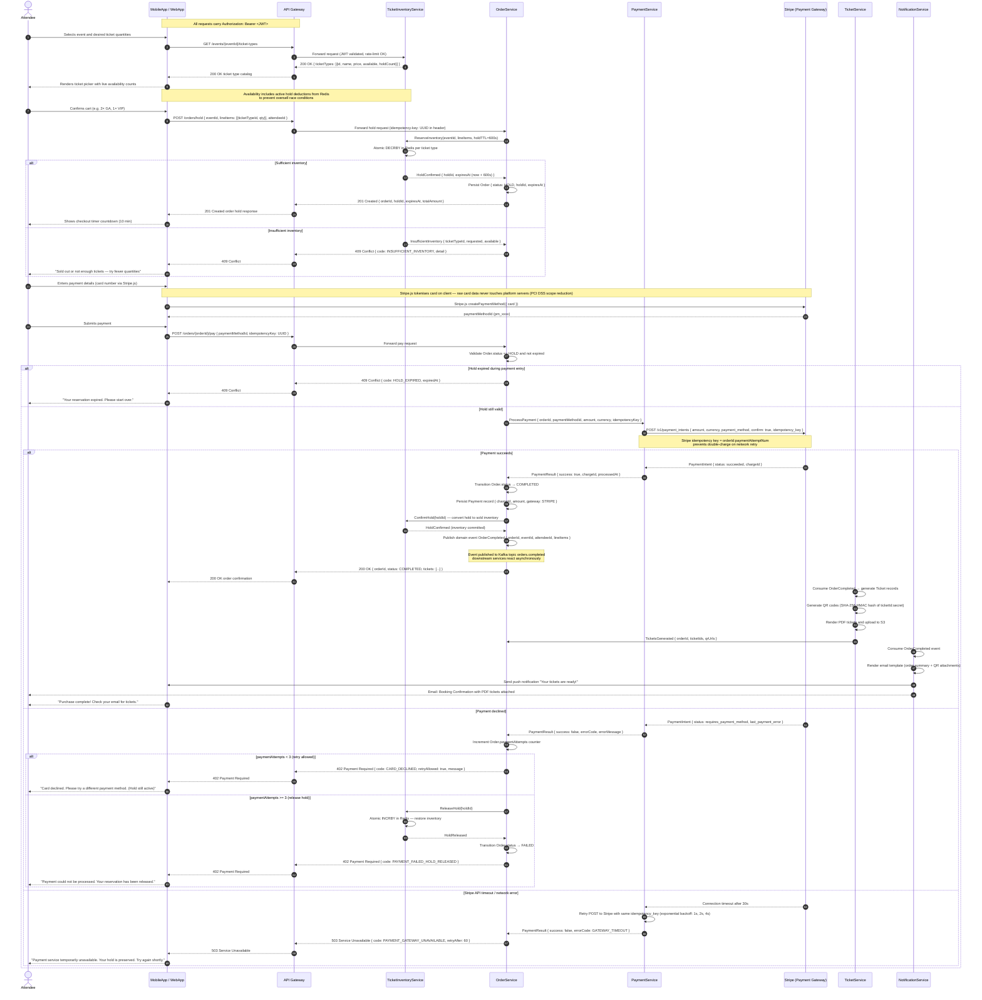
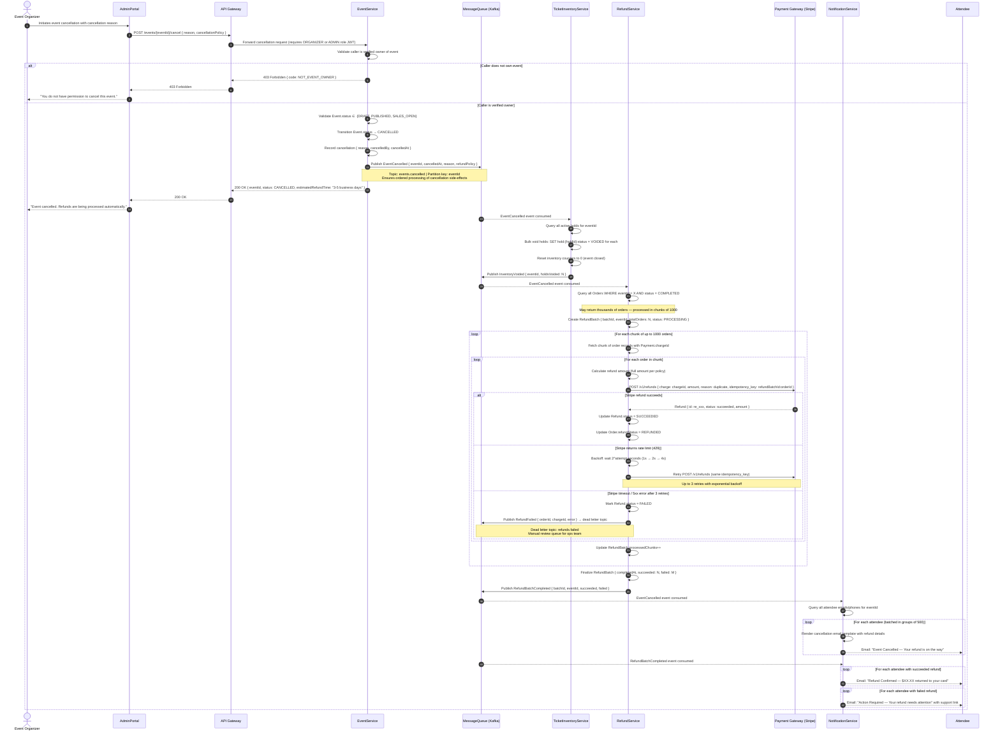
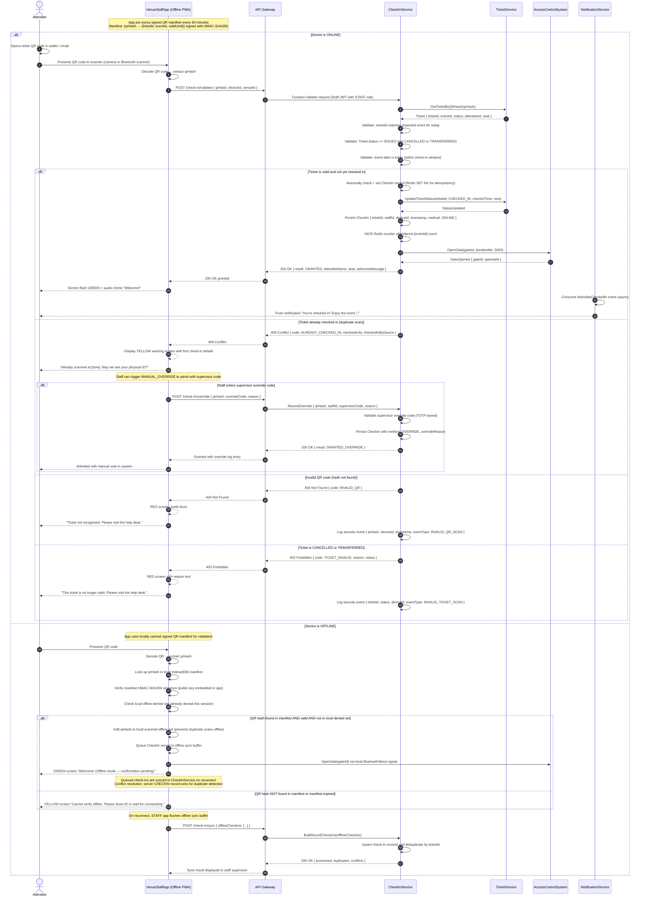
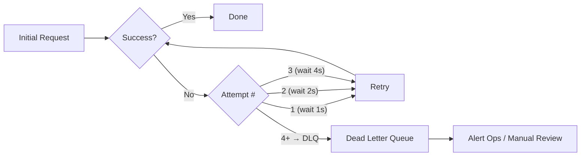

# System Sequence Diagram

## Introduction

System Sequence Diagrams (SSDs) model the interactions between **external actors** and the **system boundary** for a specific use case scenario. Unlike internal sequence diagrams that expose service-to-service calls, SSDs treat the entire platform as a black box and focus on the contract between users (humans or external systems) and the platform. They are foundational to defining API contracts, SLA targets, and failure-handling obligations at the integration boundary.

In this document, each SSD maps a critical end-to-end scenario for the Event Management and Ticketing Platform. Actors sit outside the system boundary; services shown inside represent logical processing units, not necessarily independent deployable microservices in every diagram. Time flows top-to-bottom. `alt` and `loop` fragments capture conditional branching and iteration. `note` annotations carry non-functional requirements such as latency budgets and idempotency constraints.

---

## Scenario 1: Ticket Purchase with Payment Processing

This scenario covers the complete ticket purchase flow from the moment an attendee selects a ticket type through to receiving a confirmation email and downloadable QR-code ticket. The flow must handle concurrent purchases (inventory races), payment failures, and hold expiry gracefully.

### Scenario 1: Key Design Decisions

| Concern | Decision | Rationale |
|---|---|---|
| Inventory race prevention | Redis atomic DECRBY with hold TTL | Eliminates DB-level pessimistic locking bottleneck under flash sale load |
| PCI DSS scope | Stripe.js client tokenisation | Raw card data never traverses platform servers — card data scope is Stripe only |
| Idempotency | Per-request UUID in header, forwarded to Stripe | Safe retry on mobile network drops without double-charge risk |
| Hold duration | 600 seconds (10 minutes) | Balances conversion rate against inventory lock-up; configurable per event |
| Payment retries | Max 3 attempts before hold release | Prevents indefinite inventory lock-up from repeatedly failing cards |

---

## Scenario 2: Event Cancellation with Bulk Refund Processing

When an organizer cancels an event, the platform must atomically void all inventory, compute refunds for every completed order, batch them for efficient gateway processing, and notify all affected attendees. This is a high-impact, low-frequency operation requiring careful idempotency and error handling.

### Scenario 2: Refund Batch Processing Architecture

The chunked batch processing pattern is chosen over a streaming approach because Stripe rate limits refund calls to 100 requests per second per account. Processing in 1000-order chunks with per-chunk pacing ensures the platform stays within gateway rate limits while providing progress visibility via the `RefundBatch` record.

| Metric | Value | Notes |
|---|---|---|
| Chunk size | 1000 orders | Balances memory usage vs DB round-trips |
| Stripe rate limit | 100 req/s | Requires pacing logic between chunks |
| Retry policy | 3 attempts, exponential backoff | Idempotency key guarantees no double-refund |
| Dead letter retention | 7 days | Ops team SLA for manual refund processing |
| Total estimated throughput | ~360,000 refunds/hour | At 100 req/s sustained |

---

## Scenario 3: Check-in at Venue

The check-in flow operates under field conditions: intermittent connectivity, high throughput (concerts may have 50,000 attendees arriving in 30 minutes), and the need to fail safely in the "let them in" direction to avoid attendee confrontation. The VenueStaffApp is an offline-capable Progressive Web App (PWA) that caches a signed QR manifest.

### Scenario 3: Offline Architecture Notes

The VenueStaffApp downloads a signed QR manifest hourly during the event day. The manifest contains the HMAC-SHA256 hash of every valid ticket for the event, signed with a short-lived secret rotated per event. This prevents QR forgery while enabling fully offline validation. The manifest size for a 50,000-attendee event is approximately 4.5 MB (compressed), suitable for mobile caching.

---

## Non-Functional Considerations

### Response Time Budgets

| Scenario | Operation | P50 Target | P99 Target | Timeout |
|---|---|---|---|---|
| Ticket Purchase | GET ticket types | 50 ms | 120 ms | 5 s |
| Ticket Purchase | POST /orders/hold | 200 ms | 500 ms | 10 s |
| Ticket Purchase | POST /orders/{id}/pay | 1,500 ms | 3,000 ms | 30 s |
| Ticket Purchase | QR code generation | 800 ms | 2,000 ms | 15 s |
| Event Cancellation | POST /events/{id}/cancel | 300 ms | 800 ms | 15 s |
| Event Cancellation | Bulk refund (per order) | N/A | N/A | 60 s per chunk |
| Check-in (online) | POST /check-in/validate | 80 ms | 200 ms | 5 s |
| Check-in (offline) | Local manifest lookup | 5 ms | 15 ms | N/A (local) |

### Retry Strategies

| Service | Retry Policy | Max Attempts | Backoff | DLQ |
|---|---|---|---|---|
| PaymentService → Stripe | Exponential | 3 | 1s, 2s, 4s | Yes (payments.failed) |
| RefundService → Stripe | Exponential | 3 | 2s, 4s, 8s | Yes (refunds.failed) |
| NotificationService → SendGrid | Linear | 5 | 30s | Yes (notifications.failed) |
| CheckInService → DB | Exponential | 3 | 100ms, 200ms, 400ms | No (fail open) |

### Circuit Breaker Placement

Circuit breakers (implemented via Resilience4j or equivalent) are placed at every synchronous external integration boundary:

- **PaymentService → Stripe**: Opens after 5 failures in 10s sliding window. Half-open probe every 30s. Downstream: OrderService receives 503 and holds the order (does not release inventory) to allow retry.
- **NotificationService → SendGrid/Twilio**: Opens after 10 failures in 30s. Half-open probe every 60s. Downstream: Notification queued for retry — non-blocking for purchase flow.
- **CheckInService → PostgreSQL**: Opens after 3 failures in 5s. Half-open probe every 10s. Downstream: Falls back to Redis-only validation (degraded mode, online check-in uses cached state).

### Idempotency Keys per Operation

| Operation | Idempotency Key | Scope | Storage |
|---|---|---|---|
| POST /orders/hold | Client-generated UUID in `Idempotency-Key` header | Per hold request | Redis with 24h TTL |
| POST /orders/{id}/pay | `{orderId}:{paymentAttemptNumber}` | Per payment attempt | Passed to Stripe API |
| POST /v1/refunds (Stripe) | `{refundBatchId}:{orderId}` | Per refund within batch | Passed to Stripe API |
| POST /check-in/validate | `{qrHash}:{eventId}` (Redis SET NX) | Per ticket per event | Redis with event-duration TTL |
| POST /check-in/sync (offline) | `{deviceId}:{qrHash}:{timestamp}` | Per offline scan record | PostgreSQL upsert by composite key |

### Kafka Topic Design

| Topic | Partitioning Key | Retention | Consumers |
|---|---|---|---|
| `orders.completed` | orderId | 7 days | TicketService, NotificationService, AnalyticsService |
| `events.cancelled` | eventId | 30 days | TicketInventoryService, RefundService, NotificationService |
| `refunds.failed` | orderId | 90 days | Ops alert system, manual review dashboard |
| `checkins.recorded` | eventId | 7 days | AnalyticsService, NotificationService |
| `notifications.failed` | notificationId | 14 days | Notification retry worker |
