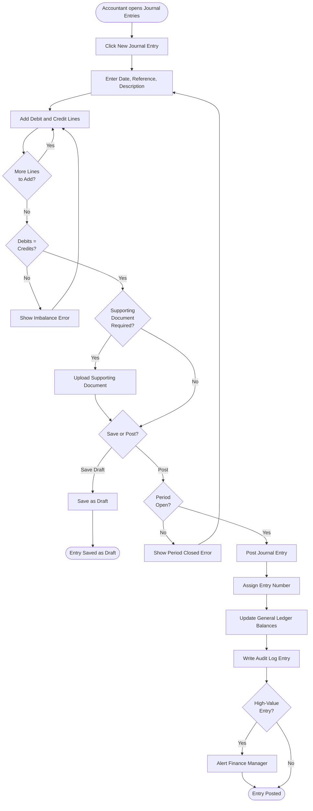
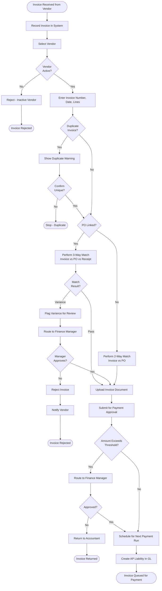
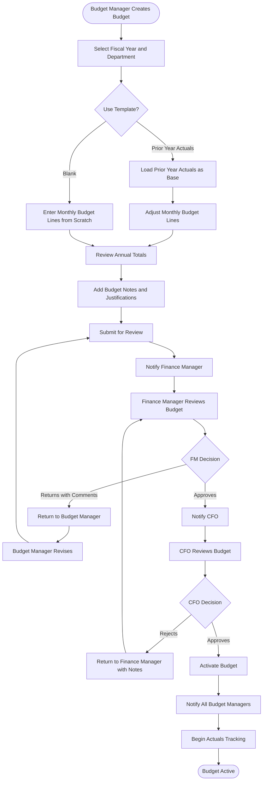
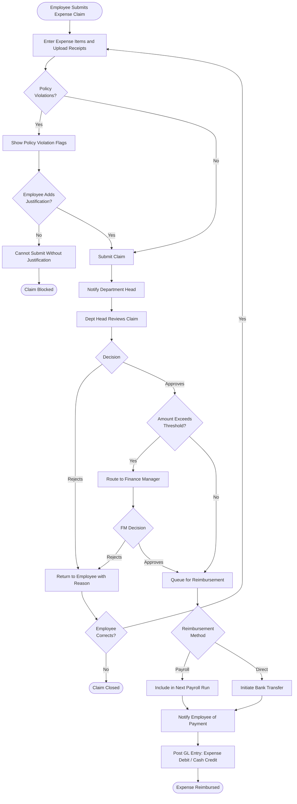
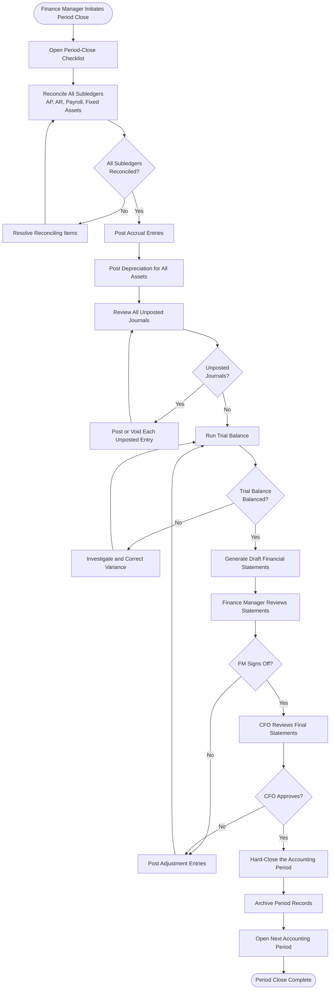
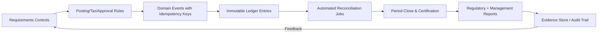

# Activity Diagrams

## Overview
Activity diagrams showing the business process flows for key operations in the Finance Management System.

---

## Journal Entry Creation Flow



---

## Vendor Invoice Processing Flow



---

## Payment Run Processing Flow

```mermaid
flowchart TD
    Start([Finance Manager Initiates Payment Run]) --> SelectInvoices[Select Approved Invoices Due for Payment]
    SelectInvoices --> ReviewBatch[Review Payment Batch Summary]
    ReviewBatch --> CheckFunds{Sufficient<br>Funds?}

    CheckFunds -->|No| AlertLowFunds[Alert Finance Manager]
    AlertLowFunds --> AdjustBatch{Adjust<br>Batch?}
    AdjustBatch -->|Yes| SelectInvoices
    AdjustBatch -->|No| End1([Payment Run Deferred])

    CheckFunds -->|Yes| EarlyDiscount{Early Payment<br>Discounts Available?}
    EarlyDiscount -->|Yes| ApplyDiscount[Apply Early-Pay Discount to Eligible Invoices]
    ApplyDiscount --> ApproveBatch
    EarlyDiscount -->|No| ApproveBatch[Finance Manager Approves Batch]

    ApproveBatch --> GenerateBankFile[Generate ACH / Wire Transfer File]
    GenerateBankFile --> SubmitToBank[Submit File to Bank]
    SubmitToBank --> BankResponse{Bank<br>Accepted?}

    BankResponse -->|Rejected| HandleRejection[Flag Rejected Items]
    HandleRejection --> NotifyAccountant[Notify Accountant]
    NotifyAccountant --> End2([Batch Partially Failed])

    BankResponse -->|Accepted| WaitClearance[Wait for Bank Clearance]
    WaitClearance --> PaymentCleared{Payment<br>Cleared?}

    PaymentCleared -->|Yes| MarkPaid[Mark Invoices as Paid]
    MarkPaid --> PostGLEntry[Post GL Payment Entry<br>Debit: AP Liability | Credit: Cash]
    PostGLEntry --> SendRemittance[Send Remittance Advice to Vendors]
    SendRemittance --> End3([Payment Run Complete])

    PaymentCleared -->|No - Timeout| EscalateBank[Escalate to Bank]
    EscalateBank --> WaitClearance
```

---

## Budget Approval Flow



---

## Expense Claim Processing Flow



---

## Period Close Flow



## Implementation-Ready Finance Control Expansion

### 1) Accounting Rule Assumptions (Detailed)
- Ledger model is strictly double-entry with balanced journal headers and line-level dimensional tagging (entity, cost-center, project, product, counterparty).
- Posting policies are versioned and time-effective; historical transactions are evaluated against the rule version active at transaction time.
- Currency handling requires transaction currency, functional currency, and optional reporting currency; FX revaluation and realized/unrealized gains are separated.
- Materiality thresholds are explicit and configurable; below-threshold variances may auto-resolve only when policy explicitly allows.

### 2) Transaction Invariants and Data Contracts
- Every command/event must include `transaction_id`, `idempotency_key`, `source_system`, `event_time_utc`, `actor_id/service_principal`, and `policy_version`.
- Mutations affecting posted books are append-only. Corrections use reversal + adjustment entries with causal linkage to original posting IDs.
- Period invariant checks: no unapproved journals in closing period, all sub-ledger control accounts reconciled, and close checklist fully attested.
- Referential invariants: every ledger line links to a provenance artifact (invoice/payment/payroll/expense/asset/tax document).

### 3) Reconciliation and Close Strategy
- Continuous reconciliation cadence:
  - **T+0/T+1** operational reconciliation (gateway, bank, processor, payroll outputs).
  - **Daily** sub-ledger to GL tie-out.
  - **Monthly/Quarterly** close certification with controller sign-off.
- Exception taxonomy is mandatory: timing mismatch, mapping/config error, duplicate, missing source event, external counterparty variance, FX rounding.
- Close blockers are machine-detectable and surfaced on a close dashboard with ownership, ETA, and escalation policy.

### 4) Failure Handling and Operational Recovery
- Posting pipeline uses outbox/inbox patterns with deterministic retries and dead-letter quarantine for non-retriable payloads.
- Duplicate delivery and partial failure scenarios must be proven safe through idempotency and compensating accounting entries.
- Incident runbooks require: containment decision, scope quantification, replay/rebuild method, reconciliation rerun, and financial controller approval.
- Recovery drills must be executed periodically with evidence retained for audit.

### 5) Regulatory / Compliance / Audit Expectations
- Controls must support segregation of duties, least privilege, and end-to-end tamper-evident audit trails.
- Retention strategy must satisfy jurisdictional requirements for financial records, tax documents, and payroll artifacts.
- Sensitive data handling includes classification, masking/tokenization for non-production, and secure export controls.
- Every policy override (manual journal, reopened period, emergency access) requires reason code, approver, and expiration window.

### 6) Data Lineage & Traceability (Requirements → Implementation)
- Maintain an explicit traceability matrix for this artifact (`analysis/activity-diagrams.md`):
  - `Requirement ID` → `Business Rule / Event` → `Design Element` (API/schema/diagram component) → `Code Module` → `Test Evidence` → `Control Owner`.
- Lineage metadata minimums: source event ID, transformation ID/version, posting rule version, reconciliation batch ID, and report consumption path.
- Any change touching accounting semantics must include impact analysis across upstream requirements and downstream close/compliance reports.
- Documentation updates are blocking for release when they alter financial behavior, posting logic, or reconciliation outcomes.

### 7) Phase-Specific Implementation Readiness
- Convert business requirements into executable decision tables with explicit preconditions, data dependencies, and exception states.
- Map each business event to accounting impact (`none`, `memo`, `sub-ledger`, `GL-posting`) and expected latency/SLA.
- Document escalation paths for unresolved breaks, including RACI and aging thresholds.

### 8) Implementation Checklist for `activity diagrams`
- [ ] Control objectives and success/failure criteria are explicit and testable.
- [ ] Data contracts include mandatory identifiers, timestamps, and provenance fields.
- [ ] Reconciliation logic defines cadence, tolerances, ownership, and escalation.
- [ ] Operational runbooks cover retries, replay, backfill, and close re-certification.
- [ ] Compliance evidence artifacts are named, retained, and linked to control owners.


### Mermaid Control Overlay (Implementation-Ready)



