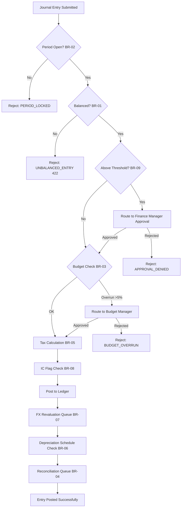

# Business Rules

This document defines enforceable policy rules for **Finance-Management** so command processing, asynchronous jobs, and operational actions behave consistently under normal and exceptional conditions.

## Overview

The Finance-Management system enforces a strict set of business rules that govern every financial transaction, period lifecycle, budget control, and compliance activity. Rules are evaluated in sequence at command time and prevent invalid state transitions, financial discrepancies, or unauthorized actions from being committed to the general ledger.

All rules are:
- **Deterministic** — identical inputs always produce the same enforcement outcome regardless of timing or actor.
- **Versioned** — every rule carries a version identifier; historical transactions are evaluated against the rule version active at their posting time.
- **Auditable** — every rule evaluation (pass or fail) generates an immutable audit event recording actor, timestamp, rule version, inputs, and outcome.
- **Hierarchical** — rules are evaluated in a fixed sequence; an earlier rejection short-circuits the pipeline and prevents later rules from firing unnecessarily.

Enforcement points span the full system surface: REST API command handlers, async job processors, period-close workflows, consolidation pipelines, and administrative consoles.

## Rule Categories

| Category | Rule IDs | Description |
|---|---|---|
| Integrity | BR-01 | Double-entry balance enforcement on every journal entry |
| Lifecycle | BR-02 | Accounting period lock preventing posting to closed periods |
| Budget Control | BR-03 | Budget overrun approval gate for expenses exceeding threshold |
| Reconciliation | BR-04 | Bank reconciliation matching logic and escalation cadence |
| Taxation | BR-05 | VAT/GST calculation by jurisdiction and tax code |
| Asset Management | BR-06 | Fixed asset depreciation schedule and method locking |
| Currency | BR-07 | Multi-currency revaluation at period-end using official rates |
| Consolidation | BR-08 | Intercompany transaction flagging and elimination |
| Approval | BR-09 | Secondary approval requirement above monetary threshold |

## Enforceable Rules

### BR-01: Double-Entry Balance Enforcement
- **Trigger**: Any `POST /journal-entries` command or bulk journal import batch.
- **Condition**: `SUM(debit_lines.amount) ≠ SUM(credit_lines.amount)` within the same `JournalEntry` header. Tolerance is exactly zero — even a $0.01 discrepancy triggers rejection.
- **Action**: Reject the entire journal entry before any line is persisted to the database. Emit a `VALIDATION_FAILED` audit event recording the computed debit total, credit total, and net delta. Return a structured error body listing the imbalance amount.
- **Error Code / HTTP Status**: `UNBALANCED_ENTRY` / HTTP 422 Unprocessable Entity.
- **Override**: **None.** Double-entry balance is a hard invariant with absolute zero tolerance. No role — including CFO, system administrator, or emergency access — may bypass this rule. Correction requires the submitter to fix the entry and resubmit.

---

### BR-02: Accounting Period Lock
- **Trigger**: Any `JournalEntry`, `Invoice`, `Payment`, or `Transaction` that specifies a `posting_date` or `period_id` resolved to a specific `AccountingPeriod`.
- **Condition**: The resolved `AccountingPeriod.status` is `LOCKED` or `CLOSED`.
- **Action**: Block the posting immediately. Return the current period status and the expected reopen workflow URL to the caller. Generate a `PERIOD_LOCK_VIOLATION` audit event.
- **Error Code / HTTP Status**: `PERIOD_LOCKED` / HTTP 409 Conflict.
- **Override**: CFO (or delegated Finance Controller) may initiate a **Period Reopen Workflow**. The workflow requires: written business justification, supporting documentation, approver identity, and a bounded reopen window (maximum 72 hours). All entries posted during a reopen window are tagged `POSTED_IN_REOPEN_WINDOW` and are subject to heightened audit review. The period auto-relocks when the window expires.

---

### BR-03: Budget Overrun Approval
- **Trigger**: Any purchase requisition, vendor invoice, expense claim, or internal recharge that posts to a cost center or project with an active budget line.
- **Condition**: `(budget_line.committed_amount + new_transaction_amount) > (budget_line.approved_amount × 1.05)` — i.e., the cumulative committed spend would exceed the approved budget line by more than 5%.
- **Action**: Block posting. Transition the transaction to `PENDING_BUDGET_APPROVAL` status. Dispatch a workflow task to the designated Budget Manager with: budget line balance, requested amount, overrun percentage, and requester notes.
- **Error Code / HTTP Status**: `BUDGET_OVERRUN` / HTTP 402 Payment Required (approval pending).
- **Override**: Budget Manager approval transitions the transaction to `BUDGET_APPROVED` and unblocks posting. If the Budget Manager does not act within 48 hours, approval authority auto-delegates to the CFO. CFO approval is logged with a delegation flag in the audit trail.

---

### BR-04: Bank Reconciliation Matching
- **Trigger**: Nightly automated reconciliation batch job (`RECONCILIATION_NIGHTLY_RUN`) and on-demand `POST /reconciliations` commands issued by AP/AR staff.
- **Condition**: A bank statement line is considered a candidate match for a ledger transaction when all three criteria are satisfied: (1) amounts match within ±$0.01, (2) value dates fall within ±3 business days of each other, and (3) the bank reference contains a substring of the internal transaction reference (case-insensitive).
- **Action**: Auto-match qualifying pairs and mark both sides `MATCHED`. Items with no confirmed match after 5 business days are escalated with a `UNMATCHED_ESCALATION` alert delivered to the AP/AR team queue and the period-close dashboard.
- **Error Code / HTTP Status**: `RECONCILIATION_MISMATCH` / HTTP 200 with warning payload in the response body; escalation delivered via async notification event.
- **Override**: Manual match is permitted with mandatory dual sign-off (preparer + independent reviewer). If the amount difference exceeds the materiality threshold (default $50), an explanatory variance note is required and stored against the reconciliation record.

---

### BR-05: Tax Calculation
- **Trigger**: Creation of any `Invoice`, `Payment`, or `Expense` record that includes one or more taxable line items.
- **Condition**: A `TaxRule` is resolved by joining `TaxRule.jurisdiction` (country + state/province code) with the line item's `product_service_tax_code`. If no active `TaxRule` is found for the combination, the transaction is held for manual tax classification.
- **Action**: Compute VAT, GST, or sales tax using the resolved `TaxRule.rate`. Apply the `TaxRule.inclusion_type` flag (`INCLUSIVE` or `EXCLUSIVE`) to determine whether tax is extracted from or added to the line amount. Round the computed tax amount per the jurisdiction rounding rule (e.g., half-up to 2 decimal places for EUR; truncate to 0 decimal places for JPY). Post a `TaxLine` record for each applicable rule.
- **Error Code / HTTP Status**: `TAX_RULE_NOT_FOUND` / HTTP 422; `TAX_RATE_EXPIRED` / HTTP 422 when the matched rule's `effective_to` date has passed.
- **Override**: Tax classification override requires Tax Manager approval and must reference a supporting jurisdiction ruling, exemption certificate, or zero-rate declaration. The override is retained in the audit trail and included in the quarterly tax reconciliation pack.

---

### BR-06: Asset Depreciation Schedule
- **Trigger**: Monthly depreciation batch job (`DEPRECIATION_MONTHLY_RUN`) and on `FixedAsset` status transition to `ACTIVE`.
- **Condition**: `FixedAsset.depreciation_method` must be one of the three supported methods: `STRAIGHT_LINE`, `DECLINING_BALANCE`, or `UNITS_OF_PRODUCTION`. Once the first depreciation posting has been made, the method field is **locked** and cannot be changed.
- **Action**: Compute the monthly depreciation charge based on the asset's cost, useful life, residual value, and chosen method. Post a balanced journal entry: Debit `Depreciation Expense` / Credit `Accumulated Depreciation`. Update `FixedAsset.book_value` and the `Depreciation` record's `cumulative_charge`.
- **Error Code / HTTP Status**: `DEPRECIATION_METHOD_LOCKED` / HTTP 409 if a method change is attempted after the first posting; `INVALID_DEPRECIATION_METHOD` / HTTP 422 for unrecognized method values.
- **Override**: Changing the depreciation method after the first posting requires full asset write-off, retirement of the original asset record, and re-registration as a new asset. This process requires CFO approval and advance notification to the external auditor.

---

### BR-07: Multi-Currency Revaluation
- **Trigger**: Period-end close workflow step `REVALUATION_RUN` executed by the Treasury team, and on-demand revaluation for specific accounts.
- **Condition**: Any open monetary balance (receivable, payable, cash, loan) denominated in a currency other than the entity's functional currency requires revaluation at the period-end spot rate.
- **Action**: Retrieve the period-end exchange rate from the configured rate provider (ECB for EUR-base entities, CBR for RUB-base entities, or a custom rate table for other jurisdictions). Compute the revaluation adjustment. Post the unrealized gain/loss: Debit/Credit the monetary asset or liability account / Credit/Debit the `Unrealized FX Gain/Loss` account. Realized gains/losses are recognized separately upon actual settlement.
- **Error Code / HTTP Status**: `FX_RATE_NOT_FOUND` / HTTP 422 when no rate is available for the currency pair and period-end date.
- **Override**: When an official rate is unavailable (illiquid pair, public holiday, rate provider outage), the Finance Controller may enter a rate manually. The manual entry must include the rate source citation (Bloomberg, Reuters, central bank press release URL) and approver sign-off. The manual rate is prominently flagged in the revaluation journal and in the period-end audit pack.

---

### BR-08: Intercompany Elimination
- **Trigger**: Consolidation close workflow step `IC_ELIMINATION_RUN` and real-time flagging on any transaction tagged with a non-null `intercompany_counterparty_id`.
- **Condition**: Both legs of an intercompany transaction (the originating entity's debit and the counterparty entity's credit, or vice versa) must be present and must balance within the materiality threshold (default $100 USD equivalent). Mismatched intercompany balances block the consolidated close.
- **Action**: Auto-flag all matching transactions with `is_intercompany = true`. During consolidation, eliminate confirmed matched pairs by reversing both sides in the consolidated ledger. Generate `IC_MISMATCH` alerts for any items that remain unmatched when the elimination run completes.
- **Error Code / HTTP Status**: `IC_MISMATCH_BLOCKS_CLOSE` / HTTP 409 when a consolidation close is attempted with unresolved intercompany mismatches above materiality.
- **Override**: CFO may approve elimination of a specific mismatch below the materiality threshold. The approval must include a written variance explanation that is stored in the consolidation audit log and flagged for external auditor review.

---

### BR-09: Journal Entry Approval Threshold
- **Trigger**: Any `POST /journal-entries` command where the journal entry total (sum of all debit line amounts) exceeds the organization's configured approval threshold.
- **Condition**: `SUM(journal_entry.debit_lines.amount) > organization.journal_approval_threshold`. The default threshold is **$10,000 USD** or the equivalent in the entity's functional currency at the current mid-market rate.
- **Action**: Create the journal entry in `PENDING_SECONDARY_APPROVAL` status. Dispatch a workflow approval task to the designated Finance Manager with the full entry details, submitter identity, and business justification. The entry cannot transition to `POSTED` until secondary approval is explicitly granted.
- **Error Code / HTTP Status**: `AWAITING_SECONDARY_APPROVAL` / HTTP 202 Accepted (task dispatched; polling URL in `Location` header).
- **Override**: Finance Manager approval transitions the entry to `APPROVED` and triggers immediate posting. If the Finance Manager does not act within 24 hours, the task auto-escalates to the CFO. For entries above $1,000,000, dual approval (Finance Manager + CFO) is required regardless of escalation timing.

---

## Rule Evaluation Pipeline

The following flowchart illustrates the sequential evaluation of all business rules when a journal entry is submitted to the system. A failure at any stage short-circuits the pipeline and returns an error to the caller without executing subsequent steps.

## Exception and Override Handling

### Period Reopen Exception (BR-02)
When a posting is blocked by BR-02, the requester submits a `PeriodReopenRequest` through the Finance Operations portal. The request must include: the business justification (e.g., late vendor invoice, audit adjustment), supporting documentation, the desired reopen window, and the list of entries expected to be posted. The CFO reviews the request and either approves, rejects, or requests additional information. Approved reopens are time-bounded and auto-expire. All entries posted during the reopen window carry the `REOPEN_WINDOW` provenance tag and are reviewed individually during the next external audit.

### Budget Overrun Exception (BR-03)
When a transaction is blocked by BR-03, the Budget Manager receives a structured workflow task showing: budget line name and owner, approved amount, current committed balance, new requested amount, and computed overrun percentage. The Budget Manager may: (a) approve the overrun with a written rationale, (b) reject it and notify the requester, or (c) escalate to CFO if the overrun exceeds a secondary threshold (default 25%). All approved overruns are aggregated into a monthly Budget Exception Report circulated to Finance leadership.

### Tax Rule Override Exception (BR-05)
When BR-05 cannot resolve a `TaxRule` for a given jurisdiction and tax code combination, the transaction enters a `PENDING_TAX_CLASSIFICATION` queue. The Tax Manager assigns the correct rule, selects the applicable tax code, and attaches the exemption certificate or ruling reference. The resolved classification is persisted against the transaction record. All manually classified transactions are included in the quarterly tax reconciliation pack submitted to the Tax Authority.

### FX Rate Override Exception (BR-07)
When BR-07 cannot source an official rate (illiquid currency pair, public holiday, rate provider outage), the Finance Controller enters the rate manually via the Treasury Operations screen. The entry form requires: the rate value, the effective date, the rate source name and URL, and the approver's electronic signature. The manual rate is flagged in the revaluation journal with a `MANUAL_RATE` indicator and is reviewed during the period-end audit. Persistent rate sourcing failures trigger a vendor escalation with the rate provider.

### Intercompany Mismatch Exception (BR-08)
When BR-08 detects an intercompany mismatch above the materiality threshold, both subsidiary controllers are notified and given 48 hours to resolve the discrepancy before the consolidated close deadline. A shared workspace lists the unmatched items, their amounts, and the responsible entities. If a mismatch cannot be resolved within the close window, the CFO may approve a plug entry with a full written variance explanation. The plug entry is flagged for mandatory follow-up in the next period.

### Approval Timeout Exception (BR-09)
When a Finance Manager does not act on a pending BR-09 approval task within 24 hours, the system sends a reminder notification and simultaneously notifies the CFO of the pending escalation. If no action is taken within a further 24 hours, the task auto-escalates to the CFO's approval queue and the Finance Manager receives an escalation notice. Journal entries that remain unapproved for more than 72 hours from submission are auto-rejected, and the submitter must resubmit with updated justification.

## Rule Versioning and Governance

| Rule ID | Rule Name | Current Version | Effective From | Last Reviewed | Control Owner |
|---|---|---|---|---|---|
| BR-01 | Double-Entry Balance Enforcement | v1.0 | 2024-01-01 | 2024-12-01 | Controller |
| BR-02 | Accounting Period Lock | v1.1 | 2024-03-01 | 2024-12-01 | Controller |
| BR-03 | Budget Overrun Approval | v2.0 | 2024-06-01 | 2024-12-01 | Budget Manager |
| BR-04 | Bank Reconciliation Matching | v1.2 | 2024-01-01 | 2024-11-01 | AP/AR Manager |
| BR-05 | Tax Calculation | v3.0 | 2024-07-01 | 2024-12-01 | Tax Manager |
| BR-06 | Asset Depreciation Schedule | v1.0 | 2024-01-01 | 2024-10-01 | Controller |
| BR-07 | Multi-Currency Revaluation | v2.1 | 2024-09-01 | 2024-12-01 | Treasury Lead |
| BR-08 | Intercompany Elimination | v1.0 | 2024-01-01 | 2024-11-01 | Consolidation Lead |
| BR-09 | Journal Entry Approval Threshold | v1.3 | 2024-04-01 | 2024-12-01 | CFO |

### Change Management Process

1. **Proposal**: Rule change proposals are submitted via the Finance Policy Change Request form, detailing the rule ID, proposed change, business rationale, and impacted systems.
2. **Review**: Proposals are reviewed by the Finance Controls Committee (Controller, CFO, Head of IT, Internal Audit representative) within 10 business days.
3. **Impact Assessment**: All changes with accounting or reporting impact require a written impact assessment covering upstream sources, downstream consumers, and reconciliation implications.
4. **Approval**: The Finance Controls Committee approves, rejects, or defers the proposal. Approved changes receive a new version number and an effective date.
5. **Testing**: Changed rules are tested in the staging environment against a representative transaction corpus before go-live.
6. **External Auditor Notification**: Rule changes affecting accounting methodology or materiality thresholds require advance notification to the external auditor at least 30 days before the effective date.
7. **Documentation**: Updated rule documentation is published to this file with the new version number, effective date, and summary of changes.
8. **Retention**: All previous rule versions are retained indefinitely and linked from this document for forensic and audit purposes.

