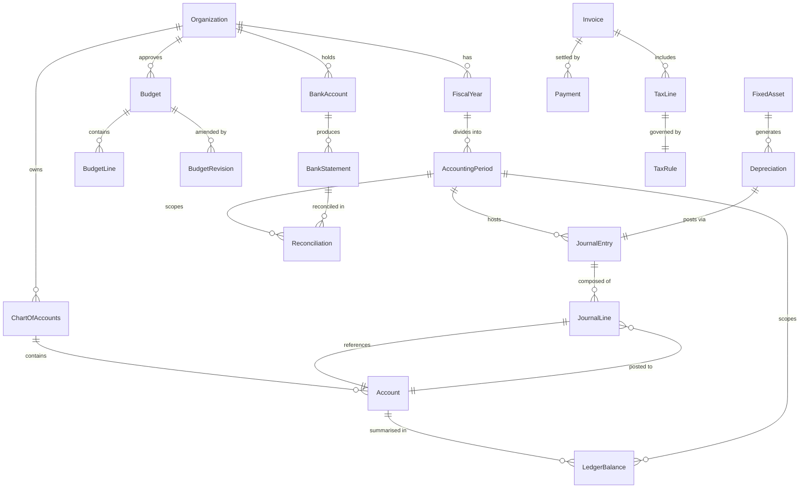

# Data Dictionary

This data dictionary is the canonical reference for **Finance-Management**. It defines shared terminology, entity semantics, attribute specifications, relationship boundaries, and governance controls required to keep finance management workflows consistent across all teams and services.

## Overview

This document serves as the single source of truth for all data entities in the Finance-Management system. It is maintained by the Finance Engineering team in collaboration with the Controller, CFO office, and Data Governance board. Any schema change that alters entity semantics, key relationships, or field-level constraints must be reflected here before the change ships to production.

**Scope**: General ledger, sub-ledgers (AP, AR, fixed assets, tax), bank reconciliation, budgeting, consolidation, and financial reporting.

**Consumers**: Backend engineers, data engineers, BI analysts, auditors, and integration partners.

## Core Entities

| Entity | Description | Key Attributes | Relationships | Notes |
|---|---|---|---|---|
| Organization | Top-level legal entity or subsidiary that owns all financial data | `org_id`, `name`, `functional_currency`, `tax_jurisdiction`, `status` | Parent of FiscalYear, ChartOfAccounts, BankAccount | Supports multi-entity consolidation |
| FiscalYear | A 12-month (or 52-week) financial reporting year for an organization | `fiscal_year_id`, `org_id`, `start_date`, `end_date`, `status` | Has many AccountingPeriod; belongs to Organization | Status: OPEN, CLOSING, CLOSED |
| AccountingPeriod | A sub-division of a FiscalYear (typically monthly or quarterly) | `period_id`, `fiscal_year_id`, `period_number`, `start_date`, `end_date`, `status` | Belongs to FiscalYear; used by JournalEntry | Status: OPEN, LOCKED, CLOSED |
| ChartOfAccounts | The structured hierarchy of accounts used by an organization | `coa_id`, `org_id`, `name`, `version`, `effective_from` | Has many Account; belongs to Organization | Versioned; changes require audit trail |
| Account | A single ledger account within a Chart of Accounts | `account_id`, `coa_id`, `account_code`, `account_name`, `account_type`, `normal_balance`, `is_control_account` | Belongs to ChartOfAccounts; has many JournalLine, LedgerBalance | Types: ASSET, LIABILITY, EQUITY, REVENUE, EXPENSE |
| JournalEntry | A balanced double-entry header grouping one or more debit and credit lines | `journal_id`, `org_id`, `period_id`, `entry_date`, `status`, `reference`, `description`, `created_by`, `approved_by` | Has many JournalLine; belongs to AccountingPeriod | Status: DRAFT, PENDING_APPROVAL, APPROVED, POSTED, REVERSED |
| JournalLine | A single debit or credit line within a JournalEntry | `line_id`, `journal_id`, `account_id`, `debit_amount`, `credit_amount`, `currency`, `cost_center_id`, `project_id`, `description` | Belongs to JournalEntry and Account | Exactly one of debit_amount or credit_amount must be non-zero |
| LedgerBalance | The running balance for an Account within a given AccountingPeriod | `balance_id`, `account_id`, `period_id`, `opening_balance`, `period_debit`, `period_credit`, `closing_balance`, `currency` | Belongs to Account and AccountingPeriod | Recomputed on each posting |
| Budget | An approved spending plan for an organization for a FiscalYear | `budget_id`, `org_id`, `fiscal_year_id`, `name`, `status`, `approved_by`, `approved_at` | Has many BudgetLine and BudgetRevision; belongs to Organization | Status: DRAFT, PENDING_APPROVAL, APPROVED, REVISED |
| BudgetLine | A single line item within a Budget linking an Account or CostCenter to an amount | `budget_line_id`, `budget_id`, `account_id`, `cost_center_id`, `project_id`, `period_id`, `approved_amount`, `committed_amount` | Belongs to Budget, Account, and CostCenter | Committed amount updated in real time on each posting |
| BudgetRevision | A formal amendment to an approved Budget | `revision_id`, `budget_id`, `revision_number`, `reason`, `approved_by`, `approved_at`, `delta_amount` | Belongs to Budget | Creates audit trail for budget changes |
| Transaction | A business-level financial event (payment, receipt, charge) before ledger posting | `txn_id`, `org_id`, `txn_type`, `amount`, `currency`, `counterparty_id`, `occurred_at`, `status`, `source_ref` | May produce JournalEntry; linked to Invoice or Payment | Source of truth for operational events |
| CostCenter | An organizational unit used for dimensional cost allocation | `cost_center_id`, `org_id`, `code`, `name`, `parent_cost_center_id`, `manager_id`, `status` | Used by JournalLine, BudgetLine | Hierarchical; supports rollup reporting |
| Project | A time-bounded initiative used for project-cost tracking | `project_id`, `org_id`, `code`, `name`, `start_date`, `end_date`, `budget_id`, `status` | Used by JournalLine, BudgetLine | Status: ACTIVE, ON_HOLD, CLOSED |
| Invoice | A formal demand for payment issued to or received from a counterparty | `invoice_id`, `org_id`, `invoice_type`, `counterparty_id`, `invoice_date`, `due_date`, `gross_amount`, `tax_amount`, `net_amount`, `currency`, `status` | Has many TaxLine; may have many Payment; produces JournalEntry | Types: ACCOUNTS_RECEIVABLE, ACCOUNTS_PAYABLE |
| Payment | A record of funds received or disbursed against one or more Invoices | `payment_id`, `org_id`, `payment_date`, `amount`, `currency`, `payment_method`, `bank_account_id`, `status` | May be linked to Invoice; produces JournalEntry; linked to BankStatement line | Status: PENDING, CLEARED, RETURNED |
| BankAccount | An organization's bank account used for cash management | `bank_account_id`, `org_id`, `account_number`, `bank_name`, `currency`, `iban`, `bic`, `status` | Has many BankStatement; linked to Payment | Masked in non-production environments |
| BankStatement | A periodic statement of transactions from the bank for a BankAccount | `statement_id`, `bank_account_id`, `statement_date`, `opening_balance`, `closing_balance`, `currency`, `imported_at` | Has many statement lines; belongs to BankAccount; linked to Reconciliation | Imported via SWIFT MT940 or OFX format |
| Reconciliation | A matching record linking BankStatement lines to Ledger transactions | `recon_id`, `bank_account_id`, `period_id`, `status`, `matched_count`, `unmatched_count`, `completed_by`, `completed_at` | Belongs to BankAccount and AccountingPeriod | Status: IN_PROGRESS, COMPLETED, ESCALATED |
| TaxRule | A versioned rule defining the tax rate for a jurisdiction and product/service code | `tax_rule_id`, `jurisdiction`, `product_service_tax_code`, `tax_type`, `rate`, `inclusion_type`, `rounding_rule`, `effective_from`, `effective_to` | Used by Invoice and TaxLine | Managed by Tax Manager; versioned |
| TaxLine | A computed tax charge on an individual Invoice line | `tax_line_id`, `invoice_id`, `tax_rule_id`, `taxable_amount`, `tax_rate`, `tax_amount`, `currency` | Belongs to Invoice and TaxRule | One TaxLine per applicable TaxRule per invoice line |
| FixedAsset | A long-lived tangible or intangible asset owned by the organization | `asset_id`, `org_id`, `asset_code`, `description`, `asset_class`, `acquisition_date`, `acquisition_cost`, `residual_value`, `useful_life_months`, `depreciation_method`, `status` | Has many Depreciation records; produces JournalEntry | Status: ACTIVE, DISPOSED, FULLY_DEPRECIATED |
| Depreciation | A single periodic depreciation charge computed for a FixedAsset | `depreciation_id`, `asset_id`, `period_id`, `charge_amount`, `accumulated_depreciation`, `book_value`, `posted_journal_id` | Belongs to FixedAsset and AccountingPeriod | Immutable once posted |
| Report | A generated financial report artifact (P&L, Balance Sheet, Cash Flow, etc.) | `report_id`, `org_id`, `report_type`, `period_id`, `generated_by`, `generated_at`, `status`, `storage_url` | Belongs to Organization and AccountingPeriod | Status: DRAFT, FINAL, ARCHIVED |

## Canonical Relationship Diagram

The following entity-relationship diagram shows the core structural relationships between Finance-Management entities.

## Entity Attribute Details

### Organization

| Field | Type | Required | Description |
|---|---|---|---|
| `org_id` | UUID | Yes | Globally unique identifier for the legal entity |
| `name` | VARCHAR(255) | Yes | Official legal name |
| `functional_currency` | CHAR(3) | Yes | ISO 4217 currency code (e.g., USD, EUR, GBP) |
| `tax_jurisdiction` | VARCHAR(10) | Yes | ISO 3166-2 country or subdivision code |
| `consolidation_parent_id` | UUID | No | Reference to parent Organization for group consolidation |
| `status` | ENUM | Yes | ACTIVE, DORMANT, LIQUIDATING, DISSOLVED |
| `created_at` | TIMESTAMPTZ | Yes | Creation timestamp in UTC |

### Account

| Field | Type | Required | Description |
|---|---|---|---|
| `account_id` | UUID | Yes | Globally unique identifier |
| `coa_id` | UUID | Yes | FK to ChartOfAccounts |
| `account_code` | VARCHAR(20) | Yes | Human-readable ledger code (e.g., 1100, 4000-01) |
| `account_name` | VARCHAR(255) | Yes | Descriptive name |
| `account_type` | ENUM | Yes | ASSET, LIABILITY, EQUITY, REVENUE, EXPENSE |
| `normal_balance` | ENUM | Yes | DEBIT or CREDIT — determines sign convention |
| `parent_account_id` | UUID | No | FK to parent Account for hierarchical roll-ups |
| `is_control_account` | BOOLEAN | Yes | If true, posting must come from sub-ledger only |
| `is_bank_account` | BOOLEAN | Yes | Links to BankAccount for reconciliation |
| `currency_restriction` | CHAR(3) | No | If set, only allows postings in specified currency |
| `status` | ENUM | Yes | ACTIVE, INACTIVE, BLOCKED |

### JournalEntry

| Field | Type | Required | Description |
|---|---|---|---|
| `journal_id` | UUID | Yes | Globally unique identifier |
| `org_id` | UUID | Yes | FK to Organization |
| `period_id` | UUID | Yes | FK to AccountingPeriod — must be OPEN |
| `entry_date` | DATE | Yes | Accounting date (must fall within period dates) |
| `status` | ENUM | Yes | DRAFT, PENDING_APPROVAL, APPROVED, POSTED, REVERSED |
| `reference` | VARCHAR(100) | Yes | Human-readable reference (invoice no., payment ID, etc.) |
| `description` | TEXT | No | Narrative description for the entry |
| `entry_type` | ENUM | Yes | MANUAL, SYSTEM, REVERSAL, ADJUSTMENT, OPENING |
| `reversal_of` | UUID | No | FK to original JournalEntry if this is a reversal |
| `intercompany_counterparty_id` | UUID | No | FK to counterparty Organization for IC transactions |
| `is_intercompany` | BOOLEAN | Yes | Derived flag; true if intercompany_counterparty_id is set |
| `created_by` | UUID | Yes | FK to User who submitted the entry |
| `approved_by` | UUID | No | FK to User who provided secondary approval |
| `posted_at` | TIMESTAMPTZ | No | Timestamp when entry status transitioned to POSTED |
| `idempotency_key` | VARCHAR(100) | Yes | Client-provided key for duplicate detection |

### Invoice

| Field | Type | Required | Description |
|---|---|---|---|
| `invoice_id` | UUID | Yes | Globally unique identifier |
| `org_id` | UUID | Yes | FK to Organization |
| `invoice_type` | ENUM | Yes | ACCOUNTS_RECEIVABLE, ACCOUNTS_PAYABLE |
| `counterparty_id` | UUID | Yes | FK to Customer or Supplier entity |
| `invoice_number` | VARCHAR(50) | Yes | Human-readable invoice number (unique per org) |
| `invoice_date` | DATE | Yes | Date the invoice was issued |
| `due_date` | DATE | Yes | Payment due date |
| `currency` | CHAR(3) | Yes | ISO 4217 transaction currency |
| `gross_amount` | DECIMAL(18,2) | Yes | Total amount including tax |
| `tax_amount` | DECIMAL(18,2) | Yes | Total tax component |
| `net_amount` | DECIMAL(18,2) | Yes | `gross_amount - tax_amount` |
| `status` | ENUM | Yes | DRAFT, ISSUED, PARTIALLY_PAID, PAID, OVERDUE, VOIDED |

### FixedAsset

| Field | Type | Required | Description |
|---|---|---|---|
| `asset_id` | UUID | Yes | Globally unique identifier |
| `org_id` | UUID | Yes | FK to Organization |
| `asset_code` | VARCHAR(30) | Yes | Human-readable asset reference |
| `description` | TEXT | Yes | Description of the asset |
| `asset_class` | VARCHAR(50) | Yes | e.g., BUILDING, VEHICLE, IT_EQUIPMENT, INTANGIBLE |
| `acquisition_date` | DATE | Yes | Date asset was acquired or placed in service |
| `acquisition_cost` | DECIMAL(18,2) | Yes | Original cost including installation and commissioning |
| `residual_value` | DECIMAL(18,2) | Yes | Estimated value at end of useful life |
| `useful_life_months` | INTEGER | Yes | Expected useful life in months |
| `depreciation_method` | ENUM | Yes | STRAIGHT_LINE, DECLINING_BALANCE, UNITS_OF_PRODUCTION |
| `first_depreciation_posted` | BOOLEAN | Yes | True after first depreciation journal is posted; locks method |
| `cost_center_id` | UUID | No | FK to CostCenter for cost allocation |
| `status` | ENUM | Yes | ACTIVE, DISPOSED, FULLY_DEPRECIATED, IMPAIRED |

## Data Quality Controls

The following controls are enforced at the application layer (API validation), database layer (constraints and triggers), and batch layer (reconciliation jobs).

| Control | Scope | Rule | Enforcement Point |
|---|---|---|---|
| DQC-01 | JournalEntry | `SUM(debit_lines) = SUM(credit_lines)` with zero tolerance | API — pre-persist validation |
| DQC-02 | JournalLine | Exactly one of `debit_amount` or `credit_amount` must be non-zero | DB check constraint |
| DQC-03 | AccountingPeriod | `entry_date` must fall within `period.start_date` and `period.end_date` | API — period resolution |
| DQC-04 | Account | `account_code` must be unique within a `ChartOfAccounts` version | DB unique index |
| DQC-05 | Invoice | `net_amount = gross_amount - tax_amount` within $0.01 rounding tolerance | API — computed field validation |
| DQC-06 | BudgetLine | `committed_amount` must never exceed `approved_amount × 1.05` without Budget Manager approval | API — BR-03 enforcement |
| DQC-07 | FixedAsset | `residual_value` must be less than `acquisition_cost` | DB check constraint |
| DQC-08 | TaxLine | `tax_rate` must match the active `TaxRule.rate` at `invoice_date` | API — rule resolution |
| DQC-09 | LedgerBalance | `closing_balance = opening_balance + period_debit - period_credit` (for DEBIT-normal accounts) | Batch — nightly reconciliation |
| DQC-10 | All entities | `created_at`, `updated_at` timestamps must be in UTC | DB trigger |
| DQC-11 | JournalEntry | `idempotency_key` must be unique per organization within a 24-hour window | API — duplicate detection |
| DQC-12 | BankStatement | `closing_balance = opening_balance + SUM(credits) - SUM(debits)` | Batch — import validation |

### Referential Integrity Rules
- Every `JournalLine` must reference an active `Account` in the organization's current `ChartOfAccounts`.
- Every `JournalEntry` must reference an `AccountingPeriod` with `status = OPEN` at time of posting.
- Every `BudgetLine` must reference an `Account` and may optionally reference a `CostCenter` and a `Project`.
- Every `Depreciation` record must reference a `FixedAsset` with `status = ACTIVE`.
- Every `TaxLine` must reference a `TaxRule` whose `effective_from` ≤ `invoice_date` ≤ `effective_to`.

### Sensitive Data Classification

| Field | Entity | Classification | Handling |
|---|---|---|---|
| `account_number` | BankAccount | CONFIDENTIAL | Masked to last 4 digits in non-production |
| `tax_identification_number` | Organization | CONFIDENTIAL | Encrypted at rest; tokenized in APIs |
| `counterparty_id` (resolved name) | Invoice, Payment | INTERNAL | Masked in analytics exports |
| `approved_by` (user identity) | JournalEntry | INTERNAL | Retained for 7 years per retention policy |

## Naming Conventions

### Entity Names
- Use **PascalCase** for all entity names (e.g., `JournalEntry`, `ChartOfAccounts`, `BankStatement`).
- Entity names are **singular nouns** (e.g., `Invoice`, not `Invoices`).
- Avoid abbreviations unless universally understood in the finance domain (e.g., `GL` for General Ledger, `AP` for Accounts Payable, `AR` for Accounts Receivable).

### Field Names
- Use **snake_case** for all field names in database schemas and API payloads (e.g., `account_id`, `invoice_date`, `debit_amount`).
- Primary keys: `{entity_name}_id` (e.g., `journal_id`, `account_id`, `asset_id`).
- Foreign keys: `{referenced_entity_name}_id` (e.g., `period_id` references `AccountingPeriod`, `coa_id` references `ChartOfAccounts`).
- Boolean fields: prefix with `is_` or `has_` (e.g., `is_intercompany`, `is_control_account`, `has_tax_override`).
- Timestamp fields: suffix with `_at` for events, `_date` for calendar dates (e.g., `posted_at`, `invoice_date`, `due_date`).
- Status fields: use controlled vocabulary ENUMs; document all valid values in this dictionary.
- Amount fields: use `DECIMAL(18, 2)` for monetary values; currency always stored as ISO 4217 CHAR(3) in an adjacent field.

### Enumeration Values
- Use **SCREAMING_SNAKE_CASE** for all enum values (e.g., `PENDING_APPROVAL`, `FULLY_DEPRECIATED`, `ACCOUNTS_PAYABLE`).
- All status enums must include a terminal state and an error/rejected state where applicable.

### Event and Message Names
- Follow the convention `<Aggregate><PastTenseAction>` (e.g., `JournalPosted`, `InvoiceRaised`, `PeriodClosed`).
- See `analysis/event-catalog.md` for the full event naming reference.

