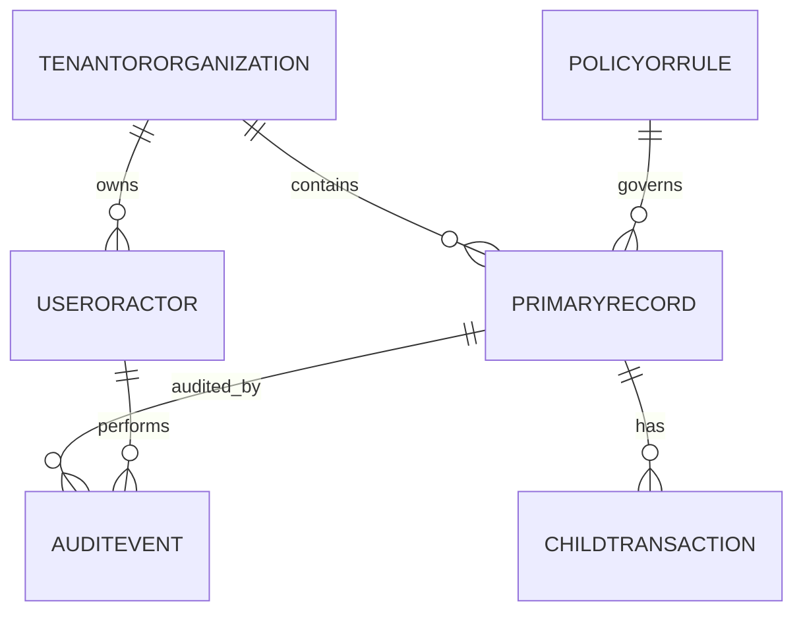

# Data Dictionary

This data dictionary is the canonical reference for **Finance-Management**. It defines shared terminology, entity semantics, and governance controls required to keep finance management workflows consistent across teams and services.

## Scope and Goals
- Establish a stable vocabulary for architecture, API, analytics, and operations teams.
- Define minimum required fields for core entities and expected relationship boundaries.
- Document data quality and retention controls needed for production readiness.

## Core Entities
| Entity | Description | Required Attributes |
|---|---|---|
| TenantOrOrganization | Top-level ownership boundary for data segregation | `org_id, name, status, region, created_at` |
| UserOrActor | Human/system principal that performs actions | `actor_id, org_id, role, status, last_active_at` |
| PrimaryRecord | Main lifecycle object handled by the platform | `record_id, org_id, state, owner_id, created_at, updated_at` |
| ChildTransaction | Operational transaction or sub-step linked to primary record | `txn_id, record_id, txn_type, amount_or_value, occurred_at` |
| PolicyOrRule | Versioned policy configuration that influences decisions | `policy_id, scope, version, effective_from, effective_to` |
| AuditEvent | Append-only evidence for state changes and controls | `audit_id, record_id, actor_id, action, reason_code, occurred_at` |

## Canonical Relationship Diagram

## Data Quality Controls
1. All write paths enforce required-field validation and referential integrity for mandatory foreign keys.
2. External imports must include provenance metadata (`source_system`, `source_ref`, `ingested_at`).
3. Status/state fields use controlled vocabularies and reject unknown values.
4. Duplicate detection runs on natural keys where business identity collisions are likely.
5. Sensitive fields carry classification tags to drive masking, encryption, and export behavior.

## Retention and Audit
- Operational records remain online for active workflow windows and support forensic queries.
- Historical records move to archive tiers by policy without breaking traceability.
- Audit events are immutable and linked through correlation ids for incident analysis.

## Implementation-Ready Finance Control Expansion

### 1) Accounting Rule Assumptions (Detailed)
- Ledger model is strictly double-entry with balanced journal headers and line-level dimensional tagging (entity, cost-center, project, product, counterparty).
- Posting policies are versioned and time-effective; historical transactions are evaluated against the rule version active at transaction time.
- Currency handling requires transaction currency, functional currency, and optional reporting currency; FX revaluation and realized/unrealized gains are separated.
- Materiality thresholds are explicit and configurable; below-threshold variances may auto-resolve only when policy explicitly allows.

### 2) Transaction Invariants and Data Contracts
- Every command/event must include `transaction_id`, `idempotency_key`, `source_system`, `event_time_utc`, `actor_id/service_principal`, and `policy_version`.
- Mutations affecting posted books are append-only. Corrections use reversal + adjustment entries with causal linkage to original posting IDs.
- Period invariant checks: no unapproved journals in closing period, all sub-ledger control accounts reconciled, and close checklist fully attested.
- Referential invariants: every ledger line links to a provenance artifact (invoice/payment/payroll/expense/asset/tax document).

### 3) Reconciliation and Close Strategy
- Continuous reconciliation cadence:
  - **T+0/T+1** operational reconciliation (gateway, bank, processor, payroll outputs).
  - **Daily** sub-ledger to GL tie-out.
  - **Monthly/Quarterly** close certification with controller sign-off.
- Exception taxonomy is mandatory: timing mismatch, mapping/config error, duplicate, missing source event, external counterparty variance, FX rounding.
- Close blockers are machine-detectable and surfaced on a close dashboard with ownership, ETA, and escalation policy.

### 4) Failure Handling and Operational Recovery
- Posting pipeline uses outbox/inbox patterns with deterministic retries and dead-letter quarantine for non-retriable payloads.
- Duplicate delivery and partial failure scenarios must be proven safe through idempotency and compensating accounting entries.
- Incident runbooks require: containment decision, scope quantification, replay/rebuild method, reconciliation rerun, and financial controller approval.
- Recovery drills must be executed periodically with evidence retained for audit.

### 5) Regulatory / Compliance / Audit Expectations
- Controls must support segregation of duties, least privilege, and end-to-end tamper-evident audit trails.
- Retention strategy must satisfy jurisdictional requirements for financial records, tax documents, and payroll artifacts.
- Sensitive data handling includes classification, masking/tokenization for non-production, and secure export controls.
- Every policy override (manual journal, reopened period, emergency access) requires reason code, approver, and expiration window.

### 6) Data Lineage & Traceability (Requirements → Implementation)
- Maintain an explicit traceability matrix for this artifact (`analysis/data-dictionary.md`):
  - `Requirement ID` → `Business Rule / Event` → `Design Element` (API/schema/diagram component) → `Code Module` → `Test Evidence` → `Control Owner`.
- Lineage metadata minimums: source event ID, transformation ID/version, posting rule version, reconciliation batch ID, and report consumption path.
- Any change touching accounting semantics must include impact analysis across upstream requirements and downstream close/compliance reports.
- Documentation updates are blocking for release when they alter financial behavior, posting logic, or reconciliation outcomes.

### 7) Phase-Specific Implementation Readiness
- Convert business requirements into executable decision tables with explicit preconditions, data dependencies, and exception states.
- Map each business event to accounting impact (`none`, `memo`, `sub-ledger`, `GL-posting`) and expected latency/SLA.
- Document escalation paths for unresolved breaks, including RACI and aging thresholds.

### 8) Implementation Checklist for `data dictionary`
- [ ] Control objectives and success/failure criteria are explicit and testable.
- [ ] Data contracts include mandatory identifiers, timestamps, and provenance fields.
- [ ] Reconciliation logic defines cadence, tolerances, ownership, and escalation.
- [ ] Operational runbooks cover retries, replay, backfill, and close re-certification.
- [ ] Compliance evidence artifacts are named, retained, and linked to control owners.

