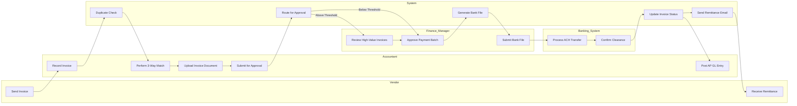
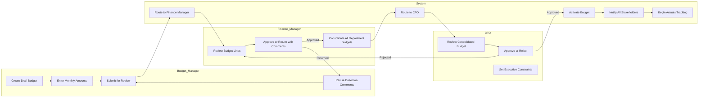
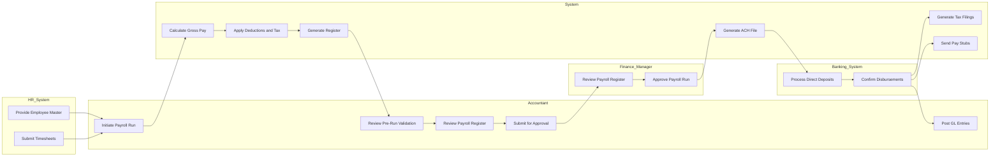
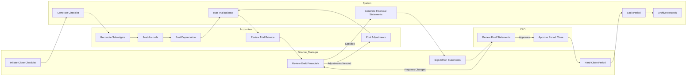
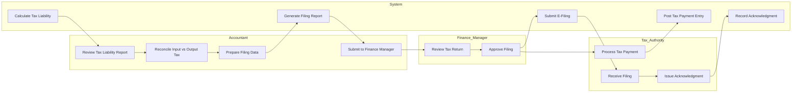
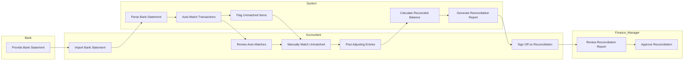

# Swimlane Diagrams

## Overview
Cross-departmental BPMN-style workflows showing how Finance Management processes span multiple roles and systems.

---

## Invoice-to-Payment Workflow

---

## Budget Planning and Approval Workflow

---

## Expense Claim and Reimbursement Workflow

```mermaid
graph LR
    subgraph Employee
        E1[Create Expense Report]
        E2[Upload Receipts]
        E3[Submit Claim]
        E4[Receive Reimbursement]
    end

    subgraph Dept_Head
        DH1[Receive Approval Request]
        DH2[Review Items and Receipts]
        DH3[Approve or Reject]
    end

    subgraph Finance_Manager
        FM1[Review High-Value Claims]
        FM2[Approve or Reject]
        FM3[Queue for Reimbursement]
    end

    subgraph Accountant
        AC1[Process Reimbursement Batch]
        AC2[Post GL Entry]
    end

    subgraph System
        S1[Policy Check]
        S2[Route to Dept Head]
        S3[Route to Finance Manager]
        S4[Initiate Bank Transfer]
        S5[Notify Employee]
    end

    E1 --> E2
    E2 --> E3
    E3 --> S1
    S1 --> S2
    S2 --> DH1
    DH1 --> DH2
    DH2 --> DH3
    DH3 -->|Rejected| E1
    DH3 -->|Approved| S3
    S3 -->|Threshold Exceeded| FM1
    FM1 --> FM2
    FM2 -->|Rejected| E1
    FM2 -->|Approved| FM3
    S3 -->|Below Threshold| FM3
    FM3 --> AC1
    AC1 --> S4
    S4 --> AC2
    AC2 --> S5
    S5 --> E4
```

---

## Payroll Processing Workflow

---

## Period Close Workflow

---

## Tax Filing Workflow

---

## Bank Reconciliation Workflow

