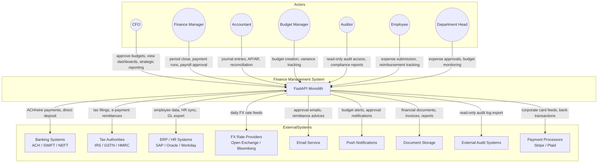
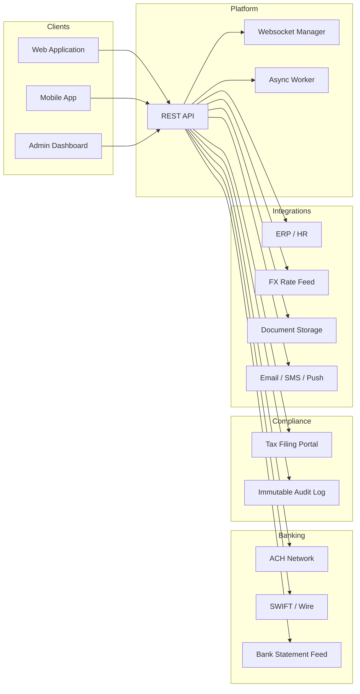
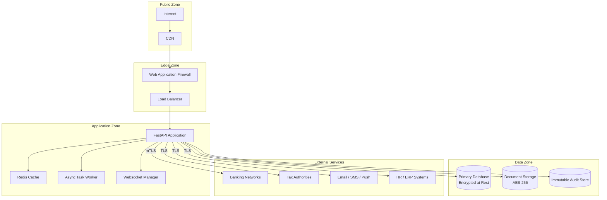

# System Context Diagram

## Overview
The system context below defines the Finance Management System and its interactions with internal users and external systems.

---

## Main System Context Diagram

---

## Detailed Context With Data Flows

---

## Security Boundaries

---

## External Dependency Notes

| System | Purpose | Integration Type |
|--------|---------|-----------------|
| Banking systems | ACH payments, wire transfers, bank statement import | Direct API / file-based SFTP |
| Tax authorities | E-filing of tax returns, payment remittance | Government API / portal upload |
| ERP / HR systems | Employee master data, purchase order sync | REST API / scheduled sync |
| FX rate providers | Daily exchange rate feeds for multi-currency | REST API polling |
| Email / Push | Approval notifications, remittance advices | Managed notification service |
| Document storage | Invoices, receipts, reports, audit artifacts | Object storage API |
| External audit systems | Read-only audit log export for external auditors | Encrypted file export |
| Payment processors | Corporate card feeds, ACH initiation | REST API / bank feed |
